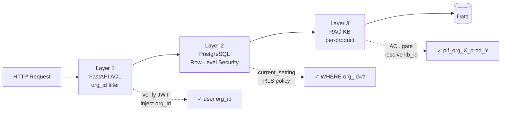
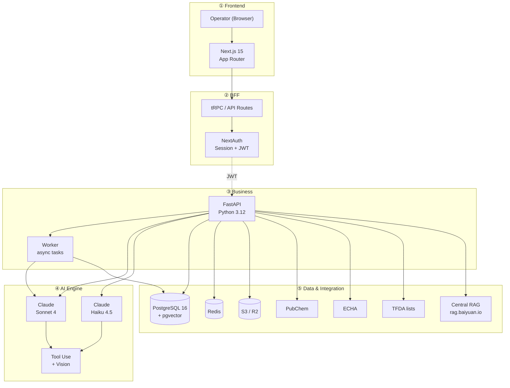

# Chapter 1: Abstract and Core Propositions

> This chapter opens with a one-sentence abstract, then unfolds PIF AI's four design propositions, gives a five-layer system overview, and enumerates the four academic and engineering contributions of this whitepaper. After reading this chapter, you should be able to explain — in under three minutes — "what PIF AI is, why it exists, and how it works."

## 📌 Key Takeaways

- PIF AI compresses cosmetic PIF documentation from **4–8 weeks** to **3–5 business days**
- Four design propositions: structured composition, AI draft + SA final, three-layer isolation, fail-soft
- Five-layer architecture (Frontend / BFF / Business / AI / Data) enforces unidirectional dependency
- Built with Anthropic **Claude Code** — simultaneously a product, a reference implementation, and a case study

## 1.1 One-Sentence Abstract

> **PIF AI is a multi-tenant SaaS that compresses Taiwan-regulated cosmetic PIF documentation from 4–8 weeks to 3–5 business days via AI document extraction, cross-query against international toxicology databases, real-time regulatory matching against Taiwan's TFDA requirements, and an online Safety Assessor (SA) review workflow with electronic signature.**

This sentence compresses three layers of information: **user pain** (4–8 weeks is too slow), **technical solution** (AI extraction + toxicology lookup + regulatory matching), and **organizational compliance** (SA sign-off is legally required). Chapter 2 goes deep on the regulatory background; Chapter 3 dissects the 16 items; subsequent chapters explore the technical implementation.

## 1.2 Why PIF AI Is Needed

### 1.2.1 Regulatory Time Pressure

Taiwan's *Cosmetic Hygiene and Safety Act* (the "Act") took phased effect from 2019; the final transition window ends on **July 1, 2026**. After that date:

- Every cosmetic product manufactured or imported in Taiwan must maintain a complete 16-item PIF
- TFDA may inspect at any time; non-compliance carries fines of NT$10,000–NT$1,000,000
- Special-use cosmetics (sunscreen, hair dye, perm, etc.) face stricter safety-assessment requirements

Taiwan's cosmetic sector (brand owners, contract manufacturers, importers, consultants/testing labs) is estimated to exceed 8,000 entities. Per TFDA registration data and public statistics from the Taiwan Cosmetic Industry Association (TCIIA), more than 100,000 SKUs are on the market[^1].

### 1.2.2 Cost Structure of Manual Compilation

Three major cost drivers (order-of-magnitude estimates):

| Cost item | Share | Why |
|---|---|---|
| Toxicology lookup & translation | 35% | Each ingredient requires querying PubChem, translating SDS, cross-checking TFDA lists |
| SA professional fees | 35% | Item 16 safety assessment must be signed by a qualified SA |
| Document assembly & regulatory cross-reference | 20% | 16 items scattered across multiple source documents |
| Coordination & admin | 10% | Gathering formulations, test reports across departments |

> [!IMPORTANT]
> These percentages are **industry observations**, not figures established by formal peer-reviewed study. See Appendix C for the methodological note.

### 1.2.3 The SME Squeeze

Large brands have in-house regulatory teams. Small businesses face a triple bind: **time they cannot afford, costs they cannot bear, expertise they cannot find**. This is precisely the SaaS-AI market opportunity — make professional knowledge affordable and accessible so SMEs can meet compliance within reasonable cost.

## 1.3 Four Design Propositions

### 1.3.1 Proposition I: Structured Composition, Not Generation

The 16 PIF items are largely a **cross-document structured-information assembly problem**: formulation (Excel), GMP certificate (PDF), test reports (various), regulatory lists (HTML/PDF), toxicology databases (JSON API). The bottleneck is **data alignment and verification**, not "writing ability."

This is exactly what LLM **Tool Use** excels at: the LLM acts as a coordinator calling structured tools rather than stuffing all computation into its token context.

> **Evidence**: `app/ai/toxicology_engine.py` uses Claude's Tool Use pattern. The LLM invokes function signatures like `pubchem.query`, `tfda.check_restricted`, `db.lookup_inci` to obtain structured results rather than free-form generation. See §7 for details.

### 1.3.2 Proposition II: AI Draft, SA Final

Every AI output is labeled as a **reference draft**; the final professional judgment rests with a qualified SA signature. This is not a disclaimer — it is a **design principle**:

1. **Regulatory requirement**: The Act Article 8 mandates SA qualification; AI cannot substitute
2. **Engineering principle**: Separating "high-confidence structured extraction" from "professional judgment" reduces hallucination liability
3. **Product experience**: SAs review by *editing* rather than *rewriting*, cutting ~80% of their time (see §13 in the Chinese edition; summarized in §11 here)

At the database layer this materializes as the `pif_documents.status` state machine: `missing → uploaded → ai_processing → ai_draft_ready → human_reviewed → approved`. AI never marks a document `approved`; that privilege belongs exclusively to the SA.

### 1.3.3 Proposition III: Three-Layer Data Isolation

Cosmetic formulations are trade secrets. Brand A's formulation must never leak to Brand B. PIF AI provides three layers of isolation:



**Figure 1.1**: Requests pass sequentially through three isolation layers. Layer 1 (FastAPI ACL) derives accessible `org_id` from the JWT. Layer 2 (PostgreSQL Row-Level Security) enforces filtering at the database — even an application-layer bug cannot return cross-tenant data. Layer 3 (central RAG with KB per product) scopes AI analysis queries to the current product's dedicated KB. Defense in depth: the failure of any one layer does not compromise the whole. See §11 for the full threat model and §10 for the RAG isolation (Scheme C+).

### 1.3.4 Proposition IV: Fail-soft by Default

PIF compilation is a multi-day continuous flow. Users upload different documents at different times; AI processes asynchronously in the background. If any step were hard-stopped by transient external-dependency failures (Claude API overload, PubChem rate limit, central RAG restart), user experience would collapse.

Therefore **all external calls are fail-soft**: on failure, the system degrades to "pending retry" rather than returning HTTP 500. Concrete example:

```python
# app/services/rag_client.py:207
async def safe_create_kb(*, org_id, product_id, product_name=None) -> str | None:
    """Attempt to create KB; return kb_id or None on failure (fail-soft)."""
    if not _is_configured():
        logger.info("RAG not configured — skipping KB creation for product %s", product_id)
        return None
    try:
        kb = await RagClient.create_knowledge_base(...)
        return kb.id
    except RagServiceError as e:
        logger.warning("RAG create_kb failed for product %s: %s", product_id, e)
        return None  # product is still created; rag_kb_id left NULL for back-fill
```

Product creation **never depends** on RAG availability. Full failure-handling strategy is covered in §10.4.

## 1.4 System Overview

The five-layer architecture of PIF AI:



**Figure 1.2**: Unidirectional dependency — upper layers call lower layers, never in reverse.

- **Layer 1 Frontend**: Next.js 15 App Router with React Server Components (RSC); browsers access via HTTPS
- **Layer 2 BFF** (Backend-for-Frontend): tRPC on Next.js API Routes handles session + API aggregation; NextAuth issues JWTs for the backend
- **Layer 3 Business**: FastAPI (Python 3.12) implements business rules, ACL, DB I/O; Worker handles long-running tasks (PDF generation, toxicology lookup). Web and Worker share code but scale independently
- **Layer 4 AI Engine**: Anthropic Claude via the official SDK. Routine Tool Use uses Sonnet 4; lightweight tasks (INCI normalization, classification labels) use Haiku 4.5
- **Layer 5 Data & Integration**: PostgreSQL 16 + pgvector (primary DB, pgvector for RAG-fallback embeddings); Redis (cache + BullMQ queues); S3/R2 (encrypted formulation files); four external integrations — PubChem (free), ECHA (API key), TFDA (local mirror), central RAG (dual-header auth), Anthropic API

### 1.4.1 Quantitative Targets

| Metric | Manual | PIF AI target | Source |
|---|---|---|---|
| Compilation time | 4–8 weeks | 3–5 business days | Business goal (CLAUDE.md) |
| Toxicology query per ingredient | 2–4 hours | < 10 seconds (concurrent + cache) | Phase 1 design |
| INCI normalization confidence | Manual dictionary lookup | ≥ 0.8 (Claude + dictionary) | `ai/ingredient_validator.py` |
| Regulatory matching latency | Manual TFDA PDF search | Real-time (local-mirror) | `mcp_servers/tfda_server/` |
| SA review time | 1–2 weeks | 2–4 hours | Online SA flow |

> [!IMPORTANT]
> The "PIF AI target" column lists **design targets**, not measured values. Formal benchmarks will appear in whitepaper v0.2 after Phase 1 GA. This principle complies with the *Development Constitution*: "no mock data, measure before reporting."

## 1.5 This Project and Claude Code

The entire PIF AI project — frontend, backend, AI engine, RAG integration, deployment config, 5-locale i18n, and this whitepaper itself — was developed in collaboration with [Anthropic Claude Code](https://docs.claude.com/en/docs/claude-code/overview) (Anthropic's official CLI).

### 1.5.1 Claude Code's Role

1. **Pair programming**: architectural discussion, decision trade-offs, code review
2. **Test authoring**: unit tests, integration tests (httpx MockTransport idiom)
3. **Code translation**: professional translation for the 5-locale i18n JSON (§11)
4. **Documentation**: this whitepaper, API docs, CONTRIBUTING, SECURITY policy
5. **CI/CD configuration**: GitHub Actions workflows, Docker Compose setup

### 1.5.2 Why Make This Public

Two reasons:

**Academic transparency**: the impact of LLM-assisted engineering on the software lifecycle is an active research topic. This project serves as a **fully auditable open-source case** for researchers to observe "how LLM-assisted engineering interacts with a commercial-scale, multi-dependency SaaS project."

**Community educational value**: for readers considering Claude Code for complex systems, we offer a specific, reproducible process — including successes, trade-offs, and failure cases. See §7.4 and §15.

## 1.6 Contributions of This Whitepaper

1. **A regulation-to-engineering mapping method** (§3): a systematic approach mapping Act Article 8's 16 items to AI modules, database columns, and state machines.
2. **A multi-tenant + multi-product dual isolation model** (§10): design and implementation of Scheme C+, solving "single RAG tenant without programmatic tenant creation yet still requiring cross-tenant / cross-product isolation."
3. **Automated regulatory rule engines** (§9): translating the Act's annexes (restricted/prohibited substances, preservatives, colorants, UV filters) into machine-readable rules integrated into the PIF build flow.
4. **An open-source, reproducible reference implementation** (§14, §15): licensed under AGPL-3.0 to ensure derivative SaaS open-source obligations, paired with this whitepaper for third-party reproduction or customization.

## 📚 References

[^1]: Taiwan Cosmetic Industry Association (TCIIA). "2024 Annual Member Report" (non-public statistics).
[^2]: Ministry of Health and Welfare (MOHW / TFDA). *Cosmetic Hygiene and Safety Act* (promulgated 2018; phased effect from 2019; fully mandatory 2026-07-01).
[^3]: See Appendix C, entry [3].
[^4]: Anthropic. *Claude Code documentation*. <https://docs.claude.com/en/docs/claude-code/overview>

## 📝 Revision History

| Version | Date | Summary |
|:---:|:---:|---|
| v0.1 | 2026-04-19 | First draft. Four design propositions, five-layer architecture, Claude Code statement |

---

© 2026 Baiyuan Tech. Licensed under CC BY-NC 4.0.

**Nav** [← README](README.md) · [Chapter 2: Regulatory Background →](ch02-regulatory-background.md)
