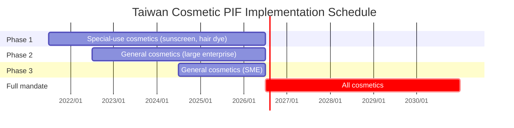

# Chapter 2: Regulatory Background — Taiwan Cosmetic PIF

> This chapter establishes the regulatory context of PIF AI: from the legislative history of Taiwan's *Cosmetic Hygiene and Safety Act*, to the substance of the Article 8 PIF obligation, the phased implementation schedule, penalties, and an international comparison with the EU CPR and US MoCRA. After reading, you should be able to answer: what is a PIF, why is July 2026 critical, and what happens if you don't comply.

## 📌 Key Takeaways

- The *Cosmetic Hygiene and Safety Act* was promulgated in 2018; phased effect from 2019; **fully mandatory on 2026-07-01**
- **Article 8** is the core PIF obligation; authorizes TFDA to inspect at any time
- Non-compliance (no PIF or incomplete PIF) carries fines of NT$10,000–NT$1,000,000
- Taiwan's PIF design is closest to the EU CPR; enforcement detail emphasizes "in-house retention," similar to US MoCRA

## 2.1 Legislative History

### 2.1.1 Predecessor: The Cosmetic Hygiene Administration Statute

Before 2018, cosmetics in Taiwan were governed by the *Cosmetic Hygiene Administration Statute* (enacted 1972; revised multiple times)[^1]. That statute centered on "pre-market licensing": special-use cosmetics required registration before sale; general cosmetics were on notification.

Problems:

- **Licensing delays**: new international products often took 1–2 years to clear registration and reach shelves
- **Incomplete records for notified cosmetics**: when safety concerns emerged post-market, authorities could not trace the source
- **Divergence from international trends**: the EU's CPR (Regulation EC 1223/2009, 2013) replaced pre-market licensing with post-market surveillance; the US enacted MoCRA in 2022 to strengthen recordkeeping

### 2.1.2 The 2018 Act

In 2018 Taiwan's Legislative Yuan passed the *Cosmetic Hygiene and Safety Act* (the "Act")[^2]. Core changes:

1. **Abolished pre-market licensing** for special-use cosmetics; introduced **product registration** (electronic TFDA platform) for all cosmetics
2. **Introduced the PIF obligation** (Article 8): all marketed cosmetics must maintain a Product Information File
3. **Mandated the Safety Assessor (SA)** to sign off the Item 16 safety assessment
4. **Staged rollout**: phased by product category and business size

## 2.2 Article 8 Deconstructed

### 2.2.1 Text (excerpt, translated)

> Article 8 of the Cosmetic Hygiene and Safety Act:
>
> 1. Businesses that manufacture or import cosmetics **shall establish a Product Information File (PIF)** before the cosmetic is supplied, sold, gifted, publicly displayed, or offered as samples to consumers.
> 2. The PIF shall be **retained at the business's premises** for inspection. The central competent authority (TFDA) shall prescribe the retention method, content, period, and other implementation details.
> 3. The central competent authority may, by product category, dosage form, or business scale, announce the **mandatory implementation schedule** of the PIF obligation.

### 2.2.2 Three Core Obligations

| Obligation | Subject | Timing |
|---|---|---|
| **Establish** | Manufacturer / importer | Before any supply / sale / gift / display / sample |
| **Retain** | Manufacturer / importer themselves | Product lifecycle + 10 years post-discontinuation (per implementation rules) |
| **Produce on demand** | Cooperate with TFDA inspection | TFDA may inspect at any time |

> [!IMPORTANT]
> A key point: the PIF is **not submitted** to TFDA. Businesses retain it themselves for inspection. This means TFDA does not routinely read each business's PIF; but upon inspection, inability to produce a complete PIF immediately is non-compliance.
>
> This design directly maps to PIF AI's product positioning: **a self-service tool for businesses**, not a submission portal.

### 2.2.3 The 16 PIF Items

The implementation rule *Regulations on Management of Cosmetic Product Information Files* specifies 16 items[^3], detailed in §3. Here are the titles for reference:

1. Product basic data
2. Product registration evidence
3. Full ingredient names and amounts
4. Labels / packaging
5. GMP certification
6. Manufacturing method / process
7. Usage instructions
8. Adverse-reaction data
9. Substance characterization data
10. Toxicological data
11. Stability testing
12. Microbial testing
13. Preservative efficacy testing
14. Functional evidence
15. Packaging material report
16. SA safety-assessment signature

## 2.3 Phased Implementation Schedule

**Figure 2.1**: TFDA announced a three-phase gradual rollout, prioritizing higher-risk products and larger businesses. The full mandate activates on 2026-07-01, giving the industry roughly five years to build capacity.

> [!WARNING]
> After July 1, 2026, **all** cosmetics manufactured or imported in Taiwan (regardless of category or business size) must hold a complete PIF. As of this whitepaper (April 2026), the remaining preparation window is about 2–3 months.

## 2.4 Penalties

Articles 23–24 of the Act govern penalties for PIF non-compliance:

| Violation | Fine | Additional consequence |
|---|---|---|
| No PIF before supply | NT$10,000 – NT$1,000,000 | Order to rectify within a period |
| Established but incomplete PIF | NT$10,000 – NT$300,000 | Same |
| Obstructing inspection | NT$100,000 – NT$1,000,000 | Same |
| Failure to rectify by deadline | **Aggravated** (up to NT$5,000,000) | May order suspension / revoke registration |
| Fraudulent SA signature | **Criminal liability** (forgery) | Civil liability separately |

> [!CAUTION]
> Fines are per-SKU. For multi-SKU businesses, a single inspection uncovering 10 non-compliant products could, in principle, lead to NT$10,000,000 in fines.

## 2.5 International Comparison

### 2.5.1 EU CPR (Cosmetic Products Regulation)

EU *Regulation (EC) No 1223/2009* has been in force since 2013[^4]. Core mechanism:

- All marketed cosmetics are **notified via CPNP** (Cosmetic Products Notification Portal), not licensed
- Manufacturers / importers must establish a **PIF**
- The **Safety Assessor** (toxicology or related science degree + professional training) must sign the Cosmetic Product Safety Report (CPSR)
- PIF must be produced within 72 hours on request by member-state authorities (e.g., ANSM in France, BVL in Germany)

### 2.5.2 US MoCRA (Modernization of Cosmetics Regulation Act of 2022)

The US passed MoCRA in 2022[^5], imposing federal recordkeeping obligations on cosmetics for the first time:

- Mandatory facility registration
- Mandatory product listing
- **Adverse Event Records** (15-year retention)
- Serious adverse-event reports to FDA within 15 business days
- Distinction from EU/Taiwan: MoCRA **does not require** a single integrated PIF; records are distributed across multiple compliance obligations

### 2.5.3 Three-Way Comparison

| Dimension | Taiwan Act | EU CPR | US MoCRA |
|---|---|---|---|
| Pre-market obligation | Product registration | CPNP notification | Product listing |
| Integrated PIF | ✅ Article 8 | ✅ CPSR | ❌ (distributed) |
| SA sign-off | Required | Required | Not required |
| Inspecting authority | TFDA | Member-state authorities | FDA |
| Full-mandate date | 2026-07-01 | 2013-07-11 | 2023-12 (facility reg) / 2024-07 (adverse events) |
| Max fine | NT$5M | €10M or 10% of turnover | Civil penalty + recall |

> [!TIP]
> PIF AI prioritizes Taiwan's Act, but the design (flexible 16-item mapping, multilingual schema) leaves room to extend to EU CPNP and MoCRA. See §12 Roadmap.

## 2.6 Regulatory Context in PIF AI

This chapter's regulatory facts map directly to PIF AI's design:

| Regulatory element | PIF AI design | Chapter |
|---|---|---|
| Article 8 — 16 items | `pif_documents` table + 16 processing modules | §3, §8 |
| SA qualification | `users.role = 'sa'` + `sa_qualified_until` | §11 (SA section) |
| In-house retention | Multi-tenant SaaS + AES-256 formulation encryption | §11 |
| Any-time inspection | Complete `audit_logs` table | §11 |
| High penalties | UI explicitly marks AI output as "reference draft" to avoid misleading compliance status | §1.3.2 |
| Phased rollout | SaaS pricing tiers (Free / Pro / Enterprise) mapped to business size | §12 |

## 📚 References

[^1]: *Cosmetic Hygiene Administration Statute* (1972; last revised 2016), superseded by the 2018 Act.
[^2]: *Cosmetic Hygiene and Safety Act* (promulgated 2018-05-02; phased effect 2019-07-01; fully mandatory 2026-07-01). MOHW/TFDA.
[^3]: *Regulations on Management of Cosmetic Product Information Files* (promulgated 2019-06-10).
[^4]: European Union. *Regulation (EC) No 1223/2009 on cosmetic products*. Official Journal, 2009.
[^5]: U.S. Congress. *Modernization of Cosmetics Regulation Act of 2022 (MoCRA)*. Public Law 117-328, 2022.

## 📝 Revision History

| Version | Date | Summary |
|:---:|:---:|---|
| v0.1 | 2026-04-19 | First draft. Covers Article 8, phased schedule, penalties, EU/US comparison |

---

© 2026 Baiyuan Tech. Licensed under CC BY-NC 4.0.

**Nav** [← Chapter 1: Abstract](ch01-abstract.md) · [Chapter 3: PIF 16 Items →](ch03-pif-16-items.md)
