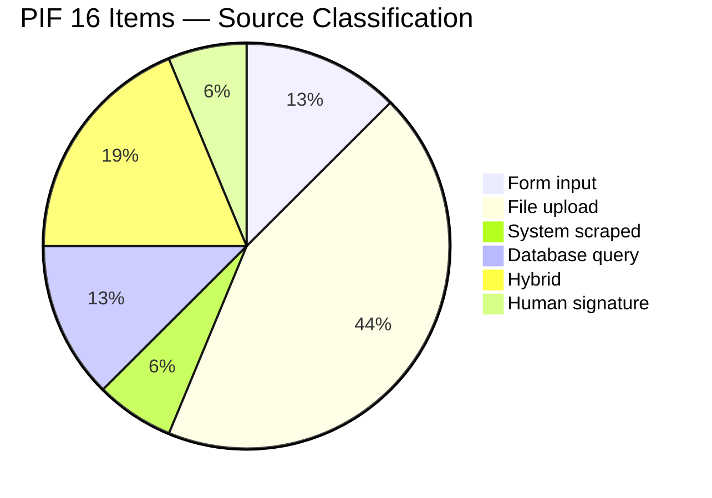
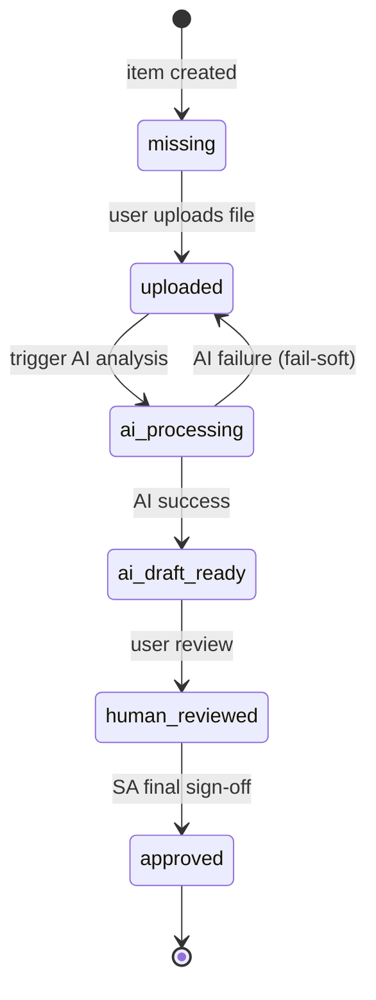

# Chapter 3: The 16 PIF Items — Deep Analysis

> This is the most specification-dense chapter in the whitepaper. We analyze each of the 16 PIF items with: (a) what the regulation requires, (b) the data source, (c) PIF AI's handling strategy, and (d) the database columns and code modules involved. At the end we generalize a "regulation-to-engineering mapping method" usable for extending to other jurisdictions.

## 📌 Key Takeaways

- The 16 items fall into five source categories: form input, file upload, system scraped, database query, human signature
- Each item maps to a specific `pif_documents.item_number` (1–16) status record
- The `ai_confidence ∈ [0, 1]` field drives UI presentation and SA review prioritization
- The "five-column mapping method" (Regulation → Source → AI Op → DB Column → State Machine) is a reusable extension blueprint

## 3.1 Classification Overview

By source, the 16 items cluster into five categories:

**Figure 3.1**: File uploads are the largest category (7 items, covering GMP and test reports), followed by hybrids (3, like usage instructions that combine user input with AI cross-checking). Only Item 16 is human-signed, but its status depends on the completion of items 1–15.

## 3.2 Item-by-Item

Each item follows the same template. The `DB`, `AI module`, and `strategy` fields are verifiable in the code.

### 3.2.1 Item 1 — Product Basic Data

| Aspect | Detail |
|---|---|
| **Regulation** | Product name, category, dosage form, intended use, manufacturer info, TFDA registration number |
| **Source** | Form input |
| **AI strategy** | LLM structured validation (name zh/en consistency, TFDA number format) |
| **DB columns** | `products.{name, name_en, category, dosage_form, intended_use, manufacturer_name, manufacturer_address, registration_id}` |
| **Module** | `app/api/v1/products.py`, `app/schemas/product.py` |

### 3.2.2 Item 2 — Product Registration Evidence

| Aspect | Detail |
|---|---|
| **Regulation** | TFDA registration platform screenshot, registration date, validity period |
| **Source** | System scraped (TFDA platform) |
| **AI strategy** | LLM parses TFDA query response, extracts status |
| **DB** | `products.registration_id` + `uploaded_files` (screenshot) |
| **Module** | `app/ai/tfda_registration_checker.py` (planned) |

### 3.2.3 Item 3 — Full Ingredient Names and Amounts

**One of the most engineering-intensive items.**

| Aspect | Detail |
|---|---|
| **Regulation** | All ingredients in INCI nomenclature, with CAS, concentration %, function; sorted descending by concentration |
| **Source** | User-uploaded formulation (PDF / Excel / image) |
| **AI strategy** | Claude Vision parses document → INCI normalization → CAS validation → concentration total check (±2%) |
| **DB columns** | `product_ingredients.{ingredient_id, concentration_pct, function, sort_order}` + `ingredients.{inci_name, inci_name_normalized, cas_number}` |
| **Module** | `app/ai/document_parser.py` + `app/ai/ingredient_validator.py` |

See §7.2 for the Claude Vision + INCI prompt design.

### 3.2.4 Item 4 — Labels / Packaging

| Aspect | Detail |
|---|---|
| **Regulation** | Labels and packaging design proofs; must include legally mandated elements (ingredients, use, manufacturer, etc.) |
| **Source** | User-uploaded design |
| **AI strategy** | OCR + Claude Vision → 11-element regulatory checklist |
| **DB** | `uploaded_files (pif_item_number=4)` |
| **Module** | `app/ai/label_checker.py` (planned) |

### 3.2.5 Item 5 — GMP Certification

| Aspect | Detail |
|---|---|
| **Regulation** | Manufacturing facility GMP certificate; contract-manufacturers need OEM GMP |
| **Source** | User upload |
| **AI strategy** | Claude identifies certificate type (ISO 22716 / MOHW GMP / other), extracts validity, cross-references manufacturer |
| **DB** | `uploaded_files (pif_item_number=5, file_type='gmp')` |
| **Module** | `app/ai/document_parser.py` + `pif_builder.py` |

### 3.2.6 Item 6 — Manufacturing Method / Process

| Aspect | Detail |
|---|---|
| **Regulation** | Detailed manufacturing steps, operational parameters (T, t), equipment used, QC checkpoints |
| **Source** | Manufacturer or contract manufacturer |
| **AI strategy** | AI structures the narrative into a standard template; flags missing fields as `[pending]` |
| **DB** | `uploaded_files` + `pif_documents.ai_draft_url` |
| **Module** | `app/ai/pif_generator.py` |

### 3.2.7 Item 7 — Usage Instructions

| Aspect | Detail |
|---|---|
| **Regulation** | Method, recommended dose, frequency, applicable areas, precautions, warnings |
| **Source** | User-provided |
| **AI strategy** | AI cross-checks claim consistency — medical-efficacy claims (e.g., "improves acne scars") are flagged as prohibited |
| **DB** | `pif_documents` (item 7) |
| **Module** | `app/ai/usage_claim_validator.py` (planned) |

### 3.2.8 Item 8 — Adverse-Reaction Data

| Aspect | Detail |
|---|---|
| **Regulation** | Historical adverse reactions; if none, a statement is required |
| **Source** | User-provided |
| **AI strategy** | AI classifies reactions (irritation / allergy / other) + risk grade |
| **DB** | `pif_documents` |
| **Module** | `app/ai/adverse_reaction_classifier.py` (planned) |

### 3.2.9 Item 9 — Substance Characterization Data

| Aspect | Detail |
|---|---|
| **Regulation** | Chemical name, molecular formula, MW, physical props (appearance, pH, solubility), chemical stability |
| **Source** | **PubChem automatic query** |
| **AI strategy** | LLM Tool Use → `pubchem.query(cas_or_inci)` → structured extraction |
| **DB** | `toxicology_cache.{data_json, source='pubchem'}` |
| **Module** | `app/ai/toxicology_engine.py` + `app/mcp_servers/` |

### 3.2.10 Item 10 — Toxicological Data

| Aspect | Detail |
|---|---|
| **Regulation** | Acute toxicity, skin/eye irritation, sensitization, genotoxicity, reproductive toxicity, carcinogenicity per ingredient |
| **Source** | Cross-query across databases (PubChem, TFDA, ECHA, SCCS) |
| **AI strategy** | AI synthesizes multi-source data → risk-summary table with citations |
| **DB** | `toxicology_cache.{data_json, risk_level, ai_summary, fetched_at, expires_at}` |
| **Module** | `app/ai/toxicology_engine.py` (Claude Sonnet + Tool Use) |

See §9 for the full pipeline.

### 3.2.11 Item 11 — Stability Testing

| Aspect | Detail |
|---|---|
| **Regulation** | Accelerated + long-term test reports; conditions, test items (appearance, pH, viscosity), conclusions, recommended shelf life |
| **Source** | User-uploaded report |
| **AI strategy** | Claude parses data tables + compliance judgment against ICH Q1A |
| **DB** | `uploaded_files (pif_item_number=11)` |
| **Module** | `app/ai/test_report_parser.py` (unified for §3.2.11–13) |

### 3.2.12 Item 12 — Microbial Testing

| Aspect | Detail |
|---|---|
| **Regulation** | Total plate count (TPC), E. coli, Staph. aureus, P. aeruginosa, etc. |
| **Source** | User upload |
| **AI strategy** | Parses test data + compares to TFDA cosmetic microbiology baselines |
| **DB** | `uploaded_files` |
| **Module** | Same as §3.2.11 |

### 3.2.13 Item 13 — Preservative Efficacy Testing

| Aspect | Detail |
|---|---|
| **Regulation** | Challenge Test report (inoculation strains, survival counts, log reduction, Grade A/B) |
| **Source** | User upload |
| **AI strategy** | Parses data + Pass/Fail judgment against ISO 11930 |
| **DB** | `uploaded_files` |
| **Module** | Same |

### 3.2.14 Item 14 — Functional Evidence

| Aspect | Detail |
|---|---|
| **Regulation** | Evidence supporting efficacy claims (clinical, in-vitro, literature). Medical-efficacy claims prohibited. |
| **Source** | User upload |
| **AI strategy** | Matches "claim" vs "evidence" consistency; flags medical-efficacy violations |
| **DB** | `uploaded_files` |
| **Module** | `app/ai/claim_evidence_checker.py` (planned) |

### 3.2.15 Item 15 — Packaging Material Report

| Aspect | Detail |
|---|---|
| **Regulation** | Packaging specs, heavy-metal migration tests (Pb, Hg, As, Cd), plasticizer tests, container compatibility |
| **Source** | User upload |
| **AI strategy** | Parses test report + compares to regulatory thresholds |
| **DB** | `uploaded_files` |
| **Module** | Same as §3.2.11 |

### 3.2.16 Item 16 — SA Safety-Assessment Signature

| Aspect | Detail |
|---|---|
| **Regulation** | A qualified SA reviews items 1–15 and signs a safety-assessment report |
| **Source** | SA online review |
| **AI strategy** | AI produces a **draft** (does not substitute for SA judgment); SA revises + signs electronically |
| **DB** | `sa_reviews.{ai_draft_assessment, sa_final_assessment, sa_comments, signature_url, signed_at}` |
| **Module** | `app/services/sa_workflow.py` + `app/api/v1/sa_review.py` |

See §11 (SA workflow) for details.

## 3.3 State Machine

Each `pif_documents` record has a `status` field. The state machine:

**Figure 3.2**: Six legal states. The `ai_processing → uploaded` fail-soft edge lets users retry after transient AI failures. Only an SA may trigger `approved` (enforced at the application layer), mapping directly to the Act's SA signature requirement.

## 3.4 The Regulation-to-Engineering Mapping Method

This whitepaper proposes a **five-column mapping method** — applicable to extending to other jurisdictions (EU CPNP, US MoCRA):

| Column | Content |
|---|---|
| **① Regulation** | Text, article number, date |
| **② Source** | Who (user / system / SA) provides? What format? |
| **③ AI operation** | LLM Tool Use verb (parse / validate / compare / summarize) |
| **④ DB column** | Table.Column or JSONB path |
| **⑤ State-machine state** | Position in the 6-state model |

Any new regulatory obligation can be systematically translated into engineering work, avoiding ad-hoc "where does this belong?" chaos. See §8 for Schema detail.

## 📚 References

[^1]: *Regulations on Management of Cosmetic Product Information Files* (2019-06-10).
[^2]: MOHW/TFDA. *Cosmetic Standards Annexes 1–5* (prohibited / restricted / preservative / colorant / UV-filter lists).
[^3]: ICH Q1A(R2). *Stability Testing of New Drug Substances and Products*.
[^4]: ISO 11930:2019. *Cosmetics — Microbiology — Evaluation of Antimicrobial Protection*.
[^5]: European Commission. *SCCS Notes of Guidance*, 12th revision.

## 📝 Revision History

| Version | Date | Summary |
|:---:|:---:|---|
| v0.1 | 2026-04-19 | First draft. 16 items deep analysis, state machine, five-column mapping method |

---

© 2026 Baiyuan Tech. Licensed under CC BY-NC 4.0.

**Nav** [← Chapter 2: Regulatory Background](ch02-regulatory-background.md) · [Chapter 4: System Architecture →](ch04-system-architecture.md)
