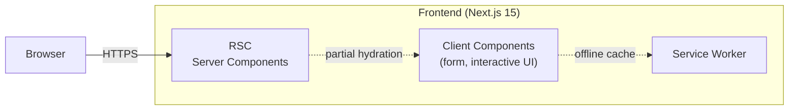
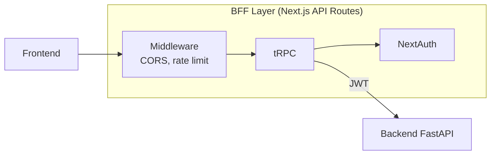
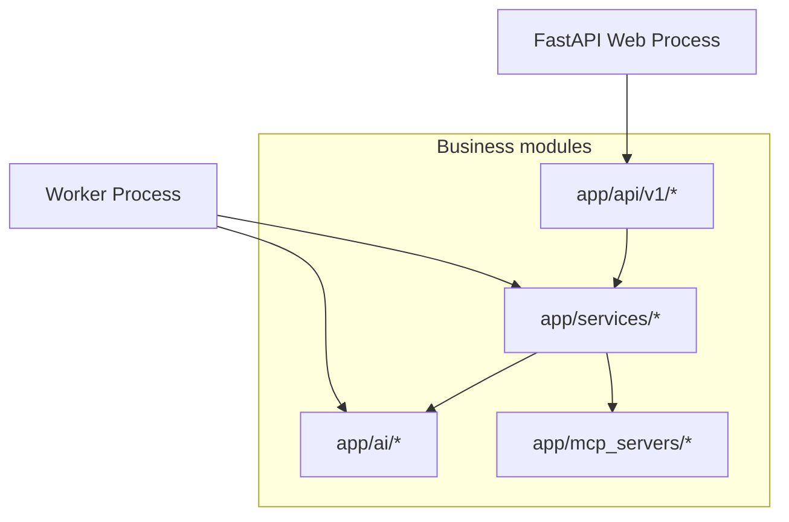
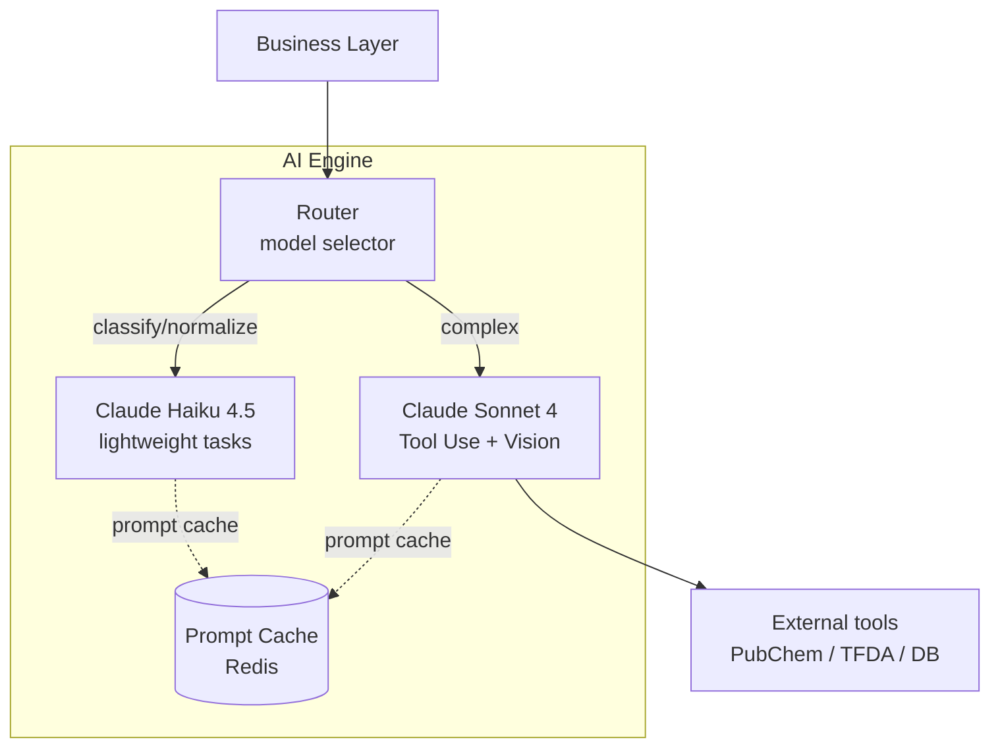
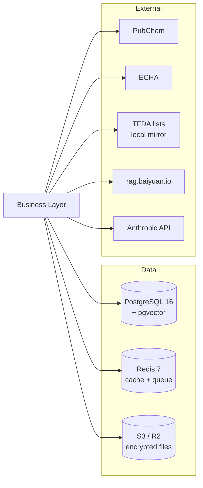

# Chapter 4: System Architecture

> This chapter deepens the five-layer architecture introduced in §1.4. For each layer we detail its module boundary, data flow, and interface contract with adjacent layers. The chapter ends with deployment topology and a horizontal-scaling path. It is the map for reading §5–§10 on individual stacks.

## 📌 Key Takeaways

- Unidirectional dependency: upper layers call lower, not vice versa
- Deployment path: Docker Compose (MVP) → Kubernetes (scale-out) → multi-region (global)
- Module boundaries follow DDD Bounded Contexts
- Each layer has a degradation strategy: cached UI, circuit breaker BFF, Worker retry, AI fallback

## 4.1 Design Principles

### 4.1.1 Unidirectional Dependency

```
Layer 1 (Frontend) → Layer 2 (BFF) → Layer 3 (Business) → Layer 4 (AI) → Layer 5 (Data)
                     ↓                ↓
                   Sessions          Worker (async)
```

Upper layers know the contract of lower layers; lower layers do not know the existence of upper layers. Lower-layer changes are breaking; upper-layer changes are invisible to lower layers. This enables:

- Backend can deploy independently without frontend coordination
- Tests can mock a lower layer to isolate an upper layer's behavior
- Any layer can be replaced (e.g., Next.js → Remix) without touching the others

### 4.1.2 Module Boundary = Bounded Context

Borrowing from DDD[^1], each module corresponds to a Bounded Context:

| Context | Concerns | Modules |
|---------|----------|---------|
| **Identity** | Users, organizations, auth | `app/api/v1/auth.py`, `app/models/user.py` |
| **Product** | Product CRUD, PIF status | `app/api/v1/products.py`, `app/services/pif_builder.py` |
| **Formulation** | Formula, ingredients, INCI | `app/models/ingredient.py`, `app/services/encryption.py` |
| **Toxicology** | Toxicology query, cache | `app/ai/toxicology_engine.py`, `app/models/toxicology_cache.py` |
| **Review** | SA review, e-signature | `app/api/v1/sa_review.py`, `app/services/sa_workflow.py` |
| **Compliance** | TFDA, regulatory check | `app/mcp_servers/tfda_server/` |
| **Knowledge** | Central RAG integration | `app/services/rag_client.py` |

Cross-Context communication happens via events or explicit API calls; internal state is not shared.

### 4.1.3 Fail-soft over Fail-fast

PIF compilation spans many days. Short-lived external failures must not block progress:

| Failure | Fail-fast | PIF AI Fail-soft |
|---|---|---|
| Claude API overloaded | HTTP 500 to user | Queue task → Worker retry |
| PubChem rate limit | Abort toxicology | Mark "in progress" → retry later |
| RAG service restart | Cannot create product | KB creation fails → product still created, `rag_kb_id` NULL for back-fill |
| PDF generation timeout | UI error | Background generation → push notification when done |

### 4.1.4 Observability over Debugging

Every cross-layer call emits a trace ID; all errors structured and pushed to central logging. Production incidents are diagnosed by querying logs, not by "local reproduction."

## 4.2 Layer-by-Layer

### 4.2.1 Layer 1 — Frontend



**Figure 4.1**: Next.js 15 App Router defaults to React Server Components (RSC); only interactive elements (forms, dropdowns, drag-drop uploads) are Client Components. Service Worker provides PWA offline caching so logged-in users can browse already-loaded data while offline.

**Key decisions**:

- Large PIF build pages use SSR (fast) + islands hydration (light)
- File uploads use **pre-signed URLs** direct to S3/R2, bypassing backend bandwidth
- Forms use `react-hook-form` + `zod` for client-side validation to filter out most errors before submission

See §5 for details.

### 4.2.2 Layer 2 — BFF



**Figure 4.2**: BFF (Backend-for-Frontend) is an API aggregation layer tailored to frontend needs. It handles: (a) session management (NextAuth issues/validates JWTs), (b) composite queries frontend needs (`getDashboardData` = products + progress + sa-pending), (c) CORS / rate limit.

**Why BFF?** Reasons against direct frontend → FastAPI:

1. **Fewer round trips**: one dashboard page needs 3 backend endpoints; BFF merges to 1
2. **Security**: short-lived backend JWTs (15 min); BFF handles refresh
3. **Frontend tailoring**: BFF response shape matches UI needs; backend schema stays clean

### 4.2.3 Layer 3 — Business Logic



**Figure 4.3**: Business logic splits into Web Process (FastAPI) and Worker Process. They share code (`app/services/*`) but have different entry points:

- **Web**: `uvicorn app.main:app` (fast response to HTTP requests)
- **Worker**: `python -m app.worker` (time-consuming tasks: toxicology batch, PDF generation, AI generation)

Both share PostgreSQL (task state) and Redis (queue). Scaling is independent: Web scales on req/sec; Worker on queue depth.

### 4.2.4 Layer 4 — AI Engine



**Figure 4.4**: Model router selects Sonnet or Haiku based on task complexity; Prompt Cache (Redis); Tool Use bridges external integrations. See §7.

### 4.2.5 Layer 5 — Data & Integration



**Figure 4.5**: Single PostgreSQL (pgvector for RAG-fallback embeddings) + Redis (LRU cache + BullMQ queues) + S3/R2 (AES-256-encrypted formulation files). External integrations split into **free APIs** (PubChem, TFDA local mirror) and **paid / controlled** (ECHA needs API key, Anthropic token-metered, central RAG dual-header auth).

## 4.3 Data Flow Example: Create New Product

The most common scenario, showing cross-layer collaboration:

```mermaid
sequenceDiagram
    participant U as User
    participant F as Frontend
    participant B as BFF
    participant A as FastAPI
    participant D as PostgreSQL
    participant R as RAG v2
    U->>F: Fill form + submit
    F->>F: zod client-side validation
    F->>B: POST /api/products
    B->>B: NextAuth validates session
    B->>A: POST /api/v1/products (JWT)
    A->>A: Pydantic + ACL check
    A->>D: INSERT products
    D-->>A: product_id
    A->>A: initialize_pif_documents(product_id)<br/>16 rows, status=missing
    A->>R: safe_create_kb(org_id, product_id)
    alt RAG success
        R-->>A: kb_id
        A->>D: UPDATE products SET rag_kb_id=?
    else RAG failure (fail-soft)
        A->>A: log warning; rag_kb_id=NULL
    end
    A-->>B: 201 + ProductResponse
    B-->>F: dashboard URL
    F-->>U: redirect to build page
```

**Figure 4.6**: Key design: (a) client-side validation before BFF (first line of defense); (b) FastAPI commits the local product transaction *before* calling RAG asynchronously; (c) RAG failure is fail-soft — product creation never depends on RAG uptime.

## 4.4 Deployment Topology

### 4.4.1 MVP Phase: Docker Compose

```yaml
# docker-compose.yml (excerpt)
services:
  frontend: { build: ./frontend, ports: ["3000:3000"] }
  backend:  { build: ./backend,  ports: ["8000:8000"] }
  worker:   { build: ./backend,  command: "python -m app.worker" }
  db:       { image: pgvector/pgvector:pg16 }
  redis:    { image: redis:7-alpine }
  minio:    { image: minio/minio }  # local S3 replacement
```

Five services on a single host. Suitable for MVP traffic (< 1000 req/min).

### 4.4.2 Scale-out: Kubernetes

When MAU > 10,000 or req/sec > 100:

- **Frontend** → Vercel (commercial) or K8s Deployment (3 replicas)
- **Backend** → K8s HPA on CPU + req/sec
- **Worker** → K8s HPA on queue depth (KEDA scaler)
- **PostgreSQL** → managed (Supabase / RDS) + read replicas
- **Redis** → managed (Upstash / ElastiCache)
- **S3** → AWS S3 or Cloudflare R2 (no egress fees)

### 4.4.3 Global: Multi-region

Phase 3 (Japan, Korea, EU):

- Per-region K8s cluster (data sovereignty: GDPR, Japan PIPA)
- Global DNS load balancing (Cloudflare)
- Per-region databases; shared read-only TFDA/ECHA mirrors

## 4.5 Observability

### 4.5.1 Logs

- Application: structlog (JSON) → Loki
- Request: FastAPI middleware logs method/path/status/duration
- AI: each Claude call records input_tokens / output_tokens / cost

### 4.5.2 Metrics

- Prometheus scrape: HTTP req/sec, DB pool usage, Redis hit rate
- Business metrics: product creation rate, PIF completion rate, SA review median time

### 4.5.3 Tracing

- OpenTelemetry: trace ID propagated across Frontend → BFF → FastAPI → DB
- Jaeger: visualize trace dependencies

## 📚 References

[^1]: Evans, E. (2003). *Domain-Driven Design: Tackling Complexity in the Heart of Software*. Addison-Wesley.
[^2]: Newman, S. (2021). *Building Microservices* (2nd ed.). O'Reilly.
[^3]: Fowler, M. *Backends For Frontends*. <https://martinfowler.com/articles/bff.html>
[^4]: Vercel. *Next.js 15 Documentation — App Router*.

## 📝 Revision History

| Version | Date | Summary |
|:---:|:---:|---|
| v0.1 | 2026-04-19 | First draft. Five-layer detail, data flow, deployment, observability |

---

© 2026 Baiyuan Tech. Licensed under CC BY-NC 4.0.

**Nav** [← Chapter 3: PIF 16 Items](ch03-pif-16-items.md) · [Chapter 5: Frontend Stack →](ch05-frontend-stack.md)
