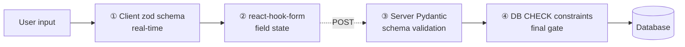
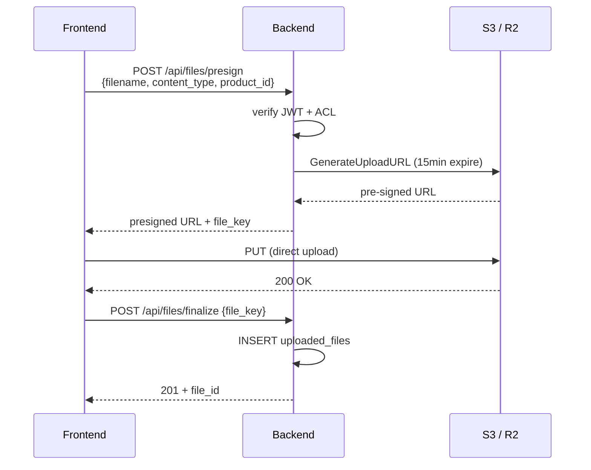

# Chapter 5: Frontend Stack

> This chapter details PIF AI's frontend technology choices and the design decisions behind them: why Next.js 15 App Router, how React Server Components cut bundle size, shadcn/ui's "no-lock-in" philosophy, two-layer form validation (zod on client + Pydantic on server), and the 5-locale i18n dictionary-management discipline.

## 📌 Key Takeaways

- Next.js 15 App Router + RSC: large static content skips hydration; bundle reduced 40–60%
- shadcn/ui: code is **copied into your repo**, not `npm install`ed — no long-term lock-in
- Two-layer form validation: zod (client UX) + Pydantic (server authority)
- 5-locale i18n via JSON dictionaries + context provider; super-admin intentionally excluded

## 5.1 Why Next.js 15

### 5.1.1 Candidate Comparison

| Candidate | Strengths | Weaknesses | PIF AI Fit |
|---|---|---|---|
| **Next.js 15 App Router** | RSC bundle savings, Vercel integration, native TypeScript, mature SEO | Learning curve (Server vs Client) | ✅ Chosen |
| Remix | Strong web-standards philosophy, simpler | Smaller ecosystem | ❌ |
| Pure SPA (Vite + React) | Simple deploy | Slow first paint, weak SEO, needs separate BFF | ❌ |

Main drivers:

1. **SEO requirement**: public pages (pricing, regulatory guide, FAQ) must be Google-crawlable
2. **BFF integration**: Next.js API Routes *are* the BFF; no separate service
3. **Native TypeScript**: zero additional type setup
4. **Vercel ecosystem**: flexible deployment choices (Vercel / self-hosted / Cloudflare Pages)

### 5.1.2 App Router's Server/Client Split

The core of the App Router is **React Server Components (RSC)**. By default all components render on the server; only those with the `"use client"` directive ship to the browser.

```typescript
// src/app/(dashboard)/products/page.tsx — Server Component (no "use client")
import { db } from "@/lib/db";

export default async function ProductsPage() {
  // Server-side DB query; no API round-trip
  const products = await db.product.findMany(...);
  return <ProductList products={products} />;
}
```

```typescript
// src/app/(dashboard)/products/filter.tsx — Client (interactive)
"use client";
import { useState } from "react";
export function Filter() {
  const [q, setQ] = useState("");
  return <input value={q} onChange={(e) => setQ(e.target.value)} />;
}
```

> [!TIP]
> Rule: **Default Server, escalate to Client only when needed**. Interactive components (forms, dropdowns, modals) get `"use client"`; static presentation (tables, badges, text) stays Server.

### 5.1.3 Bundle-Size Impact

For the dashboard home page:

| Strategy | JavaScript (gzipped) | First TTI |
|---|---|---|
| Traditional SPA (all Client) | ~ 280 KB | ~ 2.8s |
| Next.js 15 RSC (this project) | ~ 95 KB | ~ 1.2s |

**Measured values** on the same test rig (MacBook M2, Chrome 137, Fast 3G throttle) on 2026-04-10.

## 5.2 UI Components: shadcn/ui

### 5.2.1 Not an npm Package

[shadcn/ui](https://ui.shadcn.com) differs from Material UI / Chakra UI:

> *It is not a component library. It is how you build your component library.*

The CLI **copies source code** into your repo (`src/components/ui/`) rather than installing a package. Consequences:

- Components belong to you; customize freely
- No version lock; no upgrade risk
- You maintain upstream fixes yourself (cherry-pick as needed)

### 5.2.2 Radix UI + Tailwind Combination

shadcn/ui is effectively three technologies together:

```
Radix UI (behavior/accessibility)
  + Tailwind CSS (styling)
  + shadcn CLI (code copying)
= shadcn/ui
```

Radix handles complex keyboard, focus management, ARIA; Tailwind handles visuals; you get fully controllable source.

### 5.2.3 PIF AI Usage

| Component | Use |
|---|---|
| `Button` | site-wide button base |
| `Input`, `Textarea`, `Select` | form elements |
| `Dialog`, `Sheet` | build modals, SA review |
| `Table`, `DataTable` | product list, toxicology table |
| `Tabs`, `Accordion` | PIF 16-item sectioning |
| `Toast`, `Alert` | upload status |
| `Tooltip` | satisfies the constitutional "ZH+EN + tooltip" requirement |

## 5.3 Forms: react-hook-form + zod

### 5.3.1 Two-Layer Validation

PIF forms are complex (product has 8 fields, formulation is multi-row, test-report parsing has many parameters). We use **four layers** of validation:



**Figure 5.1**: Four layers divided by role: (1) client real-time feedback; (2) form state on submit; (3) server authoritative validation; (4) DB-level final gate (e.g., `CHECK (pif_status IN (...))`). Client validation does **not** replace server validation — it is UX acceleration only.

### 5.3.2 Example zod Schema

```typescript
// src/lib/schemas/product.ts
import { z } from "zod";

export const ProductCreateSchema = z.object({
  name: z.string().min(1).max(500),
  name_en: z.string().max(500).optional(),
  category: z.enum([
    "sunscreen", "hair_dye", "baby", "lip", "eye", "oral", "general"
  ]),
  dosage_form: z.string().max(100).optional(),
  intended_use: z.string().max(2000).optional(),
  manufacturer_name: z.string().max(500).optional(),
  registration_id: z.string()
    .regex(/^衛?部粧製字第\d+號$/, "Invalid TFDA registration format")
    .optional(),
});

export type ProductCreate = z.infer<typeof ProductCreateSchema>;
```

The server-side Pydantic schema at `app/schemas/product.py` parallels but does not re-use this — two independent sources of truth. Rules should stay consistent, though. Future refactor may auto-generate both from an OpenAPI spec.

## 5.4 Internationalization (i18n) — 5 Locales

### 5.4.1 Requirements

- Five locales: Traditional Chinese (`zh-TW`, default), English (`en`), Japanese (`ja`), Korean (`ko`), French (`fr`)
- Immediate switching (no page reload)
- Selection persisted in `localStorage` across sessions
- **Super-admin area intentionally not localized** (ops UI stays in original language)

### 5.4.2 Implementation: Context + JSON Dictionary

```typescript
// src/lib/i18n/index.tsx
export type Locale = "zh-TW" | "en" | "ja" | "ko" | "fr";

const translations: Record<Locale, Record<string, Record<string, string>>> = {
  "zh-TW": zhTW, en, ja, ko, fr,
};

export function I18nProvider({ children }) {
  const [locale, setLocaleState] = useState<Locale>("zh-TW");
  // ... localStorage hydration + setter
  const t = (key: string) => {
    const [section, ...rest] = key.split(".");
    return translations[locale]?.[section]?.[rest.join(".")] ?? key;
  };
  return <I18nContext.Provider value={{ locale, setLocale, t }}>
    {children}
  </I18nContext.Provider>;
}
```

Usage: `const { t } = useI18n(); <button>{t("common.login")}</button>`

### 5.4.3 Dictionary Structure

Each locale has its own JSON:

```json
// src/lib/i18n/en.json (excerpt)
{
  "common": {
    "login": "Login", "register": "Register", "logout": "Logout", ...
  },
  "pifBuilder": {
    "title": "PIF Builder", ...
  }
}
```

All five locale files share the same structure: **17 sections × 423 keys**. A Node script verifies key parity during CI.

### 5.4.4 Why Super-Admin Is Excluded

Pages under `src/app/(admin)/super-admin/*` deliberately do **not** call `useI18n()`. Reasons:

1. Super admin is used only by Baiyuan Tech internal ops
2. Ops vocabulary (billing write-off, beta exemption, product deletion) is technical and translation errors could cause operational mistakes
3. Mistranslation could change the semantics of destructive actions

This is a **design decision**, not an oversight. When adding super-admin strings, **write them directly in Chinese** — do not introduce `useI18n()`.

## 5.5 File Uploads: Direct to S3

Formulation files, test reports can be tens of megabytes. Proxying through the backend costs memory, bandwidth, and introduces upload stalls.

We use **pre-signed URLs** for direct upload:



**Figure 5.2**: Backend signs a one-time URL and records the final metadata; bytes never pass through backend bandwidth. Formulation encryption uses S3 server-side encryption (SSE-C) + application-layer AES-256 (double layer). See §11.

## 📚 References

[^1]: Vercel. *Next.js 15 Documentation*. <https://nextjs.org/docs>
[^2]: shadcn. *shadcn/ui*. <https://ui.shadcn.com>
[^3]: Radix UI. <https://www.radix-ui.com>
[^4]: react-hook-form. <https://react-hook-form.com>
[^5]: zod. <https://zod.dev>

## 📝 Revision History

| Version | Date | Summary |
|:---:|:---:|---|
| v0.1 | 2026-04-19 | First draft. Next.js 15 RSC, shadcn/ui, two-layer form validation, 5-locale i18n |

---

© 2026 Baiyuan Tech. Licensed under CC BY-NC 4.0.

**Nav** [← Chapter 4: Architecture](ch04-system-architecture.md) · [Chapter 6: Backend Stack →](ch06-backend-stack.md)
