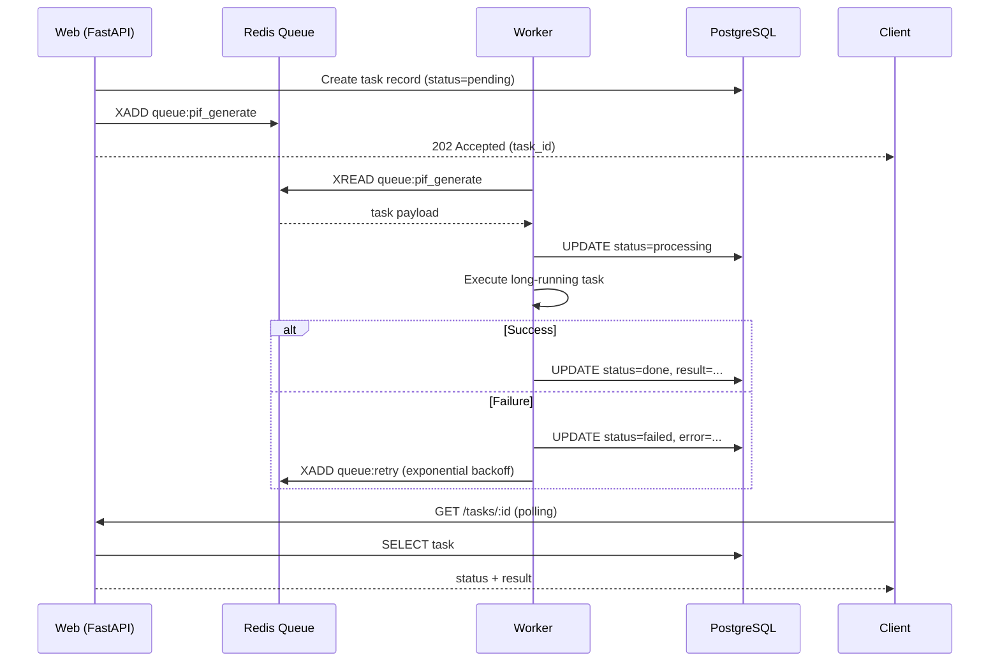

# Chapter 6: Backend Stack

> This chapter explains why Python FastAPI for PIF AI's backend, the practical trade-offs of SQLAlchemy async, why we use both Alembic and inline migrations, how Worker collaborates with the Web process, and our testing-pyramid + CI strategy.

## 📌 Key Takeaways

- FastAPI + Pydantic v2 + SQLAlchemy 2.0 async: Python's most mature async stack
- Dual migration track: **Alembic (formal)** + **inline `_run_migrations` (idempotent SQL for fast iteration)**
- Worker shares code with Web but runs as a separate process; scales independently
- Testing pyramid: Unit (httpx MockTransport) → Integration (real DB) → E2E (Playwright, Phase 2)

## 6.1 Why FastAPI

### 6.1.1 Candidate Comparison

| Candidate | Strengths | Weaknesses | PIF AI Fit |
|---|---|---|---|
| **FastAPI** | Async native, Pydantic validation, OpenAPI auto-gen, AI ecosystem | Less "batteries included" than Django | ✅ Chosen |
| Django + DRF | Mature, full-stack, admin | Late async support, heavy framework | ❌ |
| Flask | Simple, flexible | Async via plugins, weak typing | ❌ |
| Node.js (NestJS) | Unified language | Weaker AI/ML ecosystem | ❌ |

Deciding factors:

1. **AI ecosystem**: Anthropic Python SDK is officially maintained; ML stack (LangChain, LlamaIndex) is Python-first
2. **Async native**: PubChem / ECHA / Claude API are all high-latency I/O; async is essential
3. **Pydantic validation**: complex PIF schema (16 heterogeneous items) demands rigorous typing
4. **OpenAPI auto-gen**: `/docs` auto-generated; frontend team doesn't hand-write API docs

### 6.1.2 Project Layout

```
backend/
├── app/
│   ├── main.py                # FastAPI app + lifespan
│   ├── api/v1/                # Routes (products, pif, sa_review, ...)
│   ├── core/                  # config, database, security, email
│   ├── models/                # SQLAlchemy ORM
│   ├── schemas/               # Pydantic request/response
│   ├── services/              # Business logic (rag_client, sa_workflow, ...)
│   ├── ai/                    # AI engine (toxicology, document_parser, ...)
│   └── mcp_servers/           # MCP server impl (tfda, echa)
├── tests/                     # pytest
├── migrations/                # Alembic
├── alembic.ini
└── requirements.txt
```

## 6.2 SQLAlchemy 2.0 Async

### 6.2.1 Typed Models

SQLAlchemy 2.0 introduces `Mapped[T]` annotations, enabling IDE/mypy inference:

```python
# app/models/product.py (excerpt)
class Product(Base):
    __tablename__ = "products"

    id: Mapped[uuid.UUID] = mapped_column(
        UUID(as_uuid=True), primary_key=True, default=uuid.uuid4
    )
    org_id: Mapped[uuid.UUID] = mapped_column(
        UUID(as_uuid=True), ForeignKey("organizations.id")
    )
    name: Mapped[str] = mapped_column(String(500), nullable=False)
    rag_kb_id: Mapped[str | None] = mapped_column(String(100), index=True)
    # ...
    organization = relationship("Organization", back_populates="products")
```

All queries are async:

```python
async def get_product_for_org(product_id, org_id, db: AsyncSession):
    result = await db.execute(
        select(Product).where(
            Product.id == product_id,
            Product.org_id == org_id,  # ACL gate — explicit WHERE
        )
    )
    return result.scalar_one_or_none()
```

### 6.2.2 ACL-Gate Pattern

**Every** data-access function takes `org_id` and hard-filters in WHERE. This is the application-layer line of defense for Scheme C+ (see §10). Code pattern:

```python
# Correct: ACL gate
product = await get_product_for_org(product_id, current_user.org_id, db)

# Wrong: direct lookup (bypasses ACL)
# product = await db.get(Product, product_id)  # NEVER
```

Code review enforces that *all* DB access goes through `get_*_for_org` functions.

## 6.3 Dual Migration Strategy

### 6.3.1 Context

During Phase 1 rapid iteration, schema changes frequently. Pure Alembic has pain points:

1. Every field change → `alembic revision --autogenerate`
2. Developer machines need manual `alembic upgrade head`
3. Docker-startup timing is tricky (DB may not be ready)

### 6.3.2 Solution: Two Parallel Tracks

**Track A: Alembic (formal migrations)**

Used for large schema changes (new tables, index rebuilds). Stored in `migrations/versions/`, reviewed in PR.

**Track B: Inline `_run_migrations` (idempotent SQL)**

For small changes (add column, add index, data back-fill), using `ALTER ... IF NOT EXISTS` or `UPDATE ... WHERE`. Runs on every FastAPI startup:

```python
# app/main.py (excerpt)
@asynccontextmanager
async def lifespan(app: FastAPI):
    async with engine.begin() as conn:
        await conn.run_sync(Base.metadata.create_all)
        await _run_migrations(conn)
    yield
    await engine.dispose()


async def _run_migrations(conn) -> None:
    """Idempotent schema migrations for evolving an existing DB."""
    from sqlalchemy import text
    stmts = [
        "ALTER TABLE users ADD COLUMN IF NOT EXISTS totp_secret TEXT",
        "ALTER TABLE products ADD COLUMN IF NOT EXISTS rag_kb_id VARCHAR(100)",
        "CREATE INDEX IF NOT EXISTS idx_products_rag_kb_id ON products(rag_kb_id)",
        # ...
    ]
    for stmt in stmts:
        try:
            await conn.execute(text(stmt))
        except Exception:
            pass  # Already in target state — ignore
```

### 6.3.3 Trade-offs

**Pros**:

- Developer adds a column by appending one line to `_run_migrations` — PR is clear
- Deployment needs no manual `alembic upgrade`
- Runs after `create_all`, handles transformations ORM cannot express (CHECK fixes, conditional indexes)

**Cons**:

- No version tracking (unknown which schema version is live)
- No rollback
- High-risk changes (DROP COLUMN, RENAME) still need Alembic

**Rule of thumb**:

- Additive (add col, add index, relax CHECK) → inline
- Destructive (drop, rename, type change) → Alembic

## 6.4 Worker Architecture

### 6.4.1 Why Need Worker

Long-running operations do not fit HTTP request lifecycles:

| Operation | Time | Needs Worker |
|---|---|---|
| Formulation AI extraction | 10–30s | ✅ |
| Toxicology batch query | 30s–2min | ✅ |
| PIF PDF generation | 30s–1min | ✅ |
| SA assessment draft generation | 15–45s | ✅ |
| Generic DB CRUD | < 100ms | ❌ |

### 6.4.2 Queue: Redis + BullMQ

Redis is the queue backend. Web pushes tasks; Worker consumes:



**Figure 6.1**: Web enqueues and returns 202. Worker consumes independently, updates DB status. Failure uses exponential backoff (1s, 2s, 4s, 8s, …, max 300s); three consecutive failures → marked `failed`.

### 6.4.3 Horizontal Scaling

Web and Worker scale independently:

```yaml
# docker-compose.yml (excerpt)
services:
  backend:
    build: ./backend
    command: uvicorn app.main:app --host 0.0.0.0
    deploy:
      replicas: 3   # K8s: HPA on CPU
  worker:
    build: ./backend
    command: python -m app.worker
    deploy:
      replicas: 5   # K8s: KEDA on queue depth
```

Web scales on req/sec; Worker scales on queue depth. They do not interfere.

## 6.5 Testing Strategy

### 6.5.1 Testing Pyramid

```
         /\
        /  \   E2E (Playwright, Phase 2)
       /----\
      /      \  Integration (pytest + real DB)
     /--------\
    /          \ Unit (pytest + MockTransport)
   /____________\
```

### 6.5.2 Unit Testing: httpx MockTransport

External APIs (Claude, PubChem, central RAG) are replaced with `httpx.MockTransport` — no real network:

```python
# tests/test_rag_client.py (excerpt)
@pytest.mark.asyncio
async def test_create_kb_sends_correct_headers_and_payload(configured_rag):
    captured = {}
    def handler(request: httpx.Request) -> httpx.Response:
        captured["headers"] = dict(request.headers)
        return httpx.Response(
            201,
            json={"status": "success", "data": {"id": "kb_new_xyz"}},
        )
    _install_mock_transport(handler)
    kb = await RagClient.create_knowledge_base(
        org_id=uuid.uuid4(), product_id=uuid.uuid4()
    )
    assert kb.id == "kb_new_xyz"
    assert captured["headers"]["x-rag-api-key"] == "test-key-abc"
    assert captured["headers"]["x-tenant-id"] == "11111111-..."
```

This pattern keeps unit tests **fully offline** — ideal for CI. The 16 RagClient unit tests complete in 1.09 seconds on a local Docker container[^1].

### 6.5.3 Integration Testing: Real DB

`tests/conftest.py` creates a `pifai_test` database at session start, runs `Base.metadata.create_all`. Each test function runs in its own transaction, rolled back at end for isolation:

```python
@pytest.fixture(scope="session", autouse=True)
def _create_test_db():
    # Connect to main DB → DROP pifai_test → CREATE pifai_test
    ...
    yield
    # teardown
```

Integration tests validate the full FastAPI + DB + ACL chain — e.g., "can user A access user B's products?"

### 6.5.4 CI: GitHub Actions

`.github/workflows/ci.yml` (planned):

```yaml
jobs:
  test:
    services:
      postgres: { image: pgvector/pgvector:pg16 }
      redis:    { image: redis:7-alpine }
    steps:
      - run: pytest -q --cov=app --cov-report=xml
  lint:
    - run: ruff check .
    - run: mypy app/
```

## 📚 References

[^1]: Measured: `docker exec pif-backend-1 python -m pytest tests/test_rag_client.py -q` completed 16 tests in 1.09s on 2026-04-19 (MacBook M2, Docker Desktop).
[^2]: Tiangolo, S. *FastAPI Documentation*. <https://fastapi.tiangolo.com>
[^3]: SQLAlchemy Team. *SQLAlchemy 2.0 — Async*. <https://docs.sqlalchemy.org/en/20/orm/extensions/asyncio.html>
[^4]: Alembic Documentation. <https://alembic.sqlalchemy.org>

## 📝 Revision History

| Version | Date | Summary |
|:---:|:---:|---|
| v0.1 | 2026-04-19 | First draft. FastAPI, SQLAlchemy async, dual migration, Worker, pytest |

---

© 2026 Baiyuan Tech. Licensed under CC BY-NC 4.0.

**Nav** [← Chapter 5: Frontend Stack](ch05-frontend-stack.md) · [Chapter 7: AI Engine →](ch07-ai-engine.md)
