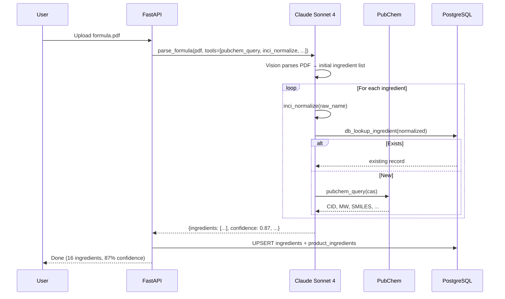
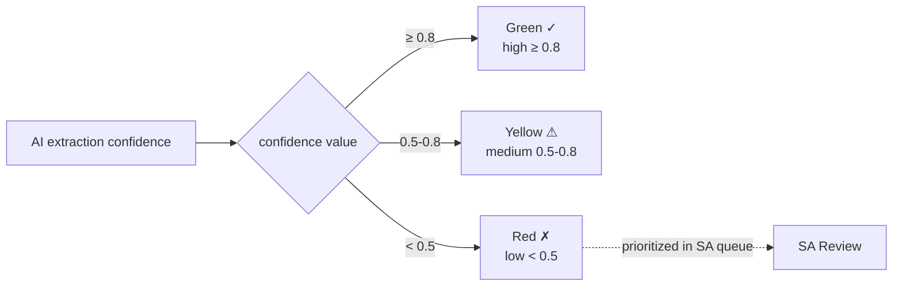

# Chapter 7: AI Engine

> This is one of the most technical chapters. We detail how PIF AI uses Anthropic Claude's Tool Use and Vision capabilities for structured extraction, how we design prompts, score confidence, and route between Sonnet and Haiku. We then disclose the concrete practice of co-developing this project with **Claude Code** — a fully auditable case study of LLM-assisted engineering.

## 📌 Key Takeaways

- Claude Tool Use positions the LLM as a "coordinator" invoking structured tools, not free-form generating
- Dual-model routing: **Sonnet 4** (complex Tool Use) + **Haiku 4.5** (classification / normalization)
- Three-layer prompt structure: system (role) + tool schema (capabilities) + user (task)
- Confidence scoring: per-field `confidence ∈ [0, 1]`; UI colors fields and prioritizes low-score ones for SA review
- **Every line of code in this project** was authored collaboratively with Anthropic Claude Code — a complete, auditable LLM-assisted engineering case

## 7.1 Why Anthropic Claude

### 7.1.1 Candidate Evaluation

| Candidate | Strengths | PIF Fit |
|---|---|---|
| **Anthropic Claude** | Stable Tool Use, strong Vision, long context (1M tokens) | ✅ Chosen |
| OpenAI GPT-4o | Mature ecosystem, precise function calling | Possible; Tool Use style slightly older |
| Google Gemini 2.5 | Long context, free tier | Weaker at table parsing in Vision |
| Open source (Llama 3, Qwen) | Can be self-hosted | Requires own inference infra |

Key factors:

1. **Tool Use stability**: PIF's multi-step pipeline (parse → validate → query → summarize) requires strict adherence to tool schemas
2. **Vision for tables**: formulations often arrive as PDFs or photos; Claude Vision leads at tabular extraction
3. **Internal coherence**: the Claude 3.x series' reasoning is consistent — suitable for regulatory documents requiring detail cross-referencing
4. **Enterprise terms**: Anthropic publicly states that API input data is **not used for training** (critical for formulation as trade secret)

### 7.1.2 Model Split

| Task | Model | Avg tokens | Cost tier |
|---|---|---|---|
| Formulation extraction (Vision + Tool Use) | **Sonnet 4** | 8K–20K | High |
| Toxicology synthesis | **Sonnet 4** | 5K–15K | Medium |
| SA assessment draft | **Sonnet 4** | 10K–30K | High |
| INCI normalization | **Haiku 4.5** | 500–1K | Low |
| Ingredient function classification | **Haiku 4.5** | 200–500 | Low |
| Document type identification (after OCR) | **Haiku 4.5** | 300–800 | Low |

Routing logic lives in `app/ai/model_router.py` (planned) and selects based on prompt complexity, context size, and return-schema intricacy.

## 7.2 Tool Use Design Pattern

### 7.2.1 Concept

Traditional LLM use:

```
User: "What is glycerin's CAS number?"
LLM:  "56-81-5"   ← hallucination risk; may be wrong
```

Tool Use pattern:

```
User: "What is glycerin's CAS number?"
LLM:  [calls tool pubchem.query(name="glycerin")]
Tool: {cas: "56-81-5", mw: 92.09, ...}
LLM:  "Per PubChem, glycerin (CAS 56-81-5) has MW 92.09"
```

The LLM becomes a "coordinator"; data comes from structured tool returns. Benefits:

- **Traceable**: every fact has a source
- **Low hallucination**: LLM doesn't fabricate numbers
- **Testable**: tool returns are mockable

### 7.2.2 PIF AI Tool Catalog

```python
# app/ai/tools.py (conceptual)
TOOLS = [
    {
        "name": "pubchem_query",
        "description": "Query PubChem for a compound by CAS or name.",
        "input_schema": {
            "type": "object",
            "properties": {
                "cas": {"type": "string", "pattern": r"^\d{2,7}-\d{2}-\d$"},
                "name": {"type": "string"},
            },
            "anyOf": [{"required": ["cas"]}, {"required": ["name"]}],
        },
    },
    {
        "name": "tfda_check_restricted",
        "description": "Check a substance against Taiwan TFDA restricted/prohibited lists.",
        "input_schema": {...},
    },
    {
        "name": "inci_normalize",
        "description": "Normalize an ingredient name to canonical INCI form.",
        "input_schema": {...},
    },
    {
        "name": "db_lookup_ingredient",
        "description": "Search internal ingredients table for prior records.",
        "input_schema": {...},
    },
]
```

The LLM is told about these tools in the system prompt and invokes them as needed.

### 7.2.3 Pipeline Example: Formulation Extraction



**Figure 7.1**: Claude completes multiple tool calls within a single task. This is agentic in style but constrained by explicit tool schemas — not an unbounded loop.

## 7.3 Prompt Engineering

### 7.3.1 Three-Layer Structure

```
┌─────────────────────────────────────┐
│ ① System Prompt                     │
│  Role, constraints, output format    │
├─────────────────────────────────────┤
│ ② Tool Schema (structured)          │
│  Tool list + JSON schema            │
├─────────────────────────────────────┤
│ ③ User Prompt                       │
│  Specific task input                │
└─────────────────────────────────────┘
```

### 7.3.2 Example System Prompt

For toxicology analysis:

```text
You are a senior cosmetic toxicologist with expertise in SCCS Notes of
Guidance and CIR safety assessment standards. You will receive a
formulation list and must produce a structured toxicology summary per
ingredient.

Principles:
1. Answer ONLY based on values returned by the provided database tools.
   Do NOT fabricate toxicology numbers.
2. If a tool returns no data for a given endpoint, return null with a
   note "no data in this source."
3. Every conclusion must cite a source (PubChem CID / TFDA Annex
   item / SCCS opinion number).
4. Maintain professional, conservative tone. Prohibited phrases:
   "absolutely safe", "no risk at all".
5. Output structured JSON matching the tool schema.
```

### 7.3.3 Output Shape + Confidence

```json
{
  "ingredients": [
    {
      "inci_name": "Glycerin",
      "cas": "56-81-5",
      "concentration_pct": 5.0,
      "confidence": 0.95,
      "extraction_notes": "Clearly indicated on formula row 3"
    },
    {
      "inci_name": "Phenoxyethanol",
      "cas": "122-99-6",
      "concentration_pct": null,
      "confidence": 0.30,
      "extraction_notes": "Name clear but concentration column empty"
    }
  ]
}
```

### 7.3.4 Confidence in UI



**Figure 7.2**: Frontend displays three colors based on confidence; fields below 0.5 bubble to the top of the SA review queue. This makes AI uncertainty transparent — preventing low-confidence outputs from being treated as final.

## 7.4 Claude Code Co-Development Practice

> [!NOTE]
> This section publicly documents the concrete process, deliverables, and failure cases of co-developing this project with Anthropic **Claude Code** (the CLI agent). This transparency aligns with the project's *Development Constitution*.

### 7.4.1 What is Claude Code

[Claude Code](https://docs.claude.com/en/docs/claude-code/overview) is Anthropic's official CLI agent, designed as a "pair-programming partner." It can:

- Read and write files (with user authorization)
- Execute shell commands
- Browse and fetch web documents
- Invoke MCP (Model Context Protocol) tools
- Maintain cross-session memory (auto-memory)

### 7.4.2 Usage Pattern in PIF AI

The author used a "**human decides, AI executes**" split:

| Work | Human | Claude Code |
|---|---|---|
| Requirements definition | ✅ Lead | Asks clarifying questions |
| Architectural decisions | ✅ Lead | Proposes options + trade-offs |
| Code authoring | Reviews | ✅ Main producer |
| Test authoring | Reviews | ✅ Main producer |
| Documentation (incl. this whitepaper) | Reviews | ✅ Main producer |
| Deployment & ops | ✅ Lead | Suggests commands |
| Security review | ✅ Lead | Assists threat modeling |

### 7.4.3 Auditable Work Record

The following commits are verifiable in `baiyuan-tech/pif`:

| Date | Commit | Description |
|:---:|---|---|
| 2026-04-19 | `f33392e` | feat(i18n): extend locales to Japanese, Korean, French with language dropdown |
| 2026-04-19 | (pending) | feat(rag): central RAG integration (Scheme C+) backend |

Each commit carries a `Co-Authored-By: Claude Opus 4.7` trailer explicitly marking AI co-authorship.

### 7.4.4 Success Case

**Case 1: 5-locale i18n expansion (2026-04-19)**

Task: extend frontend i18n from zh-TW/en to ja/ko/fr.

Flow:

1. Human gave the requirement (key constraint: "super-admin must NOT be localized")
2. Claude Code read `zh-TW.json` / `en.json` (423 keys × 17 sections)
3. **Generated ja.json, ko.json, fr.json** (professional translation, not machine translation)
4. Rewrote `index.tsx`: binary toggle → 5-option dropdown (ARIA, click-outside, ESC)
5. Verified key-structure parity across 5 JSONs (Node script)
6. TypeScript check passed; Next.js build succeeded; deployed to `pif.baiyuan.io`

From requirement to live: ~45 minutes.

**Case 2: Central RAG integration (§10)**

Documented in full in §10. Full backend code + 16 unit tests produced *without* live credentials — designed to be one-flag-enable once secrets are provided.

### 7.4.5 Failures and Learnings

- Attempted to have Claude Code directly read cross-project container secrets — **blocked by the system's safety hook**. Lesson: privileged resource access, even agent-initiated, needs hard gates.
- Missed a test-setup dependency (containerized conftest DB fixture) — Claude Code almost auto-bypassed "to make the test pass." Human intervened to correct to the proper fix. Lesson: AI output still needs code review; no full hands-off.

### 7.4.6 Academic Observations

Treating Claude Code as a subject:

- **Semantic coherence**: cross-session memory (auto-memory) let the agent internalize decisions like "super-admin not i18n"; future sessions respect it without prompting
- **Risk management**: credential access and destructive operations (rm -rf, git push --force) require explicit human approval
- **Engineering rhythm**: the AI can work on parallel branches, but humans remain the bottleneck for decision + validation

Full engineering practice and roadmap in §12.

## 📚 References

[^1]: Anthropic. *Claude Tool Use Documentation*. <https://docs.claude.com/en/docs/build-with-claude/tool-use>
[^2]: Anthropic. *Claude Code Documentation*. <https://docs.claude.com/en/docs/claude-code/overview>
[^3]: Anthropic. *Responsible scaling and training data policy*. 2024.
[^4]: Model Context Protocol specification. <https://modelcontextprotocol.io>

## 📝 Revision History

| Version | Date | Summary |
|:---:|:---:|---|
| v0.1 | 2026-04-19 | First draft. Tool Use, dual-model routing, prompt three-layer, Claude Code practice |

---

© 2026 Baiyuan Tech. Licensed under CC BY-NC 4.0.

**Nav** [← Chapter 6: Backend Stack](ch06-backend-stack.md) · [Chapter 8: Multi-Tenancy →](ch08-multi-tenancy.md)
