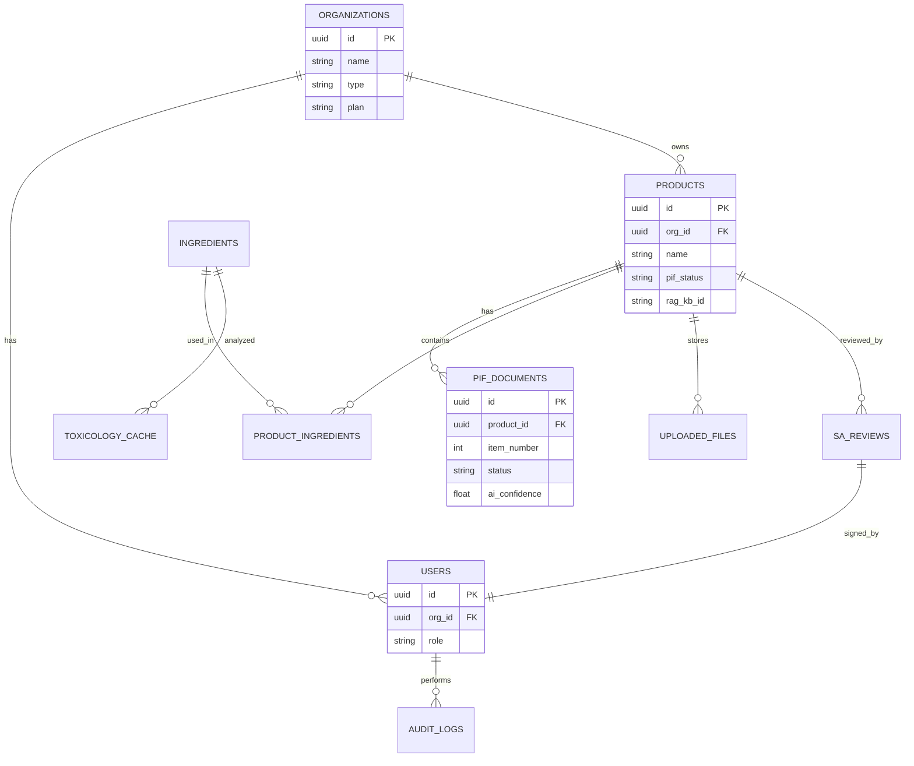
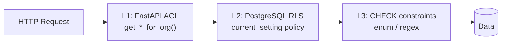
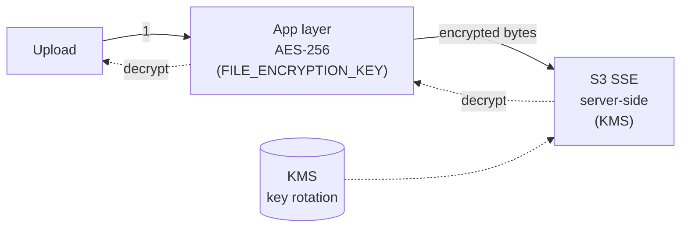

# Chapter 8: Database and Multi-Tenant Isolation

> This chapter details PIF AI's data layer: the PostgreSQL 16 primary schema, pgvector extension, Row-Level Security (RLS) with `current_setting` injection, audit log design, and file encryption strategy. Together with §10 (RAG isolation) and §11 (security model), this chapter covers the database side of a three-layer defense.

## 📌 Key Takeaways

- Single PostgreSQL architecture (not schema-per-tenant): simpler ops, easier cross-tenant reporting
- **Row-Level Security** is the bottom-line DB-layer isolation: even application bugs cannot leak
- `current_setting('app.current_org_id')` pattern: injected per-request via session var
- `audit_logs` records all sensitive operations; immutable, no UPDATE/DELETE
- Formulation files use **application-layer AES-256** + **storage-layer SSE** (double encryption)

## 8.1 Why PostgreSQL 16

### 8.1.1 Requirement Mapping

| Requirement | PostgreSQL 16 Support |
|------|--------------------|
| ACID transactions | ✅ Mature |
| JSON/JSONB (tox data, AI extraction) | ✅ Native |
| Full-text search (INCI lookup) | ✅ `tsvector` + GIN index |
| Vector search (RAG fallback embedding) | ✅ **pgvector extension** |
| Row-Level Security | ✅ Native |
| Concurrency (high build rate) | ✅ MVCC |
| Unencumbered license | ✅ PostgreSQL License |

### 8.1.2 Single DB vs Multi DB

**Schema-per-tenant** was considered and rejected:

| Aspect | Single DB + RLS | Schema-per-tenant |
|------|-------------|-------------------|
| Isolation strength | Medium (RLS-based) | High (physical) |
| Tenant provisioning speed | Fast (INSERT row) | Slow (CREATE SCHEMA) |
| Cross-tenant reporting | Easy | Cross-schema join needed |
| Ops complexity | Low | High (N schemas to migrate) |
| Scale ceiling | ~ 10K tenants | ~ 100 tenants |

PIF AI targets 200–1,000 organizations — single DB + RLS is the right call.

## 8.2 Core Schema



**Figure 8.1**: ER diagram. `organizations` is the top-level tenant node; all business data (products, users, audit_logs) reference `org_id`. `ingredients` and `toxicology_cache` are **globally shared** (not tenant-specific) to avoid redundant storage of the same substance data.

### 8.2.1 `products` Table (example)

```sql
CREATE TABLE products (
    id UUID PRIMARY KEY DEFAULT gen_random_uuid(),
    org_id UUID REFERENCES organizations(id) NOT NULL,
    name VARCHAR(500) NOT NULL,
    name_en VARCHAR(500),
    category VARCHAR(100) NOT NULL,
    dosage_form VARCHAR(100),
    intended_use TEXT,
    manufacturer_name VARCHAR(500),
    manufacturer_address TEXT,
    registration_id VARCHAR(100),
    pif_status VARCHAR(50) DEFAULT 'draft' CHECK (
        pif_status IN ('draft', 'in_progress', 'ai_review', 'sa_review',
                       'completed', 'expired')
    ),
    pif_completed_at TIMESTAMPTZ,
    rag_kb_id VARCHAR(100),
    created_at TIMESTAMPTZ DEFAULT NOW(),
    updated_at TIMESTAMPTZ DEFAULT NOW()
);
CREATE INDEX idx_products_rag_kb_id ON products(rag_kb_id);
CREATE INDEX idx_products_org_id_created ON products(org_id, created_at DESC);
```

Notes:

1. **First FK in every business table is `org_id`**: mandatory isolation field for RLS policy
2. **CHECK constraints** enforce enums: even an application bug writing an illegal value is rejected by DB
3. **`rag_kb_id`** stores the external ID of the central RAG KB; see §10

## 8.3 Row-Level Security Implementation

### 8.3.1 Enable RLS

```sql
-- Enable RLS
ALTER TABLE products ENABLE ROW LEVEL SECURITY;

-- Policy: only allow reading/writing rows matching current org
CREATE POLICY products_org_isolation ON products
    USING (org_id = current_setting('app.current_org_id')::UUID);
```

Subsequently, all `SELECT / UPDATE / DELETE` are implicitly wrapped with `WHERE org_id = current_setting(...)::UUID`. Even if the application runs `SELECT * FROM products` (no WHERE), PostgreSQL returns only the current org's rows.

### 8.3.2 The `current_setting` Injection Pattern

Each incoming request injects a session-scoped variable at transaction start:

```python
# app/core/database.py (conceptual)
async def get_db_with_org(current_user: User):
    async with async_session_maker() as session:
        await session.execute(
            text("SET LOCAL app.current_org_id = :org_id"),
            {"org_id": str(current_user.org_id)},
        )
        yield session
```

`SET LOCAL` is scoped to the current transaction; auto-cleared on commit/rollback. Even if a pooled connection is reused across requests, the variable does not leak.

### 8.3.3 Super-Admin Bypass

Some ops operations (global reports, cross-org audits) need to bypass RLS:

```sql
-- Dedicated DB user for super admin
CREATE ROLE pifai_superadmin;
GRANT pifai TO pifai_superadmin;  -- inherits base permissions
ALTER ROLE pifai_superadmin BYPASSRLS;
```

When the application detects `super_admin` role, it uses `pifai_superadmin`; regular users continue on `pifai` and remain RLS-constrained.

### 8.3.4 Three Layers of Defense



**Figure 8.2**: Three layers independently enforce isolation. L1 is explicit `WHERE`; L2 is RLS (DB-enforced); L3 is CHECK constraints (data integrity). Any layer's failure is mitigated by the others. Layer 4 (RAG KB per-product, §10) extends defense to four layers.

## 8.4 Audit Logs (`audit_logs`)

### 8.4.1 Table Structure

```sql
CREATE TABLE audit_logs (
    id UUID PRIMARY KEY DEFAULT gen_random_uuid(),
    org_id UUID,
    user_id UUID,
    action VARCHAR(100) NOT NULL,  -- 'pif.created', 'sa.signed', ...
    resource_type VARCHAR(50),
    resource_id UUID,
    details JSONB,
    ip_address INET,
    user_agent TEXT,
    created_at TIMESTAMPTZ DEFAULT NOW()
);
CREATE INDEX idx_audit_logs_org ON audit_logs(org_id, created_at DESC);
CREATE INDEX idx_audit_logs_user ON audit_logs(user_id, created_at DESC);
CREATE INDEX idx_audit_logs_action ON audit_logs(action, created_at DESC);
```

### 8.4.2 Logged Events

| Action | Trigger |
|---|---|
| `user.login` | Successful login |
| `user.login_failed` | Failed login (logs IP) |
| `product.created` / `product.deleted` | Product CRUD |
| `pif.document_uploaded` | File upload |
| `pif.ai_analyzed` | AI analysis triggered |
| `sa.review_started` | SA begins review |
| `sa.signed` | SA approves + signs |
| `sa.revision_requested` | SA requests revisions |
| `org.plan_changed` | Plan upgrade/downgrade |
| `admin.bypass_rls` | Super admin uses BYPASSRLS |

### 8.4.3 Tamper-Resistance

- The app-level DB user `pifai` has **INSERT only** permission; no UPDATE / DELETE
- `audit_logs` does not set RLS but is accessible cross-org only to super admin
- Daily cron archives to WORM S3 (Write Once Read Many, Object Lock compliance mode, 10-year retention)

## 8.5 File Encryption

### 8.5.1 Sensitivity Classification

| Class | Example | Encryption |
|------|------|---------|
| **Formula (highest)** | Formulation, INCI concentrations | App-layer AES-256 + SSE |
| Test Report | GMP, stability | SSE |
| Packaging | External packaging | SSE |
| Public | Product name, registration ID | TLS in transit, no rest |

### 8.5.2 Formula: Double Encryption



**Figure 8.3**: On upload, `app/services/encryption.py` AES-256-GCM encrypts with `FILE_ENCRYPTION_KEY`, then uploads to S3 which applies SSE-KMS on top. To recover plaintext requires breaking both layers with two different keys. Even if the S3 KMS key leaks, the attacker still needs `FILE_ENCRYPTION_KEY` (managed by HashiCorp Vault / AWS Secrets Manager).

## 8.6 pgvector Vector Search

PIF AI uses the central RAG (§10) as the primary knowledge retrieval, but local pgvector serves as fallback:

```sql
CREATE EXTENSION vector;

ALTER TABLE pif_documents ADD COLUMN content_embedding vector(1536);
CREATE INDEX ON pif_documents USING ivfflat (content_embedding vector_cosine_ops);
```

Use cases:

- Degrades to local search when central RAG is unavailable
- SA review looks up "similar past cases"
- Toxicology analysis compares with internal risk summaries

Embedding model: `text-embedding-3-small` (OpenAI, for non-sensitive text) or `Cohere embed-multilingual-v3`.

## 📚 References

[^1]: PostgreSQL Global Development Group. *PostgreSQL 16 — Row Security Policies*. 2024.
[^2]: pgvector. <https://github.com/pgvector/pgvector>
[^3]: OWASP. *Multi-tenant Data Isolation Cheat Sheet*.
[^4]: AWS. *Server-Side Encryption with KMS Keys*.

## 📝 Revision History

| Version | Date | Summary |
|:---:|:---:|---|
| v0.1 | 2026-04-19 | First draft. Single DB + RLS, current_setting injection, audit, dual encryption |

---

© 2026 Baiyuan Tech. Licensed under CC BY-NC 4.0.

**Nav** [← Chapter 7: AI Engine](ch07-ai-engine.md) · [Chapter 9: Toxicology Pipeline →](ch09-toxicology-pipeline.md)
