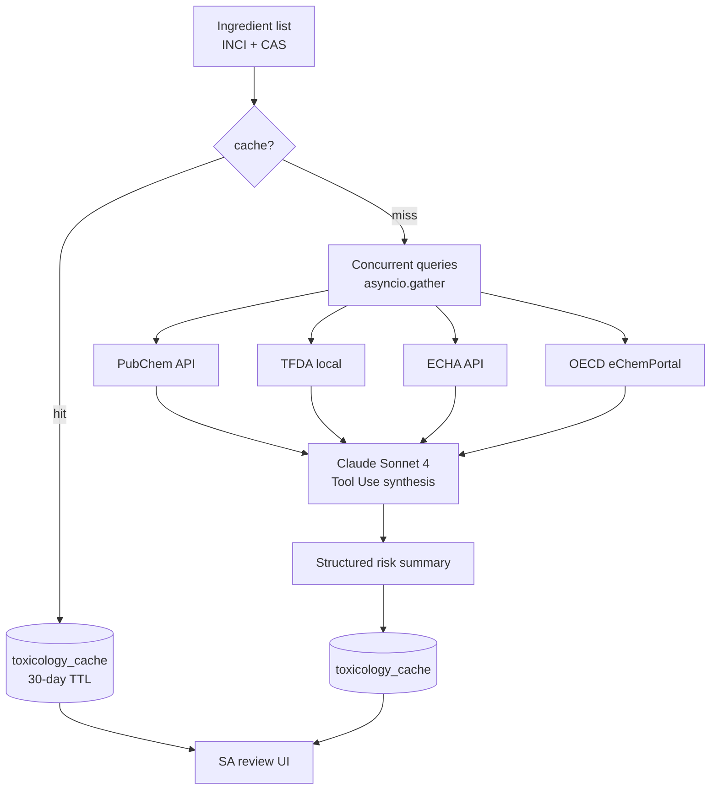

# Chapter 9: Toxicology Data Pipeline

> PIF Items 9 and 10 require per-ingredient substance-characterization and toxicology-endpoint data. This chapter explains how PIF AI concurrently queries four databases (PubChem, TFDA, ECHA, OECD), caches results, uses AI to synthesize them, and ultimately produces SA-reviewable risk-summary tables.

## 📌 Key Takeaways

- Four-database division: PubChem (physicochemical + partial tox), TFDA (regulatory compliance), ECHA (EU C&L), OECD (eChemPortal cross-check)
- Caching: 30-day TTL + stale-while-revalidate, reducing rate-limit exposure
- AI synthesis: Claude Sonnet 4 consolidates multi-source → structured risk summary with cited sources
- Failure degradation: a single source failure does not halt the pipeline; marked "[source temporarily unavailable]"

## 9.1 Source Division of Labor

### 9.1.1 Four-Database Comparison

| Database | Owner | Content | License | PIF Items |
|---|---|---|---|---|
| **PubChem** | US NIH | Physicochemical, GHS, partial LD50 | Public, free | 9, 10 |
| **TFDA Lists** | MOHW Taiwan | Restricted / prohibited / preservative / colorant / UV filter lists | Public, local mirror | 3, 10 |
| **ECHA C&L Inventory** | EU ECHA | Classification & labelling, SCCS Opinions | Registered account, rate-limited | 10 |
| **OECD eChemPortal** | OECD | Cross-country chemical test database | Public but subject to national terms | 10 |

### 9.1.2 TFDA Local Mirror

TFDA does not offer a formal API. PIF AI uses:

1. **Periodic scraping** of annex pages (Annexes 1–5)
2. Structured storage in a local `tfda_regulated_ingredients` table
3. Diff generation; changes trigger notifications to the compliance team
4. Queries hit the local table only, avoiding availability dependence on TFDA's website

```python
# app/models/tfda_regulated_ingredient.py (conceptual)
class TfdaRegulatedIngredient(Base):
    __tablename__ = "tfda_regulated_ingredients"
    id: Mapped[uuid.UUID] = mapped_column(primary_key=True)
    inci_name: Mapped[str]
    inci_name_normalized: Mapped[str] = mapped_column(index=True)
    cas_number: Mapped[str | None]
    list_type: Mapped[str]  # 'prohibited', 'restricted', 'preservative',
                            # 'colorant', 'uv_filter'
    max_concentration_pct: Mapped[float | None]
    conditions: Mapped[str | None]
    source_url: Mapped[str]
    last_synced_at: Mapped[datetime]
```

## 9.2 Pipeline Overview



**Figure 9.1**: The pipeline is concurrency-driven — four databases are queried in parallel, total latency ≈ max(four) rather than sum. The AI synthesis stage uses Tool Use and cites each conclusion. Cache layer has 30-day TTL.

## 9.3 Concurrent Query Implementation

### 9.3.1 asyncio.gather Pattern

```python
# app/ai/toxicology_engine.py (conceptual)
async def analyze_ingredient(inci: str, cas: str) -> ToxReport:
    # Check cache
    cached = await get_cached_toxicology(inci, cas)
    if cached and not cached.is_stale():
        return cached

    # Query four sources concurrently
    pubchem, tfda, echa, oecd = await asyncio.gather(
        query_pubchem(cas),
        query_tfda_local(inci, cas),
        query_echa(cas),
        query_oecd(cas),
        return_exceptions=True,
    )

    # Tolerate partial failure
    sources = {}
    for name, result in [("pubchem", pubchem), ("tfda", tfda),
                        ("echa", echa), ("oecd", oecd)]:
        if isinstance(result, Exception):
            logger.warning("Source %s failed: %s", name, result)
            sources[name] = None
        else:
            sources[name] = result

    # AI synthesis (even with partial sources)
    summary = await claude_synthesize_risk(sources, inci, cas)

    await cache_toxicology(inci, cas, sources, summary)
    return summary
```

### 9.3.2 Timeout Strategy

| Source | Normal | Timeout | Retry |
|---|---|---|---|
| PubChem | 0.5–2s | 5s | Once (exponential) |
| TFDA local | <100ms | 500ms | No retry |
| ECHA | 1–3s | 10s | Once |
| OECD | 2–5s | 10s | Once |

All sources stale → return "data temporarily unavailable" but do not write an error to DB (so retries can occur).

## 9.4 Rate Limits and Caching

### 9.4.1 Rate-Limit Pressure

PubChem public-API rate limit: 5 req/sec per IP[^1]. For PIF AI concurrent analyses:

- 100 products analyzed simultaneously, 30 ingredients each → 3,000 requests
- No cache: 600 seconds to complete (triggers rate limit)
- With cache (assuming 80% hit): 120 seconds

### 9.4.2 Cache Schema

```sql
CREATE TABLE toxicology_cache (
    id UUID PRIMARY KEY,
    ingredient_id UUID REFERENCES ingredients(id),
    source VARCHAR(50) NOT NULL,
    data_json JSONB NOT NULL,
    risk_level VARCHAR(20),
    ai_summary TEXT,
    fetched_at TIMESTAMPTZ DEFAULT NOW(),
    expires_at TIMESTAMPTZ,
    UNIQUE(ingredient_id, source)
);
```

- **TTL**: 30 days (toxicology data is stable; regulatory changes handled by separate TFDA sync)
- **Stale-while-revalidate**: return stale cache while triggering background refresh
- **Cross-tenant shared**: `toxicology_cache` has no `org_id` (toxicology data is not tenant-specific)

## 9.5 AI Synthesis: From Multi-Source to Risk Summary

### 9.5.1 Prompt Design

Claude Sonnet 4 consolidates four sources. System prompt emphasizes:

1. Answer only from tool-returned values
2. If a source has no data for an ingredient → mark "[source has no record]"
3. Cite each conclusion with source + identifier (PubChem CID / TFDA Annex item / SCCS opinion)
4. Conservative tone; forbid "absolutely safe" / "no risk"
5. Output structured JSON

### 9.5.2 Output Shape

```json
{
  "ingredient": "Phenoxyethanol",
  "cas": "122-99-6",
  "inci": "Phenoxyethanol",
  "risk_level": "low",
  "risk_endpoints": {
    "acute_toxicity_oral_ld50": {
      "value_mg_kg": 1260,
      "species": "rat",
      "source": "PubChem CID 31236"
    },
    "skin_irritation": {
      "rating": "non-irritant",
      "source": "SCCS Opinion SCCS/1575/16",
      "note": "at ≤1% concentration"
    },
    "sensitization": {
      "rating": "non-sensitizing",
      "source": "PubChem + OECD"
    }
  },
  "regulatory": {
    "tfda_status": "preservative_positive_list",
    "tfda_max_concentration_pct": 1.0,
    "tfda_source": "Annex 4 Preservatives Item 23",
    "echa_classification": "Eye Irrit. 2"
  },
  "summary_en": "Phenoxyethanol is on TFDA's positive preservative list, max 1.0%. Low acute toxicity (rat oral LD50 1260 mg/kg); SCCS deems it non-irritating at ≤1%.",
  "citations": [
    "PubChem CID 31236",
    "TFDA Cosmetic Standards Annex 4 Item 23",
    "SCCS Opinion SCCS/1575/16"
  ],
  "confidence": 0.92
}
```

## 9.6 Regulatory Rule Engine

### 9.6.1 Rule Execution

PIF AI implements a **regulatory rule engine** that compares formulation vs regulation:

```python
# app/ai/regulatory_checker.py (conceptual)
async def check_formula_compliance(
    product_id: uuid.UUID, db: AsyncSession
) -> ComplianceReport:
    ingredients = await get_product_ingredients(product_id, db)
    violations = []

    for ing in ingredients:
        tfda_record = await lookup_tfda(ing.inci_name, ing.cas_number)
        if not tfda_record:
            continue  # Not on any restricted list

        if tfda_record.list_type == "prohibited":
            violations.append(Violation(
                ingredient=ing.inci_name,
                rule="TFDA prohibited substance",
                severity="critical",
                source=tfda_record.source_url,
            ))

        if tfda_record.list_type == "restricted":
            if ing.concentration_pct > tfda_record.max_concentration_pct:
                violations.append(Violation(
                    ingredient=ing.inci_name,
                    rule=f"Exceeds TFDA max {tfda_record.max_concentration_pct}%",
                    severity="high",
                    actual=ing.concentration_pct,
                    allowed=tfda_record.max_concentration_pct,
                    source=tfda_record.source_url,
                ))

    return ComplianceReport(violations=violations, product_id=product_id)
```

### 9.6.2 Rule Coverage

| Annex | Rule Type | Check |
|------|----------|----------|
| Annex 1 Prohibited | Hard ban | Presence → violation |
| Annex 2 Restricted | Concentration + condition limits | Over concentration or condition unmet → violation |
| Annex 3 Preservatives | Positive list + concentration | Not on list or over-concentration → violation |
| Annex 4 Colorants | Positive list + use restriction | Similar |
| Annex 5 UV filters | Positive list + concentration + dosage-form | Similar |

## 📚 References

[^1]: NIH NLM. *PubChem PUG REST API — Usage Policy*. <https://pubchem.ncbi.nlm.nih.gov/docs/pug-rest#section=Dynamic-Request-Throttling>
[^2]: ECHA. *C&L Inventory*. <https://echa.europa.eu/information-on-chemicals/cl-inventory-database>
[^3]: OECD. *eChemPortal*. <https://www.echemportal.org>
[^4]: MOHW/TFDA. *Cosmetic Standards Annexes 1–5*.

## 📝 Revision History

| Version | Date | Summary |
|:---:|:---:|---|
| v0.1 | 2026-04-19 | First draft. Four sources, concurrency, caching, AI synthesis, rule engine |

---

© 2026 Baiyuan Tech. Licensed under CC BY-NC 4.0.

**Nav** [← Chapter 8: Multi-Tenancy](ch08-multi-tenancy.md) · [Chapter 10: Central RAG →](ch10-central-rag.md)
