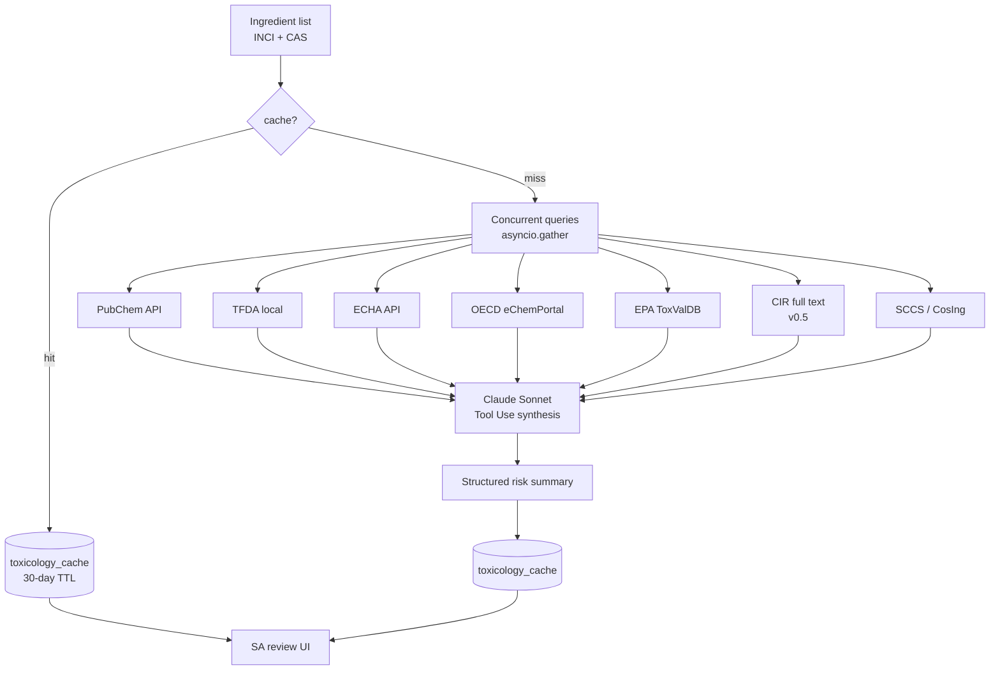

# Chapter 9: Toxicology Data Pipeline

> PIF Items 9 and 10 require per-ingredient substance-characterization and toxicology-endpoint data. This chapter explains how PIF AI concurrently queries seven toxicology / regulatory sources (PubChem, EPA CompTox, ECHA, CIR, SCCS, CosIng, TFDA) plus the OECD eChemPortal index, caches results, uses AI to synthesize them, and ultimately produces SA-reviewable risk-summary tables. Since v0.5 it also extracts NOAELs from the full text of CIR safety-assessment PDFs (§9.1.3), filling the authoritative-NOAEL layer that earlier versions admitted was almost empty.

## 📌 Key Takeaways

- Seven-source division: PubChem (physicochemical + partial tox), EPA CompTox ToxValDB (authoritative PODs), ECHA C&L + ECHA CHEM (EU classification), CIR (QRT conclusions + full reports), SCCS (opinions), CosIng (EU annexes), TFDA (Taiwan lists), with OECD eChemPortal as a cross-country index
- CIR full-report extraction (v0.5): PDFs fetched directly from the CIR portal → forced Claude tool-use extraction → three sanitize gates; as of 2026-08-30, 326 reports extracted and 1,331 cached ingredient rows carry a CIR NOAEL (zero a week earlier)
- Caching: 30-day TTL + stale-while-revalidate, reducing rate-limit exposure
- AI synthesis: Claude Sonnet 4 consolidates multi-source → structured risk summary with cited sources
- Failure degradation: a single source failure does not halt the pipeline; marked "[source temporarily unavailable]"

## 9.1 Source Division of Labor

### 9.1.1 Seven-Source Comparison (updated in v0.5)

The four sources of v0.1 (PubChem / TFDA / ECHA / OECD) grew across v0.3–v0.5 into seven sources plus the OECD index, matching the platform's public documentation (website, legal-references page). The "content" column lists what this system **actually consumes**, not everything each database offers.

| Source | Organization | Content consumed by this system | License | PIF Items |
|---|---|---|---|---|
| **PubChem** | US NIH | Physicochemical properties, GHS, partial LD50; CAS / synonym resolution | Public, free | 9, 10 |
| **EPA CompTox (ToxValDB)** | US EPA | Authoritative PODs (NOAEL / LOAEL) with study provenance; DTXSID resolvable from a chemical name; second authoritative source when CIR has no numeric value (§15.3) | Public, free | 10 |
| **ECHA C&L Inventory + ECHA CHEM (Annex VI)** | EU ECHA | Classification & labelling; harmonised classifications drive automatic CMR / genotoxic blocking (§15.4) | Public, rate-limited | 10 |
| **CIR (QRT conclusions + full reports)** | US Cosmetic Ingredient Review Expert Panel | 5,919 ingredient conclusions (Quick Reference Table); **full-text extraction of NOAELs and primary-study citations from the full report PDFs (v0.5, §9.1.3)** | Public | 10 |
| **SCCS Opinions** | EU Scientific Committee on Consumer Safety | Conclusions, NOAELs and MoS methodology from 54 opinions | Public | 10 |
| **CosIng (Annexes II–VI)** | European Commission | Prohibited / restricted / preservatives / colorants / UV filters; fragrance-allergen disclosure (Chapter 7) | Public | 3, 10 |
| **TFDA Lists** | MOHW Taiwan | Prohibited / restricted / preservative / colorant / UV-filter lists (local mirror, §9.1.2) | Public | 3, 10 |
| *OECD eChemPortal (index)* | OECD | Cross-country test-data index pointing to original dossiers; not used as a numeric source | Public but subject to national terms | 10 |

The failure contract is the same for every live source: a failed query is cached with a short 1-hour TTL, **must never overwrite an existing LD50 / NOAEL, and must never emit a "completed" progress marker**; scanned documents and sources that yield no text are honestly labelled "not sent to AI, not guessed".

### 9.1.2 TFDA Local Mirror

TFDA does not offer a formal API. PIF AI uses:

1. **Periodic scraping** of annex pages (Annexes 1–5)
2. Structured storage in a local `tfda_regulated_ingredients` table
3. Diff generation; changes trigger notifications to the compliance team
4. Queries hit the local table only, avoiding availability dependence on TFDA's website

```python
# app/models/tfda_regulated_ingredient.py (conceptual)
class TfdaRegulatedIngredient(Base):
    __tablename__ = "tfda_regulated_ingredients"
    id: Mapped[uuid.UUID] = mapped_column(primary_key=True)
    inci_name: Mapped[str]
    inci_name_normalized: Mapped[str] = mapped_column(index=True)
    cas_number: Mapped[str | None]
    list_type: Mapped[str]  # 'prohibited', 'restricted', 'preservative',
                            # 'colorant', 'uv_filter'
    max_concentration_pct: Mapped[float | None]
    conditions: Mapped[str | None]
    source_url: Mapped[str]
    last_synced_at: Mapped[datetime]
```

### 9.1.3 CIR Full-Report Full-Text NOAEL Extraction (new in v0.5)

Chapter 14's v0.3 "Observations and Limitations" admitted that the authoritative-NOAEL extraction layer was almost empty: PubChem returned only the generic CIR landing page for CIR, the individual report PDFs were unreachable, the NOAEL column of `cir_reports` was mostly empty, and ingredients fell through to the EPA backfill, read-across or even data_gap. v0.5 **bypasses PubChem and fetches reports directly from the CIR portal (cir-reports.cir-safety.org)**:

1. **Index and status pages**: read the portal's ingredient index (7,933 rows across two pages) and each ingredient's status page (`cirIngredientStatusReport`) to obtain the report attachment list.
2. **Attachment selection**: prefer the full safety-assessment report; "Re-review Not Opened" compilations carry no new toxicology data and are neither fetched nor sent to AI; an attachment shared by several ingredients is extracted once (on average 4.0 ingredients share one report, up to 133).
3. **Text extraction**: pypdf (26 pages on average); scanned PDFs with no text layer are labelled `skipped_scanned` — never guessed.
4. **Key-pages mode**: only the first and last 5 pages, pages containing NOAEL / NOEL / LOAEL, and summary / conclusion / discussion pages are sent (91.5k characters on average), about US$0.10 per report.
5. **AI extraction**: Claude with a forced tool call (`submit_cir_report_extraction`) returns structured fields — the lowest systemic repeated-dose NOAEL, unit, route, species, study type, verbatim evidence sentence and covered substances; a NOEL is accepted only when no NOAEL exists.
6. **Three sanitize gates** (anti-hallucination): the unit must belong to the mg/kg bw/day family (g/kg and µg/kg are converted); the value must be ≤ 10,000; **the number must appear verbatim in the PDF text**; non-systemic endpoints are rejected.
7. **Coverage guard**: the substances covered by a report are matched through name variants (Latin / English, parenthetical aliases); an ingredient absent from the coverage list is marked `report_mismatch` rather than inheriting another report's NOAEL.
8. **Write-back**: results land in `cir_report_attachments` (deduplicated by attachment id) and are pushed through a single assembly function into `ingredient_tox_cache.cir_data`, feeding tier 0 of the NOAEL cascade and the report's §5-1 "primary study data (verbatim citations)" section (citation, route, species, study, evidence sentence).

Measured effect as of 2026-08-30 (production; extraction continues at 25 rows every 6 hours, in-use ingredients first):

| Metric | Value |
|---|---|
| CIR full reports extracted | 326 (26 pages / 91.5k characters on average) |
| Reports yielding a numeric NOAEL | 189 (58%; the rest are qualitative conclusions) |
| In-use ingredients with a CIR entry | 1,998, of which 1,414 (71%) are linked to a full report |
| Cached ingredient rows carrying a CIR NOAEL | 1,331 (zero at v0.4) |
| Honest exclusions | 12 scanned PDFs; 57 reports awaiting retry after a provider outage |

**Cost and provider resilience**: extraction runs only for ingredients that have already entered the toxicology cache (in use), not across the whole 6,106-row index; provider-level failures (exhausted credit, invalid key, 429, 5xx) are not counted against the individual report, the batch stops and backs off, so retryable reports are never pushed into a permanent-failure state.

### 9.1.4 Retiring the Legacy Path

The pre-v0.5 PubChem-mediated CIR path remains only for the few cases where PubChem provides a direct per-report PDF URL; any URL pointing at the portal is handed to the §9.1.3 extractor (portal pages are a JavaScript shell, and what the legacy path fetched was never a report). The rule is locked by tests so the two paths cannot overwrite each other.

## 9.2 Pipeline Overview


```mermaid
flowchart TB
    IN["Ingredient list<br/>INCI + CAS"]
    Q{cache?}
    CACHE[(toxicology_cache<br/>30-day TTL)]
    PAR[Concurrent queries<br/>asyncio.gather]
    PC[PubChem API]
    TF[TFDA local]
    EC[ECHA API]
    OE[OECD eChemPortal]
    EP[EPA ToxValDB]
    CR[CIR full text<br/>v0.5]
    SC[SCCS / CosIng]
    AI[Claude Sonnet<br/>Tool Use synthesis]
    SUM[Structured risk summary]
    DB[(toxicology_cache)]
    UI[SA review UI]

    IN --> Q
    Q -- hit --> CACHE --> UI
    Q -- miss --> PAR
    PAR --> PC
    PAR --> TF
    PAR --> EC
    PAR --> OE
    PAR --> EP
    PAR --> CR
    PAR --> SC
    PC --> AI
    TF --> AI
    EC --> AI
    OE --> AI
    EP --> AI
    CR --> AI
    SC --> AI
    AI --> SUM --> DB --> UI
```

**Figure 9.1**: The pipeline is concurrency-driven — the seven sources are queried in parallel, total latency ≈ max(sources) rather than sum; CIR full-text extraction (v0.5) is an offline background job, and queries only read the cache it writes back. The AI synthesis stage uses Tool Use and cites each conclusion. Cache layer has 30-day TTL.

## 9.3 Concurrent Query Implementation

### 9.3.1 asyncio.gather Pattern

```python
# app/ai/toxicology_engine.py (conceptual)
async def analyze_ingredient(inci: str, cas: str) -> ToxReport:
    # Check cache
    cached = await get_cached_toxicology(inci, cas)
    if cached and not cached.is_stale():
        return cached

    # Query four sources concurrently
    pubchem, tfda, echa, oecd = await asyncio.gather(
        query_pubchem(cas),
        query_tfda_local(inci, cas),
        query_echa(cas),
        query_oecd(cas),
        return_exceptions=True,
    )

    # Tolerate partial failure
    sources = {}
    for name, result in [("pubchem", pubchem), ("tfda", tfda),
                        ("echa", echa), ("oecd", oecd)]:
        if isinstance(result, Exception):
            logger.warning("Source %s failed: %s", name, result)
            sources[name] = None
        else:
            sources[name] = result

    # AI synthesis (even with partial sources)
    summary = await claude_synthesize_risk(sources, inci, cas)

    await cache_toxicology(inci, cas, sources, summary)
    return summary
```

### 9.3.2 Timeout Strategy

| Source | Normal | Timeout | Retry |
|---|---|---|---|
| PubChem | 0.5–2s | 5s | Once (exponential) |
| TFDA local | <100ms | 500ms | No retry |
| ECHA | 1–3s | 10s | Once |
| OECD | 2–5s | 10s | Once |

All sources stale → return "data temporarily unavailable" but do not write an error to DB (so retries can occur).

## 9.4 Rate Limits and Caching

### 9.4.1 Rate-Limit Pressure

PubChem public-API rate limit: 5 req/sec per IP[^1]. For PIF AI concurrent analyses:

- 100 products analyzed simultaneously, 30 ingredients each → 3,000 requests
- No cache: 600 seconds to complete (triggers rate limit)
- With cache (assuming 80% hit): 120 seconds

### 9.4.2 Cache Schema

```sql
CREATE TABLE toxicology_cache (
    id UUID PRIMARY KEY,
    ingredient_id UUID REFERENCES ingredients(id),
    source VARCHAR(50) NOT NULL,
    data_json JSONB NOT NULL,
    risk_level VARCHAR(20),
    ai_summary TEXT,
    fetched_at TIMESTAMPTZ DEFAULT NOW(),
    expires_at TIMESTAMPTZ,
    UNIQUE(ingredient_id, source)
);
```

- **TTL**: 30 days (toxicology data is stable; regulatory changes handled by separate TFDA sync)
- **Stale-while-revalidate**: return stale cache while triggering background refresh
- **Cross-tenant shared**: `toxicology_cache` has no `org_id` (toxicology data is not tenant-specific)

## 9.5 AI Synthesis: From Multi-Source to Risk Summary

### 9.5.1 Prompt Design

Claude Sonnet 4 consolidates four sources. System prompt emphasizes:

1. Answer only from tool-returned values
2. If a source has no data for an ingredient → mark "[source has no record]"
3. Cite each conclusion with source + identifier (PubChem CID / TFDA Annex item / SCCS opinion)
4. Conservative tone; forbid "absolutely safe" / "no risk"
5. Output structured JSON

### 9.5.2 Output Shape

```json
{
  "ingredient": "Phenoxyethanol",
  "cas": "122-99-6",
  "inci": "Phenoxyethanol",
  "risk_level": "low",
  "risk_endpoints": {
    "acute_toxicity_oral_ld50": {
      "value_mg_kg": 1260,
      "species": "rat",
      "source": "PubChem CID 31236"
    },
    "skin_irritation": {
      "rating": "non-irritant",
      "source": "SCCS Opinion SCCS/1575/16",
      "note": "at ≤1% concentration"
    },
    "sensitization": {
      "rating": "non-sensitizing",
      "source": "PubChem + OECD"
    }
  },
  "regulatory": {
    "tfda_status": "preservative_positive_list",
    "tfda_max_concentration_pct": 1.0,
    "tfda_source": "Annex 4 Preservatives Item 23",
    "echa_classification": "Eye Irrit. 2"
  },
  "summary_en": "Phenoxyethanol is on TFDA's positive preservative list, max 1.0%. Low acute toxicity (rat oral LD50 1260 mg/kg); SCCS deems it non-irritating at ≤1%.",
  "citations": [
    "PubChem CID 31236",
    "TFDA Cosmetic Standards Annex 4 Item 23",
    "SCCS Opinion SCCS/1575/16"
  ],
  "confidence": 0.92
}
```

## 9.6 Regulatory Rule Engine

### 9.6.1 Rule Execution

PIF AI implements a **regulatory rule engine** that compares formulation vs regulation:

```python
# app/ai/regulatory_checker.py (conceptual)
async def check_formula_compliance(
    product_id: uuid.UUID, db: AsyncSession
) -> ComplianceReport:
    ingredients = await get_product_ingredients(product_id, db)
    violations = []

    for ing in ingredients:
        tfda_record = await lookup_tfda(ing.inci_name, ing.cas_number)
        if not tfda_record:
            continue  # Not on any restricted list

        if tfda_record.list_type == "prohibited":
            violations.append(Violation(
                ingredient=ing.inci_name,
                rule="TFDA prohibited substance",
                severity="critical",
                source=tfda_record.source_url,
            ))

        if tfda_record.list_type == "restricted":
            if ing.concentration_pct > tfda_record.max_concentration_pct:
                violations.append(Violation(
                    ingredient=ing.inci_name,
                    rule=f"Exceeds TFDA max {tfda_record.max_concentration_pct}%",
                    severity="high",
                    actual=ing.concentration_pct,
                    allowed=tfda_record.max_concentration_pct,
                    source=tfda_record.source_url,
                ))

    return ComplianceReport(violations=violations, product_id=product_id)
```

### 9.6.2 Rule Coverage

| Annex | Rule Type | Check |
|------|----------|----------|
| Annex 1 Prohibited | Hard ban | Presence → violation |
| Annex 2 Restricted | Concentration + condition limits | Over concentration or condition unmet → violation |
| Annex 3 Preservatives | Positive list + concentration | Not on list or over-concentration → violation |
| Annex 4 Colorants | Positive list + use restriction | Similar |
| Annex 5 UV filters | Positive list + concentration + dosage-form | Similar |

## 📚 References

[^1]: NIH NLM. *PubChem PUG REST API — Usage Policy*. <https://pubchem.ncbi.nlm.nih.gov/docs/pug-rest#section=Dynamic-Request-Throttling>
[^2]: ECHA. *C&L Inventory*. <https://echa.europa.eu/information-on-chemicals/cl-inventory-database>
[^3]: OECD. *eChemPortal*. <https://www.echemportal.org>
[^4]: MOHW/TFDA. *Cosmetic Standards Annexes 1–5*.

## 📝 Revision History

| Version | Date | Summary |
|:---:|:---:|---|
| v0.1 | 2026-04-19 | First draft. Four sources, concurrency, caching, AI synthesis, rule engine |
| v0.5 | 2026-08-30 | §9.1.1 updated from four sources to seven sources + OECD index (aligned with the website); new §9.1.3 CIR full-report full-text NOAEL extraction (direct portal fetch, key-pages mode, three sanitize gates, coverage guard, provider resilience) with measured effect as of 2026-08-30; §9.1.4 legacy-path retirement; Figure 9.1 sources completed. |

---

© 2026 Baiyuan Tech. Licensed under CC BY-NC 4.0.

**Nav** [← Chapter 8: Multi-Tenancy](ch08-multi-tenancy.md) · [Chapter 10: Central RAG →](ch10-central-rag.md)
