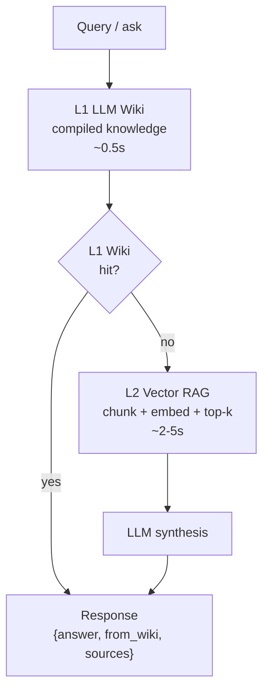
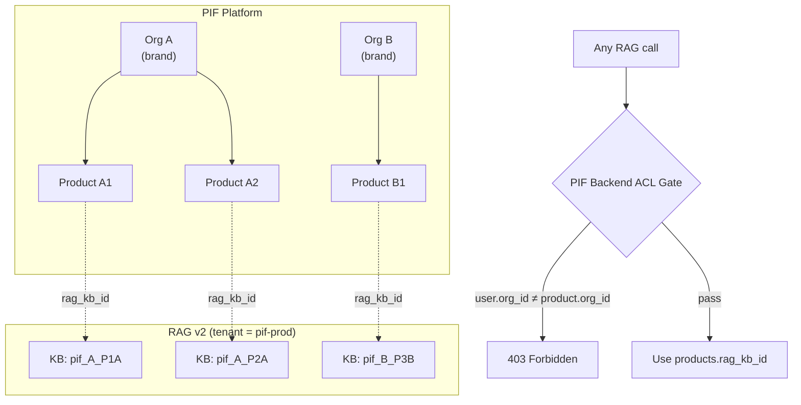

# Chapter 10: Central RAG Integration Architecture (Scheme C+)

> PIF AI does not reinvent knowledge retrieval; it integrates the sibling **Baiyuan central RAG v2** (`rag.baiyuan.io`) — a knowledge service using a **L1 LLM Wiki + L2 vector RAG** dual-layer retrieval architecture. This is one of the most important chapters: why Scheme C+ for isolation, how "1 product = 1 KB" implements dual isolation, the meaning of the dual-header auth, and concrete fail-soft implementation.

## 📌 Key Takeaways

- Central RAG uses **L1 LLM Wiki** (compiled/cached knowledge) + **L2 vector RAG** (vector retrieval) dual-layer architecture
- PIF isolation is **Scheme C+**: the entire PIF platform shares a single `tenant_id`; one KB per product + backend ACL gate
- Auth requires **two headers**: `X-RAG-API-Key` + `X-Tenant-ID` (unlike the older A1)
- **Fail-soft**: RAG outage does not block product creation; `rag_kb_id` stays NULL for back-fill
- Implementation: `app/services/rag_client.py` + 16 unit tests all passing

## 10.1 Central RAG's Dual-Layer Retrieval

### 10.1.1 L1 LLM Wiki: Compiled Knowledge

**Wiki L1** is the first retrieval tier. Conceptually it's a compiled wiki — an LLM pre-compiles KB content into structured entries, and each query matches the title and summary quickly. Hits return fast (no vector computation, no LLM synthesis).

Characteristics:

- Query latency ≈ 0.5s (vs L2 ≈ 2–5s)
- Low token usage (no long retrieval + LLM synthesis)
- Suitable for high-frequency, canonical questions (regulatory definitions, official explanations)
- Produced periodically by `/knowledge-bases/{id}/wiki/compile`

### 10.1.2 L2 Vector RAG: Semantic Retrieval

When L1 misses (query is novel or requires depth), the system **falls back to L2** traditional vector RAG:

- Chunk documents → embed → store in vector database
- Compute cosine similarity between query embedding and document chunks
- Take top-k chunks, hand to LLM for synthesis

L2 is strong on **depth and novelty** — finding details not yet compiled into Wiki; weakness is latency and token cost.

### 10.1.3 L1 + L2 Hit Indicator

The central RAG returns a `from_wiki` field in `/ask` responses:

```json
{
  "status": "success",
  "data": {
    "answer": "...",
    "from_wiki": true,     ← L1 hit
    "sources": [...],
    "response_time": 0.48  ← L1 is noticeably fast
  }
}
```

`from_wiki: false` means L2 fallback. PIF AI displays a small indicator icon so users (or SA) see which tier answered.

### 10.1.4 Architecture Diagram



**Figure 10.1**: L1 Wiki retrieves first. On miss, L2 vector retrieval runs. Both layers share the same `knowledge_base_id`; L1 is a compiled cache of L2. PIF merely queries once; RAG automatically selects the tier.

## 10.2 Why Central RAG Over Self-Hosted

### 10.2.1 Avoiding Self-Host

| Self-host need | Central RAG provides |
|---|---|
| Vector DB (Weaviate / Qdrant / pgvector) | ✅ Managed |
| Chunking strategy tuning | ✅ Already optimized |
| Embedding model management + versioning | ✅ Centralized |
| L1 Wiki compilation pipeline | ✅ Auto-compiled |
| RAG quality evaluation | ✅ Built up via sibling projects |
| Regulatory document intake + updates | ✅ Handled by compliance team centrally |

PIF AI focuses on the **cosmetic domain**; knowledge retrieval is delegated to specialists.

### 10.2.2 Synergy

- **Cross-project knowledge sharing**: regulatory and industry knowledge accumulated by other Baiyuan projects (customer service, brand sites) is accessible
- **Centralized ops**: model upgrades, index rebuilds handled once
- **Cost amortization**: vector-DB infra cost shared across multiple projects

## 10.3 Multi-Tenant Isolation: Scheme C+

PIF's isolation requirements:

> "Different **organizations** (tenants) must be isolated from each other; different **products** within the same organization must also be isolated."

### 10.3.1 Three Candidate Schemes

| Scheme | Description | Pros | Cons |
|---|---|---|---|
| **A** | Single tenant, single KB for all data | Simplest | Zero tenant / zero product isolation |
| **B** | Per PIF org → 1 RAG tenant; per product → 1 KB | DB-level tenant isolation | RAG v2 has **no tenant CRUD API** — not feasible |
| **C+** (chosen) | Single tenant; per product → 1 KB + backend ACL gate | Feasible + application-level strict isolation | Depends on rigorous PIF backend filtering |

### 10.3.2 Scheme C+ Architecture



**Figure 10.2**: The entire PIF platform is a single tenant (`pif-prod`) in RAG. Each PIF product gets a dedicated KB named `pif_<org_id>_<product_id>` with metadata `{pif_org_id, pif_product_id}`. The isolation is enforced not in RAG but at the **PIF backend's ACL gate**: every RAG call must first SQL-filter `WHERE org_id = user.org_id AND id = product_id` to retrieve `products.rag_kb_id`. The frontend **never** passes a raw `kb_id`.

### 10.3.3 Four Layers of Defense

Combined with §8's three-layer DB defense, PIF's isolation is now **four-layered**:

```
Request → L1 FastAPI ACL  →  L2 PostgreSQL RLS  →  L3 DB CHECK  →  L4 RAG KB per-product
         (explicit WHERE)    (current_setting)      (enum CHECK)    (pif_<org>_<prod>)
```

Any one layer failing still leaves three intact.

## 10.4 Authentication: X-RAG-API-Key + X-Tenant-ID

### 10.4.1 Why Two Headers

Unlike the older A1 version (single `X-API-Key`), RAG v2 mandates two headers:

```http
POST /api/v1/ask HTTP/1.1
Host: rag.baiyuan.io
Content-Type: application/json
X-RAG-API-Key: <secret>
X-Tenant-ID: <uuid>

{"question": "...", "knowledge_base_id": "kb_..."}
```

Rationale:

- `X-RAG-API-Key` handles **authentication** (valid client?)
- `X-Tenant-ID` handles **tenant routing** (quota, KB visibility scope)

Missing `X-Tenant-ID` returns **HTTP 400** (not 401) — easy to misdiagnose.

### 10.4.2 PIF Credential Management

```env
# /home/baiyuan/pif/.env (from env var, not committed)
RAG_API_BASE=https://rag.baiyuan.io
RAG_API_KEY=<secret>
RAG_TENANT_ID=<uuid-for-pif>
RAG_TIMEOUT_SECONDS=20
RAG_KB_NAME_PREFIX=pif
```

Loaded at FastAPI startup via `pydantic_settings`. Accessed as `settings.RAG_API_KEY`. **Keys never enter git**: `.gitignore` excludes `.env`; production uses Secret Manager.

## 10.5 Client Implementation

### 10.5.1 RagClient Architecture

```python
# app/services/rag_client.py (excerpt)
class RagClient:
    _shared_client: httpx.AsyncClient | None = None

    @classmethod
    def _get_client(cls) -> httpx.AsyncClient:
        if cls._shared_client is None:
            cls._shared_client = httpx.AsyncClient(
                base_url=settings.RAG_API_BASE.rstrip("/"),
                timeout=httpx.Timeout(...),
                limits=httpx.Limits(max_keepalive_connections=10, max_connections=20),
            )
        return cls._shared_client

    @staticmethod
    def _headers() -> dict[str, str]:
        if not _is_configured():
            raise RagNotConfiguredError(...)
        return {
            "Content-Type": "application/json",
            "X-RAG-API-Key": settings.RAG_API_KEY.strip(),
            "X-Tenant-ID": settings.RAG_TENANT_ID.strip(),
        }

    @classmethod
    async def create_knowledge_base(
        cls, *, org_id, product_id, product_name=None
    ) -> KnowledgeBase:
        payload = {
            "name": _kb_name(org_id, product_id),  # pif_<org>_<prod>
            "metadata": {
                "pif_org_id": str(org_id),
                "pif_product_id": str(product_id),
                "pif_product_name": product_name or "",
                "source": "pif-ai",
            },
        }
        body = await cls._request("POST", "/api/v1/knowledge-bases", json=payload)
        return KnowledgeBase(id=body["data"]["id"], ...)

    @classmethod
    async def ask(cls, *, question: str, kb_id: str, ...) -> AskResult:
        if not (kb_id or "").strip():
            raise RagServiceError("kb_id required — PIF ACL must resolve it")
        payload = {
            "question": question.strip(),
            "knowledge_base_id": kb_id,
        }
        body = await cls._request("POST", "/api/v1/ask", json=payload)
        return AskResult(
            answer=body["data"]["answer"],
            sources=body["data"]["sources"],
            from_wiki=body["data"].get("from_wiki", False),  # L1 hit?
            raw=body["data"],
        )
```

### 10.5.2 Fail-Soft Wrapper

`RagClient.create_knowledge_base(...)` raises `RagServiceError` on failure. Product creation should not fail due to RAG, so `safe_create_kb` wraps:

```python
async def safe_create_kb(*, org_id, product_id, product_name=None) -> str | None:
    """Attempt to create KB; return kb_id or None on failure (fail-soft)."""
    if not _is_configured():
        logger.info("RAG not configured — skipping KB creation for %s", product_id)
        return None
    try:
        kb = await RagClient.create_knowledge_base(
            org_id=org_id, product_id=product_id, product_name=product_name
        )
        return kb.id
    except RagServiceError as e:
        logger.warning("RAG create_kb failed for %s: %s", product_id, e)
        return None  # Product is still created; rag_kb_id=NULL
```

### 10.5.3 Products API Integration

```python
# app/api/v1/products.py (excerpt)
@router.post("", response_model=ProductResponse, status_code=201)
async def create_product(...):
    # ... Create product local record ...
    product = Product(org_id=current_user.org_id, **payload.model_dump())
    db.add(product)
    await db.commit()
    await db.refresh(product)
    await initialize_pif_documents(product.id, db)

    # RAG KB creation (fail-soft)
    kb_id = await safe_create_kb(
        org_id=product.org_id,
        product_id=product.id,
        product_name=product.name,
    )
    if kb_id:
        product.rag_kb_id = kb_id
        await db.commit()
    return product
```

Delete mirrors: capture `rag_kb_id` → delete locally → asynchronously delete KB.

## 10.6 Testing: 16 Unit Tests All Passing

`tests/test_rag_client.py` uses `httpx.MockTransport` to verify:

1. Both headers are correctly emitted
2. KB naming matches `pif_<org>_<prod>`
3. Metadata includes `pif_org_id`, `pif_product_id`, `source=pif-ai`
4. Non-2xx raises `RagServiceError` with `status_code`
5. 404 on delete is treated as already-gone (idempotent)
6. `ask` rejects empty `kb_id` (ACL upstream responsibility)
7. `from_wiki` field is correctly parsed
8. When secrets not configured, `safe_*` are no-ops
9. External errors are swallowed by `safe_*`, returning None

Measured: `docker exec pif-backend-1 python -m pytest tests/test_rag_client.py -q` completes 16 tests in **1.09s** on 2026-04-19.

## 10.7 Future Extensions

In Phase 2 / Phase 3:

- **User-contributed knowledge**: businesses can upload private industry insights into their own KB (scoped to their `kb_id`); AI generation prefers these
- **Cross-KB search**: SA roles can opt-in to query across KBs within the same organization (anonymized past-case reference)
- **Auto Wiki compilation**: periodically compile high-frequency queries into L1 Wiki to reduce latency
- **Multilingual RAG**: under 5-locale i18n, RAG must support non-Chinese queries — will leverage multilingual embedding models

## 📚 References

[^1]: Baiyuan Tech. *baiyuan-tech/geo-whitepaper — Central RAG Architecture*. 2026.
[^2]: Internal document: *Baiyuan Central RAG API Integration Guide* (`/home/baiyuan/baiyuan-brand/RAG/`)
[^3]: Lewis et al. (2020). *Retrieval-Augmented Generation for Knowledge-Intensive NLP Tasks*. NeurIPS.
[^4]: Anthropic. *Prompt Caching Documentation*. <https://docs.claude.com/en/docs/build-with-claude/prompt-caching>

## 📝 Revision History

| Version | Date | Summary |
|:---:|:---:|---|
| v0.1 | 2026-04-19 | First draft. L1 Wiki + L2 vector RAG, Scheme C+, dual-header auth, fail-soft, 16 unit tests |

---

© 2026 Baiyuan Tech. Licensed under CC BY-NC 4.0.

**Nav** [← Chapter 9: Toxicology Pipeline](ch09-toxicology-pipeline.md) · [Chapter 11: Security Model →](ch11-security-model.md)
