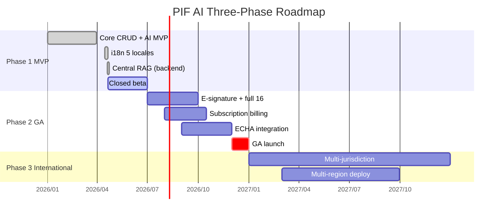
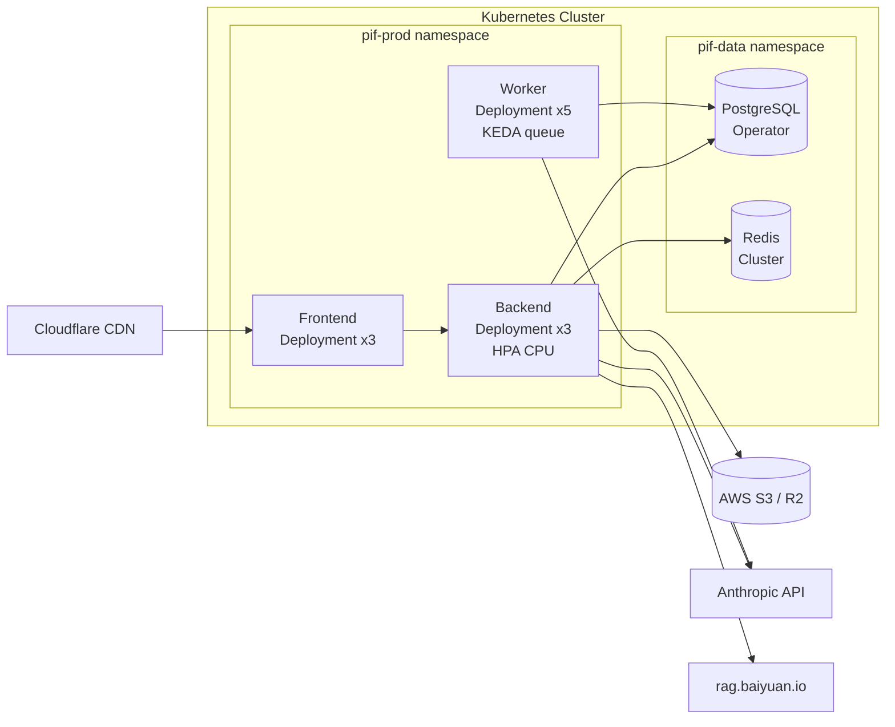

# Chapter 12: Roadmap, Deployment, and Open-Source Strategy

> This chapter is PIF AI's commitment to the future: what will be done when, how it is deployed, why AGPL-3.0, and how community contributions are accepted. After reading, you should be able to judge: is this a project you can invest in long-term as a contributor or investor?

## 📌 Key Takeaways

- Phase 1 MVP (2026 Q2) → Phase 2 GA (2026 Q4) → Phase 3 Scale (2027)
- Deployment: Docker Compose (MVP) → Kubernetes (scale) → multi-region (global)
- **AGPL-3.0**: ensures derivative SaaS open-source obligations (vs MIT/Apache allowing closed repackaging)
- Governance: **BDFL + Maintainers** — founder final decision, 3–5 maintainers for daily review

## 12.1 Three-Phase Roadmap

### 12.1.1 Phase 1: MVP (complete through 2026-04)

Focus: **validate that AI produces usable PIF drafts**.

Delivered:

- ✅ User registration / login / organization management
- ✅ Product CRUD + formulation upload
- ✅ AI ingredient extraction (Claude Vision + Tool Use)
- ✅ PubChem toxicology lookup + TFDA compliance check
- ✅ PIF items 1–10 draft generation
- ✅ Missing-item checklist
- ✅ Basic SA review flow
- ✅ 5-locale i18n (zh-TW / en / ja / ko / fr)
- ✅ Central RAG backend integration (Scheme C+)

Not yet: electronic signature, batch multi-brand mode, billing, advanced ECHA, regulatory change alerts.

### 12.1.2 Phase 2: GA (target 2026 Q4)

Focus: **complete 16 items + live production + commercialization**.

- Full 16-item PIF (including test-report auto-parsing)
- SA electronic signature (cryptographic + notarization)
- Stripe subscription billing (Free / Pro / Enterprise)
- ECHA C&L Inventory integration
- Multi-brand contract manufacturer mode
- Mobile app (React Native, optional)
- Audit-log SIEM export
- Published performance benchmarks (fulfilling §1.4's "target values")

### 12.1.3 Phase 3: Scale & Internationalization (2027)

- Multi-region deployment (Japan, Korea, EU)
- Multi-jurisdiction regulatory support (EU CPNP, US MoCRA, Japan Yakukiho, Korea Cosmetics Act)
- Regulatory change auto-notification (change → impact analysis → revision suggestion)
- RAG L1 Wiki auto-compilation improvements
- SCCS / CIR expert knowledge bases
- AI-automated monthly compliance reports
- Bug bounty program

### 12.1.4 Timeline Visualization



**Figure 12.1**: Phase 1 closed beta runs from 2026-04-20 through just before the regulatory deadline (2026-07-01). Phase 2 drives GA in H2 2026, targeting 200 paying customers by year-end (CLAUDE.md business goal).

## 12.2 Deployment Evolution

### 12.2.1 Current Stage: Docker Compose

MVP deploys on a single host (Hetzner / DigitalOcean / on-prem):

```
host
├── pif-frontend-1     :3000
├── pif-backend-1      :8000
├── pif-worker-1
├── pif-db-1           :5432 (pgvector/pgvector:pg16)
├── pif-redis-1        :6379
└── pif-minio-1        :9000 (S3-compatible)
```

External reverse proxy via **Nginx Proxy Manager** (NPM) handles TLS certificates, custom domains, basic WAF.

Pros:

- Single machine ≈ USD 100/month
- Fast deploy (`docker compose up -d`)
- All services on the same Docker network; internal latency minimal

Cons:

- Single point of failure
- Upgrade downtime
- Inelastic resources

### 12.2.2 Scale Out: Kubernetes

When MAU > 10,000 or req/sec > 100:

- **Frontend** → Vercel (commercial) or K8s Deployment (3 replicas)
- **Backend** → K8s HPA on CPU + req/sec
- **Worker** → K8s HPA on queue depth (KEDA)
- **PostgreSQL** → managed (Supabase / RDS) + read replicas
- **Redis** → managed (Upstash / ElastiCache)
- **S3** → AWS S3 or Cloudflare R2 (no egress fees)



**Figure 12.2**: K8s deployment uses a PostgreSQL Operator (e.g., CloudNativePG) for primary/replica; KEDA scales Workers by queue depth. External dependencies go through an egress gateway.

### 12.2.3 Future: Multi-Region

Phase 3 global expansion:

- Taiwan (primary): AWS ap-northeast-1 or GCP asia-east1
- Japan: AWS ap-northeast-1 (Japan data sovereignty)
- EU: AWS eu-central-1 (GDPR)
- US: AWS us-west-2

Each region: independent cluster + DB; DNS-based geo routing via Cloudflare Load Balancer.

## 12.3 License Choice: AGPL-3.0

### 12.3.1 Candidate Comparison

| License | Closed-source derivative | SaaS loophole | Business-friendliness | PIF fit |
|------|------------|----------|-----------|---------|
| MIT / Apache-2.0 | ✅ Allowed | ✅ Allowed (no disclosure) | Most | ❌ |
| GPL-3.0 | ❌ Must open | ✅ Allowed (SaaS not distribution) | Medium | ❌ |
| **AGPL-3.0** | ❌ Must open | ❌ **SaaS must open too** | Stricter | ✅ Chosen |
| Proprietary | — | — | Closed | ❌ |

### 12.3.2 Why AGPL

Core consideration: **prevent forks from packaging PIF AI as a competing SaaS without contributing back**.

MIT permits: Company A forks PIF AI → wraps as cloud service → charges for access → no disclosure of changes.

AGPL Article 13: if users access a modified version over a network, the source must be available. This forces fork-and-sell to open-source changes.

For third parties building on PIF AI:

- ✅ Internal use (no external service obligation)
- ✅ Commercial use (per AGPL terms)
- ✅ Forking + modification — but **serving as SaaS requires disclosure**

### 12.3.3 Impact on Enterprise Users

| Scenario | AGPL impact |
|---------|-----------|
| Brand owner uses pif.baiyuan.io | **None** — users are not "distributors" |
| Business self-hosts PIF AI for internal use | None (no external service) |
| Company packages PIF AI as a product for sale | Must disclose modifications |
| External system integrates with PIF AI | Depends on integration depth (see AGPL FAQ) |

For the vast majority of users (businesses), AGPL is **transparent**. Only fork-and-resell scenarios are affected.

### 12.3.4 Whitepaper Licensed Differently

The whitepaper is licensed **CC BY-NC 4.0** (attribution, non-commercial), allowing:

- ✅ Academic citation, teaching, translation
- ✅ Individual research
- ❌ Commercial reproduction (requires Baiyuan Tech written permission)

This lets the whitepaper flow freely in academic circles while preserving licensing flexibility for commercial contexts (paid training, publications).

## 12.4 Community Governance

### 12.4.1 Roles

| Role | Responsibility | Count |
|------|------|------|
| **BDFL** (Benevolent Dictator For Life) | Project vision, final decisions, constitution keeper | 1 (author) |
| **Maintainer** | PR review, issue triage, releases | 3–5 (to be recruited before Phase 2) |
| **Contributor** | Submit PRs, translations, docs | Unlimited |
| **User** | Report bugs, participate | Unlimited |

### 12.4.2 Decision Process

- Small changes (bug fix, docs): any maintainer's approval is sufficient
- Medium changes (new feature, refactor): at least 2 maintainers
- Large changes (architectural restructure, license change): BDFL approval + public 14-day RFC

### 12.4.3 Types of Contributions

- **Code**: features, bug fixes, performance
- **Translation**: 5-locale i18n review and extension (except super-admin!)
- **Whitepaper translation**: Japanese, Korean, French (Phase 3 goal)
- **Testing & security review**: report vulnerabilities → Hall of Fame
- **Regulatory knowledge**: SCCS / MoCRA / EU CPR rule implementation
- **Case studies**: anonymized enterprise adoption stories

### 12.4.4 Interaction with the Claude Code Community

As a Claude Code engineering case study, we welcome the Anthropic community to:

- Reference this repo as a Claude Code best-practice example
- List in [docs.claude.com](https://docs.claude.com) community showcase (with Anthropic's consent)
- Participate in monthly "Claude Code Office Hours" to share insights

## 12.5 Closing

PIF AI aims to prove: **LLM-assisted engineering can deliver commercial-grade open-source SaaS in the regulatory-compliance domain**. This whitepaper is the full record of that process.

If you are:

- A cosmetic business → try [pif.baiyuan.io](https://pif.baiyuan.io)
- A developer → contribute at [baiyuan-tech/pif](https://github.com/baiyuan-tech/pif)
- A researcher → cite via [CITATION.cff](../CITATION.cff)
- A regulatory professional → rule-extension suggestions welcome
- An investor → contact services@baiyuan.io

Thank you for reading this far. The remaining 4 appendices provide complete reference material:

- [Appendix A: Glossary](appendix-a-glossary.md)
- [Appendix B: API Endpoint List](appendix-b-api-endpoints.md)
- [Appendix C: References](appendix-c-references.md)
- [Appendix D: Changelog](appendix-d-changelog.md)

## 📚 References

[^1]: Free Software Foundation. *GNU Affero General Public License version 3*. <https://www.gnu.org/licenses/agpl-3.0.html>
[^2]: Creative Commons. *Attribution-NonCommercial 4.0 International*. <https://creativecommons.org/licenses/by-nc/4.0/>
[^3]: Kubernetes. *KEDA — Kubernetes Event-driven Autoscaling*. <https://keda.sh>
[^4]: CloudNativePG. *PostgreSQL Operator for Kubernetes*. <https://cloudnative-pg.io>

## 📝 Revision History

| Version | Date | Summary |
|:---:|:---:|---|
| v0.1 | 2026-04-19 | First draft. Three-phase roadmap, deployment evolution, AGPL rationale, community governance |

---

© 2026 Baiyuan Tech. Licensed under CC BY-NC 4.0.

**Nav** [← Chapter 11: Security Model](ch11-security-model.md) · [Appendix A: Glossary →](appendix-a-glossary.md)
