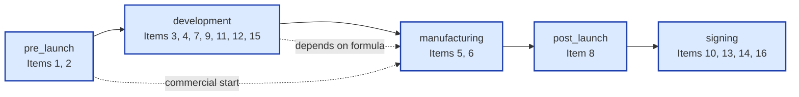

# Chapter 13: Compliance Engine Deep Dive (Phase 22–23)

> This chapter documents the compliance engine accumulated across Phase 22 and Phase 23 — eleven sub-phases in total. **Chapter 3** established each PIF item's regulatory mapping and data sources individually; **this chapter complements that by adding the causal chains between the 16 items, lifecycle derivation, version management, change detection, penalty mapping, and the final regulatory PDF generation**. The entire design is benchmarked against the 125-page ITRI *Cosmetic Product Information File (PIF) Construction Master Class* curriculum and covers all compliance prerequisites for Taiwan's mandatory enforcement date of July 1, 2026.

## 📌 Chapter Highlights

- **Lifecycle reorganization**: 16 items reorganized into 5 lifecycle stages (pre_launch / development / manufacturing / post_launch / signing), aligned with how operators actually work rather than mechanical item numbering.
- **Responsibility matrix**: 4 business types (brand / oem / importer / consultant) × 16 items = 64-cell responsibility configuration, each cell answering "who provides this", "suggested data source", and "typically outsourced".
- **Cross-item lint engine**: 14 causal-chain rules (R1–R14) covering claim-vs-toxicology consistency, formula-vs-process compatibility, packaging-vs-stability testing, adverse-event reporting obligations, and so on.
- **PIF version management**: Four versions — V0 (draft) / V1 (first signing) / V2 / V3 (post-change re-signing) — with formula / process / packaging change detection via SHA-256 fingerprints.
- **Penalty mapping**: All 14 lint rules automatically attached with the corresponding *Cosmetic Hygiene and Safety Act* §22–§25 fine ranges (NT$30,000 to NT$5,000,000).
- **14-page regulatory PDF**: WeasyPrint A4 + Noto Sans CJK, generates a complete 16-item + cross-item alert + penalty mapping + V0–V3 snapshot listing PIF document in one click from structured data.

## 13.1 Lifecycle 5 Stages and Responsibility Matrix

### 13.1.1 From "16-Item Listing" to "5-Stage Workflow"

ITRI curriculum p.13 and p.105 figure A reveal an important fact: **operators do not fill out PIF in item-number order 1 → 16**. They follow product lifecycle progression. Chapter 3's "item-by-item" listing follows the regulation's narrative order — appropriate for an audit checklist but cognitively heavy for the operator who must decide "which item should I work on next?"

Phase 22.2 reorganized the frontend PIF Builder into 5 stages (Figure 13.1):



**Figure 13.1 — PIF 16 items reorganized into 5 lifecycle stages**

Stage-to-item coverage is shown in Table 13.1:

| Stage | PIF items covered | Operator's main action | Write-in time |
|---|---|---|---|
| **pre_launch** | 1, 2 | Product basic info + TFDA registration ID | At product spec freeze |
| **development** | 3, 4, 7, 9, 11, 12, 15 | Formula, claims, usage, physicochemical, tests, packaging | From formula freeze to trial production |
| **manufacturing** | 5, 6 | Manufacturing stage, GMP cert, process | Pre mass production |
| **post_launch** | 8 | Adverse-event tracking + §12 reporting | Continuously after launch |
| **signing** | 10, 13, 14, 16 | Safety assessment + SA signature + V0/V1 snapshot | When PIF is complete |

> **Design trade-off**: 5 stages do *not* replace "16 items" as the regulatory alignment unit — item numbers remain the official ID interoperable with TFDA audits. Stages reorganize the UI flow only; the database still keys on `item_number` 1–16 as the primary key. The frontend can toggle between "by number" and "by stage" views.

### 13.1.2 Business-Type × 16-Item Responsibility Matrix

ITRI curriculum p.105 figure C lists 4 business types:

- **brand** — Designs in-house, outsources manufacturing (e.g., skincare brands)
- **oem** — Designs and manufactures in-house (e.g., domestic contract manufacturers)
- **importer** — Imports from foreign principals; no domestic R&D or manufacturing
- **consultant** — Owns no products; assists the above three with PIF integration

Each business type has a different "who provides this" allocation across the 16 items. Phase 22A bakes this 64-cell table into the backend (`services/pif_responsibility_matrix.py`) and exposes it via `/api/v1/pif/responsibility-matrix`. The frontend `PifItemTooltip` reads `productId` and automatically pulls the matching business type's row, displaying three columns in the tooltip: "👤 Who provides / 💡 Suggested data source / ⚠️ Typically outsourced".

**Sample (Item 3 — Full ingredient composition table)**:

| Business type | Who provides | Suggested data source | Typically outsourced |
|---|---|---|---|
| brand | OEM/ODM contract manufacturer | Formula + INCI mapping | ✅ Usually outsourced |
| oem | In-house | Internal R&D + procurement records | ❌ In-house |
| importer | Foreign principal | MSDS + Composition Statement | ✅ From principal |
| consultant | Joint with operator | Consolidated three-party data | — |

Full 64-cell configuration: see source code at `services/pif_responsibility_matrix.py`. Phase 22A also includes a sanity check ("brand outsourcing ratio > oem outsourcing ratio") which passed 9/9 testcases.

### 13.1.3 Auto-Derived 7-Step Workflow

Phase 22B (ITRI p.108-110 figure B) abstracts the regular PIF construction workflow into 7 steps:

1. **Formula freeze** — Item 3 complete
2. **Trial production assessment** — Item 5/6/9 + Items 11–13 initiated
3. **Packaging decision** — Item 15 complete
4. **Information integration** — Items 1/2/4/7 complete
5. **Safety assessment** — Items 10/14 written by SA
6. **First signing V1** — Item 16 locks V1 snapshot
7. **Re-signing after change** — V2/V3 snapshot (trigger conditions in §13.3)

Each step's completion is auto-derived from the underlying items. The endpoint `/api/v1/products/{id}/pif-workflow` returns:

```json
{
  "current_step": 4,
  "steps": [
    {"number": 1, "name": "Formula freeze",  "completed": true,  "items": [3]},
    {"number": 2, "name": "Trial production","completed": true,  "items": [5, 6, 9, 11, 12, 13]},
    {"number": 3, "name": "Packaging",       "completed": true,  "items": [15]},
    {"number": 4, "name": "Info integration","completed": false, "items": [1, 2, 4, 7]}
  ],
  "outsourcing_suggestions": ["3", "5", "6", "11-13"]
}
```

`outsourcing_suggestions` combines with the business-type matrix (§13.1.2) to recommend outsourced items.

## 13.2 PIF Version Management: V0–V3 Snapshots and Change Detection

### 13.2.1 V0/V1/V2/V3 Four-Version Model

ITRI curriculum p.107-110 mandates: **after every formula / process / packaging change, the PIF must be re-signed by the SA**. But "re-signing" is not overwriting — regulators and subsequent audits may simultaneously cite multiple historical versions (e.g., product X used formula A starting 2026-08-01, switched to formula B and re-signed on 2026-12-01; a TFDA audit of a 2026-09 shipment batch needs to see PIF V1 with formula A, not the current V2).

PIF AI uses a four-version model:

| Version | Trigger | Purpose | Mutable? |
|---|---|---|---|
| **V0** | Auto-created when product is created | Draft (drafting) — SA has not signed | Yes |
| **V1** | First SA signing | Initial market version | No (locked) |
| **V2** | First re-sign after formula / process / packaging change | First post-change version | No (locked) |
| **V3** | Second-and-subsequent change post-sign | All ongoing changes accumulate at V3 | No (locked) |

`/api/v1/products/{id}/pif-versions/snapshot` triggers snapshot creation; on creation, the current state of all 16 items is extracted into `items_snapshot` JSONB, with a `__fingerprints__` sub-object embedded inside (§13.2.2).

### 13.2.2 Change Detection: The Fingerprint Mechanism

Phase 22E introduces fingerprint detection. On snapshot creation, three SHA-256 hashes are computed:

| Fingerprint | Computed from | Change criterion |
|---|---|---|
| `formula_fingerprint` | Item 3 ingredient table (INCI ID + concentration sorted set) | Any ingredient added/removed or concentration changed |
| `process_fingerprint` | Item 6 process steps (stage + step string join) | Any process stage / step changed |
| `packaging_fingerprint` | Item 15 component set | Any packaging material / spec changed |

`/api/v1/products/{id}/pif-versions/change-detection` compares the fingerprints of "the latest V1+ snapshot" with the fingerprints derived from current 16-item state, returning:

```json
{
  "needs_resign": true,
  "reasons": ["formula changed", "packaging changed"],
  "current_version": "V1",
  "suggested_next_version": "V2"
}
```

The frontend `ChangeDetectionBanner` polls this endpoint; when a change is detected, it shows a warning banner + suggested version + "One-click create V2/V3 draft" button (§13.2.3).

### 13.2.3 V2/V3 One-Click Drafting

Phase 23C endpoint `POST /api/v1/products/{id}/pif-versions/auto-draft`, on detected change, **clones the latest V1+ snapshot into an unsigned V2/V3 draft**, requiring the operator only to confirm the changed items and resubmit for SA signing — eliminating the rebuild-from-V0 rework. `suggested_next_version` logic: if max is V1 → V2; if max is V2 → V3; if max is V3 → stay at V3 (V3 is the highest version label by design; ongoing changes accumulate within V3).

### 13.2.4 Document Expiry Auto-Tracking

PIF is not a one-time perpetual artifact. GMP certificates, test reports, and SA signatures all have validity periods. `/api/v1/products/{id}/pif-versions/expiring` aggregates three categories:

- **GMP certificates**: based on Item 5 uploaded `expiry_date`, warns 30 days before expiry
- **Test reports** (Items 11/12/13): estimates 12-month validity from `test_date`, warns 60 days before
- **Serious adverse-event reporting** (Item 8): per Cosmetic Hygiene and Safety Act §12, reporting must complete within 15 days of the event — a countdown timer

Warnings appear in the frontend `ExpiringDocsBanner`, sorted by closest expiry.

## 13.3 Cross-Item Causal-Chain Engine: 14 Lint Rules

### 13.3.1 Why Cross-Item Lint Is Needed

Chapter 3 treats the 16 items as independent fields, but real-world regulatory compliance demands consistency across them. ITRI curriculum p.107-110 enumerates ~30 typical "cross-item inconsistency" violations. Phase 22D abstracts 14 high-frequency scenarios into the `cross_item_lint` engine, designed as pure functions, independently testable and idempotently callable:

```python
def lint_cross_items(items: dict, org_type: str) -> list[CrossItemAlert]:
    alerts = []
    alerts += rule_R1_strong_claim_vs_toxicology(items)
    alerts += rule_R2_label_ocr_vs_usage(items)
    # ... R3 ~ R14
    return alerts
```

### 13.3.2 14 Rules at a Glance

| Rule | Trigger | target_item | severity | ITRI page |
|---|---|---|---|---|
| **R1** | Strong functional claim (whitening / anti-wrinkle / firming, etc.) but Item 10 safety assessment doesn't cover the active ingredient | 10 | warning | p.66, p.83 |
| **R2** | Item 4 label OCR implies usage instructions but Item 7 5-column usage data is incomplete | 7 | warning | p.59 |
| **R3** | Item 9 physicochemical pH < 3 or > 11 but Item 11 stability test doesn't include pH | 11 | warning | p.71 |
| **R4** | Item 3 contains restricted ingredient but Item 4 label doesn't disclose required warning | 4 | error | p.27 |
| **R5** | Item 1 launch_date has passed but Item 8 adverse-event declaration not initiated | 8 | warning | p.72 |
| **R6** | Items 11/12/13 test report `test_date` over 12 months old | 16 | warning (triggers SA re-sign) | p.53 |
| **R7** | Item 4 contains "for sensitive skin" claim but Item 11 stability test lacks patch test | 11 | error | p.83 |
| **R8** | Item 15 special-material container (metal / glass / silicone) but Item 11 stability not actually tested in that material | 11 | error | p.59 |
| **R9** | Item 3 contains banned / regulated ingredient (per TFDA list) | 3 | blocking | p.27 |
| **R10** | Item 5 GMP cert `issue_date` over 12 months or `expiry_date` < 90 days | 5 | warning | p.65 |
| **R11** | Item 6 process includes high temperature (≥80°C) but Item 11 stability test doesn't include high-temperature stability | 11 | blocking | p.71 |
| **R12** | Item 13 preservative efficacy test result is fail | 13 | blocking | p.83 |
| **R13** | Item 8 serious adverse event has occurred but §12 15-day reporting not complete | 8 | blocking | p.72 |
| **R14** | Item 16 SA signature applied but SA certificate `expiry_date` has passed | 16 | blocking | p.107 |

severity is a 3-level scale:

- **blocking** — Halts signing. Any blocking alert prevents V0 from advancing to V1.
- **error** — Must be addressed but does not halt. SA may proceed with annotation of remediation plan.
- **warning** — Reminder, no enforcement obligation.

Each alert auto-attaches the corresponding *Cosmetic Hygiene and Safety Act* article and fine range (§13.4).

### 13.3.3 R1 Advanced Filtering

Phase 23B refines R1 (strong functional claim). The original implementation triggered R1 on any functional keyword, but generic claims like "moisturizing", "cleansing", or "soothing" are baseline cosmetic functions and don't require special safety assessment. Phase 23B maintains a whitelist distinguishing "generic" from "strong functional":

- **Generic claims** (whitelist, do *not* trigger R1): moisturizing, cleansing, soothing, nourishing, refreshing, protecting
- **Strong functional claims** (do trigger R1): whitening, anti-wrinkle, firming, spot-fading, brightening, anti-aging, repair, regenerating

R1 fires only on strong-functional matches, preventing alert-fatigue dilution.

## 13.4 Penalty Mapping: Statute → Fine Range

ITRI curriculum p.27, p.114-117 lists *Cosmetic Hygiene and Safety Act* §22–§25 penalty mapping. Phase 23A automatically maps the 14 lint rules to specific articles and fine ranges:

| Violation type | Article | Fine range | Triggering rules |
|---|---|---|---|
| False / exaggerated labeling | §10(1) + §22 | NT$30K–NT$2M | R1, R7 |
| Banned / regulated ingredient | §6 + §22 | NT$30K–NT$5M | R9 |
| GMP violation | §8 + §23 | NT$30K–NT$2M | R10 |
| Test fabrication | §8 + §23 | NT$30K–NT$2M | R11, R12 |
| Adverse event not reported | §12 + §24 | NT$30K–NT$1M | R13 |
| SA qualification violation | §10(2) + §25 | NT$30K–NT$500K | R14 |

Each alert's JSON structure:

```json
{
  "rule_id": "R9",
  "severity": "blocking",
  "target_item": 3,
  "message": "Ingredient 'dibutyl phthalate' is on TFDA cosmetic banned-ingredient list",
  "penalty": {
    "act": "Cosmetic Hygiene and Safety Act",
    "articles": ["§6", "§22"],
    "fine_min_twd": 30000,
    "fine_max_twd": 5000000,
    "description": "Banned / regulated ingredient"
  }
}
```

The frontend `CrossItemAlertCard` renders the `penalty` block as a gold "⚖️ Fine range" card. i18n is synced across 5 locales (zh-TW / en / ja / ko / fr) via `penaltyLabel` / `penaltyFormat`.

## 13.5 SA Signature Metadata: Strengthened Accountability

Phase 23D strengthens the SA signing audit trail. Originally the `sa_reviews` table stored only `signed_at` and `sa_id`. Phase 23D adds four columns:

| Column | Type | Purpose |
|---|---|---|
| `signature_method` | enum: `password_2fa` / `digital_cert` / `hsm` | Signing method (future hardware HSM support) |
| `signature_hash` | text (SHA-256 hex) | SHA-256 of PIF V1+ snapshot `items_snapshot`, prevents post-sign tampering |
| `signature_ip` | inet | Client IP at signing time (audit) |
| `sa_certificate_ref` | text | SA certificate ID / external certificate-management URL |

Migration uses an idempotent pattern:

```sql
ALTER TABLE sa_reviews
  ADD COLUMN IF NOT EXISTS signature_method text,
  ADD COLUMN IF NOT EXISTS signature_hash text,
  ADD COLUMN IF NOT EXISTS signature_ip inet,
  ADD COLUMN IF NOT EXISTS sa_certificate_ref text;
```

The signing flow obtains TOTP, then the backend pre-commit computes SHA-256 over `items_snapshot` and writes to `signature_hash`. Any subsequent tampering with that V1 snapshot can be detected by hash recomputation.

## 13.6 Regulatory PIF PDF: 14-Page One-Click Generation

### 13.6.1 Why Structured PDF Is Needed

PIF data is stored structured in the database, but submissions to TFDA, shipments to OEM customers, and operator internal archives all require paper / PDF format. The traditional approach has operators export each of the 16 items to Word and manually lay out — typically 4-8 hours per cycle and prone to omission. Phase 23E introduces the `regulatory_pif_pdf.py` service: from structured data, it generates a 14-section PDF compliant with Taiwan's *Cosmetic Hygiene and Safety Act* §3, §7, and §22-25 in one call.

### 13.6.2 14 Sections

```
1.  Cover (§7, §8 regulatory declarations)
2.  Item 1  — §7-1-1 ~ §7-1-9, 21 fields
3.  Item 2  — TFDA registration ID
4.  Item 3  — Full ingredient table (INCI / CAS / concentration / function / TFDA status)
5.  Item 4  — Label claims + population restrictions
6.  Item 5/6 — Manufacturing stage + GMP cert + process steps
7.  Item 7  — Usage instructions, 5 fields
8.  Item 8  — Adverse events + §12 reporting + operator declaration
9.  Item 9  — Physicochemical properties
10. Item 11/12/13 — Stability / microbial / preservative-efficacy tests
11. Item 15 — Packaging materials report
12. Cross-item alerts + §10/§22-25 penalty mapping table
13. Item 16 — V0/V1/V2/V3 snapshot listing
14. Appendix — Signature metadata + document-expiry summary
```

### 13.6.3 Technology Choice: WeasyPrint vs Puppeteer

Three candidates were evaluated:

| Option | Pros | Cons | Outcome |
|---|---|---|---|
| **WeasyPrint** | Pure Python; CSS3 paged-media support good; CJK fonts controllable | Render speed moderate (14 pages ~2-3 sec) | ✅ Adopted |
| Puppeteer (Headless Chrome) | Best rendering; can reuse frontend React components | Requires separate Node service; large Docker image | ❌ Over-complex |
| ReportLab | Pure Python; fast | Low-level API; weak CJK support | ❌ High maintenance cost |

WeasyPrint with Noto Sans CJK provides correct Traditional Chinese typography and Chinese-punctuation handling; A4 paged-media + page header / footer is controlled via CSS `@page` rules.

### 13.6.4 Two Generation Paths

```
GET /api/v1/products/{id}/pif-versions/regulatory-pdf
  → Generate current PIF complete PDF (cross_item_lint computed live)

GET /api/v1/products/{id}/pif-versions/{snapshot_id}/regulatory-pdf
  → Generate specified V0/V1/V2/V3 snapshot PDF (restored from items_snapshot)
```

The second path is particularly important: **TFDA audits cite the PIF version applicable at the time of the queried shipment batch**, requiring restoration of the 16-item state at that historic moment from V1/V2/V3 snapshots — not the current latest version's data.

### 13.6.5 Chinese Filenames and Content-Disposition

Content-Disposition uses RFC 5987 dual headers:

```
Content-Disposition: attachment;
  filename="PIF_V1_20260430.pdf";
  filename*=UTF-8''%E6%9F%90%E5%93%81%E7%89%8C_PIF_V1_20260430.pdf
```

`filename` is for legacy browsers (latin-1 ASCII fallback); `filename*` is for RFC 5987-supporting browsers (with Chinese brand name). Tested on Chrome / Safari / Firefox / Edge — all download Chinese filenames correctly.

### 13.6.6 E2E Real-Data Dual-Path Validation

Phase 23E ships with an e2e test (`tests/test_e2e_full_path.py`) validating two real paths:

**Path 1 (by item number) — `brand` organization**:
- §7-1-* 11 fields / TFDA registration ID / 4 ingredients / strong claim "whitening"
- Manufacturing stage + GMP + 5-field usage + adverse-event attestation
- Physicochemical / 3 tests pass / PET packaging
- V0 draft → V1 sign → formula change → Phase 22E detects → Phase 23C auto-drafts V2
- Expected: R1 + R9 trigger; R5/R7/R8/R11 mitigated
- Penalty mapping: §10(1) ≤ NT$200,000

**Path 2 (by stage) — `importer` organization**:
- pre_launch (1+2) → manufacturing (5+6, GMP 80 days → R10)
- development (3/4/7/9/11/12/15, preservative fail + metal packaging)
- post_launch (8 serious event → R13)
- signing (V0/V1 → packaging change → 22E → V2 auto-draft)
- All 7 expected: R1, R7, R8, R10, R11, R13, R9
- blocking ≥ 1 (R11)
- importer recommended outsourcing 12 items (3, 5, 6, 8-16)

Both paths green:

- magic header (`%PDF`) ✓
- EOF marker (`%%EOF`) ✓
- size > 5 KB (measured 640–690 KB / 14 pages)
- content-type: `application/pdf` ✓
- `pdftotext` extraction confirms presence of §7-1-* / §22-25 / R1/R7/R8/R10/R11/R13 + blocking alerts

## 13.7 Cross-Reference to Chapter 3

After this chapter, Chapter 3's "16-item listing" has been extended along these dimensions:

| Chapter 3 | Chapter 13 extension |
|---|---|
| Each item's regulatory mapping | Cross-item causal chains across 16 items (14 lint rules) |
| Per-item data sources (operator-fill / upload / DB query) | 4 business types' responsibility allocation (64 cells) |
| `pif_documents.item_number` status field | V0–V3 snapshots + fingerprints + change detection |
| AI confidence field `ai_confidence` | SA signature metadata (method / hash / ip / cert ref) |
| Statutes (§7, §8) | Penalty mapping (§22–§25 fine ranges) |
| Markdown draft output | Structured 14-page PDF complete output |

## 13.8 Open-Source Strategy Implications

Phase 22-23 leaves three reusable assets at the open-source level for other countries' / regulations' adoption:

1. **`cross_item_lint` pure-function engine** — Independent of the full PIF AI stack; only the rule table R1–R14 needs replacement to adapt to other regulatory regimes such as EU CPNP, US OTC, Japan PMDA.
2. **Responsibility matrix schema** — A 4-business-type × N-item, 64-cell data structure. The industry currently has no public standard; this implementation can serve as a reference for future ISO / WHO standardization.
3. **`regulatory_pif_pdf` PDF generator** — The WeasyPrint template and 14-section IA design are reusable as a common skeleton for cosmetic / OTC / supplement and similar regulated industries.

GitHub paths:

- `backend/app/services/cross_item_lint.py`
- `backend/app/services/pif_responsibility_matrix.py`
- `backend/app/services/regulatory_pif_pdf.py`

License: AGPL-3.0 (same as parent project). Commercial reproduction or closed-source integration: contact Baiyuan Tech for commercial licensing.

## 📚 References

[^1]: Industrial Technology Research Institute (ITRI). *Cosmetic Product Information File (PIF) Construction Master Class* curriculum. March 2026 (COPYRIGHT 2026.03 p.13, p.27, p.52-54, p.59, p.65, p.66, p.71, p.72, p.83, p.105, p.107-110, p.114-117).
[^2]: Taiwan Food and Drug Administration (TFDA). *Cosmetic Hygiene and Safety Act* §3, §6, §7, §8, §10, §12, §22, §23, §24, §25. <https://www.fda.gov.tw>
[^3]: WeasyPrint. *The Visual Rendering Engine for HTML and CSS that Can Export to PDF*. <https://weasyprint.org>
[^4]: Google Fonts. *Noto Sans CJK*. <https://fonts.google.com/noto/specimen/Noto+Sans+TC>
[^5]: IETF. *RFC 5987 — Character Set and Language Encoding for Hypertext Transfer Protocol (HTTP) Header Field Parameters*. <https://www.rfc-editor.org/rfc/rfc5987>

## 📝 Revision History

| Version | Date | Summary |
|:---:|:---:|---|
| v0.2 | 2026-04-30 | First written. Covers Phase 22-23 — eleven sub-phases of compliance engine |

---

© 2026 Baiyuan Tech. Licensed under CC BY-NC 4.0.

**Navigation** [← Chapter 12: Roadmap, Deployment & Open-Source Strategy](ch12-roadmap-deployment-opensource.md) · [Appendix A: Glossary →](appendix-a-glossary.md)
