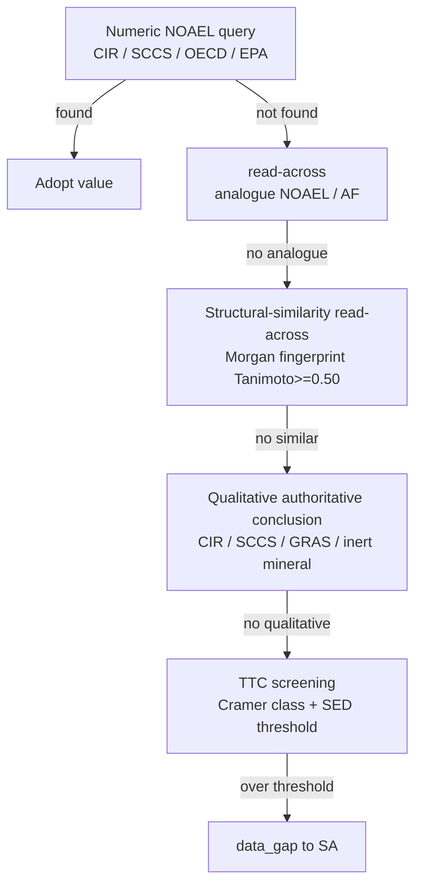

# Chapter 14: Toxicology Safety-Assessment Engine — The NOAEL Fallback Constitution and MoS Margin

> **Chapter 9** established the multi-source query pipeline for toxicological data (4 major databases + TFDA mapping + concurrent queries). But "finding the data" is not the same as "reaching a safety verdict". When an ingredient has no numeric NOAEL, should the system print "not found" or continue to derive one? This chapter documents an engine constitution anchored by the user — **no NOAEL means switch to a fallback; never let any ingredient stall at a blank** — together with the MoS margin calculation and the fail-safe asymmetry principle that support it.

## 📌 Chapter Highlights

- **NOAEL fallback constitution**: whenever an ingredient has no numeric NOAEL, the engine must, in order, attempt read-across borrowing, structural-similarity analogy, qualitative authoritative conclusion, and TTC screening; only after exhausting all of these does it fall to data_gap for human review. On the report, **every ingredient must display an explicit safety basis** — never "not found".
- **Six-tier cascade**: numeric NOAEL → read-across (analogue NOAEL ÷ assessment factor) → structural-similarity read-across (RDKit Morgan fingerprint, Tanimoto ≥ 0.50) → qualitative authority (CIR / SCCS / GRAS / inert mineral) → TTC (Cramer class + SED threshold) → data_gap.
- **MoS margin**: `MoS = NOAEL / SED`, where `SED = systemic exposure × concentration × dermal-absorption rate DAp`. MoS ≥ 100 is the safety threshold (aligned with SCCS convention).
- **DAp correction**: the dermal-absorption rate of fixed plant / animal oils is corrected from the default 50% to 5% (molecular-weight 800–900 triglycerides barely penetrate the stratum corneum), preventing benign oils from being wrongly rejected by inflated exposure — but essential oils / small molecules / esters are always excluded from this correction.
- **Fail-safe asymmetry**: prefer a false positive (mis-flagging as review) over a false negative (letting a hazardous ingredient through). A fallback value must still pass MoS ≥ 100; hard gates (nano / CMR / corrosive / statutory limit / carcinogenic classification) override any lenient conclusion.

## 14.1 Why Multi-Source Query Is Not Enough

The Chapter 9 pipeline solved "where to find toxicological data": concurrent queries across the four sources CIR, SCCS, OECD, and EPA ToxValDB, consolidated into a risk summary. But in practice it exposed a harsh gap — **most cosmetic ingredients (especially botanical extracts, natural oils, and fragrances) have no numeric NOAEL in the authoritative databases**.

Early versions behaved as follows: when nothing was found, the ingredient's safety-basis column simply printed "not found". In one real submission this caused a disaster: a tenant's formula of 23 ingredients showed "not found" for 11 of them. The user's reaction was not "this system is rigorous" but "this system can't do the job" — a report full of "not found" is worthless to an operator who must answer to a regulator, and the user churned outright.

The essence of the problem is a positioning gap:

> **A human safety assessor (SA) faced with an ingredient that has no NOAEL will use their full chemical knowledge plus literature to perform on-the-spot structural reasoning, finding a read-across analogue or falling back to TTC screening. The AI engine's "brain capacity" should not lose to a human's.**

So the engine constitution was explicitly anchored (user, 2026-07-01): **"No NOAEL means switch to TTC, or borrow a NOAEL via read-across."** No ingredient is allowed to stall at a blank; on the report, every ingredient must display an explicit safety basis — a numeric value, a read-across borrowed value, a qualitative conclusion, or a TTC screening result.

## 14.2 The Six-Tier NOAEL Fallback Cascade

The core of the engine is a **deterministic fallback ladder** (Figure 14.1): it starts from the most authoritative, most precise source and steps down tier by tier toward the most conservative backstop, reaching human review only after exhausting the ladder.



**Figure 14.1 — The six-tier NOAEL fallback cascade**: each tier corresponds to a Tier in `app/services/noael_resolver.py` and `safety_determination.py`, stepping down in order from high authority to low.

The criteria for each tier:

| Tier | Method | Criterion / source |
|:---:|---|---|
| 0 | Numeric NOAEL | Measured POD from CIR full_report / SCCS opinion / OECD / EPA ToxValDB |
| 0.5 | Authority re-grounded | Cited value re-fetched from EPA ToxValDB ← ECHA (treated as authority-grade) |
| 1 | read-across (borrowed value) | Analogue cited NOAEL ÷ assessment factor (AF) |
| 1.5 | Structural-similarity read-across | Anchor with RDKit Morgan fingerprint Tanimoto ≥ 0.50 |
| 2 | Qualitative authoritative conclusion | CIR / SCCS "safe as used", GRAS, inert mineral; downgraded to review when conditional |
| 3 | TTC screening | Low exposure + Cramer class classification + SED ≤ corresponding threshold |
| — | data_gap | Handed to human SA after exhaustion |

One key design point: **every tier's output carries a "method label" and a "provenance"**. The report display layer does not print a bare number; it prints "read-across borrowed value (analogue X, cited NOAEL Y)" or "TTC screening (Cramer class II, SED below threshold)" — letting the SA see the confidence level of the conclusion at a glance.

### 14.2.1 The Assessment Factor in read-across

When read-across borrows an analogue's NOAEL, it cannot be applied directly; it must be divided by an assessment factor to cover interspecies differences, inter-individual differences, and data-quality uncertainty. The engine's read-across borrowed values are always labeled with the analogue's CAS and the similarity, so the verdict is traceable. Structural-similarity read-across uses RDKit to compute the Tanimoto coefficient of Morgan fingerprints, with the threshold set at 0.50 — a "similarity" below this value is not toxicologically persuasive, so the engine would rather step down to the next tier.

### 14.2.2 TTC as the Universal Backstop

TTC (Threshold of Toxicological Concern) is the last non-human backstop: for low-exposure ingredients, it assigns a conservative daily permitted-exposure threshold according to the Cramer structural classification (class I/II/III), and as long as the systemic exposure dose (SED) is below that threshold, the risk is judged acceptable. The TTC threshold is deliberately set to the strictest value — for genotoxicity-suspect ingredients bearing a structural alert, the most conservative value of 0.15 µg/day is applied.

**Iron rule**: TTC is "conservative screening when no dedicated data can be found", not "relaxation". Any ingredient that passes TTC still has its hard gates (see §14.4) in full force.

## 14.3 The MoS Margin and Dermal Absorption

With a NOAEL in hand (regardless of which tier it came from), the next step is to compute the safety margin MoS (Margin of Safety):

```text
SED (systemic exposure dose) = systemic exposure E × formula concentration C / 100 × dermal-absorption rate DAp / 100
MoS = NOAEL / SED
```

MoS ≥ 100 is the safety threshold (aligned with SCCS convention: 100 = 10× interspecies × 10× inter-individual). Below 100 falls to insufficient_margin and is handed to the SA for re-review.

### 14.3.1 The Trap in the Dermal-Absorption Rate DAp

DAp (dermal absorption percentage) defaults to a conservative 50%. But for some ingredients this is clearly over-conservative and would wrongly reject benign ones. A real case: a formula containing fixed oils such as sunflower oil and emu oil had 6 ingredients judged "cannot submit". One root cause was that these inert triglyceride oils, with molecular weights of 800–900, have a true dermal-absorption rate below 1–2%, yet were forced to 50%, inflating SED by 25–50× and falsely depressing MoS.

The fix (aligned with SCCS/1647/22 §4-5 + the Bos & Meinardi 500-Dalton rule): the DAp of fixed plant / animal oils is corrected from 50% to **5%**. But this is a "relaxation" action, so its scope of applicability must be strictly controlled:

- **Positive control (5% applies)**: fixed plant oils, animal oils (triglycerides, MW 800–900)
- **Negative control (always excluded, stay conservative)**: essential oils, small molecules (< 500 Da), esters, extracts, surfactants

After the correction, the benign oils in the aforementioned formula recovered from being wrongly rejected (one sunflower-oil ingredient's MoS went from 36 → 361), while the genuinely problematic ingredients (an essential oil at an absurd concentration, MoS 1.2) were still correctly blocked. **The product decision remained "formula revision required" = a correct, honest assessment**, not a relaxation to keep the customer happy.

### 14.3.2 The Exposure Fallback Is Correct Conservatism, Not a Bug

When the user does not specify a precise dosage form, the engine falls to a "conservative whole-body exposure" fallback value. This causes some ingredients in facial dosage forms (toner, gel, mask) to be judged insufficient_margin. This was once viewed as over-flagging (false alarm) and there was an urge to "relax" it, but a deeper look revealed a subversive conclusion:

> For these facial dosage forms falling to the whole-body fallback, **SCCS/1647/22 officially lists no corresponding exposure value at all**. To "relax" would be to fabricate a number the authority does not provide — which is unconstitutional (fabricating toxicological data) and would create a false negative.

Therefore over-flagging **is not a bug and cannot be eliminated by relaxing the threshold**. The correct answer is three safe-side fixes: (1) semantic correction of body dosage-form discrimination ("cream" cannot uniformly be treated as facial); (2) **transparency flagging** of the exposure fallback — the report shows in the exposure block "no precise dosage form specified; conservative whole-body exposure adopted; provide the correct dosage form for precise calculation", letting the SA recognize at a glance that this is conservative false-positive rather than real risk; (3) filling in the cited exposure values that the authority does list.

## 14.4 The Fail-Safe Asymmetry Principle

The whole engine observes an asymmetric safety philosophy: **prefer a false positive over a false negative**.

- **False positive**: mis-flagging a safe ingredient as review / insufficient_margin. The cost is one extra glance from the SA — acceptable.
- **False negative**: letting a hazardous ingredient through as safe. The cost is a harmful formula entering the market — unacceptable.

Therefore:

1. **A fallback value does not equal a pass**. A NOAEL borrowed via read-across / TTC must still pass MoS ≥ 100; failing that, it falls to review.
2. **Hard gates override every lenient conclusion**. The following are placed directly at high severity, regardless of how high MoS is:
   - Nanomaterials (require dedicated safety assessment)
   - CMR (carcinogenic / mutagenic / reproductive-toxicity) classified substances
   - Corrosive / strongly irritant
   - Exceeding a statutory limit
   - Carcinogen-classified permitted colorants / UV filters used above their limit
3. **Review must state a reason**. Any review verdict must display the primary reason from `review_points` (AI estimate pending verification / carcinogenic classification / read-across analogue to be confirmed…), leaving no reasonless "pending".

An extension of the constitution: for ingredients with a statutory limit (especially carcinogen-classified but permitted colorants / UV filters, such as Titanium Dioxide, Zinc Oxide, Iron Oxides), the engine **must automatically judge whether the usage is within the limit** — usage ≤ limit and matching the permitted use / dosage form → compliant; > limit → hard block. Anchored by the user: "If it can't even tell the dose apart, there's no point in building it." Such judgments cannot all be dumped on the SA.

## 14.5 Display Layer: Every Ingredient Must Show an Explicit Safety Basis

No matter how rigorous the engine, if the display layer still prints "not found", what the user experiences is "it can't do the job". So the display layer has a hard rule: when there is no numeric value, the NOAEL column of the safety-assessment report (three tables + two places in the DOCX) **shows the fallback method actually used**, rather than rigidly printing "not found":

- "Qualitative assessment (CIR: safe as used)"
- "read-across borrowed value (analogue X)"
- "TTC screening (Cramer class II)"
- "Statutorily prohibited — NOAEL not required (H350 carcinogenic classification)"

The last item is particularly important: for a statutorily prohibited substance, showing "NOAEL not required" rather than wrongly showing "TTC screening" — a prohibited substance has no need to compute a NOAEL at all, and showing TTC would be misleading. The verdict-aware display logic ensures each type of conclusion is paired with the correct basis text.

## 14.6 Observations and Limitations

- **The authoritative-NOAEL extraction layer still has holes**: full-text extraction of CIR reports is not yet complete — PubChem often returns only the CIR generic landing-page URL and cannot reach the individual report PDF. Currently the gap is filled by live queries of EPA ToxValDB plus read-across; full-text extraction of CIR PDFs is a large task still pending.
- **Over-flag calibration needs a human decision**: some conservative false positives (e.g., certain facial dosage forms falling to whole-body exposure) are on the safe side and are not a breach, but neither can they be eliminated by relaxing the threshold — because the authority has no corresponding exposure value. Relaxation must be verified case by case by a human toxicologist and cannot be auto-released by the engine.
- **Never fabricate toxicological values (platform iron rule)**: any NOAEL / DAp / exposure value must have a real provenance (EPA POD, SCCS article, literature). Lowering DAp or borrowing via read-across must both come with a precise scope of applicability and basis, otherwise real hazards would falsely pass.
- **Fallback is not relaxing safety**: the purpose of every fallback mechanism in this chapter is "eliminate the blank, give a traceable basis", not "let more ingredients pass". The direction of fail-safe is always to tighten, never to release.

The core value of the fallback constitution: **let the AI engine's toxicological judgment not lose to a human SA's on-the-spot structural reasoning — every ingredient has an explicit, traceable, and conservatively directed safety basis, rather than a page full of "not found".**

## 📚 References

[^1]: SCCS (Scientific Committee on Consumer Safety). *The SCCS Notes of Guidance for the Testing of Cosmetic Ingredients and their Safety Evaluation, 12th Revision (SCCS/1647/22)*. §4–5 (dermal absorption), Margin of Safety. <https://health.ec.europa.eu/publications/sccs-notes-guidance-testing-cosmetic-ingredients-and-their-safety-evaluation-12th-revision_en>
[^2]: Kroes, R., et al. (2004). *Structure-based thresholds of toxicological concern (TTC): guidance for application to substances present at low levels in the diet*. Food and Chemical Toxicology, 42(1), 65–83.
[^3]: Cramer, G. M., Ford, R. A., & Hall, R. L. (1978). *Estimation of toxic hazard — a decision tree approach*. Food and Cosmetics Toxicology, 16(3), 255–276.
[^4]: Bos, J. D., & Meinardi, M. M. (2000). *The 500 Dalton rule for the skin penetration of chemical compounds and drugs*. Experimental Dermatology, 9(3), 165–169.
[^5]: US EPA. *CompTox Chemicals Dashboard — ToxValDB*. <https://comptox.epa.gov/dashboard>
[^6]: RDKit. *Open-Source Cheminformatics — Morgan Fingerprints / Tanimoto Similarity*. <https://www.rdkit.org>

## 📝 Revision History

| Version | Date | Summary |
|:---:|:---:|---|
| v0.3 | 2026-07-06 | First written. Covers the six-tier NOAEL fallback cascade, MoS margin and DAp correction, the fail-safe asymmetry principle, and the display-layer safety-basis rules. |

---

© 2026 Baiyuan Tech. Licensed under CC BY-NC 4.0.

**Navigation** [← Chapter 13: Compliance Engine Deep Dive](ch13-compliance-engine.md) · [Chapter 15: Regulatory Correctness — Disclosure Thresholds, Authority Hierarchy, and Structured Harvesting →](ch15-regulatory-correctness.md)
