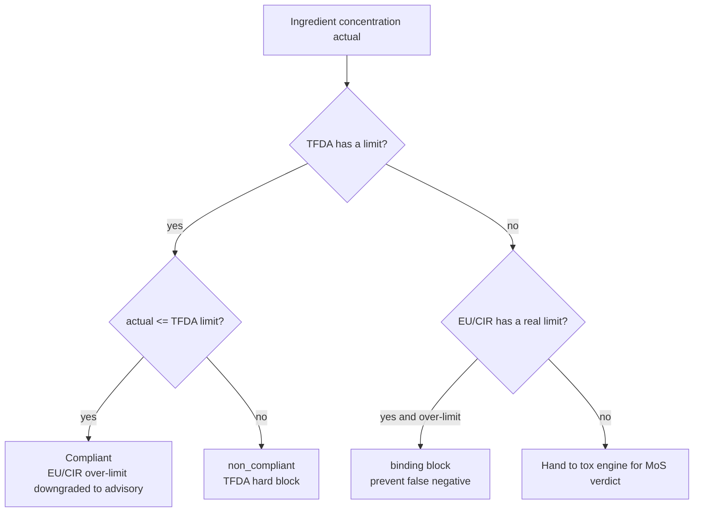

# Chapter 15: Regulatory Correctness — Disclosure Thresholds, Authority Hierarchy, and Structured Harvesting

> The toxicology engine (Chapter 14) judges "how toxic this ingredient is in itself"; the regulatory layer judges "whether this usage is legal in this market". Both can err, and the regulatory layer's errors are especially insidious — a parsing bug that mistakes a "label disclosure threshold" for a "concentration limit" would cause 62 common natural fragrances to be collectively mis-judged as over-limit. This chapter documents three classes of regulatory-correctness engineering fixes, each observing the same iron rule: **removing or downgrading a limit must never cause a false negative.**

## 📌 Chapter Highlights

- **Disclosure threshold ≠ concentration limit**: EU Annex III's "shall be indicated when concentration exceeds 0.001% leave-on / 0.01% rinse-off" for sensitizing fragrances is a **labeling disclosure requirement**, not a usage limit. Storing it as max=0.001 would falsely judge Menthol at 12% as over-limit.
- **Positional parser**: first strip the "presence...shall be indicated" disclosure clause, then parse the remainder — because EU Annex III's real limit always precedes the disclosure marker. Of the 62 rows, 7 are a "disclosure clause + real limit" mixture, and the real value must be preserved to prevent a false negative.
- **Authority hierarchy**: this system is for Taiwan TFDA registration. If TFDA has a limit and it is met → an EU / CIR over-limit is downgraded to advisory (export reference); **if TFDA has no limit → EU is still binding** (to prevent a false negative).
- **EPA ToxValDB backfill**: the CIR full-text extraction layer is almost empty, so authoritative NOAELs are filled by EPA ToxValDB live queries; EPA's self-declared possibly-high flag verdicts are all fail-closed to review.
- **Structured regulatory harvester**: scans ECHA C&L's 1125 carcinogenic classifications joined with CosIng, automatically deriving 421 genotoxic + 684 CMR prohibited CAS, replacing the hand-curated 2 entries, each carrying an ECHA C&L citation code.

## 15.1 A Disclosure Threshold Is Not a Concentration Limit

A real submission formula triggered this bug: an ingredient was judged over-limit by the system, yet the same product had passed on the TFDA registration site. The root cause was that the parsing layer conflated two things with entirely different meanings.

The EU Cosmetics Regulation Annex III has this provision for its 26 sensitizing fragrances:

> The presence of the substance **shall be indicated** in the list of ingredients... when its concentration exceeds **0.001 % in leave-on products** and **0.01 % in rinse-off products**.

This is a **labeling disclosure requirement**: "when the concentration exceeds this value, it must be indicated in the ingredient list" — it governs "whether it must be written on the label", not "whether this concentration may be used". Menthol at 12% is entirely legal; it merely must be disclosed on the label.

But the parser stored `0.001` into `cosing_substances.max_concentration_pct` (the concentration-limit column), so Menthol at 12% > 0.001% → falsely judged "over-limit". This mis-judgment spread to 62 rows of common natural fragrances: Limonene, Eucalyptus, various Citrus oils, Lavender, Menthol, and so on.

### 15.1.1 Why We Cannot "Just Clear Everything to NULL"

The most intuitive fix is to set max to NULL for all rows containing "shall be indicated". But this would create 7 false negatives.

Of the 62 rows, 7 are a **"disclosure clause + real Annex III limit" mixture** — for example, Methyl Salicylate has, besides the disclosure requirement, a real 0.06% usage limit. The max value of these rows is not 0.001 but the real limit. If all were indiscriminately cleared to NULL, these 7 real limits would vanish → false negative.

The first version of the fix used a "value exclusion" approach: clear only `max = 0.001` (the characteristic value of the disclosure threshold), preserving other values. This rescued most, but one residue remained — the real limit of 3-Propylidenephthalide, "0.01 (other products)", happens to equal the rinse-off disclosure threshold value 0.01 and was excluded along with it.

### 15.1.2 Positional Parser: Strip the Clause Before Parsing

The final fix switched to a **positional parser** (`eurlex_cosing._strip_disclosure_clause`): first strip the "presence... shall be indicated..." disclosure clause and its trailing text, then parse the remainder. The key insight is — **EU Annex III's real limit always precedes the disclosure marker**. After the disclosure clause is stripped, if a numeric value remains, it is the real limit.

The result of recomputing all 62 rows: **7 danger rows preserved their real value (3-Propylidenephthalide 0.01 restored), 55 pure-disclosure rows → NULL**. At the same time a CosIng comma-decimal bug was fixed: the EU uses "0,001" to denote a decimal, and the original parser would mis-parse it as "1"; the regex was changed to `(\d+(?:[.,]\d+)?)` + replace.

## 15.2 The TFDA / EU / CIR Authority Hierarchy

The second class of regulatory error is **authority confusion**. This system's purpose is **Taiwan TFDA registration**, but the toxicological databases are mostly EU / US sources. Without distinguishing an authority hierarchy, an EU limit would be used to reject a TFDA-legal formula.

A real case: Methyl Salicylate's TFDA limit is 1% (a formula using 1% passes legally), yet it was mis-judged as non_compliant by the EU's 0.06% (category-a leave-on).

The fix establishes an explicit hierarchy (`concentration_compliance.py` + `safety_determination.py`):

```python
tfda_permits = (tfda_max is not None and actual <= tfda_max)
```

- **TFDA has a limit and it is met** → an EU / CIR over-limit is downgraded to **advisory** (export reference, does not block Taiwan submission)
- **TFDA has no limit** → EU is still **binding** — this is the key to preventing a false negative: if an ingredient is unlisted by TFDA but the EU has a real 5% limit, a formula using 5% must still be blocked; it cannot be released just because "TFDA has no rule"

**Figure 15.1 — Authority verdict flow**:



TFDA hard gates (severity high), the Annex II prohibited list, and CMR classification — these do not move under any authority hierarchy.

## 15.3 EPA ToxValDB Backfill of Authoritative Values

Chapter 14 noted that the authoritative-NOAEL extraction layer is almost empty: the noael column of `cir_reports` is largely 0 (PubChem returns only the CIR generic landing-page URL and cannot reach the individual reports). This makes many ingredients that could have been decided by an authoritative numeric value fall instead to AI read-across or even data_gap.

The fix (`noael_engine._epa_toxval_backfill`): before an ingredient falls to AI read-across, for those with "no authoritative numeric NOAEL", live-query EPA ToxValDB and merge the result into that ingredient's toxicological data, so the parser preferentially recognizes the authoritative value. EPA ToxValDB can even resolve a DTXSID from a chemical name (queryable even without a CAS), filling in a large block of ingredients that previously came up empty.

Two safety designs:

1. **Sanity ceiling 10000 (not 2000)**: EPA's limit-dose studies often have legitimately high NOAEL values (benign oils can reach thousands of mg/kg/day). Retaining the AI-hallucination-guard ceiling of 2000 would wrongly kill these legitimate high values, so the sanity ceiling for EPA values is relaxed to 10000.
2. **Flag verdict fail-closed**: EPA marks some values with `verdict='flag'` (self-declaring they may be high). Such values cannot be silently released — they are all fail-closed to review and handed to the SA for confirmation.

Empirical result: in the aforementioned case of 6 wrongly-rejected ingredients, after the fix it became "4 real problems still blocked + 2 benign oils released" — Methyl Salicylate, using EPA's 3.9 mg/kg/day + fail-closed, honestly remained blocked; the benign oils were correctly released.

## 15.4 Structured Regulatory Harvester: Auto-Blocking CMR

The original prohibited-substance list was hand-curated — only 2 entries. For a system meant to cover the full ingredient space, manually maintaining a prohibited list is neither possibly complete nor traceable.

The 2026-07 phase built a **structured regulatory harvester** (`regulatory_limit_harvester`): it scans `echa_cl_substances` (the ECHA harmonized classification list, 1125 carcinogenic / mutagenic / reproductive-toxicity classifications) joined with `cosing_substances`, automatically deriving prohibited CAS:

- **421 genotoxic** CAS
- **684 CMR prohibited** CAS

Each entry carries an ECHA C&L citation code (such as H350 carcinogenic, H340 mutagenic), fully traceable. The harvest result (`carcinogen_limits_harvested`) is machine-produced, baked into the image; a worker cron re-runs every 168 hours, so the system auto-expands whenever the authoritative source updates.

The lookup merge priority: **hand-curated > genotoxic / CMR exclusion > harvested**. One seemingly anomalous but correct result: the intersection of the harvested CMR substances with the Annex IV/VI permitted colorants / UV filters is **0** — because H350/H351 carcinogen-classified substances and the permitted list should not overlap to begin with, so `derived = 0` is the correct result, not a harvesting failure.

### 15.4.1 A Pitfall: asyncpg's JSONB Placeholder

The harvester's implementation stepped on a hidden asyncpg pitfall: the `?` inside PostgreSQL's JSONB `?|` operator (checking whether a key exists) is parsed by asyncpg as a parameter placeholder, throwing `UndefinedFunctionError` and polluting the entire transaction. The fix is to switch to the function form `func.jsonb_exists_any(col, array[...])`, avoiding the `?` character. This kind of "ORM / driver mistaking a SQL operator for a placeholder" pitfall demands special vigilance on JSONB-heavy regulatory tables.

## 15.5 Filling the Heavy-Metal-Salt Hole

Red-team testing found a boundary hole: mercury, arsenic, and cadmium "and their compounds" are category-prohibited under both TFDA and EU Annex II, but the database listed only the elements themselves; the individual CAS of the salts (such as mercuric chloride 7487-94-7) were not enumerated one by one. So mercuric chloride was originally only downgraded to review rather than prohibited.

The fix (`safety_determination._is_prohibited_heavy_metal_compound`): using a curated list of salt CAS + INCI word-root matching (mercuric / 汞 / arsenic / 砷 / cadmium / 鎘), it places the gate for such compounds at the highest priority (§1.0), review → prohibited. This is a tightening action, and its direction is correct.

## 15.6 The Safety Iron Rule: Downgrading a Limit Must Never Cause a False Negative

Every fix in this chapter touches a "limit" — removing a disclosure threshold, downgrading EU to advisory, relaxing DAp. Such actions are the most dangerous, because getting the direction wrong means letting a hazardous ingredient falsely pass. The unified iron rule:

1. **NULL-ing a disclosure threshold removes only values that "were never a limit in the first place"** (0.001/0.01 characteristic value + positional clause-stripping, double confirmation)
2. **Mixed rows must preserve the real value** (not one of the 7 danger rows' real limits may be dropped)
3. **When TFDA has no limit, the EU / real limit is still binding** (do not release just because there is no local rule)
4. **TFDA hard gates + Annex II prohibited + CMR classification do not move at all** (they are the ceiling under any authority hierarchy)

Verification method: end-to-end + adversarial regression. Menthol 12% over-limit count → 0 (the disclosure threshold is now correctly NULL); Methyl Salicylate 1% → binding maintained; the false-negative scenario (TFDA has no limit + EU real limit 1%, formula uses 5%) → EU stays blocking. A dedicated regression test `test_disclosure_threshold_authority.py` (10 tests) + the full regression suite lock it down, preventing any fix from being inadvertently reverted in the future.

## 📚 References

[^1]: European Commission. *Regulation (EC) No 1223/2009 on cosmetic products — Annex II (prohibited) & Annex III (restricted)*. <https://eur-lex.europa.eu/legal-content/EN/TXT/?uri=CELEX:32009R1223>
[^2]: European Commission. *CosIng — Cosmetic Ingredient Database*. <https://ec.europa.eu/growth/tools-databases/cosing/>
[^3]: ECHA. *C&L Inventory — Classification and Labelling*. <https://echa.europa.eu/information-on-chemicals/cl-inventory-database>
[^4]: Taiwan Food and Drug Administration (TFDA), Ministry of Health and Welfare, R.O.C. *Cosmetic Hygiene and Safety Act* and the Table of Restrictions on Cosmetic Ingredient Use. <https://www.fda.gov.tw>
[^5]: US EPA. *CompTox Chemicals Dashboard — ToxValDB*. <https://comptox.epa.gov/dashboard>

## 📝 Revision History

| Version | Date | Summary |
|:---:|:---:|---|
| v0.3 | 2026-07-06 | First written. Covers disclosure threshold vs concentration limit, the positional parser, the TFDA/EU/CIR authority hierarchy, EPA ToxValDB backfill, ECHA C&L structured harvesting, filling the heavy-metal-salt hole, and the downgrade-limit false-negative-prevention iron rule. |

---

© 2026 Baiyuan Tech. Licensed under CC BY-NC 4.0.

**Navigation** [← Chapter 14: Toxicology Safety-Assessment Engine](ch14-toxicology-safety-engine.md) · [Chapter 16: Self-Driving Evolution and Computation-Basis Documentation →](ch16-self-driving-evolution.md)
