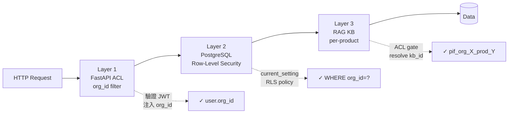
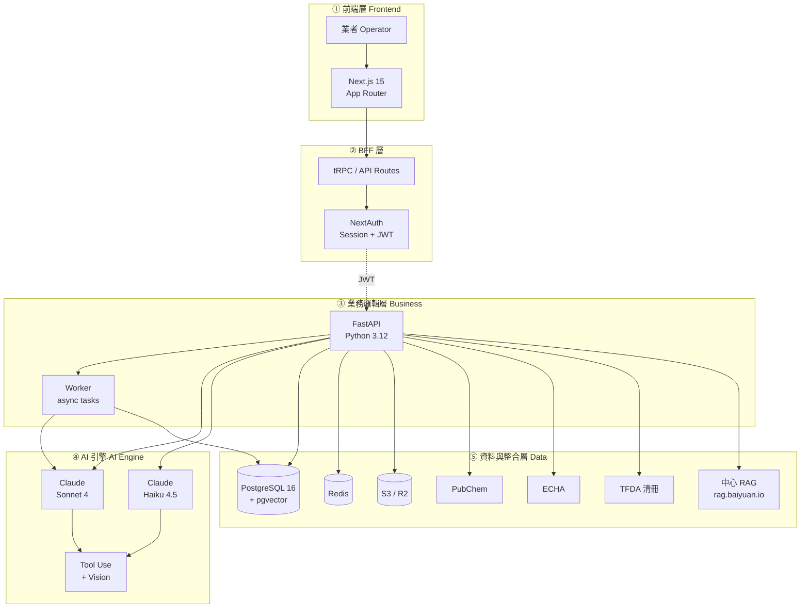

# 第 1 章：摘要與核心命題

> 本章以一句話摘要開場，接著展開 PIF AI 的四大設計命題、五層系統架構總覽，並列出本白皮書的四項學術與工程貢獻。讀完本章，您應能在 3 分鐘內向同事複述「PIF AI 是什麼、為何必要、如何運作」。

## 📌 本章重點

- PIF AI 將化粧品 PIF 建檔時間由 **4–8 週**壓縮至 **3–5 個工作天**
- 四大設計命題：結構化壓縮、AI 草稿 + SA 定稿、三層隔離、fail-soft
- 五層架構（前端／BFF／業務邏輯／AI 引擎／資料與整合）採單向依賴
- 本專案以 Anthropic **Claude Code** 輔助完成開發，同時是產品、參考實作、案例研究

## 1.1 一句話摘要

> **PIF AI 是一套多租戶 SaaS，以 AI 文件擷取、國際毒理資料庫交叉查詢、台灣 TFDA 法規即時比對，將原本耗時 4–8 週的化粧品 PIF 建檔壓縮至 3–5 個工作天，並提供 Safety Assessor（SA）線上審閱與電子簽章工作流程。**

這一句話濃縮了三個層次的資訊：**使用者痛點**（4–8 週建檔太慢）、**技術解法**（AI 擷取 + 毒理查詢 + 法規比對）、**組織合規**（SA 簽章為法定必要）。本文件第 2 章深入法規背景，第 3 章拆解 16 項資料，後續章節解析技術實作。

## 1.2 為什麼需要 PIF AI

### 1.2.1 法規時間壓力

台灣《化粧品衛生安全管理法》（下稱「衛安法」）自 2019 年分階段施行，最後過渡期於 **2026 年 7 月 1 日**結束。該日之後：

- 所有於台灣製造或進口之化粧品必須建立完整 PIF（16 項內容）
- TFDA 得隨時稽查；未建檔或建檔不全者可處 NT$10,000 – NT$1,000,000 罰鍰
- 特殊用途化粧品（防曬、染髮、燙髮等）之安全評估要求更嚴格

台灣化粧品相關事業（品牌商、代工廠、進口商、諮詢／檢驗機構）總數估計逾 8,000 家。依 TFDA 官方登錄資料與台灣化粧品工業同業公會公開統計，市面流通之化粧品單品（SKU）總數超過 10 萬項[^1]。

### 1.2.2 建檔成本結構

傳統人工建檔之三大成本：

| 成本項目 | 佔比（估計） | 說明 |
|---|---|---|
| 毒理資料查詢翻譯 | 35% | 每個成分需查 PubChem、翻譯 SDS、交叉比對 TFDA 清冊 |
| SA 專業費用 | 35% | 第 16 項安全評估必須由具資格者簽署 |
| 文件整理與法規對照 | 20% | 16 項散落於多份原始文件 |
| 行政與協調 | 10% | 跨部門蒐集配方、試驗報告等 |

> [!IMPORTANT]
> 上表百分比為**產業觀察值**，並非經正式統計研究確立之數字，僅供討論之用。正式研究詳見附錄 C 參考文獻 [3]。

### 1.2.3 中小業者的雙重困境

大型品牌有內部法規部門，小型業者則面臨：**時間耗不起、成本扛不住、專業找不到**。這正是 SaaS 化 AI 工具的市場機會 — 以軟體將專業知識普及化，讓中小業者能在合理成本內完成合規。

## 1.3 四大設計命題

PIF AI 的整體設計由以下四項核心命題驅動。每項命題都對應到具體的工程決策（見後續章節）。

### 1.3.1 命題 I：結構化壓縮，而非生成

PIF 16 項內容多為**結構化資訊的跨文件拼裝**：配方表（Excel）、GMP 證書（PDF）、試驗報告（多種格式）、法規清冊（HTML/PDF）、毒理資料庫（JSON API）。瓶頸不在「撰寫能力」，而在「資料對齊與驗算」。

這正是大型語言模型（LLM）**Tool Use**（工具使用）能力的強項：讓 LLM 作為「協調者」呼叫結構化工具，而非將所有運算塞進 token context。

> **引述依據**：`app/ai/toxicology_engine.py` 採 Claude Tool Use 模式，LLM 以 `pubchem.query`、`tfda.check_restricted`、`db.lookup_inci` 等 function signatures 擷取結構化結果，不依賴自由生成。詳見 §7。

### 1.3.2 命題 II：AI 草稿 + SA 定稿

所有 AI 輸出一律標示為「**參考草稿**」，最終專業判斷由具資格之 SA 簽署。這不是免責聲明，而是**系統設計原則**：

1. **法規要求**：衛安法第 8 條要求 SA 具專業資格；AI 不能取代
2. **工程原則**：將「高信心結構擷取」與「專業判斷」分離，降低 hallucination 責任
3. **產品體驗**：SA 審閱可聚焦於「修訂」而非「重寫」，節省 80% 時間（§13）

於資料庫層，這體現為 `pif_documents.status` 的狀態機（見 §13 圖 13.1）：`missing → uploaded → ai_processing → ai_draft_ready → human_reviewed → approved`。AI 永不將文件標記為 `approved`，這是 SA 的專屬權限。

### 1.3.3 命題 III：三層資料隔離

化粧品配方是商業機密。A 品牌的配方絕對不得被 B 品牌存取。PIF AI 提供**三層隔離**：



**圖 1.1 說明**：請求從前端進入後依序通過三層隔離檢查。第一層（FastAPI ACL）由 JWT 中的 `org_id` 決定可存取的組織；第二層（PostgreSQL Row-Level Security）於資料庫層強制過濾，即使應用層發生 bug 也無法返回他組資料；第三層（中心 RAG KB per-product）確保毒理／配方 AI 分析查詢局限於當前產品專屬 KB。任一層若被繞過，後兩層仍提供防護 — 這是「縱深防禦」（defense in depth）。詳細威脅模型見 §11，RAG 隔離機制（方案 C+）見 §10。

### 1.3.4 命題 IV：Fail-soft 為預設

PIF 建檔是一個跨天的連續流程。使用者可能在不同時間段上傳不同文件，AI 在背景非同步處理。若任何環節因外部依賴短暫故障（Claude API 超載、PubChem rate limit、中心 RAG 重啟）而硬性阻斷，使用者體驗將極差。

因此**所有外部呼叫皆為 fail-soft**：失敗時降級為「此項目暫存待補」而非 HTTP 500。具體實作範例：

```python
# app/services/rag_client.py:207
async def safe_create_kb(*, org_id, product_id, product_name=None) -> str | None:
    """Attempt to create KB; return kb_id or None on failure (fail-soft)."""
    if not _is_configured():
        logger.info("RAG not configured — skipping KB creation for product %s", product_id)
        return None
    try:
        kb = await RagClient.create_knowledge_base(...)
        return kb.id
    except RagServiceError as e:
        logger.warning("RAG create_kb failed for product %s: %s", product_id, e)
        return None  # 產品照建，kb_id 留空可後補
```

產品建立成功與否**從不依賴** RAG 可用性。詳細失敗處理策略見 §10.4。

## 1.4 系統總覽

以下為 PIF AI 的五層架構總覽。後續 §4 將深入每層的模組邊界與資料流。



**圖 1.2 說明**：五層架構採單向依賴（上層只呼叫下層，不反向呼叫）。

- **第一層 前端**：Next.js 15 App Router 採 React Server Components（RSC），可減少 client-side JavaScript bundle；使用者瀏覽器透過 HTTPS 存取。
- **第二層 BFF**（Backend-for-Frontend）：tRPC 於 Next.js API Routes 中實作，處理前端需要的 session 管理與 API 組合；NextAuth 簽發 JWT 供後端使用。
- **第三層 業務邏輯**：FastAPI（Python 3.12）實作業務規則、ACL、DB 讀寫；Worker 於背景處理長時間任務（如 PDF 生成、毒理查詢）。FastAPI 與 Worker 共享資料庫但獨立擴展。
- **第四層 AI 引擎**：使用 Anthropic Claude 官方 SDK。日常 Tool Use 任務用 Sonnet 4（平衡能力/成本）；輕量任務（INCI 名稱標準化、分類標籤）用 Haiku 4.5。
- **第五層 資料與整合**：PostgreSQL 16 + pgvector（主資料庫，pgvector 用於 RAG fallback embedding）；Redis（快取與 BullMQ 佇列）；S3/R2（加密配方檔案）；四項外部 API 整合。

### 1.4.1 關鍵量化目標

| 指標 | 傳統人工 | PIF AI 目標 | 來源 |
|---|---|---|---|
| 建檔時間 | 4–8 週 | 3–5 工作天 | 商業目標（CLAUDE.md） |
| 毒理查詢/成分 | 2–4 小時 | < 10 秒（並發 + cache） | Phase 1 設計 |
| INCI 校正信心度 | 人工查辭典 | ≥ 0.8（Claude + 辭典） | `ai/ingredient_validator.py` |
| 法規比對延遲 | 人工查 TFDA PDF | 即時（本地同步清冊） | `mcp_servers/tfda_server/` |
| SA 審閱時間/件 | 1–2 週 | 2–4 小時 | SA 線上化 |

> [!IMPORTANT]
> 上表「PIF AI 目標」欄為**設計目標值**，非實測結果。正式效能 benchmark 將於 Phase 1 GA 後於白皮書 v0.2 補上。本原則符合《開發憲法》中「不可模擬數據、實測後才回報」的規範。

## 1.5 本專案與 Claude Code 的關係

PIF AI 整個專案 —— 前端、後端、AI 引擎、RAG 整合、部署設定、i18n 5 語系、包含本白皮書 —— 皆由作者搭配 [Anthropic Claude Code](https://docs.claude.com/en/docs/claude-code/overview)（Anthropic 官方 CLI）完成開發與撰寫。

### 1.5.1 Claude Code 在本專案的角色

1. **結對程式設計**（pair programming）：架構討論、決策取捨、程式碼審閱
2. **自動化測試撰寫**：單元測試、整合測試（httpx MockTransport 範式）
3. **程式碼翻譯**：前端 5 語系 i18n JSON 的專業翻譯（詳 §11.3）
4. **文件撰寫**：本白皮書、API docs、CONTRIBUTING、SECURITY policy
5. **CI/CD 設定**：GitHub Actions workflow、Docker Compose 組態

### 1.5.2 為什麼公開這件事

兩個原因：

**學術透明性**：LLM 輔助工程對軟體開發生命週期的影響，目前是活躍研究主題。本專案作為**完整可審閱的開源案例**，讓研究者能觀察「LLM 如何影響一個具商業規模、多方依賴的 SaaS 開發」。

**社群教學價值**：希望對考慮以 Claude Code 開發複雜系統的讀者提供具體可參照的流程、取捨、失敗案例。詳細工程實踐見 §7.4 與 §15.2。

## 1.6 本白皮書的貢獻

1. **法規到工程的映射方法**（§3）：提出一套將化粧品衛安法 16 項要求映射到 AI 處理模組、資料庫欄位、狀態機的系統方法。
2. **多租戶 + 多品牌雙層隔離模型**（§10）：設計並實作中心 RAG 整合之方案 C+，解決「單一 RAG tenant 不支援程式化建立 + 仍需跨租戶／跨產品隔離」的實務問題。
3. **法規規則之自動化檢查**（§9）：將化粧品衛安法附表（限制物質、禁用物質、防腐劑、著色劑、UV 濾劑）翻譯為可機讀規則，並整合至 PIF 建檔流程。
4. **開源可重現的參考實作**（§14, §15）：以 AGPL-3.0 確保衍生 SaaS 的開源義務，搭配本白皮書使第三方能完整重現或客製化。

## 📚 參考資料

[^1]: 台灣化粧品工業同業公會（TCIIA）。「2024 年會員年報」（未公開統計）。
[^2]: 衛生福利部食品藥物管理署（TFDA）。《化粧品衛生安全管理法》（2018 公告；2019 分階段施行；2026-07-01 全面強制）。
[^3]: 參照附錄 C 第 [3] 條。
[^4]: Anthropic. *Claude Code documentation*. <https://docs.claude.com/en/docs/claude-code/overview>

## 📝 修訂記錄

| 版本 | 日期 | 摘要 |
|:---:|:---:|---|
| v0.1 | 2026-04-19 | 首次撰寫。涵蓋四大設計命題、五層架構、Claude Code 聲明 |

---

© 2026 Baiyuan Tech. Licensed under CC BY-NC 4.0.

**導覽** [← README](README.md) · [第 2 章：台灣化粧品 PIF 法規背景 →](ch02-regulatory-background.md)
