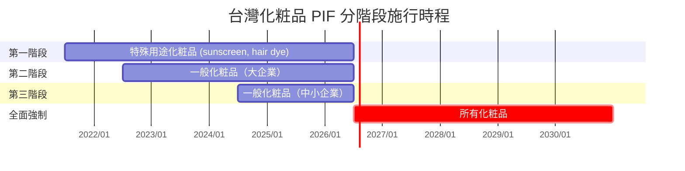

# 第 2 章：台灣化粧品 PIF 法規背景

> 本章建立 PIF AI 的法規脈絡：從《化粧品衛生安全管理法》的立法源流、第 8 條 PIF 義務的內容、分階段施行時程，到罰則細則與國際比較（歐盟 CPNP、美國 MoCRA）。讀完本章，您應能回答：PIF 是什麼？為何 2026 年 7 月是關鍵日期？不做會怎樣？

## 📌 本章重點

- 《化粧品衛生安全管理法》於 2018 年公告，2019 年起分階段施行，**2026-07-01** 全面強制
- **第 8 條**為 PIF 核心義務條款，授權 TFDA 隨時稽查
- 未建檔或建檔不全處 NT$10,000 – NT$1,000,000 罰鍰
- 台灣 PIF 制度設計與歐盟 CPNP 最為接近，但施行細則與美國 MoCRA 更強調企業內部留存

## 2.1 立法源流

### 2.1.1 前身：化粧品衛生管理條例

在 2018 年修法之前，台灣化粧品管理依據《**化粧品衛生管理條例**》（1972 年制定，歷經多次修正）[^1]。該條例以「事前查驗登記」為核心：特殊用途化粧品須查驗登記後方可上市，一般化粧品則採備查制。

該條例的問題：

- **查驗登記延宕**：國際新品上市後常需等待 1–2 年方能於台灣上架
- **備查化粧品資料不完整**：若事後發現安全疑慮，主管機關難以溯源
- **與國際趨勢脫鉤**：歐盟 2013 年施行 CPR（Regulation EC 1223/2009），由事前登記改為事後市場監控，美國 2022 年亦通過 MoCRA 強化 recordkeeping

### 2.1.2 2018 年修法：化粧品衛生安全管理法

2018 年，立法院通過《**化粧品衛生安全管理法**》（下稱「衛安法」）[^2]，核心變革：

1. **廢除特殊用途化粧品查驗登記**，改為「**產品登錄**」（所有化粧品皆需登錄 TFDA 電子平台）
2. **引進 PIF 制度**（第 8 條）：所有上市前應建立「**產品資訊檔案**」並妥善保存
3. **強化安全評估義務**：PIF 之第 16 項安全評估必須由具資格之 **Safety Assessor（SA）**簽署
4. **訂定分階段施行時程**：依化粧品類別與業者規模分批納入強制

## 2.2 第 8 條條文解析

### 2.2.1 條文原文（節錄）

> 《化粧品衛生安全管理法》第 8 條：
>
> 1. 化粧品製造或輸入業者，應於化粧品供應、販賣、贈送、公開陳列或提供消費者試用前，**建立產品資訊檔案（PIF）**。
> 2. 產品資訊檔案應**留存於製造或輸入業者**營業處所，以備查核；其保存方法、內容、期限及其他應遵行事項之辦法，由中央主管機關（TFDA）定之。
> 3. 中央主管機關得依產品類別、劑型、業者規模等要素，分階段公告產品資訊檔案之**強制建立時程**。

### 2.2.2 三項核心義務

條文可拆解為三項義務：

| 義務 | 主體 | 期限 |
|------|------|------|
| **建立** | 化粧品製造／輸入業者 | 供應／販售／贈送／陳列／試用前 |
| **保存** | 製造／輸入業者本身 | 全生命週期 + 至停售後 10 年（依施行辦法） |
| **備查** | 配合 TFDA 隨時稽查 | TFDA 得隨時為之 |

> [!IMPORTANT]
> 值得注意：PIF **並非**繳交給 TFDA，而是由業者自行保存備查。這表示 TFDA 平時不會閱覽各家業者之 PIF；但一旦稽查，若無法立即出示完整 PIF 即構成違規。
>
> 此設計直接對應到 PIF AI 的產品定位：**業者自用的建檔工具**，而非提交主管機關的投遞平台。

### 2.2.3 PIF 16 項內容

施行辦法《**化粧品產品資訊檔案管理辦法**》明定 PIF 必須包含 16 項內容[^3]，詳見 §3。本章僅列標題作為後續章節的索引：

1. 產品基本資料
2. 產品登錄證據
3. 全成分名稱及含量
4. 標籤／外包裝
5. GMP 證明文件
6. 製造方法／流程
7. 使用說明
8. 不良反應資料
9. 物質特性資料
10. 毒理資料
11. 安定性試驗
12. 微生物測試
13. 防腐效能試驗
14. 功能佐證資料
15. 包裝材質報告
16. SA 安全評估簽署

## 2.3 分階段施行時程

**圖 2.1 說明**：TFDA 公告採三階段漸進，由高風險產品與大型業者先行，最終於 2026-07-01 全面強制。此時程使業界約有 5 年過渡期以建立能力。

> [!WARNING]
> 2026 年 7 月 1 日之後，**所有**台灣製造或輸入之化粧品（不論類別、不論業者規模）皆須持有完整 PIF。對尚未準備之業者，剩餘準備期僅餘 2-3 個月（以本白皮書撰寫時間 2026-04 計算）。

## 2.4 罰則

衛安法第 23–24 條規範違反 PIF 義務之罰則：

| 違規態樣 | 罰鍰範圍 | 附加處分 |
|---|---|---|
| 未於供應前建立 PIF | NT$10,000 – NT$1,000,000 | 併命限期改正 |
| 建立 PIF 但內容不全 | NT$10,000 – NT$300,000 | 同上 |
| 拒絕或妨礙稽查 | NT$100,000 – NT$1,000,000 | 同上 |
| 屆期未改正 | **加重處分**（最高 NT$5,000,000） | 得停業或廢止登錄 |
| SA 簽署不實 | 另依《刑法》偽造文書罪論處 | 另民事責任 |

> [!CAUTION]
> 罰鍰按產品項次計算。對多 SKU 業者而言，若一次稽查發現 10 個產品缺件，理論罰鍰可達 NT$10,000,000。

## 2.5 與國際比較

### 2.5.1 歐盟 CPNP（Cosmetic Products Notification Portal）

歐盟《Regulation (EC) No 1223/2009》自 2013 年施行[^4]。核心機制：

- 所有上市化粧品須於 **CPNP 電子平台**通報（notify）而非查驗登記
- 製造商／輸入商須建立 **PIF**（在歐盟法規稱 Product Information File）
- 由資格化之 **Safety Assessor**（需具毒理學或相關科學學位 + 執業訓練）簽署安全評估報告（CPSR）
- PIF 須能於 **會員國主管機關**（如法國 ANSM、德國 BVL）要求下 72 小時內提供

### 2.5.2 美國 MoCRA（Modernization of Cosmetics Regulation Act of 2022）

美國 2022 年通過 MoCRA[^5]，首次對化粧品課以聯邦層級 recordkeeping 義務：

- 業者須註冊（facility registration）
- 產品須列示（product listing）
- 建立 **Adverse Event Record**（15 年保存）
- 遇嚴重不良事件須於 15 個工作天內通報 FDA
- 與 EU/Taiwan PIF 最大差異：MoCRA **未強制** 單一整合之 PIF 文件，但各項記錄散落於不同合規義務

### 2.5.3 三地比較表

| 面向 | 台灣 衛安法 | 歐盟 CPR | 美國 MoCRA |
|------|-------------|----------|------------|
| 上市前義務 | 產品登錄 | CPNP 通報 | 產品列示 |
| 整合 PIF 義務 | ✅ 第 8 條 | ✅ CPSR | ❌（分散記錄） |
| SA 簽署 | 必要 | 必要 | 非必要 |
| 稽查機關 | TFDA | 各國主管機關 | FDA |
| 全面強制日 | 2026-07-01 | 2013-07-11 | 2023-12（Facility reg）; 2024-07 (Adverse events) |
| 罰則上限 | NT$500 萬 | €10M 或年營業額 10% | 民事罰＋召回 |

> [!TIP]
> PIF AI 以台灣衛安法為第一優先對象，但系統設計（16 項可彈性對應、Schema 多語）預留了擴展至 EU CPNP 與 MoCRA 的空間。詳見 §15 路線圖。

## 2.6 本章與 PIF AI 的連結

本章建立的法規事實直接對應到 PIF AI 的多項設計：

| 法規要素 | PIF AI 對應設計 | 章節 |
|---|---|---|
| 第 8 條 16 項內容 | `pif_documents` 表 + 16 項處理模組 | §3, §8 |
| SA 資格要求 | `users.role = 'sa'` + `sa_qualified_until` | §13 |
| 業者自行保存 | SaaS 多租戶 + 配方 AES-256 加密 | §11 |
| 稽查隨時進行 | 完整稽核日誌（`audit_logs`） | §11 |
| 罰則高昂 | UI 明確標示 AI 為「參考草稿」，避免誤導合規狀態 | §1.3.2 |
| 分階段施行 | SaaS 計費採 Free / Pro / Enterprise 分級對應業者規模 | §15 |

## 📚 參考資料

[^1]: 《化粧品衛生管理條例》（1972 年制定；2016 年最後修正）。已於 2018 年由衛安法全面取代。
[^2]: 《化粧品衛生安全管理法》（2018 年 5 月 2 日公布；2019 年 7 月 1 日施行；2026 年 7 月 1 日全面強制）。衛福部食藥署。
[^3]: 《化粧品產品資訊檔案管理辦法》（2019 年 6 月 10 日公布）。該辦法為衛安法第 8 條之授權子法，規範 16 項內容、保存方法與期限。
[^4]: European Union. *Regulation (EC) No 1223/2009 on cosmetic products*. Official Journal of the European Union, 2009.
[^5]: U.S. Congress. *Modernization of Cosmetics Regulation Act of 2022 (MoCRA)*. Public Law 117-328, 2022.

## 📝 修訂記錄

| 版本 | 日期 | 摘要 |
|:---:|:---:|---|
| v0.1 | 2026-04-19 | 首次撰寫。涵蓋衛安法第 8 條、分階段時程、罰則、EU/US 比較 |

---

© 2026 Baiyuan Tech. Licensed under CC BY-NC 4.0.

**導覽** [← 第 1 章：摘要](ch01-abstract.md) · [第 3 章：PIF 16 項深度解析 →](ch03-pif-16-items.md)
