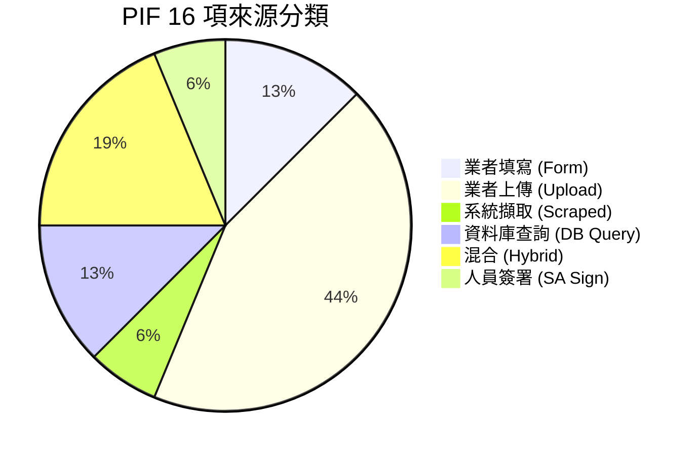
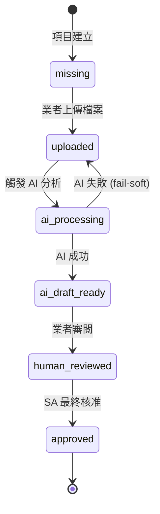

# 第 3 章：PIF 16 項深度解析

> 本章是全書最「規格密集」的一章。我們將 PIF 16 項逐條解析，對每項說明：(a) 法規要求的內容、(b) 資料來源、(c) PIF AI 的處理策略、(d) 對應的資料庫欄位與程式碼模組。最後給出「法規到工程的映射方法論」作為其他國家／法規擴展之參考。

## 📌 本章重點

- 16 項可依資料來源分為五類：業者填寫、業者上傳、系統擷取、資料庫查詢、人員簽署
- 每項對應到明確的 `pif_documents.item_number`（1–16）狀態追蹤
- 信心度欄位 `ai_confidence`（0–1 浮點）供前端顯示與 SA 審閱優先序判斷
- 法規到工程的映射方法論採「五欄對照法」：條文 → 資料源 → AI 操作 → DB 欄位 → 狀態機

## 3.1 分類總覽

依資料來源，16 項可歸為五類：

**圖 3.1 說明**：業者上傳占最大比例（7 項，涵蓋 GMP、試驗報告等），其次為混合型（3 項，如使用說明需結合業者提供與 AI 比對）。SA 簽署僅第 16 項，但其狀態連動前 15 項之完成度。

## 3.2 16 項逐條解析

以下採統一格式呈現。每項的 `DB 欄位`、`AI 模組`、`處理策略`三欄皆可於程式碼中驗證。

### 3.2.1 第 1 項 — 產品基本資料

| 要素 | 內容 |
|---|---|
| **法規要求** | 產品名稱、類別、劑型、用途、製造業者資訊、TFDA 登錄編號 |
| **資料來源** | 業者填寫 |
| **AI 策略** | LLM 結構化驗證（產品名稱 zh/en 一致性、TFDA 編號格式） |
| **DB 欄位** | `products.{name, name_en, category, dosage_form, intended_use, manufacturer_name, manufacturer_address, registration_id}` |
| **程式碼模組** | `app/api/v1/products.py` + `app/schemas/product.py` |

### 3.2.2 第 2 項 — 產品登錄證據

| 要素 | 內容 |
|---|---|
| **法規要求** | TFDA 化粧品產品登錄平台登錄編號截圖、登錄日期、有效期 |
| **資料來源** | 系統擷取（連結 TFDA 登錄平台驗證） |
| **AI 策略** | LLM 解析 TFDA 查詢結果頁面，擷取登錄狀態 |
| **DB 欄位** | `products.registration_id` + `uploaded_files`（截圖） |
| **程式碼模組** | `app/ai/tfda_registration_checker.py`（規劃中） |

### 3.2.3 第 3 項 — 全成分名稱及含量

**本項為 PIF 核心之一，工程投入最大。**

| 要素 | 內容 |
|---|---|
| **法規要求** | 所有成分以 INCI 名稱列示，含 CAS Number、濃度百分比、成分功能；依濃度降序排列 |
| **資料來源** | 業者上傳配方表（PDF / Excel / 圖片） |
| **AI 策略** | Claude Vision 解析文件 → INCI 名稱校正 → CAS 格式驗證 → 濃度加總驗算（±2% 容許） |
| **DB 欄位** | `product_ingredients.{ingredient_id, concentration_pct, function, sort_order}` + `ingredients.{inci_name, inci_name_normalized, cas_number}` |
| **程式碼模組** | `app/ai/document_parser.py` + `app/ai/ingredient_validator.py` |

詳見 §7.2 關於 Claude Vision 與 INCI 名稱校正的 prompt 設計。

### 3.2.4 第 4 項 — 標籤／外包裝

| 要素 | 內容 |
|---|---|
| **法規要求** | 產品標籤與外包裝設計稿，確認法定標示要素（成分、用途、製造業者等） |
| **資料來源** | 業者上傳設計稿 |
| **AI 策略** | OCR + Claude Vision → 法規標示要素檢查（11 項必要元素） |
| **DB 欄位** | `uploaded_files`（`pif_item_number=4`） |
| **程式碼模組** | `app/ai/label_checker.py`（規劃中） |

### 3.2.5 第 5 項 — GMP 證明文件

| 要素 | 內容 |
|---|---|
| **法規要求** | 製造廠 GMP（Good Manufacturing Practice）證書；若為代工廠，需代工廠 GMP |
| **資料來源** | 業者上傳 |
| **AI 策略** | Claude 辨識證書類型（ISO 22716 / 衛福部 GMP / 其他）、擷取有效期、對應製造商名稱 |
| **DB 欄位** | `uploaded_files`（`pif_item_number=5, file_type='gmp'`） |
| **程式碼模組** | `app/ai/document_parser.py` + `pif_builder.py` |

### 3.2.6 第 6 項 — 製造方法／流程

| 要素 | 內容 |
|---|---|
| **法規要求** | 詳細製造步驟、操作參數（溫度、時間）、使用設備、品質管制點 |
| **資料來源** | 業者或代工廠提供 |
| **AI 策略** | AI 結構化整理 + 套用範本；若業者未提供則以 [待補] 標記 |
| **DB 欄位** | `uploaded_files` + `pif_documents.ai_draft_url` |
| **程式碼模組** | `app/ai/pif_generator.py` |

### 3.2.7 第 7 項 — 使用說明

| 要素 | 內容 |
|---|---|
| **法規要求** | 產品使用方法、建議用量、頻次、適用部位、注意事項、警告 |
| **資料來源** | 業者提供 |
| **AI 策略** | AI 比對安全宣稱一致性 — 例如「可改善痘疤」等醫療效能宣稱將被標示為違規 |
| **DB 欄位** | `pif_documents`（第 7 項） |
| **程式碼模組** | `app/ai/usage_claim_validator.py`（規劃中） |

### 3.2.8 第 8 項 — 不良反應資料

| 要素 | 內容 |
|---|---|
| **法規要求** | 歷史不良反應紀錄；若無紀錄需提供聲明 |
| **資料來源** | 業者提供 |
| **AI 策略** | AI 分類歸檔（刺激反應 / 過敏反應 / 其他） + 風險等級標記 |
| **DB 欄位** | `pif_documents` |
| **程式碼模組** | `app/ai/adverse_reaction_classifier.py`（規劃中） |

### 3.2.9 第 9 項 — 物質特性資料

| 要素 | 內容 |
|---|---|
| **法規要求** | 各成分之化學名、分子式、分子量、物理性質（外觀、pH、溶解度）、化學穩定性 |
| **資料來源** | **PubChem 自動查詢** |
| **AI 策略** | LLM Tool Use → 呼叫 `pubchem.query(cas_or_inci)` → 結構化擷取屬性 |
| **DB 欄位** | `toxicology_cache.{data_json, source='pubchem'}` |
| **程式碼模組** | `app/ai/toxicology_engine.py` + `app/mcp_servers/` |

### 3.2.10 第 10 項 — 毒理資料

**與第 9 項並列為「成分風險三項」（9, 10, 15）。**

| 要素 | 內容 |
|---|---|
| **法規要求** | 各成分之急性毒性、皮膚刺激、眼刺激、致敏性、遺傳毒性、生殖毒性、致癌性等毒理終點 |
| **資料來源** | 多資料庫交叉查詢（PubChem, TFDA, ECHA, SCCS） |
| **AI 策略** | AI 綜合分析各來源資料 + 產出風險摘要表 + 資料來源引註 |
| **DB 欄位** | `toxicology_cache.{data_json, risk_level, ai_summary, fetched_at, expires_at}` |
| **程式碼模組** | `app/ai/toxicology_engine.py`（Claude Sonnet + Tool Use） |

詳細 Pipeline 見 §9。

### 3.2.11 第 11 項 — 安定性試驗

| 要素 | 內容 |
|---|---|
| **法規要求** | 加速試驗與長期試驗報告；試驗條件、檢測項目（外觀、pH、黏度）、結論與建議保存期限 |
| **資料來源** | 業者上傳試驗報告 |
| **AI 策略** | Claude 解析數據表 + 合規性判定（對照 ICH Q1A 標準） |
| **DB 欄位** | `uploaded_files`（`pif_item_number=11`） |
| **程式碼模組** | `app/ai/test_report_parser.py`（通用，含 §3.2.12-13） |

### 3.2.12 第 12 項 — 微生物測試

| 要素 | 內容 |
|---|---|
| **法規要求** | 總生菌數（TPC）、大腸桿菌、金黃色葡萄球菌、綠膿桿菌等試驗結果 |
| **資料來源** | 業者上傳 |
| **AI 策略** | 解析試驗數據 + 比對 TFDA 化粧品微生物基準 |
| **DB 欄位** | `uploaded_files` |
| **程式碼模組** | 同 §3.2.11 |

### 3.2.13 第 13 項 — 防腐效能試驗

| 要素 | 內容 |
|---|---|
| **法規要求** | Challenge Test 報告（含接種菌種、存活數、對數遞減值、A/B Grade 判定） |
| **資料來源** | 業者上傳 |
| **AI 策略** | 解析數據 + Pass/Fail 判定（對照 ISO 11930） |
| **DB 欄位** | `uploaded_files` |
| **程式碼模組** | 同 §3.2.11 |

### 3.2.14 第 14 項 — 功能佐證資料

| 要素 | 內容 |
|---|---|
| **法規要求** | 支持產品功效宣稱之證據（臨床試驗、體外試驗、文獻參考）；嚴禁醫療效能宣稱 |
| **資料來源** | 業者上傳 |
| **AI 策略** | 比對「宣稱」vs「證據」一致性；標示醫療宣稱違規 |
| **DB 欄位** | `uploaded_files` |
| **程式碼模組** | `app/ai/claim_evidence_checker.py`（規劃中） |

### 3.2.15 第 15 項 — 包裝材質報告

| 要素 | 內容 |
|---|---|
| **法規要求** | 包裝材料規格、重金屬遷移測試（鉛、汞、砷、鎘）、塑化劑測試、容器相容性 |
| **資料來源** | 業者上傳 |
| **AI 策略** | 解析檢測報告 + 比對法規上限值 |
| **DB 欄位** | `uploaded_files` |
| **程式碼模組** | 同 §3.2.11 |

### 3.2.16 第 16 項 — SA 安全評估簽署

| 要素 | 內容 |
|---|---|
| **法規要求** | 具資格 SA 綜合前 15 項資料，撰寫安全評估報告並簽署 |
| **資料來源** | SA 線上審閱 |
| **AI 策略** | AI 產出評估**草稿**（不取代 SA 判斷）；SA 修訂後電子簽章 |
| **DB 欄位** | `sa_reviews.{ai_draft_assessment, sa_final_assessment, sa_comments, signature_url, signed_at}` |
| **程式碼模組** | `app/services/sa_workflow.py` + `app/api/v1/sa_review.py` |

詳見 §13 SA 審閱工作流程。

## 3.3 狀態機設計

每個 `pif_documents` 記錄皆具狀態欄位 `status`，狀態機如下：

**圖 3.2 說明**：狀態機有六個合法狀態。`ai_processing → uploaded` 的 fail-soft 邊允許 AI 失敗時回退，業者可稍後重試；`approved` 僅能由 SA 觸發（應用層 ACL 保證），對應法規第 8 條的 SA 簽署義務。

## 3.4 法規到工程的映射方法論

本白皮書主張的「**五欄對照法**」，可作為其他國家／法規（如歐盟 CPNP、美國 MoCRA）擴展的指引：

| 欄位 | 說明 |
|------|------|
| **① 法規條文** | 原文、條號、日期 |
| **② 資料來源** | 誰（業者／系統／SA）提供？什麼格式？ |
| **③ AI 操作** | LLM Tool Use 動詞（parse / validate / compare / summarize） |
| **④ DB 欄位** | 對應的 Table.Column 或 JSONB path |
| **⑤ 狀態機狀態** | 在六狀態模型中的位置 |

以此方法，任何新增法規義務可系統化地翻譯為工程工項，避免「哪裡該對應哪裡」的混亂。詳細實作範例見 §8 的 Schema 解析。

## 📚 參考資料

[^1]: 《化粧品產品資訊檔案管理辦法》（2019-06-10 公布）。
[^2]: 衛福部食藥署。《化粧品基準中禁用成分表、限用成分表、防腐劑表、著色劑表、紫外線濾劑表》。
[^3]: ICH Q1A(R2). *Stability Testing of New Drug Substances and Products*.
[^4]: ISO 11930:2019. *Cosmetics — Microbiology — Evaluation of the antimicrobial protection of a cosmetic product*.
[^5]: European Commission. *SCCS Notes of Guidance for the Testing of Cosmetic Ingredients and their Safety Evaluation*, 12th revision.

## 📝 修訂記錄

| 版本 | 日期 | 摘要 |
|:---:|:---:|---|
| v0.1 | 2026-04-19 | 首次撰寫。涵蓋 16 項逐條解析、狀態機、五欄對照法 |

---

© 2026 Baiyuan Tech. Licensed under CC BY-NC 4.0.

**導覽** [← 第 2 章：法規背景](ch02-regulatory-background.md) · [第 4 章：系統全局架構 →](ch04-system-architecture.md)
