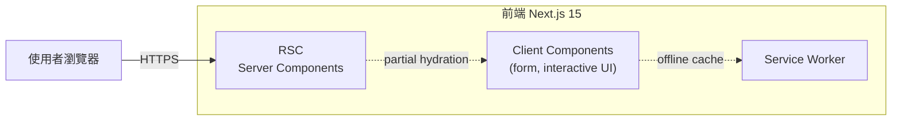
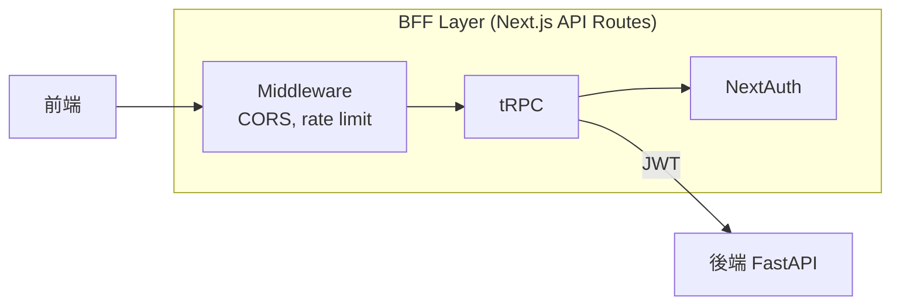
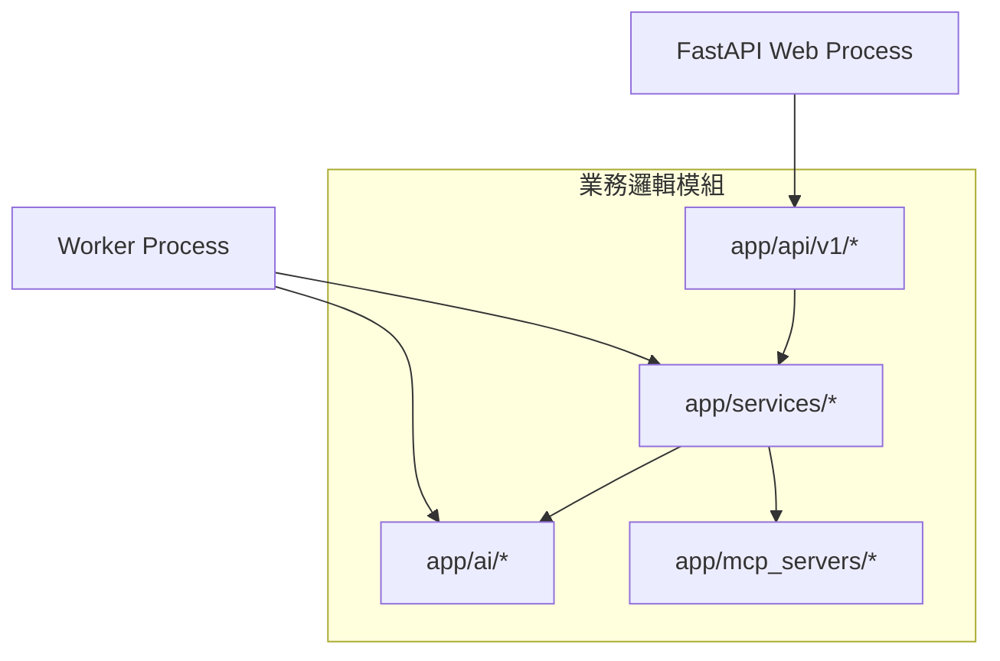
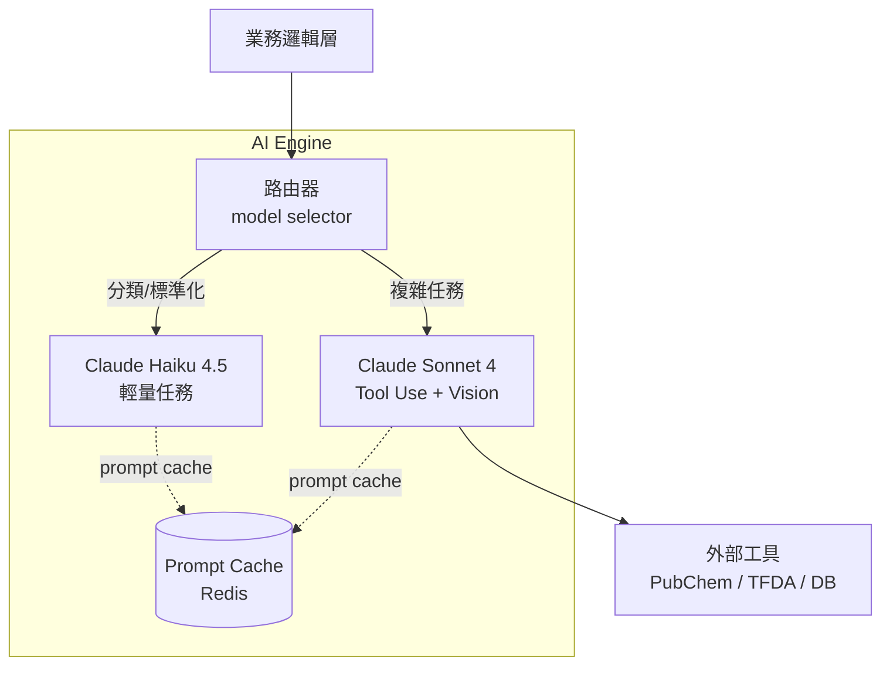
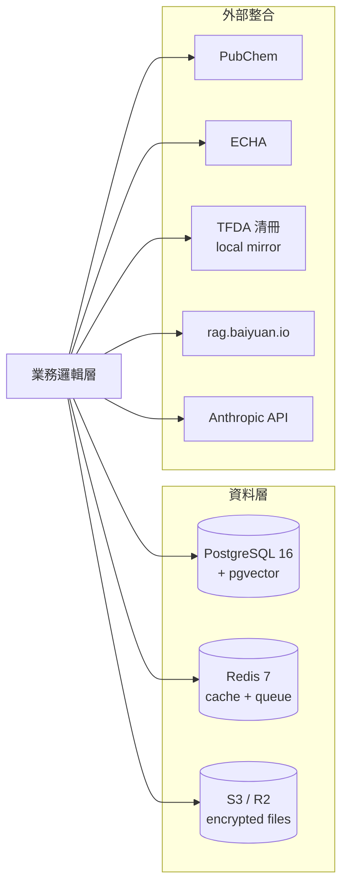

# 第 4 章：系統全局架構

> 本章深入 §1.4 初步介紹的五層架構。對每層詳述其模組邊界、資料流、與相鄰層的介面約定，最後給出部署拓撲與可能的水平擴展路徑。本章是閱讀 §5–§10 各技術棧章節的地圖。

## 📌 本章重點

- 五層架構採**單向依賴**：上層呼叫下層，下層不反向呼叫
- 部署拓撲：Docker Compose（MVP）→ Kubernetes（規模化）→ 多區（全球化）
- 模組邊界遵循 **DDD**（Domain-Driven Design）的 Bounded Context 原則
- 每一層失敗時的降級策略：前端 cached UI、BFF Circuit Breaker、Worker 重試、AI fallback

## 4.1 設計原則

在討論具體架構前，先明確四項指導原則。這些原則影響了每個後續的設計決策。

### 4.1.1 單向依賴

```
Layer 1 (Frontend) → Layer 2 (BFF) → Layer 3 (Business) → Layer 4 (AI) → Layer 5 (Data)
                     ↓                ↓
                   Sessions          Worker (async)
```

上層知道下層的介面，下層**不知道**上層的存在。下層變更對上層是 breaking change；上層變更對下層無影響。這使得：

- 後端可獨立部署而不需協調前端
- 測試可對下層 mock 而隔離上層行為
- 可獨立替換某層（例如前端從 Next.js 換到 Remix 不需動後端）

### 4.1.2 模組邊界 = Bounded Context

借鑑 DDD[^1]，每個模組對應一個 Bounded Context：

| Context | 關注 | 模組 |
|---------|------|------|
| **Identity** | 使用者、組織、認證 | `app/api/v1/auth.py`, `app/models/user.py` |
| **Product** | 產品 CRUD、PIF 狀態 | `app/api/v1/products.py`, `app/services/pif_builder.py` |
| **Formulation** | 配方、成分、INCI | `app/models/ingredient.py`, `app/services/encryption.py` |
| **Toxicology** | 毒理查詢、快取 | `app/ai/toxicology_engine.py`, `app/models/toxicology_cache.py` |
| **Review** | SA 審閱、電子簽章 | `app/api/v1/sa_review.py`, `app/services/sa_workflow.py` |
| **Compliance** | TFDA、法規比對 | `app/mcp_servers/tfda_server/` |
| **Knowledge** | 中心 RAG 整合 | `app/services/rag_client.py` |

跨 Context 的通訊以**事件**（event）或**顯式 API 呼叫**，不共享內部狀態。

### 4.1.3 Fail-soft 優於 Fail-fast

PIF 建檔是連續數日的流程。外部依賴短暫失敗不應阻斷進度：

| 失敗場景 | 傳統 Fail-fast | PIF AI Fail-soft |
|---|---|---|
| Claude API 超載 | HTTP 500 給使用者 | 暫存任務 → Worker 重試 |
| PubChem rate limit | 中止毒理查詢 | 標記「查詢中」→ 稍後重試 |
| RAG 服務重啟 | 產品無法建立 | KB 建立失敗 → 產品照建，`rag_kb_id` 留空後補 |
| PDF 生成超時 | UI 顯示錯誤 | 背景生成 → 完成時推送通知 |

### 4.1.4 可觀測性優於除錯

每個跨層呼叫產生 **trace ID**；所有錯誤結構化記錄並推送至中央日誌。這使得上線後的問題診斷不需「本機重現」而可直接於日誌系統追查。

## 4.2 五層架構詳解

### 4.2.1 第一層 前端（Frontend）



**圖 4.1 說明**：Next.js 15 App Router 預設採 React Server Components（RSC），僅互動性元件（表單、下拉、拖放上傳）為 Client Component。Service Worker 提供離線快取（PWA），讓已登入使用者斷網時仍可瀏覽先前建檔資料。

**關鍵設計決策**：

- 大型 PIF 建檔頁 SSR 渲染（快）+ 互動區塊 islands hydration（輕量）
- 檔案上傳以 **pre-signed URL** 直傳 S3/R2，繞過後端減輕頻寬
- 表單採 `react-hook-form` + `zod` 做客戶端驗證，提交前即擋下大部分錯誤

詳見 §5。

### 4.2.2 第二層 BFF



**圖 4.2 說明**：BFF（Backend-for-Frontend）是專為前端量身訂做的 API 聚合層。它處理：(a) Session 管理（NextAuth 簽發 / 驗證 JWT）、(b) 前端需要的組合查詢（`getDashboardData` = products + progress + sa-pending）、(c) CORS / rate limit。

**為什麼需要 BFF？**

不直接讓前端呼叫 FastAPI 的理由：

1. **減少 round trip**：一個 dashboard 頁需要 3 個後端端點，BFF 合併為 1 個
2. **安全**：後端 JWT 可短效（15 分鐘），BFF 負責 refresh
3. **前端特化**：BFF 回傳 shape 可對應 UI 需求，不需讓後端 schema 遷就前端

### 4.2.3 第三層 業務邏輯（Business）



**圖 4.3 說明**：業務邏輯層拆分為 Web Process（FastAPI）與 Worker Process。兩者共用相同程式碼庫（`app/services/`），但啟動不同的入口：

- **Web**：`uvicorn app.main:app`（處理 HTTP 請求，快速回應）
- **Worker**：`python -m app.worker`（處理耗時任務：毒理批次查詢、PDF 生成、AI 生成）

兩者共用 PostgreSQL（任務狀態）與 Redis（佇列）。擴展時可獨立水平擴展：Web 看 req/sec，Worker 看 queue depth。

### 4.2.4 第四層 AI 引擎



**圖 4.4 說明**：AI 引擎包含模型路由器（依任務複雜度選擇 Sonnet 或 Haiku）、Prompt Cache（Redis）、以及 Tool Use 的外部工具橋接。詳見 §7。

### 4.2.5 第五層 資料與整合



**圖 4.5 說明**：資料層為單一 PostgreSQL（pgvector 用於 RAG fallback 向量搜尋）+ Redis（LRU 快取 + BullMQ 佇列）+ S3/R2（配方檔案 AES-256 加密）。外部整合分兩類：**自由 API**（PubChem、TFDA 本地映射）與 **付費／受控 API**（ECHA 需 API Key、Anthropic 按 token 計費、中心 RAG 需雙 header auth）。

## 4.3 資料流範例：建立新產品

以最常見場景「建立新產品」示範跨層資料流：

```mermaid
sequenceDiagram
    participant U as 使用者
    participant F as Frontend
    participant B as BFF
    participant A as FastAPI
    participant D as PostgreSQL
    participant R as RAG v2
    U->>F: 填寫產品表單 + 提交
    F->>F: zod 客戶端驗證
    F->>B: POST /api/products
    B->>B: NextAuth 驗證 session
    B->>A: POST /api/v1/products (JWT)
    A->>A: Pydantic 驗證 + ACL 檢查
    A->>D: INSERT products
    D-->>A: product_id
    A->>A: initialize_pif_documents(product_id)<br/>產生 16 筆 missing 狀態
    A->>R: safe_create_kb(org_id, product_id)
    alt RAG 成功
        R-->>A: kb_id
        A->>D: UPDATE products SET rag_kb_id=?
    else RAG 失敗 (fail-soft)
        A->>A: log warning; rag_kb_id=NULL
    end
    A-->>B: 201 + ProductResponse
    B-->>F: 返回 dashboard URL
    F-->>U: 導向建檔頁
```

**圖 4.6 說明**：此序列展示了多層協作。關鍵設計：(a) 客戶端驗證先於 BFF（第一道防線）；(b) FastAPI 建立 product 後**本地事務先完成**，再非同步呼叫 RAG；(c) RAG 失敗採 fail-soft，產品照建、鎖定後補。這使得產品建立不被 RAG 可用性卡住。

## 4.4 部署拓撲

### 4.4.1 MVP 階段（Docker Compose）

```yaml
# docker-compose.yml 骨架（節錄自實際檔案）
services:
  frontend: { build: ./frontend, ports: ["3000:3000"] }
  backend:  { build: ./backend,  ports: ["8000:8000"] }
  worker:   { build: ./backend,  command: "python -m app.worker" }
  db:       { image: pgvector/pgvector:pg16 }
  redis:    { image: redis:7-alpine }
  minio:    { image: minio/minio }  # 本機 S3 替代
```

五項服務於單一 host 上運行。適用 MVP 期流量（< 1000 req/min）。

### 4.4.2 規模化（Kubernetes）

擴展至 K8s 時：

- **Frontend** → Vercel（商業版）或自建 K8s Deployment（3 replica）
- **Backend** → K8s HPA，基於 CPU 與 req/sec 自動擴展
- **Worker** → K8s HPA 基於佇列深度（KEDA scaler）
- **PostgreSQL** → 託管服務（Supabase / RDS）+ read replica
- **Redis** → 託管（Upstash / ElastiCache）
- **S3** → AWS S3 或 Cloudflare R2（無入流量費）

### 4.4.3 全球化（多區）

未來 Phase 3 擴展至日本、韓國、歐盟市場時：

- 每區獨立 K8s cluster（**資料主權**考量：EU GDPR / 日本個資法）
- 全球 DNS 負載平衡（Cloudflare Load Balancer）
- 各區獨立資料庫但共享 TFDA/ECHA 清冊（僅讀）

## 4.5 可觀測性

### 4.5.1 日誌

- 應用日誌：structlog（結構化 JSON）→ Loki
- 請求日誌：FastAPI middleware 記錄 method/path/status/duration
- AI 日誌：每次 Claude 呼叫記錄 input_tokens / output_tokens / cost

### 4.5.2 指標

- Prometheus scrape：HTTP req/sec、DB pool 使用率、Redis hit rate
- 業務指標：產品建立率、PIF 完成率、SA 審閱中位時間

### 4.5.3 追蹤

- OpenTelemetry：跨 Frontend → BFF → FastAPI → DB 的 trace ID 傳遞
- Jaeger：視覺化 trace 依賴圖

## 📚 參考資料

[^1]: Evans, E. (2003). *Domain-Driven Design: Tackling Complexity in the Heart of Software*. Addison-Wesley.
[^2]: Newman, S. (2021). *Building Microservices* (2nd ed.). O'Reilly.
[^3]: Fowler, M. *Backends For Frontends*. <https://martinfowler.com/articles/bff.html>
[^4]: Vercel. *Next.js 15 Documentation — App Router*.

## 📝 修訂記錄

| 版本 | 日期 | 摘要 |
|:---:|:---:|---|
| v0.1 | 2026-04-19 | 首次撰寫。涵蓋五層詳解、資料流、部署拓撲、可觀測性 |

---

© 2026 Baiyuan Tech. Licensed under CC BY-NC 4.0.

**導覽** [← 第 3 章：PIF 16 項](ch03-pif-16-items.md) · [第 5 章：前端技術棧 →](ch05-frontend-stack.md)
