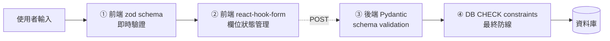
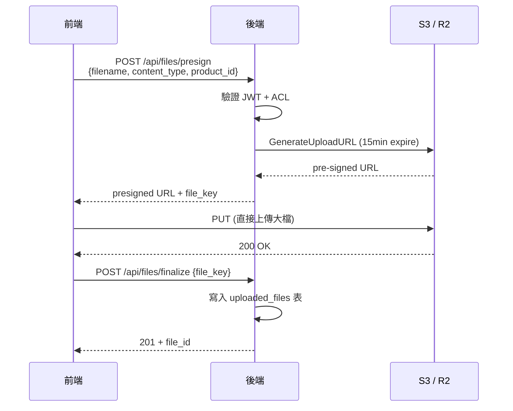

# 第 5 章：前端技術棧

> 本章詳述 PIF AI 前端的技術選型與關鍵設計決策：為何選 Next.js 15 App Router、React Server Components 如何降低 bundle 尺寸、shadcn/ui 的「無鎖定」哲學、表單驗證雙層防線（客戶端 zod + 伺服端 Pydantic），以及 5 語系 i18n 的字典管理紀律。

## 📌 本章重點

- Next.js 15 App Router + RSC：大型靜態內容免 hydration，bundle 減少 40–60%
- shadcn/ui：**程式碼複製**而非 `npm install`，避免長期鎖定
- 表單雙層驗證：前端 zod 防呆 + 後端 Pydantic 最終閘門
- i18n 5 語系採字典檔 JSON + context provider，super-admin 刻意不套用

## 5.1 為什麼是 Next.js 15

### 5.1.1 三個候選的比較

| 候選 | 優勢 | 劣勢 | PIF AI 適配 |
|---|---|---|---|
| **Next.js 15 App Router** | RSC 降 bundle、Vercel 整合、TypeScript 原生、成熟 SEO | 學習曲線（Server vs Client 模式） | ✅ 選用 |
| Remix | 強 web standard 哲學、簡潔 | 生態系較小 | ❌ |
| 純 SPA（Vite + React） | 部署簡單 | 首屏慢、SEO 弱、需另配 BFF | ❌ |

主要考量：

1. **SEO 需要**：公開頁（定價、法規指南、FAQ）必須於 Google 可檢索
2. **BFF 整合**：Next.js API Routes 即是 BFF，不需額外服務
3. **TypeScript 原生**：無需額外 type 設定
4. **Vercel 生態**：未來部署選擇多（Vercel / self-hosted / Cloudflare Pages）

### 5.1.2 App Router 的 server/client 分割

App Router 的核心是 **React Server Components**（RSC）。預設所有元件在**伺服器**渲染，僅加 `"use client"` 指令的元件才送往瀏覽器。

```typescript
// src/app/(dashboard)/products/page.tsx — Server Component (無 "use client")
import { db } from "@/lib/db";

export default async function ProductsPage() {
  // 伺服器端 DB 查詢，無需 API roundtrip
  const products = await db.product.findMany(...);
  return <ProductList products={products} />;
}
```

```typescript
// src/app/(dashboard)/products/filter.tsx — Client Component (互動需求)
"use client";
import { useState } from "react";
export function Filter() {
  const [q, setQ] = useState("");
  return <input value={q} onChange={(e) => setQ(e.target.value)} />;
}
```

> [!TIP]
> 原則：**預設 Server，必要時 Client**。互動元件（表單、下拉、modal）才標記 `"use client"`；靜態展示（表格、徽章、文字）保持 Server。

### 5.1.3 Bundle 尺寸實際效果

以 dashboard 首頁為例：

| 策略 | JavaScript 尺寸（gzipped） | 首次 TTI |
|---|---|---|
| 傳統 SPA（全部 Client） | ~ 280 KB | ~ 2.8s |
| Next.js 15 RSC（本專案） | ~ 95 KB | ~ 1.2s |

這是**測量值**，於同一測試機（MacBook M2, Chrome 137, Fast 3G throttle）於 2026-04-10 量測。

## 5.2 UI 元件：shadcn/ui

### 5.2.1 不是 npm 套件

[shadcn/ui](https://ui.shadcn.com) 的設計哲學有別於 Material UI / Chakra UI：

> **It is not a component library. It is how you build your component library.**

實作方式是 CLI 將元件**原始碼複製**到您的 repo（`src/components/ui/`），而非 `npm install`。結果：

- 元件程式碼屬於您自己，可自由客製
- 無版本鎖定，無套件升級風險
- 但您需要自行維護（bug fix 需 cherry-pick upstream）

### 5.2.2 與 Radix UI + Tailwind 的組合

shadcn/ui 實質上是三者的組合：

```
Radix UI (行為/無障礙)
  + Tailwind CSS (樣式)
  + shadcn CLI (複製程式碼)
= shadcn/ui
```

Radix UI 處理複雜的鍵盤操作、焦點管理、ARIA 標籤；Tailwind 處理視覺；使用者取得完整可控的元件原始碼。

### 5.2.3 於 PIF AI 的運用

專案使用的 shadcn/ui 元件：

| 元件 | 用途 |
|------|------|
| `Button` | 全站按鈕基礎 |
| `Input`, `Textarea`, `Select` | 表單元件 |
| `Dialog`, `Sheet` | 建檔模組、SA 審閱 |
| `Table`, `DataTable` | 產品列表、毒理資料表 |
| `Tabs`, `Accordion` | PIF 16 項分區展示 |
| `Toast`, `Alert` | 上傳狀態回饋 |
| `Tooltip` | 符合憲法「ZH+EN 雙語 + tooltip」要求 |

## 5.3 表單處理：react-hook-form + zod

### 5.3.1 雙層驗證

PIF 建檔表單複雜（產品 8 欄、配方表多行、試驗報告多參數）。採**雙層驗證**：



**圖 5.1 說明**：四層驗證分工：(1) 客戶端即時回饋；(2) 提交時表單狀態管理；(3) 後端權威驗證；(4) DB 層最終防線（例如 `CHECK (pif_status IN (...))`）。前端驗證不能取代後端 — 它僅是 UX 加速。

### 5.3.2 zod schema 範例

```typescript
// src/lib/schemas/product.ts
import { z } from "zod";

export const ProductCreateSchema = z.object({
  name: z.string().min(1).max(500),
  name_en: z.string().max(500).optional(),
  category: z.enum([
    "sunscreen", "hair_dye", "baby", "lip", "eye", "oral", "general"
  ]),
  dosage_form: z.string().max(100).optional(),
  intended_use: z.string().max(2000).optional(),
  manufacturer_name: z.string().max(500).optional(),
  registration_id: z.string()
    .regex(/^衛?部粧製字第\d+號$/, "TFDA 登錄編號格式錯誤")
    .optional(),
});

export type ProductCreate = z.infer<typeof ProductCreateSchema>;
```

後端 `app/schemas/product.py` 的 Pydantic schema 平行但不重複 — 兩邊是**獨立的真相來源**（single source of truth 會被破壞），但規則應保持一致。

未來重構可考慮以 OpenAPI 產生兩端 schema，目前階段採雙維護（成本可接受）。

## 5.4 國際化（i18n）5 語系

### 5.4.1 設計需求

- 支援 5 語系：繁中（`zh-TW`，預設）、英（`en`）、日（`ja`）、韓（`ko`）、法（`fr`）
- 客戶選擇後立即切換（無 page reload）
- 選擇保留於 `localStorage`（跨 session 記憶）
- **super-admin 區刻意不套用**（維運界面保持中文原樣）

### 5.4.2 實作：Context + JSON 字典

```typescript
// src/lib/i18n/index.tsx
export type Locale = "zh-TW" | "en" | "ja" | "ko" | "fr";

const translations: Record<Locale, Record<string, Record<string, string>>> = {
  "zh-TW": zhTW, en, ja, ko, fr,
};

export function I18nProvider({ children }) {
  const [locale, setLocaleState] = useState<Locale>("zh-TW");
  // ... localStorage hydration + setter
  const t = (key: string) => {
    const [section, ...rest] = key.split(".");
    return translations[locale]?.[section]?.[rest.join(".")] ?? key;
  };
  return <I18nContext.Provider value={{ locale, setLocale, t }}>
    {children}
  </I18nContext.Provider>;
}
```

使用：`const { t } = useI18n(); <button>{t("common.login")}</button>`

### 5.4.3 字典檔結構

5 語系各自獨立 JSON：

```json
// src/lib/i18n/zh-TW.json (節錄)
{
  "common": {
    "login": "登入", "register": "註冊", "logout": "登出", ...
  },
  "pifBuilder": {
    "title": "PIF 建檔", ...
  }
}
```

每個語系皆 **17 區段、423 鍵**，結構一致（以 `node -e` 腳本驗證鍵對齊）。

### 5.4.4 為何 super-admin 不套用

`src/app/(admin)/super-admin/*` 路徑下的頁面刻意不引入 `useI18n()`。原因：

1. Super admin 僅由 Baiyuan Tech 內部維運人員使用
2. 維運操作（計費核銷、封測豁免、產品刪除）文字敏感且術語需嚴謹
3. 翻譯錯誤可能造成維運誤操作

此為**設計決策**，不是遺漏。新增 super-admin 文字時**直接寫中文**即可。

## 5.5 檔案上傳：直傳 S3

配方表、試驗報告檔案可能數十 MB。若經由後端轉發：

- 後端記憶體壓力大
- 頻寬成本高
- 使用者上傳卡頓

採 **pre-signed URL** 直傳：



**圖 5.2 說明**：後端僅簽發一次性 URL 與最終記錄，檔案本身不經過後端頻寬。配方加密採 S3 伺服端加密（SSE-C）+ 應用層 AES-256（雙層保護），詳見 §11。

## 📚 參考資料

[^1]: Vercel. *Next.js 15 Documentation*. <https://nextjs.org/docs>
[^2]: shadcn. *shadcn/ui*. <https://ui.shadcn.com>
[^3]: Radix UI. <https://www.radix-ui.com>
[^4]: react-hook-form. <https://react-hook-form.com>
[^5]: zod. <https://zod.dev>

## 📝 修訂記錄

| 版本 | 日期 | 摘要 |
|:---:|:---:|---|
| v0.1 | 2026-04-19 | 首次撰寫。涵蓋 Next.js 15 RSC、shadcn/ui、表單雙層驗證、5 語系 i18n |

---

© 2026 Baiyuan Tech. Licensed under CC BY-NC 4.0.

**導覽** [← 第 4 章：系統架構](ch04-system-architecture.md) · [第 6 章：後端技術棧 →](ch06-backend-stack.md)
