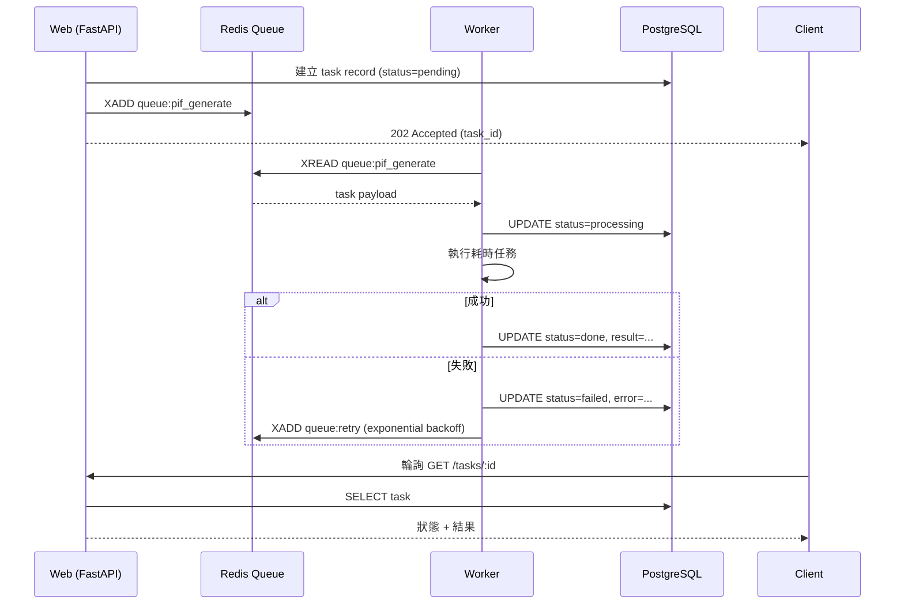

# 第 6 章：後端技術棧

> 本章說明 PIF AI 後端為何選 Python FastAPI、SQLAlchemy async 的實務取捨、為何混用 Alembic 與 inline migration、Worker 如何與 Web process 協作，以及測試金字塔與 CI 策略。

## 📌 本章重點

- FastAPI + Pydantic v2 + SQLAlchemy 2.0 async stack：Python 生態中對非同步最成熟的組合
- Migration 雙軌：**Alembic（正式）** + **inline `_run_migrations`（idempotent SQL，開發迭代快）**
- Worker 與 Web 共用程式庫、分離 process；獨立水平擴展
- 測試金字塔：單元（httpx MockTransport）→ 整合（真 DB）→ E2E（Phase 2 導入）

## 6.1 為什麼是 FastAPI

### 6.1.1 候選比較

| 候選 | 優勢 | 劣勢 | PIF AI 適配 |
|---|---|---|---|
| **FastAPI** | async 原生、Pydantic 驗證、OpenAPI 自動、AI 生態系 | 尚無 Django 級整合 | ✅ 選用 |
| Django + DRF | 成熟、全端、admin | async 支援晚、過度封裝 | ❌ |
| Flask | 簡單、靈活 | 非同步需靠外掛、無型別 | ❌ |
| Node.js (NestJS) | 前後端語言統一 | AI/ML 生態系弱於 Python | ❌ |

決定因子：

1. **AI 生態系**：Anthropic Python SDK 是官方優先維護；ML 工具鏈（LangChain、LlamaIndex）皆以 Python 為主
2. **Async 原生**：PubChem / ECHA / Claude API 皆為高延遲 IO，async 是必需
3. **Pydantic 驗證**：複雜 PIF schema（16 項各異）需要嚴謹型別系統
4. **OpenAPI 自動**：`/docs` 自動產生，前端團隊不需手寫 API 文件

### 6.1.2 實際專案結構

```
backend/
├── app/
│   ├── main.py                # FastAPI app + lifespan
│   ├── api/v1/                # API routes (products, pif, sa_review, ...)
│   ├── core/                  # config, database, security, email
│   ├── models/                # SQLAlchemy ORM
│   ├── schemas/               # Pydantic request/response
│   ├── services/              # 業務邏輯（rag_client, sa_workflow, pif_builder）
│   ├── ai/                    # AI engine (toxicology, document_parser, ...)
│   └── mcp_servers/           # MCP server 實作 (tfda, echa)
├── tests/                     # pytest
├── migrations/                # Alembic
├── alembic.ini
└── requirements.txt
```

## 6.2 SQLAlchemy 2.0 async

### 6.2.1 新版 SQLAlchemy 的型別升級

SQLAlchemy 2.0 引入了 `Mapped[T]` 型別註解，使 IDE 與 mypy 能正確推論模型屬性：

```python
# app/models/product.py (節錄)
class Product(Base):
    __tablename__ = "products"

    id: Mapped[uuid.UUID] = mapped_column(
        UUID(as_uuid=True), primary_key=True, default=uuid.uuid4
    )
    org_id: Mapped[uuid.UUID] = mapped_column(
        UUID(as_uuid=True), ForeignKey("organizations.id")
    )
    name: Mapped[str] = mapped_column(String(500), nullable=False)
    rag_kb_id: Mapped[str | None] = mapped_column(String(100), index=True)
    # ...
    organization = relationship("Organization", back_populates="products")
```

所有 query 皆非同步：

```python
async def get_product_for_org(product_id, org_id, db: AsyncSession):
    result = await db.execute(
        select(Product).where(
            Product.id == product_id,
            Product.org_id == org_id,  # ACL 閘門硬性過濾
        )
    )
    return result.scalar_one_or_none()
```

### 6.2.2 ACL 閘門範式

**每個**資料存取函式皆帶 `org_id` 參數並於 WHERE 硬性過濾。這是方案 C+ 的應用層防線（見 §10）。程式碼範式：

```python
# 正確：ACL 閘門
product = await get_product_for_org(product_id, current_user.org_id, db)

# 錯誤：直接用 product_id 查（繞過 ACL）
# product = await db.get(Product, product_id)  # 絕不可 ！
```

Code review 時查閱是否所有 DB 存取皆經由 `get_*_for_org` 函式，是強制規範。

## 6.3 Migration 雙軌策略

### 6.3.1 問題背景

PIF AI 於 Phase 1 快速迭代期，Schema 變動頻繁。純 Alembic 流程的痛點：

1. 每次欄位變動需 `alembic revision --autogenerate`
2. 本機開發需手動 `alembic upgrade head`
3. Docker 啟動時機微妙（DB 未就緒時 migration 會失敗）

### 6.3.2 解法：雙軌並行

**Track A：Alembic（正式 migration）**

用於 schema 大變動（新表、索引重建）。存於 `migrations/versions/`，經 PR review。

**Track B：Inline `_run_migrations`（idempotent SQL）**

用於小變動（加欄位、加索引、回填資料），採 `ALTER ... IF NOT EXISTS` 或 `UPDATE ... WHERE` 形式，每次 FastAPI 啟動執行一次：

```python
# app/main.py (節錄)
@asynccontextmanager
async def lifespan(app: FastAPI):
    async with engine.begin() as conn:
        await conn.run_sync(Base.metadata.create_all)
        await _run_migrations(conn)
    yield
    await engine.dispose()


async def _run_migrations(conn) -> None:
    """Idempotent schema migrations for evolving an existing DB."""
    from sqlalchemy import text
    stmts = [
        "ALTER TABLE users ADD COLUMN IF NOT EXISTS totp_secret TEXT",
        "ALTER TABLE products ADD COLUMN IF NOT EXISTS rag_kb_id VARCHAR(100)",
        "CREATE INDEX IF NOT EXISTS idx_products_rag_kb_id ON products(rag_kb_id)",
        # ...
    ]
    for stmt in stmts:
        try:
            await conn.execute(text(stmt))
        except Exception:
            pass  # 已是目標狀態即忽略
```

### 6.3.3 權衡

**優點**：

- 開發者新增欄位時於 `_run_migrations` 加一行即可，PR 審查清楚
- 部署時不需人工執行 `alembic upgrade`
- 可在 `create_all` 之後執行，處理 ORM 無法表達的變動（CHECK 修正、index 條件）

**缺點**：

- 無版本追蹤（不知道現在 schema 是哪一版）
- 無法 rollback
- 高風險變動（drop column、rename）仍需走 Alembic

**規則**：

- Additive（add col, add index, CHECK relax）→ inline
- Destructive（drop, rename, type change）→ Alembic

## 6.4 Worker 架構

### 6.4.1 為何需要 Worker

耗時操作不宜卡在 HTTP request：

| 操作 | 時間 | 需 Worker |
|------|------|-----------|
| 配方 AI 擷取 | 10–30s | ✅ |
| 毒理批次查詢 | 30s–2min | ✅ |
| PIF PDF 生成（16 項合併） | 30s–1min | ✅ |
| SA 評估草稿生成 | 15–45s | ✅ |
| 一般 DB CRUD | < 100ms | ❌ |

### 6.4.2 佇列：Redis + BullMQ

採 Redis 作為 queue backend。任務從 Web 推入佇列後由 Worker 領取：



**圖 6.1 說明**：Web 接到請求後僅 enqueue 任務並返回 202。Worker 獨立 consume，更新 DB 狀態。失敗採指數退避（1s, 2s, 4s, 8s, ... max 300s），三次後標記 failed。

### 6.4.3 水平擴展

Web 與 Worker 獨立：

```yaml
# docker-compose.yml (節錄)
services:
  backend:
    build: ./backend
    command: uvicorn app.main:app --host 0.0.0.0
    deploy:
      replicas: 3   # K8s: HPA on CPU
  worker:
    build: ./backend
    command: python -m app.worker
    deploy:
      replicas: 5   # K8s: KEDA on queue depth
```

Web 看 req/sec 擴展；Worker 看佇列深度擴展。兩者不互相影響。

## 6.5 測試策略

### 6.5.1 測試金字塔

```
         /\
        /  \   E2E (Playwright, Phase 2)
       /----\
      /      \  Integration (pytest + real DB)
     /--------\
    /          \ Unit (pytest + MockTransport)
   /____________\
```

### 6.5.2 單元測試：httpx MockTransport

外部 API（Claude、PubChem、中心 RAG）以 `httpx.MockTransport` 取代，不打真網路：

```python
# tests/test_rag_client.py (節錄)
@pytest.mark.asyncio
async def test_create_kb_sends_correct_headers_and_payload(configured_rag):
    captured = {}
    def handler(request: httpx.Request) -> httpx.Response:
        captured["headers"] = dict(request.headers)
        return httpx.Response(
            201,
            json={"status": "success", "data": {"id": "kb_new_xyz"}},
        )
    _install_mock_transport(handler)
    kb = await RagClient.create_knowledge_base(
        org_id=uuid.uuid4(), product_id=uuid.uuid4()
    )
    assert kb.id == "kb_new_xyz"
    assert captured["headers"]["x-rag-api-key"] == "test-key-abc"
    assert captured["headers"]["x-tenant-id"] == "11111111-..."
```

此模式使單元測試**完全離線**，適合 CI。16 個 RagClient 單元測試於本機 Docker 執行 1.09 秒完成[^1]。

### 6.5.3 整合測試：真 DB

`tests/conftest.py` 於 session 起始建立 `pifai_test` 資料庫，`Base.metadata.create_all` 建表。每個測試函式於獨立 transaction 執行，結束 rollback 以保持隔離：

```python
@pytest.fixture(scope="session", autouse=True)
def _create_test_db():
    # 連 main DB → DROP pifai_test → CREATE pifai_test
    ...
    yield
    # teardown
```

整合測試驗證 FastAPI + DB + ACL 的完整鏈路，如「使用者 A 能否存取使用者 B 的產品」。

### 6.5.4 CI：GitHub Actions

`.github/workflows/ci.yml`（規劃中）：

```yaml
jobs:
  test:
    services:
      postgres: { image: pgvector/pgvector:pg16 }
      redis:    { image: redis:7-alpine }
    steps:
      - run: pytest -q --cov=app --cov-report=xml
  lint:
    - run: ruff check .
    - run: mypy app/
```

## 📚 參考資料

[^1]: 實測結果（MacBook M2, Docker Desktop）：`docker exec pif-backend-1 python -m pytest tests/test_rag_client.py -q` 於 2026-04-19 執行 1.09 秒完成 16 項測試。
[^2]: Tiangolo, S. *FastAPI Documentation*. <https://fastapi.tiangolo.com>
[^3]: SQLAlchemy Team. *SQLAlchemy 2.0 Documentation — Async*. <https://docs.sqlalchemy.org/en/20/orm/extensions/asyncio.html>
[^4]: Alembic Documentation. <https://alembic.sqlalchemy.org>

## 📝 修訂記錄

| 版本 | 日期 | 摘要 |
|:---:|:---:|---|
| v0.1 | 2026-04-19 | 首次撰寫。涵蓋 FastAPI、SQLAlchemy async、migration 雙軌、Worker、pytest |

---

© 2026 Baiyuan Tech. Licensed under CC BY-NC 4.0.

**導覽** [← 第 5 章：前端技術棧](ch05-frontend-stack.md) · [第 7 章：AI 引擎 →](ch07-ai-engine.md)
