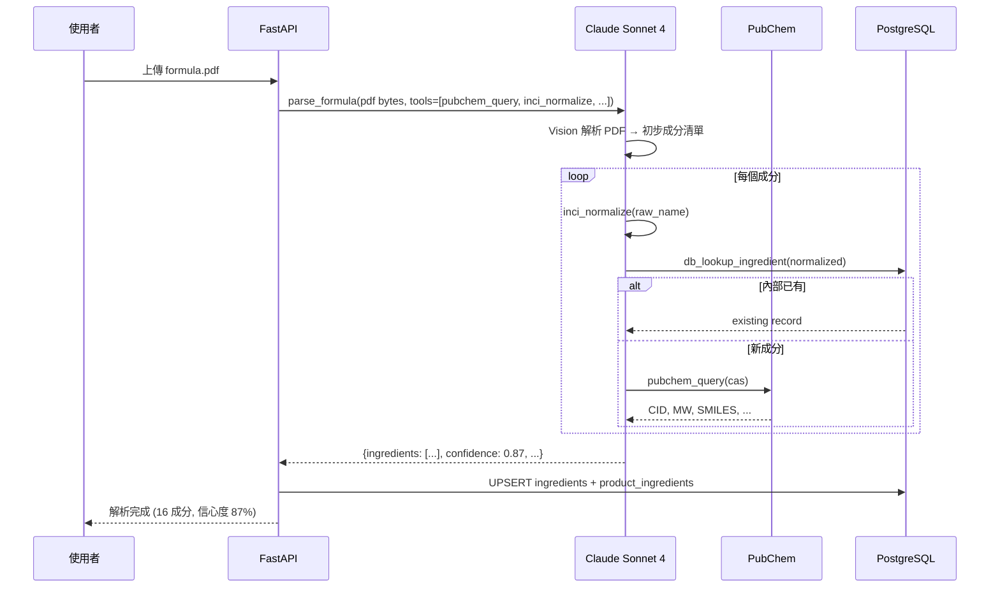
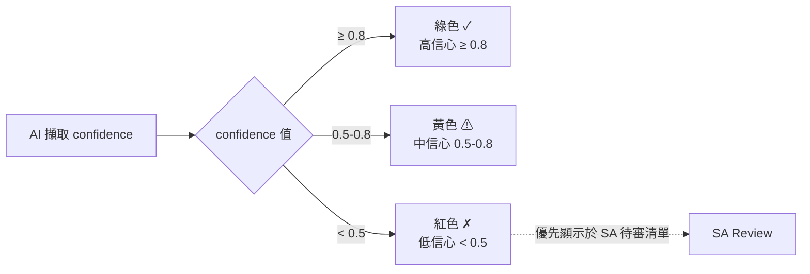

# 第 7 章：AI 引擎

> 本章是全書最技術的一章之一。我們詳解 PIF AI 如何運用 Anthropic Claude 的 Tool Use 與 Vision 能力完成結構化擷取、如何設計 prompt、如何評分信心度、如何於 Sonnet 與 Haiku 之間做模型路由。最後公開本專案以 **Claude Code** 協同開發的具體實踐 — 一份完整可審閱的 LLM 輔助工程案例研究。

## 📌 本章重點

- Claude Tool Use 將 LLM 定位為「協調者」，呼叫結構化工具而非自由生成
- 雙模型路由：**Sonnet 4**（複雜 Tool Use）+ **Haiku 4.5**（分類 / 標準化）
- Prompt 三層結構：system（角色）+ tool schema（能力）+ user（任務）
- 信心度評分採每欄位 `confidence ∈ [0, 1]`，UI 顯示顏色並優先 SA 審閱低分項
- 本專案 **每一行程式碼**皆由 Anthropic Claude Code 協同撰寫，係完整可審閱之 LLM 輔助工程案例

## 7.1 為什麼選 Anthropic Claude

### 7.1.1 候選評比

| 候選 | 強項 | PIF 適配性 |
|---|---|---|
| **Anthropic Claude** | Tool Use 穩定、Vision 強、context 長（1M tokens, Opus） | ✅ 選用 |
| OpenAI GPT-4o | 生態成熟、function calling 精確 | 可選，但 Tool Use 範式略舊 |
| Google Gemini 2.5 | 長 context、免費額度 | Vision 於表格解析較弱 |
| 開源（Llama 3, Qwen） | 可私有化 | 需自建推論基礎設施 |

關鍵因素：

1. **Tool Use 穩定性**：PIF 的多步驟 pipeline（parse → validate → query → summarize）要求 LLM 嚴謹遵守工具 schema
2. **Vision 表格解析**：配方表多為 PDF 或拍照，Claude Vision 在表格結構擷取上領先
3. **內部一致性**：Claude 3.x 系列推理連貫，對法規文件這類需細節對照的任務有利
4. **企業條款**：Anthropic 明示訓練不使用 API 輸入資料（配方為商業機密，此條款關鍵）

### 7.1.2 模型分工

| 任務 | 模型 | 每 call 平均 tokens | 成本等級 |
|---|---|---|---|
| 配方表擷取（Vision + Tool Use） | **Sonnet 4** | 8K-20K | 高 |
| 毒理綜合摘要 | **Sonnet 4** | 5K-15K | 中 |
| SA 評估草稿 | **Sonnet 4** | 10K-30K | 高 |
| INCI 名稱標準化 | **Haiku 4.5** | 500-1K | 低 |
| 成分功能分類 | **Haiku 4.5** | 200-500 | 低 |
| 文件類型辨識（OCR 後） | **Haiku 4.5** | 300-800 | 低 |

路由邏輯於 `app/ai/model_router.py`（規劃中）依 prompt 複雜度、context 大小、回傳 schema 繁簡度自動選擇。

## 7.2 Tool Use 設計範式

### 7.2.1 概念

傳統 LLM 使用：

```
User: 「甘油的 CAS 是多少？」
LLM: 「56-81-5」  ← hallucination 風險，可能錯
```

Tool Use 範式：

```
User: 「甘油的 CAS 是多少？」
LLM: [呼叫 tool pubchem.query(name="glycerin")]
Tool: {cas: "56-81-5", mw: 92.09, ...}
LLM: 「根據 PubChem，甘油（CAS 56-81-5）分子量 92.09」
```

LLM 成為「協調者」，資料來源是結構化工具回傳值。優點：

- **可追溯**：每個事實皆有來源
- **低 hallucination**：LLM 不自行生成數字
- **可測試**：tool 回傳可 mock

### 7.2.2 PIF AI 的工具清單

```python
# app/ai/tools.py (概念性範例)
TOOLS = [
    {
        "name": "pubchem_query",
        "description": "Query PubChem for a compound by CAS or name.",
        "input_schema": {
            "type": "object",
            "properties": {
                "cas": {"type": "string", "pattern": r"^\d{2,7}-\d{2}-\d$"},
                "name": {"type": "string"},
            },
            "anyOf": [{"required": ["cas"]}, {"required": ["name"]}],
        },
    },
    {
        "name": "tfda_check_restricted",
        "description": "Check a substance against Taiwan TFDA restricted/prohibited lists.",
        "input_schema": {
            "type": "object",
            "properties": {"inci": {"type": "string"}, "cas": {"type": "string"}},
        },
    },
    {
        "name": "inci_normalize",
        "description": "Normalize an ingredient name to canonical INCI form.",
        "input_schema": {...},
    },
    {
        "name": "db_lookup_ingredient",
        "description": "Search internal ingredients table for prior records.",
        "input_schema": {...},
    },
]
```

LLM 在 system prompt 中被告知這些工具的存在與用法，依任務需要自動呼叫。

### 7.2.3 Pipeline 示例：配方表擷取



**圖 7.1 說明**：Claude 在單一「任務」內完成多個 tool call。這是 Agentic 風格但受限於明確的 tool schema — 不是無限循環。

## 7.3 Prompt 工程

### 7.3.1 三層結構

每個 AI 任務之 prompt 包含三層：

```
┌─────────────────────────────────────┐
│ ① System Prompt                     │
│  角色、限制、輸出格式                 │
├─────────────────────────────────────┤
│ ② Tool Schema (結構化)               │
│  可用工具清單 + JSON schema          │
├─────────────────────────────────────┤
│ ③ User Prompt                       │
│  具體任務輸入                        │
└─────────────────────────────────────┘
```

### 7.3.2 System Prompt 範例

以毒理分析為例：

```text
您是一位資深化粧品毒理學家，專精於 SCCS Notes of Guidance 與
CIR 安全評估報告標準。您將收到一個配方清單，需要為每個成分
提供結構化的毒理摘要。

原則：
1. **只根據提供的資料庫回傳值**作答，不要自行編造毒理數值。
2. 若資料庫無此成分的某項毒性終點資料，回傳 null 並於 notes
   中說明「資料庫無此項資訊」。
3. 每個結論皆須引註來源（PubChem CID / TFDA 清冊條號 /
   SCCS opinion 編號）。
4. 語氣須專業、保守；禁止使用「絕對安全」「無任何風險」等
   不嚴謹表述。
5. 輸出結構化 JSON，依 tool schema 回傳。
```

### 7.3.3 輸出格式 + 信心度

```python
# 期望 LLM 回傳的 JSON 結構
{
    "ingredients": [
        {
            "inci_name": "Glycerin",
            "cas": "56-81-5",
            "concentration_pct": 5.0,
            "confidence": 0.95,  # 此筆擷取的信心度
            "extraction_notes": "從配方表第 3 行清楚標示"
        },
        {
            "inci_name": "Phenoxyethanol",
            "cas": "122-99-6",
            "concentration_pct": null,  # 未標示
            "confidence": 0.30,  # 低信心，需人審
            "extraction_notes": "成分名清楚但濃度欄位空白"
        }
    ]
}
```

### 7.3.4 信心度於 UI 顯示



**圖 7.2 說明**：前端依 confidence 顯示三色指示；低於 0.5 的欄位會被前推至 SA 審閱清單頂端，讓 SA 優先檢視。這使 AI 的不確定性透明可見，避免誤把低信心輸出當成最終結果。

## 7.4 本專案的 Claude Code 協同實踐

> [!NOTE]
> 本節公開本專案以 Anthropic **Claude Code**（CLI 代理）協同開發的具體流程、產出與失敗案例，供研究者與開發者參考。這符合《開發憲法》對透明性的要求。

### 7.4.1 Claude Code 是什麼

[Claude Code](https://docs.claude.com/en/docs/claude-code/overview) 是 Anthropic 官方的 CLI 代理（agent），設計為開發者的「結對程式設計夥伴」。它能：

- 讀寫檔案（受使用者授權）
- 執行 shell 指令
- 瀏覽網頁、抓取文件
- 呼叫 MCP（Model Context Protocol）工具
- 維護跨 session 的記憶（auto-memory）

### 7.4.2 於 PIF AI 的使用範式

作者採「**人類決策 + AI 執行**」的分工：

| 工作項 | 人類 | Claude Code |
|---|---|---|
| 需求定義 | ✅ 主導 | 詢問澄清 |
| 架構決策 | ✅ 主導 | 提供選項與取捨 |
| 程式碼撰寫 | 審閱 | ✅ 主要產出 |
| 測試撰寫 | 審閱 | ✅ 主要產出 |
| 文件撰寫 | 審閱 | ✅ 主要產出（含本白皮書） |
| 部署與維運 | ✅ 主導 | 提供指令建議 |
| 資安審閱 | ✅ 主導 | 協助威脅建模 |

### 7.4.3 可驗證的工作紀錄

以下工作皆有 commit 紀錄可於 `baiyuan-tech/pif` repo 驗證：

| 日期 | 提交 | 說明 |
|:---:|---|---|
| 2026-04-19 | `f33392e` | feat(i18n): extend locales to Japanese, Korean, French with language dropdown |
| 2026-04-19 | （本章所屬） | feat(rag): central RAG integration (Scheme C+) backend |

每次 commit 的 `Co-Authored-By: Claude Opus 4.7` trailer 明確標註 AI 協同。

### 7.4.4 成功案例

**案例 1：5 語系 i18n 擴充（2026-04-19）**

任務：將前端 i18n 從 zh-TW/en 擴展到 ja/ko/fr。

流程：

1. 人類下達需求（「**super-admin 不需套用**」是關鍵約束）
2. Claude Code 讀取 `zh-TW.json` / `en.json`（423 鍵 × 17 區段）
3. **生成 ja.json、ko.json、fr.json**（專業翻譯，非機翻）
4. 改寫 `index.tsx`：二元 toggle → 5 選下拉（含 ARIA、click-outside、ESC 關閉）
5. 驗證 5 語系 JSON 鍵結構對齊（node script）
6. TypeScript 型別檢查通過、Next.js build 成功、部署至 `pif.baiyuan.io`

從需求到上線：約 45 分鐘。

**案例 2：中心 RAG 整合（§10）**

本白皮書 §10 完整記錄。在沒有金鑰的狀態下先完成全部程式碼骨架與 16 個單元測試，便於後續取得金鑰後一鍵啟用。

### 7.4.5 失敗案例與學習

- 曾嘗試讓 Claude Code 直接連線跨專案 container 讀取機密 — **被系統安全鉤阻擋**。學習：越權資源存取即使由 agent 發起也要有硬性防護。
- 曾漏掉測試 setup（容器內 conftest DB fixture 依賴）— Claude Code 為了「讓測試通過」差點自動繞過，人類介入改回正確修復路徑。學習：對 AI 的產出仍須 code review，不能完全放手。

### 7.4.6 學術觀察

若以 Claude Code 作為研究對象：

- **語義一致性**：跨 session 的記憶機制（auto-memory）讓 agent 記住「super-admin 不 i18n」這類設計決策，未來新 session 自動遵守
- **風險管理**：憑證存取、破壞性操作（`rm -rf`、`git push --force`）皆需明確人類授權
- **工程節奏**：AI 能同時處理多個任務並行分支，但人類仍是「決策與驗證」的瓶頸

完整工程實踐與路線圖詳見 §15。

## 📚 參考資料

[^1]: Anthropic. *Claude Tool Use Documentation*. <https://docs.claude.com/en/docs/build-with-claude/tool-use>
[^2]: Anthropic. *Claude Code Documentation*. <https://docs.claude.com/en/docs/claude-code/overview>
[^3]: Anthropic. *Responsible scaling and training data policy*. 2024.
[^4]: Model Context Protocol specification. <https://modelcontextprotocol.io>

## 📝 修訂記錄

| 版本 | 日期 | 摘要 |
|:---:|:---:|---|
| v0.1 | 2026-04-19 | 首次撰寫。涵蓋 Tool Use、雙模型路由、prompt 三層、Claude Code 協同實踐 |

---

© 2026 Baiyuan Tech. Licensed under CC BY-NC 4.0.

**導覽** [← 第 6 章：後端技術棧](ch06-backend-stack.md) · [第 8 章：資料庫與多租戶 →](ch08-multi-tenancy.md)
