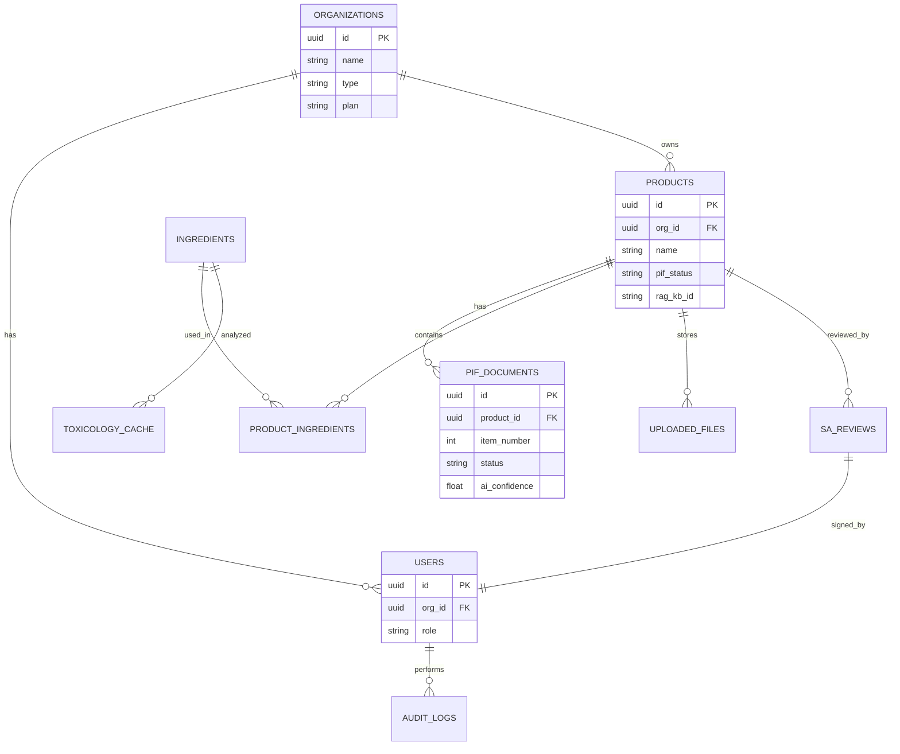
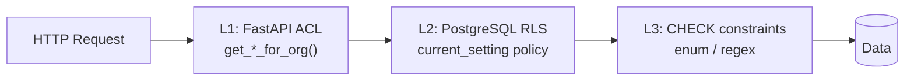
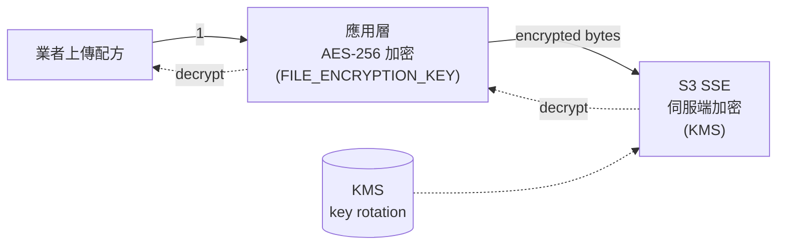

# 第 8 章：資料庫與多租戶隔離

> 本章詳述 PIF AI 的資料層：PostgreSQL 16 主 Schema、pgvector 向量擴充、Row-Level Security（RLS）多租戶隔離的 `current_setting` 注入模式、稽核日誌設計，以及檔案加密策略。本章與 §10（RAG 隔離）、§11（安全模型）形成三層防護的 DB 側。

## 📌 本章重點

- 單一 PostgreSQL 架構（非 schema-per-tenant）：簡化運維、便於跨租戶報表
- **Row-Level Security** 為 DB 層隔離底線：即使應用層 bug 也無法返回他組資料
- `current_setting('app.current_org_id')` 模式：每 request 透過 session var 注入
- `audit_logs` 表記錄所有敏感操作，不可刪除、不可修改
- 配方檔案採 **應用層 AES-256** + **儲存層 SSE** 雙層加密

## 8.1 為什麼選 PostgreSQL 16

### 8.1.1 需求對照

PIF AI 的 DB 需求：

| 需求 | PostgreSQL 16 支援 |
|------|--------------------|
| ACID transaction | ✅ 成熟 |
| JSON/JSONB（毒理數據、AI 擷取） | ✅ 原生 |
| 全文檢索（INCI 搜尋） | ✅ `tsvector` + GIN index |
| 向量搜尋（RAG fallback embedding） | ✅ **pgvector 擴充** |
| Row-Level Security | ✅ 原生 |
| 並發能力（高併發建檔） | ✅ MVCC |
| 無鎖定（自由授權） | ✅ PostgreSQL License |

### 8.1.2 單 DB vs 多 DB

**Schema-per-tenant** 模式（每租戶一個 schema 或 DB）被考慮但否決：

| 面向 | 單 DB + RLS | Schema-per-tenant |
|------|-------------|-------------------|
| 隔離強度 | 中（靠 RLS） | 高（物理隔離） |
| 建租戶速度 | 快（INSERT row） | 慢（需 CREATE SCHEMA） |
| 跨租戶報表 | 容易 | 需跨 DB join |
| 運維複雜度 | 低 | 高（N 個 schema 需同步 migration） |
| 規模上限 | ~ 10K 租戶 | ~ 100 租戶 |

PIF AI 目標 200–1000 家組織，單 DB + RLS 是合理選擇。

## 8.2 核心 Schema



**圖 8.1 說明**：ER 圖展示主要實體關係。`organizations` 為頂層租戶節點；所有業務資料（products、users、audit_logs）皆以 `org_id` 歸屬。`ingredients` 與 `toxicology_cache` 為**全局共享**（非租戶特有），避免重複儲存相同物質的查詢結果。

### 8.2.1 products 表（範例）

```sql
CREATE TABLE products (
    id UUID PRIMARY KEY DEFAULT gen_random_uuid(),
    org_id UUID REFERENCES organizations(id) NOT NULL,
    name VARCHAR(500) NOT NULL,
    name_en VARCHAR(500),
    category VARCHAR(100) NOT NULL,
    dosage_form VARCHAR(100),
    intended_use TEXT,
    manufacturer_name VARCHAR(500),
    manufacturer_address TEXT,
    registration_id VARCHAR(100),
    pif_status VARCHAR(50) DEFAULT 'draft' CHECK (
        pif_status IN ('draft', 'in_progress', 'ai_review', 'sa_review',
                       'completed', 'expired')
    ),
    pif_completed_at TIMESTAMPTZ,
    rag_kb_id VARCHAR(100),
    created_at TIMESTAMPTZ DEFAULT NOW(),
    updated_at TIMESTAMPTZ DEFAULT NOW()
);
CREATE INDEX idx_products_rag_kb_id ON products(rag_kb_id);
CREATE INDEX idx_products_org_id_created ON products(org_id, created_at DESC);
```

注意：

1. **所有業務表的第一個 FK 皆為 `org_id`**：配合 RLS policy，為硬性隔離欄
2. **CHECK constraint** 限制 enum 值：即使 application bug 寫入非法值也會被 DB 拒絕
3. **`rag_kb_id`** 為中心 RAG KB 的外部 ID，詳見 §10

## 8.3 Row-Level Security 實作

### 8.3.1 啟用 RLS

```sql
-- 開啟 RLS
ALTER TABLE products ENABLE ROW LEVEL SECURITY;

-- 建立 policy：只允許讀寫自己組織的產品
CREATE POLICY products_org_isolation ON products
    USING (org_id = current_setting('app.current_org_id')::UUID);
```

此後所有 `SELECT / UPDATE / DELETE` 皆被強制加上隱含的 `WHERE org_id = current_setting(...)::UUID`。即使 application 呼叫 `SELECT * FROM products`（無 WHERE），PostgreSQL 也會僅返回當前 `org_id` 的資料。

### 8.3.2 current_setting 注入模式

每個 request 進入 backend 後，於交易起始注入 session-scoped 變數：

```python
# app/core/database.py (概念性範例)
async def get_db_with_org(current_user: User):
    async with async_session_maker() as session:
        await session.execute(
            text("SET LOCAL app.current_org_id = :org_id"),
            {"org_id": str(current_user.org_id)},
        )
        yield session
```

`SET LOCAL` 僅於當前交易有效，交易結束自動清除。即使同一 connection 於連線池中被不同 request 使用，變數也不會洩漏。

### 8.3.3 Super admin 繞過

某些維運操作（全域報表、跨組織稽查）需要繞過 RLS：

```sql
-- 為 super admin 使用獨立 DB user
CREATE ROLE pifai_superadmin;
GRANT pifai TO pifai_superadmin;  -- 繼承基礎權限
ALTER ROLE pifai_superadmin BYPASSRLS;
```

當應用層偵測為 `super_admin` 時，使用 `pifai_superadmin` 連線；一般使用者仍走 `pifai`，受 RLS 限制。

### 8.3.4 三層防線



**圖 8.2 說明**：三層防線相互獨立。L1 為 explicit `WHERE`；L2 為 RLS（DB 層強制）；L3 為 CHECK 約束（最終資料整性）。任何一層失效，其他兩層仍守住。§10 再疊加 RAG KB 隔離，構成**四層防禦**。

## 8.4 稽核日誌（audit_logs）

### 8.4.1 表結構

```sql
CREATE TABLE audit_logs (
    id UUID PRIMARY KEY DEFAULT gen_random_uuid(),
    org_id UUID,
    user_id UUID,
    action VARCHAR(100) NOT NULL,  -- 'pif.created', 'sa.signed', ...
    resource_type VARCHAR(50),
    resource_id UUID,
    details JSONB,
    ip_address INET,
    user_agent TEXT,
    created_at TIMESTAMPTZ DEFAULT NOW()
);
CREATE INDEX idx_audit_logs_org ON audit_logs(org_id, created_at DESC);
CREATE INDEX idx_audit_logs_user ON audit_logs(user_id, created_at DESC);
CREATE INDEX idx_audit_logs_action ON audit_logs(action, created_at DESC);
```

### 8.4.2 記錄事件

**寫入稽核**的操作：

| Action | 時機 |
|---|---|
| `user.login` | 登入成功 |
| `user.login_failed` | 登入失敗（記 IP） |
| `product.created` / `product.deleted` | 產品 CRUD |
| `pif.document_uploaded` | 檔案上傳 |
| `pif.ai_analyzed` | AI 分析觸發 |
| `sa.review_started` | SA 開始審閱 |
| `sa.signed` | SA 簽署通過 |
| `sa.revision_requested` | SA 要求修訂 |
| `org.plan_changed` | 方案升降 |
| `admin.bypass_rls` | Super admin 繞過 RLS |

### 8.4.3 不可篡改

- DB user `pifai`（應用連線）**僅有 INSERT 權**，無 UPDATE / DELETE 權
- `audit_logs` 不設定 RLS，但只有 super admin 可查跨 org
- 定期（每日）將 audit_logs 歸檔到 S3 WORM（Write Once Read Many）儲存桶

## 8.5 檔案加密

### 8.5.1 敏感資料分級

| 類別 | 範例 | 加密強度 |
|------|------|---------|
| **Formula（最敏感）** | 配方表、INCI 濃度 | AES-256 應用層 + SSE |
| Test Report | GMP、安定性試驗 | SSE |
| Packaging | 外包裝設計 | SSE |
| Public | 產品名稱、登錄編號 | TLS in-transit, no rest |

### 8.5.2 配方檔案雙層加密



**圖 8.3 說明**：上傳時先經 `app/services/encryption.py` 以 `FILE_ENCRYPTION_KEY` 進行 AES-256-GCM 加密，再上傳到 S3；S3 本身再套一層 SSE-KMS（伺服端加密）。要取得明文需同時破解兩層 + 兩把不同鑰匙。即使 S3 的 KMS key 洩漏，attacker 仍需 `FILE_ENCRYPTION_KEY`（由 HashiCorp Vault / AWS Secrets Manager 管理）。

## 8.6 pgvector 向量搜尋

PIF AI 採中心 RAG（§10）為主要知識檢索，但本機 pgvector 作為 fallback：

```sql
CREATE EXTENSION vector;

ALTER TABLE pif_documents ADD COLUMN content_embedding vector(1536);
CREATE INDEX ON pif_documents USING ivfflat (content_embedding vector_cosine_ops);
```

使用時機：

- 中心 RAG 故障時降級為本機搜尋
- SA 審閱時查找「類似歷史案件」
- 毒理分析時比對內部已有的風險摘要

Embedding 模型：`text-embedding-3-small`（OpenAI，僅用於非機密文字）或 `Cohere embed-multilingual-v3`。

## 📚 參考資料

[^1]: PostgreSQL Global Development Group. *PostgreSQL 16 Documentation — Row Security Policies*. 2024.
[^2]: pgvector. <https://github.com/pgvector/pgvector>
[^3]: OWASP. *Multi-tenant Data Isolation Cheat Sheet*.
[^4]: AWS. *Server-Side Encryption with KMS Keys*.

## 📝 修訂記錄

| 版本 | 日期 | 摘要 |
|:---:|:---:|---|
| v0.1 | 2026-04-19 | 首次撰寫。涵蓋單 DB + RLS、current_setting 注入、稽核、配方雙層加密 |

---

© 2026 Baiyuan Tech. Licensed under CC BY-NC 4.0.

**導覽** [← 第 7 章：AI 引擎](ch07-ai-engine.md) · [第 9 章：毒理資料 Pipeline →](ch09-toxicology-pipeline.md)
