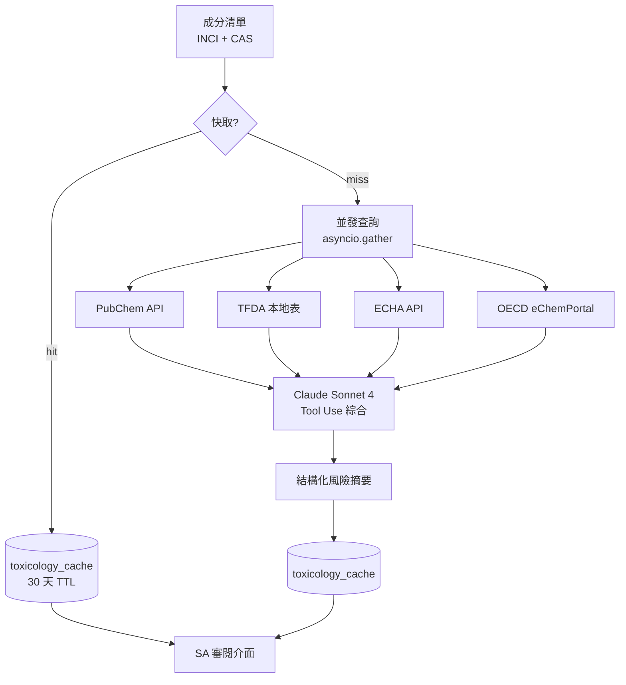

# 第 9 章：毒理資料 Pipeline

> PIF 第 9、10 項要求對每個成分的物質特性與毒理終點提供資料。本章說明 PIF AI 如何從四大資料庫（PubChem、TFDA、ECHA、OECD）並發查詢、快取、AI 綜合，並最終產出可供 SA 審閱的風險摘要表。

## 📌 本章重點

- 四資料庫分工：PubChem（物理化學 + 部分毒性）、TFDA（法規合規）、ECHA（EU C&L 分類）、OECD（eChemPortal 交叉）
- 快取策略：30 天 TTL + stale-while-revalidate，降低 rate limit 風險
- AI 綜合：Claude Sonnet 4 匯整多源 → 結構化風險摘要，每結論引註來源
- 失敗降級：單一資料庫故障不阻斷整體，以「[來源暫不可用]」標記

## 9.1 資料源分工

### 9.1.1 四大資料庫比較

| 資料庫 | 機構 | 內容 | 許可 | PIF 對應項 |
|---|---|---|---|---|
| **PubChem** | 美國 NIH | 化合物物理化學屬性、GHS 分類、部分毒性 LD50 | 公開免費 | 第 9、10 項 |
| **TFDA 清冊** | 台灣衛福部 | 禁用／限用／防腐劑／著色劑／紫外線濾劑清單 | 公開，本地映射 | 第 3、10 項 |
| **ECHA C&L Inventory** | 歐盟化學品管理局 | 分類與標示、SCCS Opinion | 註冊帳號、有 rate limit | 第 10 項 |
| **OECD eChemPortal** | OECD | 跨國化學品試驗資料庫 | 公開但需遵守各國條款 | 第 10 項 |

### 9.1.2 TFDA 本地映射

TFDA 不提供正式 API。PIF AI 採：

1. **定期爬取**公告頁（附表一至附表五）
2. 結構化存入本地 `tfda_regulated_ingredients` 表
3. 每次爬取產生 diff，若有變動發送通知給法規團隊
4. 查詢時僅打本地表，避免 TFDA 網站 down 時阻斷

```python
# app/models/tfda_regulated_ingredient.py (概念)
class TfdaRegulatedIngredient(Base):
    __tablename__ = "tfda_regulated_ingredients"
    id: Mapped[uuid.UUID] = mapped_column(primary_key=True)
    inci_name: Mapped[str]
    inci_name_normalized: Mapped[str] = mapped_column(index=True)
    cas_number: Mapped[str | None]
    list_type: Mapped[str]  # 'prohibited', 'restricted', 'preservative',
                            # 'colorant', 'uv_filter'
    max_concentration_pct: Mapped[float | None]
    conditions: Mapped[str | None]  # 使用條件限制
    source_url: Mapped[str]  # TFDA 公告原始 URL
    last_synced_at: Mapped[datetime]
```

## 9.2 Pipeline 全貌



**圖 9.1 說明**：Pipeline 以並發查詢為核心 — 四資料庫同時打，總延遲 ≈ max(四者) 而非 sum。AI 綜合階段採 Tool Use，每個結論引註來源。快取層採 30 天 TTL，減少重複打 API。

## 9.3 並發查詢實作

### 9.3.1 asyncio.gather 範式

```python
# app/ai/toxicology_engine.py (概念範例)
async def analyze_ingredient(inci: str, cas: str) -> ToxReport:
    # 先查快取
    cached = await get_cached_toxicology(inci, cas)
    if cached and not cached.is_stale():
        return cached

    # 並發查四源
    pubchem, tfda, echa, oecd = await asyncio.gather(
        query_pubchem(cas),
        query_tfda_local(inci, cas),
        query_echa(cas),
        query_oecd(cas),
        return_exceptions=True,
    )

    # 容錯處理
    sources = {}
    for name, result in [("pubchem", pubchem), ("tfda", tfda),
                        ("echa", echa), ("oecd", oecd)]:
        if isinstance(result, Exception):
            logger.warning("Source %s failed: %s", name, result)
            sources[name] = None
        else:
            sources[name] = result

    # AI 綜合（即使部分來源失敗也要產出）
    summary = await claude_synthesize_risk(sources, inci, cas)

    # 寫入快取
    await cache_toxicology(inci, cas, sources, summary)
    return summary
```

### 9.3.2 逾時策略

| 資料源 | 正常延遲 | 逾時 | 重試 |
|---|---|---|---|
| PubChem | 0.5–2s | 5s | 1 次（指數退避）|
| TFDA 本地 | <100ms | 500ms | 不重試 |
| ECHA | 1–3s | 10s | 1 次 |
| OECD | 2–5s | 10s | 1 次 |

全部來源皆過時 → 返回「**資料暫時不可用，請稍後重試**」但不寫錯誤入 DB（讓下次查詢仍可嘗試）。

## 9.4 Rate Limit 與快取策略

### 9.4.1 rate limit 壓力

PubChem 公開 API rate limit：5 req/sec per IP[^1]。對並發高的 PIF AI：

- 若 100 件產品同時分析，每件 30 個成分 → 3000 個請求
- 無快取：600 秒完成（觸發 rate limit）
- 有快取（假設 80% hit rate）：120 秒完成

### 9.4.2 快取設計

```sql
CREATE TABLE toxicology_cache (
    id UUID PRIMARY KEY,
    ingredient_id UUID REFERENCES ingredients(id),
    source VARCHAR(50) NOT NULL,
    data_json JSONB NOT NULL,
    risk_level VARCHAR(20),
    ai_summary TEXT,
    fetched_at TIMESTAMPTZ DEFAULT NOW(),
    expires_at TIMESTAMPTZ,
    UNIQUE(ingredient_id, source)
);
```

- **TTL**：30 天（大多數物質毒理數據穩定；法規部分由 TFDA sync 另行處理）
- **Stale-while-revalidate**：過期但仍返回，同時非同步觸發重新查詢
- **跨租戶共享**：`toxicology_cache` 不設 `org_id`（毒理數據非租戶專屬機密）

## 9.5 AI 綜合：從多源資料到風險摘要

### 9.5.1 Prompt 設計

以 Claude Sonnet 4 整合四源資料。System prompt 強調：

1. 僅依資料庫回傳值作答
2. 若某源無此成分資料 → 明確標示「[來源未收錄]」
3. 每個結論引註來源 + 條號 / PubChem CID
4. 保守語氣：禁用「絕對安全」「無風險」
5. 輸出結構化 JSON

### 9.5.2 輸出格式

```json
{
  "ingredient": "Phenoxyethanol",
  "cas": "122-99-6",
  "inci": "Phenoxyethanol",
  "risk_level": "low",
  "risk_endpoints": {
    "acute_toxicity_oral_ld50": {
      "value_mg_kg": 1260,
      "species": "rat",
      "source": "PubChem CID 31236"
    },
    "skin_irritation": {
      "rating": "non-irritant",
      "source": "SCCS Opinion SCCS/1575/16",
      "note": "at ≤1% concentration"
    },
    "sensitization": {
      "rating": "non-sensitizing",
      "source": "PubChem + OECD"
    }
  },
  "regulatory": {
    "tfda_status": "preservative_positive_list",
    "tfda_max_concentration_pct": 1.0,
    "tfda_source": "附表四 防腐劑成分表 第 23 項",
    "echa_classification": "Eye Irrit. 2"
  },
  "summary_zh": "Phenoxyethanol 為 TFDA 防腐劑正面表列成分，最高允許 1.0%。急性毒性低（rat oral LD50 1260 mg/kg）；SCCS 認定 ≤1% 濃度下為非刺激性。",
  "citations": [
    "PubChem CID 31236",
    "TFDA 化粧品基準 附表四 第 23 項",
    "SCCS Opinion SCCS/1575/16"
  ],
  "confidence": 0.92
}
```

## 9.6 法規自動化檢查

### 9.6.1 規則引擎

PIF AI 實作「**法規規則引擎**」比對配方 vs 法規：

```python
# app/ai/regulatory_checker.py (概念)
async def check_formula_compliance(
    product_id: uuid.UUID, db: AsyncSession
) -> ComplianceReport:
    ingredients = await get_product_ingredients(product_id, db)
    violations = []

    for ing in ingredients:
        tfda_record = await lookup_tfda(ing.inci_name, ing.cas_number)
        if not tfda_record:
            continue  # 不在管制清單

        if tfda_record.list_type == "prohibited":
            violations.append(Violation(
                ingredient=ing.inci_name,
                rule="TFDA 禁用物質",
                severity="critical",
                source=tfda_record.source_url,
            ))

        if tfda_record.list_type == "restricted":
            if ing.concentration_pct > tfda_record.max_concentration_pct:
                violations.append(Violation(
                    ingredient=ing.inci_name,
                    rule=f"超過 TFDA 允許濃度 {tfda_record.max_concentration_pct}%",
                    severity="high",
                    actual=ing.concentration_pct,
                    allowed=tfda_record.max_concentration_pct,
                    source=tfda_record.source_url,
                ))

    return ComplianceReport(violations=violations, product_id=product_id)
```

### 9.6.2 規則覆蓋

| 附表 | 規則類型 | 檢查邏輯 |
|------|----------|----------|
| 附表一 禁用物質 | 硬性禁止 | 出現即違規 |
| 附表二 限用物質 | 濃度限制 + 使用條件 | 超濃度 或 條件不符 即違規 |
| 附表三 防腐劑 | 白名單 + 濃度 | 非白名單 或 超濃度 即違規 |
| 附表四 著色劑 | 白名單 + 用途限制 | 類似 |
| 附表五 UV 濾劑 | 白名單 + 濃度 + 劑型限制 | 類似 |

## 📚 參考資料

[^1]: NIH National Library of Medicine. *PubChem PUG REST API — Usage Policy*. <https://pubchem.ncbi.nlm.nih.gov/docs/pug-rest#section=Dynamic-Request-Throttling>
[^2]: European Chemicals Agency. *C&L Inventory*. <https://echa.europa.eu/information-on-chemicals/cl-inventory-database>
[^3]: OECD. *eChemPortal*. <https://www.echemportal.org>
[^4]: 衛福部食藥署.《化粧品基準》附表一至附表五。

## 📝 修訂記錄

| 版本 | 日期 | 摘要 |
|:---:|:---:|---|
| v0.1 | 2026-04-19 | 首次撰寫。涵蓋四資料源、並發查詢、快取、AI 綜合、法規規則引擎 |

---

© 2026 Baiyuan Tech. Licensed under CC BY-NC 4.0.

**導覽** [← 第 8 章：多租戶隔離](ch08-multi-tenancy.md) · [第 10 章：中心 RAG 整合 →](ch10-central-rag.md)
