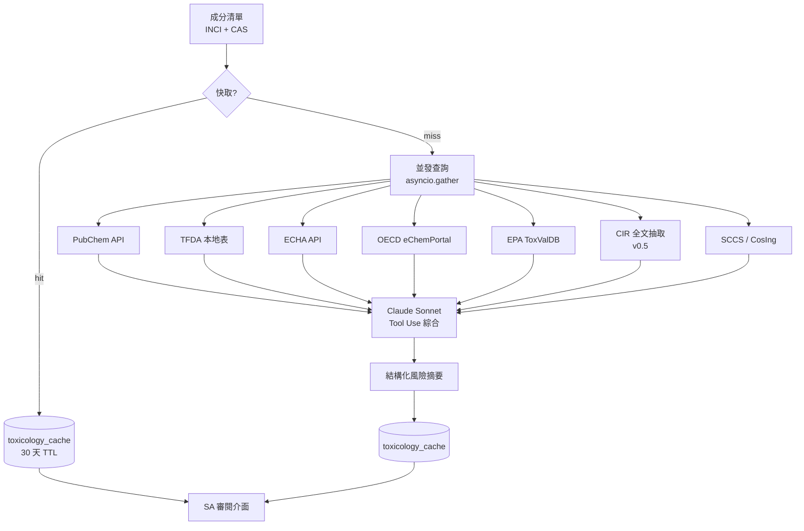

# 第 9 章：毒理資料 Pipeline

> PIF 第 9、10 項要求對每個成分的物質特性與毒理終點提供資料。本章說明 PIF AI 如何從七大毒理／法規資料源（PubChem、EPA CompTox、ECHA、CIR、SCCS、CosIng、TFDA）與 OECD eChemPortal 索引並發查詢、快取、AI 綜合，並最終產出可供 SA 審閱的風險摘要表。v0.5 起新增 CIR 完整報告 PDF 的全文 NOAEL 抽取（§9.1.3），把過去「幾乎是空的」權威 NOAEL 擷取層填實。

## 📌 本章重點

- 七大資料源分工：PubChem（物理化學 + 部分毒性）、EPA CompTox ToxValDB（權威 POD）、ECHA C&L + ECHA CHEM（EU 分類）、CIR（QRT 結論 + 完整報告全文）、SCCS（意見書）、CosIng（EU Annex）、TFDA（台灣清冊），OECD eChemPortal 作跨國索引
- CIR 完整報告全文抽取（v0.5）：入口站直抓 PDF → Claude 強制 tool-use 抽取 → 三道 sanitize；截至 2026-08-30 已抽 326 份報告、1,331 個快取成分列帶有 CIR NOAEL（一週前為 0）
- 快取策略：30 天 TTL + stale-while-revalidate，降低 rate limit 風險
- AI 綜合：Claude Sonnet 4 匯整多源 → 結構化風險摘要，每結論引註來源
- 失敗降級：單一資料庫故障不阻斷整體，以「[來源暫不可用]」標記

## 9.1 資料源分工

### 9.1.1 七大資料源比較（v0.5 更新）

v0.1 的四源（PubChem / TFDA / ECHA / OECD）在 v0.3–v0.5 擴充為七大資料源 + OECD 索引，與平台對外文件（官網、法規參考頁）一致。「內容」欄寫的是本系統**實際取用**的部分，而非該資料庫的全部。

| 資料源 | 機構 | 本系統取用內容 | 許可 | PIF 對應項 |
|---|---|---|---|---|
| **PubChem** | 美國 NIH | 物化屬性、GHS 分類、部分 LD50；CAS／同義詞解析 | 公開免費 | 第 9、10 項 |
| **EPA CompTox（ToxValDB）** | 美國環保署 | 權威 POD（NOAEL／LOAEL）與研究出處；可由化學名解 DTXSID；CIR 無數值時的第二權威源（§15.3） | 公開免費 | 第 10 項 |
| **ECHA C&L Inventory + ECHA CHEM（Annex VI）** | 歐盟化學總署 | 分類與標示；調和分類自動推導 CMR／基因毒封鎖（§15.4） | 公開，有 rate limit | 第 10 項 |
| **CIR（QRT 結論 + 完整報告全文）** | 美國 Cosmetic Ingredient Review Expert Panel | 5,919 筆成分結論（Quick Reference Table）；**完整報告 PDF 全文抽取 NOAEL 與原始研究引文（v0.5，§9.1.3）** | 公開 | 第 10 項 |
| **SCCS Opinions** | 歐盟消費者安全科學委員會 | 54 份意見書之結論、NOAEL 與 MoS 方法論 | 公開 | 第 10 項 |
| **CosIng（Annex II–VI）** | 歐盟執委會 | 禁用／限用／防腐劑／著色劑／UV 濾劑；香氛過敏原揭示（第 7 章） | 公開 | 第 3、10 項 |
| **TFDA 清冊** | 台灣衛福部 | 禁用／限用／防腐劑／著色劑／紫外線濾劑（本地映射，§9.1.2） | 公開 | 第 3、10 項 |
| *OECD eChemPortal（索引）* | OECD | 跨國試驗資料索引，導向原始 dossier；不作數值來源 | 公開但需遵守各國條款 | 第 10 項 |

失敗契約對所有 live 源一致：查詢失敗寫 1 小時短 TTL 快取、**不得覆蓋既有 LD50／NOAEL、不得發「已完成」進度標記**；掃描件與抽不出文字的來源誠實標記「不送 AI、不猜」。

### 9.1.2 TFDA 本地映射

TFDA 不提供正式 API。PIF AI 採：

1. **定期爬取**公告頁（附表一至附表五）
2. 結構化存入本地 `tfda_regulated_ingredients` 表
3. 每次爬取產生 diff，若有變動發送通知給法規團隊
4. 查詢時僅打本地表，避免 TFDA 網站 down 時阻斷

```python
# app/models/tfda_regulated_ingredient.py (概念)
class TfdaRegulatedIngredient(Base):
    __tablename__ = "tfda_regulated_ingredients"
    id: Mapped[uuid.UUID] = mapped_column(primary_key=True)
    inci_name: Mapped[str]
    inci_name_normalized: Mapped[str] = mapped_column(index=True)
    cas_number: Mapped[str | None]
    list_type: Mapped[str]  # 'prohibited', 'restricted', 'preservative',
                            # 'colorant', 'uv_filter'
    max_concentration_pct: Mapped[float | None]
    conditions: Mapped[str | None]  # 使用條件限制
    source_url: Mapped[str]  # TFDA 公告原始 URL
    last_synced_at: Mapped[datetime]
```

### 9.1.3 CIR 完整報告全文 NOAEL 抽取（v0.5 新增）

第 14 章 v0.3 的「觀察與限制」承認：權威 NOAEL 擷取層幾乎是空的，因為 PubChem 對 CIR 只回通用首頁 URL，抓不到個別報告 PDF；`cir_reports` 的 NOAEL 欄大量為空，成分只能落到 EPA backfill、read-across 甚至 data_gap。v0.5 改為**不經 PubChem，直接對 CIR 入口站（cir-reports.cir-safety.org）取報告**：

1. **索引與狀態頁**：讀取入口站成分索引（兩頁共 7,933 筆）與每個成分的狀態頁（`cirIngredientStatusReport`），取得報告附件清單。
2. **挑選附件**：偏好「完整安全評估報告」；「Re-review Not Opened」彙編沒有新毒理資料，不抓、不送 AI；同一份附件被多個成分共用時只抽一次（平均 4.0 個成分共用一份，最多 133 個）。
3. **抽文字**：pypdf 抽取（平均 26 頁）；抽不出文字的掃描件標 `skipped_scanned`，不猜。
4. **關鍵頁模式**：只送首尾各 5 頁 + 含 NOAEL／NOEL／LOAEL 的頁 + summary／conclusion／discussion 頁（平均 91.5k 字元），每份約 US$0.10。
5. **AI 抽取**：Claude 以強制 tool-use（`submit_cir_report_extraction`）輸出結構化欄位：最低全身性重複劑量 NOAEL、單位、給藥途徑、物種、研究類型、逐字證據句、涵蓋物質；只有在無 NOAEL 時才接受 NOEL。
6. **三道 sanitize**（防幻覺）：單位必須是 mg/kg bw/day 家族（含 g/kg、µg/kg 換算）；數值 ≤ 10,000；**數字必須逐字出現在 PDF 內文**；非全身性終點一律拒用。
7. **涵蓋守門**：報告涵蓋物質經名稱變體（拉丁／英文、括號別名）比對，成分不在涵蓋名單者標 `report_mismatch`，不把別的報告的 NOAEL 掛到它頭上。
8. **回灌**：結果寫入 `cir_report_attachments`（以附件 id 去重），經單一組裝函式刷進 `ingredient_tox_cache.cir_data`，供 NOAEL cascade 第 0 階與報告 §5-1「原始研究數據引用」逐字引用（引文、途徑、物種、研究、證據句）。

截至 2026-08-30 的實際效果（PROD，抽取仍以在用成分優先、每 6 小時 25 列持續進行）：

| 指標 | 數值 |
|---|---|
| 已抽取的 CIR 完整報告 | 326 份（平均 26 頁、91.5k 字元） |
| 其中抽到數值 NOAEL | 189 份（58%；其餘為定性結論） |
| 在用成分對得上 CIR 者 | 1,998 個，其中 1,414 個（71%）已連結完整報告 |
| 快取層帶有 CIR NOAEL 的成分列 | 1,331 列（v0.4 時為 0） |
| 誠實排除 | 掃描件 12 份；額度中斷待重試 57 份 |

**成本與供應商韌性**：抽取只對「已進入毒理快取的在用成分」執行，不對整個 6,106 筆索引無差別掃描；LLM 供應商層級的失敗（額度用罄、金鑰失效、429、5xx）不計入該份報告的失敗次數，整批中止並退避，避免把可重試的報告推成永久失敗。

### 9.1.4 舊路徑的退場

v0.5 之前經 PubChem 的 CIR 路徑仍保留給「PubChem 直接給出個別報告 PDF URL」的少數案例；凡 URL 指向入口站者一律交給 §9.1.3 的抽取器（入口站頁面是 JavaScript 殼，舊路徑抓到的不是報告）。這條規則以測試鎖死，避免兩條路徑互相覆寫。

## 9.2 Pipeline 全貌


```mermaid
flowchart TB
    IN["成分清單<br/>INCI + CAS"]
    Q{快取?}
    CACHE[(toxicology_cache<br/>30 天 TTL)]
    PAR[並發查詢<br/>asyncio.gather]
    PC[PubChem API]
    TF[TFDA 本地表]
    EC[ECHA API]
    OE[OECD eChemPortal]
    EP[EPA ToxValDB]
    CR[CIR 全文抽取<br/>v0.5]
    SC[SCCS / CosIng]
    AI[Claude Sonnet<br/>Tool Use 綜合]
    SUM[結構化風險摘要]
    DB[(toxicology_cache)]
    UI[SA 審閱介面]

    IN --> Q
    Q -- hit --> CACHE --> UI
    Q -- miss --> PAR
    PAR --> PC
    PAR --> TF
    PAR --> EC
    PAR --> OE
    PAR --> EP
    PAR --> CR
    PAR --> SC
    PC --> AI
    TF --> AI
    EC --> AI
    OE --> AI
    EP --> AI
    CR --> AI
    SC --> AI
    AI --> SUM --> DB --> UI
```

**圖 9.1 說明**：Pipeline 以並發查詢為核心 — 七大資料源同時打，總延遲 ≈ max(各源) 而非 sum；CIR 全文抽取（v0.5）為離線背景作業，查詢時只讀已回灌的快取。AI 綜合階段採 Tool Use，每個結論引註來源。快取層採 30 天 TTL，減少重複打 API。

## 9.3 並發查詢實作

### 9.3.1 asyncio.gather 範式

```python
# app/ai/toxicology_engine.py (概念範例)
async def analyze_ingredient(inci: str, cas: str) -> ToxReport:
    # 先查快取
    cached = await get_cached_toxicology(inci, cas)
    if cached and not cached.is_stale():
        return cached

    # 並發查四源
    pubchem, tfda, echa, oecd = await asyncio.gather(
        query_pubchem(cas),
        query_tfda_local(inci, cas),
        query_echa(cas),
        query_oecd(cas),
        return_exceptions=True,
    )

    # 容錯處理
    sources = {}
    for name, result in [("pubchem", pubchem), ("tfda", tfda),
                        ("echa", echa), ("oecd", oecd)]:
        if isinstance(result, Exception):
            logger.warning("Source %s failed: %s", name, result)
            sources[name] = None
        else:
            sources[name] = result

    # AI 綜合（即使部分來源失敗也要產出）
    summary = await claude_synthesize_risk(sources, inci, cas)

    # 寫入快取
    await cache_toxicology(inci, cas, sources, summary)
    return summary
```

### 9.3.2 逾時策略

| 資料源 | 正常延遲 | 逾時 | 重試 |
|---|---|---|---|
| PubChem | 0.5–2s | 5s | 1 次（指數退避）|
| TFDA 本地 | <100ms | 500ms | 不重試 |
| ECHA | 1–3s | 10s | 1 次 |
| OECD | 2–5s | 10s | 1 次 |

全部來源皆過時 → 返回「**資料暫時不可用，請稍後重試**」但不寫錯誤入 DB（讓下次查詢仍可嘗試）。

## 9.4 Rate Limit 與快取策略

### 9.4.1 rate limit 壓力

PubChem 公開 API rate limit：5 req/sec per IP[^1]。對並發高的 PIF AI：

- 若 100 件產品同時分析，每件 30 個成分 → 3000 個請求
- 無快取：600 秒完成（觸發 rate limit）
- 有快取（假設 80% hit rate）：120 秒完成

### 9.4.2 快取設計

```sql
CREATE TABLE toxicology_cache (
    id UUID PRIMARY KEY,
    ingredient_id UUID REFERENCES ingredients(id),
    source VARCHAR(50) NOT NULL,
    data_json JSONB NOT NULL,
    risk_level VARCHAR(20),
    ai_summary TEXT,
    fetched_at TIMESTAMPTZ DEFAULT NOW(),
    expires_at TIMESTAMPTZ,
    UNIQUE(ingredient_id, source)
);
```

- **TTL**：30 天（大多數物質毒理數據穩定；法規部分由 TFDA sync 另行處理）
- **Stale-while-revalidate**：過期但仍返回，同時非同步觸發重新查詢
- **跨租戶共享**：`toxicology_cache` 不設 `org_id`（毒理數據非租戶專屬機密）

## 9.5 AI 綜合：從多源資料到風險摘要

### 9.5.1 Prompt 設計

以 Claude Sonnet 4 整合四源資料。System prompt 強調：

1. 僅依資料庫回傳值作答
2. 若某源無此成分資料 → 明確標示「[來源未收錄]」
3. 每個結論引註來源 + 條號 / PubChem CID
4. 保守語氣：禁用「絕對安全」「無風險」
5. 輸出結構化 JSON

### 9.5.2 輸出格式

```json
{
  "ingredient": "Phenoxyethanol",
  "cas": "122-99-6",
  "inci": "Phenoxyethanol",
  "risk_level": "low",
  "risk_endpoints": {
    "acute_toxicity_oral_ld50": {
      "value_mg_kg": 1260,
      "species": "rat",
      "source": "PubChem CID 31236"
    },
    "skin_irritation": {
      "rating": "non-irritant",
      "source": "SCCS Opinion SCCS/1575/16",
      "note": "at ≤1% concentration"
    },
    "sensitization": {
      "rating": "non-sensitizing",
      "source": "PubChem + OECD"
    }
  },
  "regulatory": {
    "tfda_status": "preservative_positive_list",
    "tfda_max_concentration_pct": 1.0,
    "tfda_source": "附表四 防腐劑成分表 第 23 項",
    "echa_classification": "Eye Irrit. 2"
  },
  "summary_zh": "Phenoxyethanol 為 TFDA 防腐劑正面表列成分，最高允許 1.0%。急性毒性低（rat oral LD50 1260 mg/kg）；SCCS 認定 ≤1% 濃度下為非刺激性。",
  "citations": [
    "PubChem CID 31236",
    "TFDA 化粧品基準 附表四 第 23 項",
    "SCCS Opinion SCCS/1575/16"
  ],
  "confidence": 0.92
}
```

## 9.6 法規自動化檢查

### 9.6.1 規則引擎

PIF AI 實作「**法規規則引擎**」比對配方 vs 法規：

```python
# app/ai/regulatory_checker.py (概念)
async def check_formula_compliance(
    product_id: uuid.UUID, db: AsyncSession
) -> ComplianceReport:
    ingredients = await get_product_ingredients(product_id, db)
    violations = []

    for ing in ingredients:
        tfda_record = await lookup_tfda(ing.inci_name, ing.cas_number)
        if not tfda_record:
            continue  # 不在管制清單

        if tfda_record.list_type == "prohibited":
            violations.append(Violation(
                ingredient=ing.inci_name,
                rule="TFDA 禁用物質",
                severity="critical",
                source=tfda_record.source_url,
            ))

        if tfda_record.list_type == "restricted":
            if ing.concentration_pct > tfda_record.max_concentration_pct:
                violations.append(Violation(
                    ingredient=ing.inci_name,
                    rule=f"超過 TFDA 允許濃度 {tfda_record.max_concentration_pct}%",
                    severity="high",
                    actual=ing.concentration_pct,
                    allowed=tfda_record.max_concentration_pct,
                    source=tfda_record.source_url,
                ))

    return ComplianceReport(violations=violations, product_id=product_id)
```

### 9.6.2 規則覆蓋

| 附表 | 規則類型 | 檢查邏輯 |
|------|----------|----------|
| 附表一 禁用物質 | 硬性禁止 | 出現即違規 |
| 附表二 限用物質 | 濃度限制 + 使用條件 | 超濃度 或 條件不符 即違規 |
| 附表三 防腐劑 | 白名單 + 濃度 | 非白名單 或 超濃度 即違規 |
| 附表四 著色劑 | 白名單 + 用途限制 | 類似 |
| 附表五 UV 濾劑 | 白名單 + 濃度 + 劑型限制 | 類似 |

## 📚 參考資料

[^1]: NIH National Library of Medicine. *PubChem PUG REST API — Usage Policy*. <https://pubchem.ncbi.nlm.nih.gov/docs/pug-rest#section=Dynamic-Request-Throttling>
[^2]: European Chemicals Agency. *C&L Inventory*. <https://echa.europa.eu/information-on-chemicals/cl-inventory-database>
[^3]: OECD. *eChemPortal*. <https://www.echemportal.org>
[^4]: 衛福部食藥署.《化粧品基準》附表一至附表五。

## 📝 修訂記錄

| 版本 | 日期 | 摘要 |
|:---:|:---:|---|
| v0.1 | 2026-04-19 | 首次撰寫。涵蓋四資料源、並發查詢、快取、AI 綜合、法規規則引擎 |
| v0.5 | 2026-08-30 | §9.1.1 由四源更新為七大資料源 + OECD 索引（與官網一致）；新增 §9.1.3 CIR 完整報告全文 NOAEL 抽取（入口站直抓、關鍵頁模式、三道 sanitize、涵蓋守門、供應商韌性）與截至 2026-08-30 的實際效果；§9.1.4 舊路徑退場；圖 9.1 補齊資料源。 |

---

© 2026 Baiyuan Tech. Licensed under CC BY-NC 4.0.

**導覽** [← 第 8 章：多租戶隔離](ch08-multi-tenancy.md) · [第 10 章：中心 RAG 整合 →](ch10-central-rag.md)
