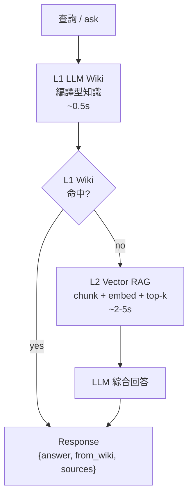
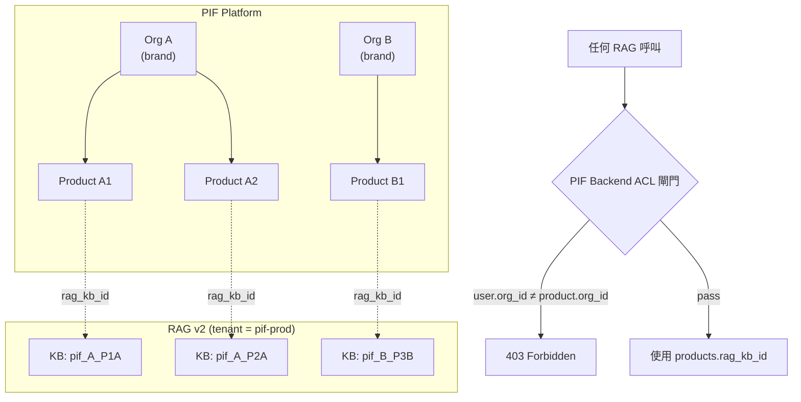

# 第 10 章：中心 RAG 整合架構（方案 C+）

> PIF AI 不重造知識檢索輪子，而是整合姊妹專案 **baiyuan 中心 RAG v2**（`rag.baiyuan.io`）—— 一套採 **L1 LLM Wiki + L2 向量 RAG** 雙層檢索的知識服務。本章是全書最核心章節之一：說明為何採方案 C+ 隔離模型、如何以 1 product = 1 KB 實現雙層隔離、兩 header 認證的意義，以及 fail-soft 設計的具體實作。

## 📌 本章重點

- 中心 RAG 採 **L1 LLM Wiki**（快取/編譯型知識）+ **L2 向量 RAG**（向量檢索）雙層架構
- PIF 隔離方案 **C+**：PIF 全平台共用單一 `tenant_id`，每產品 1 KB + backend ACL 閘門
- 認證需**兩個 header**：`X-RAG-API-Key` + `X-Tenant-ID`（與 A1 舊版不同）
- **Fail-soft**：RAG 故障不阻斷產品建立，`rag_kb_id` 留空後補
- 實作：`app/services/rag_client.py` + 16 個單元測試全數通過

## 10.1 中心 RAG 的雙層檢索架構

### 10.1.1 L1 LLM Wiki：快取／編譯型知識

**Wiki L1** 是中心 RAG 的第一層檢索。概念上類似編譯過的維基百科 — 針對知識庫內容，預先以 LLM 編譯為結構化條目，每次查詢直接比對條目標題與摘要，命中則快速回傳，省去向量計算成本。

特性：

- 查詢延遲 ≈ 0.5 秒（vs L2 ≈ 2–5 秒）
- Token 使用量低（不需整段檢索 + LLM 綜合）
- 適合高頻、定型問題（如常見法規解釋、官方定義）
- 由 `/knowledge-bases/{id}/wiki/compile` 定期編譯產出

### 10.1.2 L2 向量 RAG：semantic retrieval

若 L1 未命中（查詢過於新穎或深度），**降級到 L2** 的傳統向量 RAG：

- 將文件切片（chunk）→ embedding → 存於向量資料庫
- 查詢時計算 query embedding 與文件 chunk 的 cosine similarity
- 取 top-k chunks 交給 LLM 綜合回答

L2 的強項是**深度與新穎性**：能找到 Wiki 尚未編譯的細節；弱項是延遲與 token 成本。

### 10.1.3 L1 + L2 的命中指示

中心 RAG 於 `/ask` 回應中攜帶 `from_wiki` 欄位：

```json
{
  "status": "success",
  "data": {
    "answer": "...",
    "from_wiki": true,     ← L1 命中
    "sources": [...],
    "response_time": 0.48  ← 可明顯看出 L1 快
  }
}
```

`from_wiki: false` 表示降級到 L2。PIF AI 在 UI 以小圖示標示，讓使用者（或 SA）知道答案來自哪一層。

### 10.1.4 架構圖



**圖 10.1 說明**：L1 Wiki 為第一道檢索。未命中才降級到 L2 向量檢索。兩層共享同一知識庫（`knowledge_base_id`），L1 為 L2 的編譯快取型態。PIF 依此呼叫，不需自行維護雙層；RAG 服務自動判定。

## 10.2 為什麼 PIF 選中心 RAG 而非自建

### 10.2.1 不自建的理由

| 自建 RAG 需要 | 中心 RAG 已提供 |
|---|---|
| 向量資料庫（Weaviate / Qdrant / pgvector） | ✅ 託管 |
| Chunking 策略調校 | ✅ 已調優 |
| Embedding model 管理 + 版本 | ✅ 中央管理 |
| L1 Wiki 編譯 pipeline | ✅ 自動編譯 |
| RAG 品質評估 | ✅ 姊妹專案累積 |
| 法規文件導入與更新 | ✅ 法規團隊集中維護 |

PIF AI 團隊專注於**化粧品領域**；向量檢索與知識管理交給專門團隊。

### 10.2.2 共用中心 RAG 的綜效

- **跨專案知識共享**：baiyuan 旗下其他專案（客服、品牌網站）累積之法規、產業知識可被 PIF 讀取
- **維運集中**：模型升級、索引重建統一處理
- **成本攤銷**：向量資料庫伺服器成本由多專案共攤

## 10.3 多租戶隔離：方案 C+

PIF 面對的隔離需求：

> 「不同 **租戶**（organizations）互相隔離；同一租戶的不同 **產品**（products）也互相隔離。」

### 10.3.1 三種方案比較

| 方案 | 描述 | 優點 | 缺點 |
|---|---|---|---|
| **A** | PIF 整平台共用 1 tenant，1 KB 服務所有資料 | 最簡 | 零租戶 / 零產品隔離 |
| **B** | 每 PIF org 對應 1 RAG tenant；每產品 1 KB | 租戶 DB-level 隔離 | RAG v2 **無 tenant CRUD API**，不可行 |
| **C+**（選用） | PIF 整平台 1 tenant；每產品 1 KB + backend ACL 閘門 | 實作可行 + 應用層嚴謹隔離 | 依賴 PIF backend 嚴謹過濾 |

### 10.3.2 方案 C+ 架構



**圖 10.2 說明**：PIF 整個平台在 RAG 層僅是一個 tenant（`pif-prod`）。每個 PIF product 於 RAG 建立一個獨立 KB，命名規則 `pif_<org_id>_<product_id>` 並附 metadata `{pif_org_id, pif_product_id}`。隔離的關鍵不在 RAG 層，而在 **PIF backend 的 ACL 閘門**：每次呼叫 RAG 前必先 SQL 過濾 `WHERE org_id = user.org_id AND id = product_id` 取得 `products.rag_kb_id`，前端絕不被允許直接傳 `kb_id`。

### 10.3.3 四層防禦

結合 §8 的 DB 三層防線，PIF 的隔離為**四層**：

```
Request → L1 FastAPI ACL  →  L2 PostgreSQL RLS  →  L3 DB CHECK  →  L4 RAG KB per-product
         (explicit WHERE)    (current_setting)      (enum CHECK)    (pif_<org>_<prod>)
```

任一層失守，其餘三層仍守住。

## 10.4 認證：X-RAG-API-Key + X-Tenant-ID

### 10.4.1 為什麼是兩個 header

與 A1 舊版（單一 `X-API-Key`）不同，RAG v2 強制兩個 header：

```http
POST /api/v1/ask HTTP/1.1
Host: rag.baiyuan.io
Content-Type: application/json
X-RAG-API-Key: <secret>
X-Tenant-ID: <uuid>

{"question": "...", "knowledge_base_id": "kb_..."}
```

原因：

- `X-RAG-API-Key` 負責**身份認證**（是否為合法 client）
- `X-Tenant-ID` 負責**租戶路由**（屬於哪個邏輯租戶；影響配額、KB 可見性）

缺少 `X-Tenant-ID` 會返回 **HTTP 400**（不是 401），容易除錯錯方向。

### 10.4.2 PIF 憑證管理

```env
# /home/baiyuan/pif/.env (from-env-var 不入 git)
RAG_API_BASE=https://rag.baiyuan.io
RAG_API_KEY=<secret>
RAG_TENANT_ID=<uuid-for-pif>
RAG_TIMEOUT_SECONDS=20
RAG_KB_NAME_PREFIX=pif
```

於 FastAPI 啟動時由 `pydantic_settings` 載入，透過 `settings.RAG_API_KEY` 存取。**金鑰永不進 git**：`.gitignore` 排除 `.env`，生產環境由 Secret Manager 注入。

## 10.5 Client 實作

### 10.5.1 RagClient 架構

```python
# app/services/rag_client.py (節錄)
class RagClient:
    _shared_client: httpx.AsyncClient | None = None

    @classmethod
    def _get_client(cls) -> httpx.AsyncClient:
        if cls._shared_client is None:
            cls._shared_client = httpx.AsyncClient(
                base_url=settings.RAG_API_BASE.rstrip("/"),
                timeout=httpx.Timeout(...),
                limits=httpx.Limits(max_keepalive_connections=10, max_connections=20),
            )
        return cls._shared_client

    @staticmethod
    def _headers() -> dict[str, str]:
        if not _is_configured():
            raise RagNotConfiguredError(...)
        return {
            "Content-Type": "application/json",
            "X-RAG-API-Key": settings.RAG_API_KEY.strip(),
            "X-Tenant-ID": settings.RAG_TENANT_ID.strip(),
        }

    @classmethod
    async def create_knowledge_base(
        cls, *, org_id, product_id, product_name=None
    ) -> KnowledgeBase:
        payload = {
            "name": _kb_name(org_id, product_id),  # pif_<org>_<prod>
            "metadata": {
                "pif_org_id": str(org_id),
                "pif_product_id": str(product_id),
                "pif_product_name": product_name or "",
                "source": "pif-ai",
            },
        }
        body = await cls._request("POST", "/api/v1/knowledge-bases", json=payload)
        return KnowledgeBase(id=body["data"]["id"], ...)

    @classmethod
    async def ask(cls, *, question: str, kb_id: str, ...) -> AskResult:
        if not (kb_id or "").strip():
            raise RagServiceError("kb_id required — PIF ACL must resolve it")
        payload = {
            "question": question.strip(),
            "knowledge_base_id": kb_id,
            # temperature, max_tokens, system_prompt 可選
        }
        body = await cls._request("POST", "/api/v1/ask", json=payload)
        return AskResult(
            answer=body["data"]["answer"],
            sources=body["data"]["sources"],
            from_wiki=body["data"].get("from_wiki", False),  # L1 命中?
            raw=body["data"],
        )
```

### 10.5.2 Fail-soft 包裝

直接 `RagClient.create_knowledge_base(...)` 會 raise `RagServiceError`。產品建立流程不希望因 RAG 故障而失敗，因此提供 `safe_create_kb`：

```python
async def safe_create_kb(*, org_id, product_id, product_name=None) -> str | None:
    """Attempt to create KB; return kb_id or None on failure (fail-soft)."""
    if not _is_configured():
        logger.info("RAG not configured — skipping KB creation for %s", product_id)
        return None
    try:
        kb = await RagClient.create_knowledge_base(
            org_id=org_id, product_id=product_id, product_name=product_name
        )
        return kb.id
    except RagServiceError as e:
        logger.warning("RAG create_kb failed for %s: %s", product_id, e)
        return None  # 產品照建，rag_kb_id=NULL
```

### 10.5.3 於 products API 接入

```python
# app/api/v1/products.py (節錄)
@router.post("", response_model=ProductResponse, status_code=201)
async def create_product(...):
    # ... 建立 product 本地記錄 ...
    product = Product(org_id=current_user.org_id, **payload.model_dump())
    db.add(product)
    await db.commit()
    await db.refresh(product)
    await initialize_pif_documents(product.id, db)

    # RAG KB 建立（fail-soft）
    kb_id = await safe_create_kb(
        org_id=product.org_id,
        product_id=product.id,
        product_name=product.name,
    )
    if kb_id:
        product.rag_kb_id = kb_id
        await db.commit()
    return product
```

刪除同理：捕獲 `rag_kb_id` → 本地刪除 → 非同步刪 KB。

## 10.6 測試：16 個單元測試全數通過

`tests/test_rag_client.py` 以 `httpx.MockTransport` 驗證：

1. 兩 header 正確送出
2. KB 命名符合 `pif_<org>_<prod>` 格式
3. Metadata 包含 `pif_org_id`、`pif_product_id`、`source=pif-ai`
4. Non-2xx 正確 raise `RagServiceError` 含 `status_code`
5. 404 於 delete 視為已刪除（幂等性）
6. `ask` 拒絕空 `kb_id`（ACL 責任必須在上層）
7. `from_wiki` 欄位正確解析
8. 未設定金鑰時 `safe_*` 變成 no-op
9. 外部 error 被 `safe_*` 吞掉並返回 None

實測：`docker exec pif-backend-1 python -m pytest tests/test_rag_client.py -q` 於 2026-04-19 執行 **1.09 秒** 通過 16 項測試。

## 10.7 未來延伸

當 PIF AI 進入 Phase 2 / Phase 3，中心 RAG 整合還可延伸：

- **業者自行貢獻知識**：業者可上傳私有產業洞察進自家 KB（隔離於自己的 `kb_id`），AI 生成時優先引用
- **跨 KB 搜尋**：SA 角色可 opt-in 讓 RAG 跨同組織 KB 查找（匿名化類案參考）
- **Wiki 自動編譯**：定期將高頻查詢整理進 L1 Wiki，縮短常見問題延遲
- **多語言 RAG**：5 語系 i18n 下，RAG 需支援非中文查詢，可利用 embedding multilingual model

## 📚 參考資料

[^1]: Baiyuan Tech. *baiyuan-tech/geo-whitepaper — Central RAG Architecture*. 2026.
[^2]: `/home/baiyuan/baiyuan-brand/RAG/RAG_API_串接指南.md`（內部 API 規格書）
[^3]: Lewis et al. (2020). *Retrieval-Augmented Generation for Knowledge-Intensive NLP Tasks*. NeurIPS.
[^4]: Anthropic. *Prompt Caching Documentation*. <https://docs.claude.com/en/docs/build-with-claude/prompt-caching>

## 📝 修訂記錄

| 版本 | 日期 | 摘要 |
|:---:|:---:|---|
| v0.1 | 2026-04-19 | 首次撰寫。涵蓋 L1 Wiki + L2 向量 RAG、方案 C+、兩 header 認證、fail-soft、16 單元測試 |

---

© 2026 Baiyuan Tech. Licensed under CC BY-NC 4.0.

**導覽** [← 第 9 章：毒理 Pipeline](ch09-toxicology-pipeline.md) · [第 11 章：安全模型 →](ch11-security-model.md)
