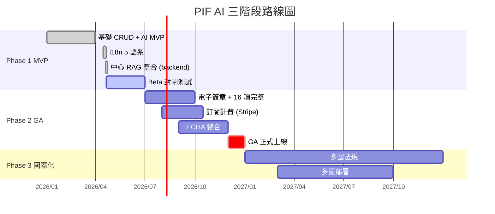
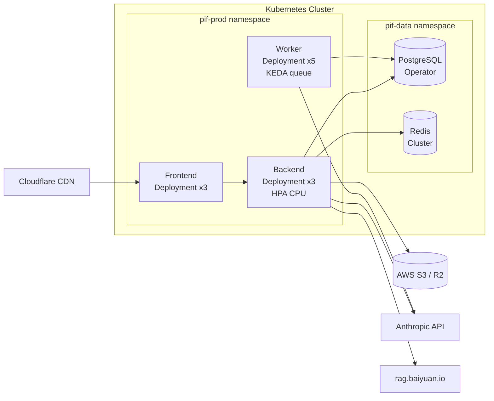

# 第 12 章：路線圖、部署與開源策略

> 本章是 PIF AI 對未來的承諾：什麼時候做什麼、怎麼部署、為何選 AGPL-3.0、如何接受社群貢獻。讀者讀完本章應能判斷：本專案是否是您可以投入參與（或投資）的長期方案。

## 📌 本章重點

- Phase 1 MVP（2026 Q2）→ Phase 2 GA（2026 Q4）→ Phase 3 規模化（2027）
- 部署：Docker Compose（MVP）→ Kubernetes（規模化）→ 多區（全球化）
- 採 **AGPL-3.0**：確保衍生 SaaS 的開源義務（vs 一般 MIT/Apache 允許商業封閉化）
- 社群治理採 **BDFL + Maintainers**：專案創始人最終決定，3-5 位 maintainers 日常審閱

## 12.1 三階段路線圖

### 12.1.1 Phase 1：MVP（已完成至 2026-04）

焦點：**驗證 AI 能否產出可用的 PIF 草稿**。

已交付：

- ✅ 使用者註冊 / 登入 / 組織管理
- ✅ 產品 CRUD + 配方上傳
- ✅ AI 成分擷取（Claude Vision + Tool Use）
- ✅ PubChem 毒理查詢 + TFDA 合規檢查
- ✅ PIF 1–10 項草稿生成
- ✅ 缺件提示清單
- ✅ SA 審閱基本流程
- ✅ 5 語系 i18n（zh-TW / en / ja / ko / fr）
- ✅ 中心 RAG backend 整合（方案 C+）

暫未納入：電子簽章、代工廠批量模式、計費系統、ECHA 進階查詢、法規變更通知。

### 12.1.2 Phase 2：GA（目標 2026 Q4）

焦點：**完整 16 項 + 正式上線 + 商業化**。

計畫：

- 完整 PIF 16 項（含試驗報告自動解析）
- SA 電子簽章（密碼學簽章 + 存證）
- Stripe 訂閱計費（Free / Pro / Enterprise）
- ECHA C&L Inventory 整合
- 代工廠多品牌管理
- Mobile app（React Native，可選）
- 審計日誌 SIEM 匯出
- 績效 benchmark 公開（回應白皮書 §1.4 之「目標值」）

### 12.1.3 Phase 3：規模化與國際化（2027）

- 多區部署（日本、韓國、歐盟）
- 多國法規支援（EU CPNP、US MoCRA、日本薬事法、韓国化粧品法）
- 法規變更自動通知（變更 → 影響分析 → 修訂建議）
- RAG L1 Wiki 自動編譯改進
- SCCS / CIR 專業知識庫
- AI 自動化合規報告月度統計
- Bug bounty program

### 12.1.4 時程視覺化



**圖 12.1 說明**：Phase 1 Beta 測試期從 2026-04-20 開始，於 2026-07-01（法規強制日）前夕完成。Phase 2 於 2026 下半年衝 GA，目標於年底前達成 200 家付費用戶（CLAUDE.md 商業目標）。

## 12.2 部署演進

### 12.2.1 當前階段：Docker Compose

MVP 期部署於單一 host（Hetzner / DigitalOcean / 自建 IDC）：

```
host
├── pif-frontend-1     :3000
├── pif-backend-1      :8000
├── pif-worker-1
├── pif-db-1           :5432 (pgvector/pgvector:pg16)
├── pif-redis-1        :6379
└── pif-minio-1        :9000 (S3-compatible)
```

外部反向代理採 **Nginx Proxy Manager**（NPM），處理 TLS 憑證、自訂 domain、WAF 基礎規則。

優勢：

- 單機 ≈ NT$3,000/月
- 快速部署（`docker compose up -d`）
- 所有服務於同 Docker network，內部通訊無延遲

劣勢：

- 單點故障
- 升級 downtime
- 資源不彈性

### 12.2.2 規模化：Kubernetes

當 MAU > 10,000 或 req/sec > 100 時，遷移至 K8s：



**圖 12.2 說明**：K8s 部署使用 PostgreSQL Operator（如 CloudNativePG）管理主從複製；Worker 使用 KEDA 依佇列深度自動擴展。所有外部相依（S3、Claude API、中心 RAG）透過 egress gateway。

### 12.2.3 未來：多區

Phase 3 全球化：

- 台灣區（主）：AWS ap-northeast-1 或 GCP asia-east1
- 日本區：AWS ap-northeast-1（日本資料主權）
- 歐盟區：AWS eu-central-1（GDPR）
- 美國區：AWS us-west-2

每區獨立 cluster + DB；DNS 由 Cloudflare Load Balancer 做 geo routing。

## 12.3 開源授權選擇：AGPL-3.0

### 12.3.1 候選比較

| 授權 | 衍生封閉化 | SaaS 迴避 | 對商業友善 | PIF 適配 |
|------|------------|----------|-----------|---------|
| MIT / Apache-2.0 | ✅ 允許 | ✅ 允許（不公開改動） | 最友善 | ❌ |
| GPL-3.0 | ❌ 需開源 | ✅ 允許（SaaS 不算分發） | 中等 | ❌ |
| **AGPL-3.0** | ❌ 需開源 | ❌ **SaaS 也需開源** | 較嚴格 | ✅ 選用 |
| 專有 | — | — | 不開源 | ❌ |

### 12.3.2 為何選 AGPL

核心考量：**防止他人 fork 本專案後包裝成競品 SaaS，但不回饋改動**。

MIT 允許：甲公司拿 PIF AI → 封裝成 cloud 服務 → 對外收費 → 任何改動都不需公開。

AGPL 條文第 13 條：使用者若透過網路存取修改版本，必須能取得原始碼。這讓 fork-and-sell 模式必須同步開源。對採 PIF AI 作為基礎的第三方：

- ✅ 可自建內部使用（無對外服務義務）
- ✅ 可商用（依 AGPL 條款）
- ✅ 可 fork 改造 **但對外提供 SaaS 須公開改造**

### 12.3.3 AGPL 對企業使用者的影響

| 使用情境 | AGPL 影響 |
|---------|-----------|
| 品牌商使用 pif.baiyuan.io | **無** — 使用者不是衍生者 |
| 業者內部自建 PIF AI 給自家員工 | 無（未對外） |
| 將 PIF AI 打包成產品售賣 | 必須公開改動 |
| 與 PIF AI 整合的外部系統 | 視整合程度而定（參 AGPL FAQ） |

對絕大多數使用者（業者）而言，AGPL **完全無感**。僅影響「fork 後商業化」的場景。

### 12.3.4 白皮書授權不同

白皮書採 **CC BY-NC 4.0**（非商業署名授權），允許：

- ✅ 學術引用、教學、翻譯
- ✅ 個人研究
- ❌ 商業重製（需取得 Baiyuan Tech 書面許可）

這設計讓白皮書於學術圈自由流通，同時保留商業場景（如付費培訓、出版品）的授權彈性。

## 12.4 社群治理

### 12.4.1 角色

| 角色 | 權責 | 人數 |
|------|------|------|
| **BDFL**（Benevolent Dictator For Life） | 專案願景、最終決策、憲法守護 | 1（作者） |
| **Maintainer** | PR 審閱、Issue 分類、發版 | 3-5（Phase 2 前募集） |
| **Contributor** | 提交 PR、翻譯、文件 | 不限 |
| **User** | 回報 bug、參與討論 | 不限 |

### 12.4.2 決策流程

- 小變動（bug fix, docs）：任一 maintainer 核准即合併
- 中型變動（新功能、重構）：至少 2 maintainers 核准
- 大型變動（架構重組、授權變更）：BDFL 核准 + RFC 公開討論 14 天

### 12.4.3 貢獻種類

歡迎以下貢獻：

- **程式碼**：feature、bug fix、效能優化
- **翻譯**：5 語系 i18n 校對與擴充（super-admin 除外！）
- **白皮書翻譯**：日、韓、法文翻譯（Phase 3 目標）
- **測試與資安審閱**：報告漏洞 → 列入致謝名單
- **法規知識**：SCCS / MoCRA / EU CPR 的規則實作
- **案例研究**：企業導入案例分享（匿名化）

### 12.4.4 與 Claude Code 社群的互動

本專案作為 Claude Code 工程案例，歡迎 Anthropic 社群：

- 參考本 repo 作為 Claude Code 最佳實踐示例
- 於 [docs.claude.com](https://docs.claude.com) 的 community showcase 列為範例（若 Anthropic 同意）
- 參與每月「Claude Code Office Hours」分享本專案經驗

## 12.5 結語

PIF AI 試圖證明：**LLM 輔助工程可以在法規合規領域產出商業可用的開源 SaaS**。本白皮書是過程的完整紀錄。

若您是：

- 化粧品業者 → 歡迎試用 [pif.baiyuan.io](https://pif.baiyuan.io)
- 開發者 → 歡迎至 [baiyuan-tech/pif](https://github.com/baiyuan-tech/pif) 貢獻
- 研究者 → 歡迎引用本白皮書（見 [CITATION.cff](../CITATION.cff)）
- 法規專業人士 → 歡迎提供規則擴充建議
- 投資人 → 請聯繫 services@baiyuan.io

感謝您讀到這裡。剩餘 4 項附錄提供完整參考資料：

- [附錄 A：縮寫與術語對照](appendix-a-glossary.md)
- [附錄 B：API 端點完整清單](appendix-b-api-endpoints.md)
- [附錄 C：參考文獻](appendix-c-references.md)
- [附錄 D：變更紀錄](appendix-d-changelog.md)

## 📚 參考資料

[^1]: Free Software Foundation. *GNU Affero General Public License version 3*. <https://www.gnu.org/licenses/agpl-3.0.html>
[^2]: Creative Commons. *Attribution-NonCommercial 4.0 International*. <https://creativecommons.org/licenses/by-nc/4.0/>
[^3]: Kubernetes. *KEDA — Kubernetes Event-driven Autoscaling*. <https://keda.sh>
[^4]: CloudNativePG. *PostgreSQL Operator for Kubernetes*. <https://cloudnative-pg.io>

## 📝 修訂記錄

| 版本 | 日期 | 摘要 |
|:---:|:---:|---|
| v0.1 | 2026-04-19 | 首次撰寫。涵蓋三階段路線圖、部署演進、AGPL 選擇、社群治理 |

---

© 2026 Baiyuan Tech. Licensed under CC BY-NC 4.0.

**導覽** [← 第 11 章：安全模型](ch11-security-model.md) · [第 13 章：PIF 合規引擎深度解析 →](ch13-compliance-engine.md)
