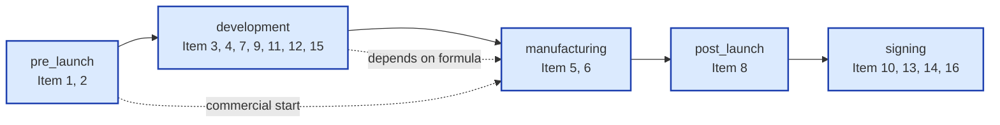

# 第 13 章：PIF 合規引擎深度解析（Phase 22–23）

> 本章記錄 PIF AI 從 Phase 22 到 Phase 23 共 11 個 sub-phase 累積的合規引擎能力。**第 3 章**已建立每項 PIF 的法規對應與資料來源；**本章補上 16 項之間的因果鏈、生命週期推導、版本管理、變更偵測、罰則對照與最終的合規 PDF 自動產出**。整套設計以 ITRI《化粧品產品資訊檔案建置精修班》125 頁講義為對齊基線，涵蓋 2026/7/1 全面強制日的所有合規條件。

## 📌 本章重點

- **生命週期重組**：16 項依產品生命週期 5 階段（pre_launch / development / manufacturing / post_launch / signing）重新編組 IA，符合業者實際工作流而非單純按項次排列
- **責任歸屬矩陣**：4 種業者類型（brand / oem / importer / consultant）× 16 項 = 64 格責任配置，每格附「該由誰提供」「資料來源建議」「典型需委外」三欄
- **cross-item lint engine**：14 條因果鏈規則（R1–R14）涵蓋宣稱vs毒理一致性、配方vs製程相容、包材vs安定性試驗、不良反應vs通報義務等所有跨 Item 關聯
- **PIF 版本管理**：V0（草稿）/V1（首簽）/V2/V3（變更後重簽）四版本快照，配方/製程/包材以 SHA-256 fingerprint 偵測異動
- **罰則對照**：14 條 lint 規則自動附掛《化粧品衛生安全管理法》§22-25 罰鍰範圍（NT$3 萬至 NT$500 萬）
- **合規 PDF 14 頁**：WeasyPrint A4 + Noto Sans CJK，從結構化資料一鍵產出全 16 項 + 罰則對照 + V0–V3 快照清單之完整 PIF 文件

## 13.1 生命週期 5 階段與責任歸屬矩陣

### 13.1.1 從「16 項條列」到「5 階段流程」

ITRI 講義 p.13、p.105 圖 A 揭露一個重要事實：**業者建檔時並非依項次 1 → 16 順序填寫**，而是依產品生命週期推進。原本第 3 章採用「項次條列」是法規敘述順序，符合稽查清單的閱讀習慣；但對實際填檔的業者而言，這樣的 IA 易產生「應該先做哪一項？」的決策負擔。

Phase 22.2 將前端 PIF Builder 重組為 5 階段（圖 13.1）：



**圖 13.1 — PIF 16 項依生命週期 5 階段重組**

階段對 16 項的覆蓋如表 13.1：

| 階段 | 涵蓋 PIF 項目 | 業者主要動作 | 寫入時點 |
|---|---|---|---|
| **pre_launch**（上市前） | 1, 2 | 產品基本資料 + TFDA 登錄號 | 產品定型時 |
| **development**（研發） | 3, 4, 7, 9, 11, 12, 15 | 配方、宣稱、使用方法、物化、試驗、包材 | 配方定型至試產 |
| **manufacturing**（製造） | 5, 6 | 製造階段、GMP 證書、製程 | 量產前 |
| **post_launch**（上市後） | 8 | 不良反應追蹤 + §12 通報 | 上市後持續 |
| **signing**（簽核） | 10, 13, 14, 16 | 安全評估 + SA 簽署 + V0/V1 快照 | PIF 完整時 |

> **設計取捨**：5 階段並非取代「16 項」做為法規對齊單位 — Item 編號仍是與 TFDA 稽查互通的官方 ID。階段只是 UI 動線重組；資料庫仍以 `item_number` 1–16 為主鍵。前端可在「依編號」與「依階段」之間切換顯示。

### 13.1.2 業者類型 × 16 項責任歸屬矩陣

ITRI 講義 p.105「圖 C」列出 4 種業者類型：

- **brand**（品牌商）— 自行設計、委外製造，例如：保養品牌
- **oem**（自有品牌工廠）— 設計與製造皆自行，例如：本土代工廠
- **importer**（輸入業者）— 進口自國外原廠，本土無研發、無製造
- **consultant**（諮詢顧問）— 不擁產品，協助上述三者整合 PIF

每種業者對 16 項的「該由誰提供」配置不同。Phase 22A 將此表格 64 格內建到後端（`services/pif_responsibility_matrix.py`），並透過 `/api/v1/pif/responsibility-matrix` 回傳。前端的 `PifItemTooltip` 取得 `productId` 後依 `product.org.type` 自動帶出對應業者類型的「👤 該由誰提供／💡 資料來源建議／⚠️ 典型需委外」三欄提示。

**簡例**（節錄 Item 3 — 全成分含量表）：

| 業者類型 | 該由誰提供 | 資料來源建議 | 典型需委外 |
|---|---|---|---|
| brand | 代工廠（OEM/ODM）| 配方表 + INCI 對照表 | ✅ 通常委外 |
| oem | 自行 | 內部研發 + 採購記錄 | ❌ 自行 |
| importer | 國外原廠 | MSDS + Composition Statement | ✅ 由原廠提供 |
| consultant | 與業者共同確認 | 統整三方資料 | — |

完整 64 格配置請見原始碼 `services/pif_responsibility_matrix.py`。Phase 22A 並對「品牌商委外比例 > 自有品牌」做 sanity check（通過 9/9 testcases）。

### 13.1.3 7 步驟工作流自動推導

Phase 22B（ITRI p.108-110「圖 B」）把 PIF 建檔的常規工作流抽象為 7 步驟：

1. **配方定型** — Item 3 完成
2. **試產評估** — Item 5/6/9 + Item 11–13 啟動
3. **包裝決定** — Item 15 完成
4. **資訊整合** — Item 1/2/4/7 完成
5. **安全評估** — Item 10/14 由 SA 撰寫
6. **首次簽署 V1** — Item 16 鎖定 V1 快照
7. **變更後重簽** — V2/V3 快照（觸發條件詳 §13.3）

每步驟的「完成度」由各 Item 進度推導，端點 `/api/v1/products/{id}/pif-workflow` 回傳：

```json
{
  "current_step": 4,
  "steps": [
    {"number": 1, "name": "配方定型", "completed": true,  "items": [3]},
    {"number": 2, "name": "試產評估", "completed": true,  "items": [5, 6, 9, 11, 12, 13]},
    {"number": 3, "name": "包裝決定", "completed": true,  "items": [15]},
    {"number": 4, "name": "資訊整合", "completed": false, "items": [1, 2, 4, 7]},
    ...
  ],
  "outsourcing_suggestions": ["3", "5", "6", "11-13"]
}
```

`outsourcing_suggestions` 會結合業者類型矩陣（§13.1.2）給出建議委外項目。

## 13.2 PIF 版本管理：V0–V3 快照與變更偵測

### 13.2.1 V0/V1/V2/V3 四版本模型

ITRI 講義 p.107-110 規範：**每次配方／製程／包材變更後，PIF 必須由 SA 重新簽署**。但「重簽」不是覆蓋舊資料 — 法規與後續稽查可能同時引用多個歷史版本（例：產品 X 於 2026-08-01 採配方 A，2026-12-01 改配方 B 後重簽，TFDA 抽查 2026-09 出貨批號時要看的是配方 A 的 PIF V1，不是現行的 V2）。

PIF AI 採四版本模型：

| 版本 | 觸發 | 用途 | 可變動？ |
|---|---|---|---|
| **V0** | 系統建立產品時自動 | 草稿（drafting）— SA 尚未簽核 | 是 |
| **V1** | SA 首次簽署 | 上市初版 | 否（鎖定） |
| **V2** | 配方／製程／包材任一變更後 SA 重簽 | 第一次變更後 | 否（鎖定） |
| **V3** | 第二次（含）以上變更後 SA 重簽 | 持續變更皆累積至 V3 | 否（鎖定）|

`/api/v1/products/{id}/pif-versions/snapshot` 觸發快照建立；快照建立時自動將 16 項當下狀態抽取為 `items_snapshot` JSONB，並在其中嵌入 `__fingerprints__` 子物件（§13.2.2）。

### 13.2.2 變更偵測：fingerprints 機制

Phase 22E 引入指紋偵測。snapshot 建立時計算三組 SHA-256 hash：

| Fingerprint | 取自 | 變更判定 |
|---|---|---|
| `formula_fingerprint` | Item 3 全成分含量表（INCI ID + 濃度 sorted set） | 任一成分增刪或濃度變動 |
| `process_fingerprint` | Item 6 製程步驟（stage + step 字串 join） | 任一製程階段／步驟變動 |
| `packaging_fingerprint` | Item 15 包材 component set | 任一包材材質／規格變動 |

`/api/v1/products/{id}/pif-versions/change-detection` 比對「最新 V1+ 之 fingerprints」與「當下 16 項計算出之 fingerprints」，回傳：

```json
{
  "needs_resign": true,
  "reasons": ["formula changed", "packaging changed"],
  "current_version": "V1",
  "suggested_next_version": "V2"
}
```

前端 `ChangeDetectionBanner` 元件持續輪詢此端點；偵測到變動時顯示警示框 + 建議版號 + 「一鍵建立 V2/V3 草案」按鈕（§13.2.3）。

### 13.2.3 V2/V3 一鍵草案

Phase 23C 端點 `POST /api/v1/products/{id}/pif-versions/auto-draft` 在偵測到變更時，**將最新 V1+ 快照複製為 V2/V3 草案 unsigned 版本**，業者只需確認變更項目並重新提交給 SA 簽署，省去從 V0 重建的所有重工。`suggested_next_version` 邏輯：當前最高為 V1 → V2；當前最高為 V2 → V3；當前已 V3 → 維持 V3（業務上 V3 是最高版號，後續變更累積在 V3 內）。

### 13.2.4 文件時效自動追蹤

PIF 並非建一次永久有效。GMP 證書、試驗報告、SA 簽署皆有時效。`/api/v1/products/{id}/pif-versions/expiring` 聚合三類時效：

- **GMP 證書**：依 Item 5 上傳之證書 `expiry_date`，到期前 30 天警示
- **試驗報告**（Item 11/12/13）：以 `test_date` 加 12 個月為推估有效期，到期前 60 天警示
- **嚴重不良反應通報**（Item 8）：依《化粧品衛生安全管理法》§12，事件發生 15 天內須完成通報，倒數計時

警示資料於前端 `ExpiringDocsBanner` 顯示，按到期遠近排序。

## 13.3 跨 Item 因果鏈引擎：14 條 lint 規則

### 13.3.1 為什麼需要 cross-item lint

第 3 章把 16 項當作獨立欄位處理，但實際法規合規要求項目間互相一致。ITRI 講義 p.107-110 列舉約 30 種「跨 Item 不一致」典型違規。Phase 22D 將其中 14 種高頻情境抽象為 `cross_item_lint` 引擎，純函式設計，可獨立測試並重複呼叫。

```python
def lint_cross_items(items: dict, org_type: str) -> list[CrossItemAlert]:
    alerts = []
    alerts += rule_R1_strong_claim_vs_toxicology(items)
    alerts += rule_R2_label_ocr_vs_usage(items)
    # ... R3 ~ R14
    return alerts
```

### 13.3.2 14 條規則總覽

| 規則 | 觸發條件 | target_item | severity | 對應講義頁 |
|---|---|---|---|---|
| **R1** | 強功能宣稱（美白/抗皺/緊緻 etc）但 Item 10 安全評估未涵蓋功效成分 | 10 | warning | p.66, p.83 |
| **R2** | Item 4 標籤 OCR 暗示使用方式但 Item 7 5 欄位不完整 | 7 | warning | p.59 |
| **R3** | Item 9 物化特性 pH < 3 或 > 11 但 Item 11 安定性試驗未測 pH | 11 | warning | p.71 |
| **R4** | Item 3 含限用成分但 Item 4 標籤未揭露限用警語 | 4 | error | p.27 |
| **R5** | Item 1 launch_date 已過但 Item 8 未啟動不良反應宣告 | 8 | warning | p.72 |
| **R6** | Item 11/12/13 試驗報告 test_date 超過 12 個月 | 16 | warning（觸發 SA 重簽） | p.53 |
| **R7** | Item 4 含「敏感肌專用」宣稱但 Item 11 安定性試驗未做 patch test | 11 | error | p.83 |
| **R8** | Item 15 特殊材質容器（金屬/玻璃/矽膠）但 Item 11 安定性未於該材質實測 | 11 | error | p.59 |
| **R9** | Item 3 含禁用／管制成分（依 TFDA 清冊） | 3 | blocking | p.27 |
| **R10** | Item 5 GMP 證書 issue_date 超過 12 個月或 expiry_date < 90 天 | 5 | warning | p.65 |
| **R11** | Item 6 製程包含高溫（≥80°C）但 Item 11 安定性試驗未測高溫穩定性 | 11 | blocking | p.71 |
| **R12** | Item 13 防腐效能試驗結果為 fail | 13 | blocking | p.83 |
| **R13** | Item 8 嚴重不良反應已發生但 §12 15 天通報未完成 | 8 | blocking | p.72 |
| **R14** | Item 16 SA 簽署但 SA 證書 `expiry_date` 已過 | 16 | blocking | p.107 |

severity 分三級：

- **blocking** — 阻擋簽署。出現任一 blocking 即無法將 V0 推進至 V1
- **error** — 必須處理但不阻擋。SA 可備註後續處理計畫繼續簽
- **warning** — 提醒，無強制義務

每筆 alert 自動附掛該違規對應之《化粧品衛生安全管理法》條文與罰鍰範圍（§13.4）。

### 13.3.3 R1 進階過濾

Phase 23B 對 R1（強功能宣稱）做進階過濾。原始實作會把所有功能性詞觸發 R1，但「保濕」「清潔」「舒緩」等通用宣稱屬一般化粧品功效，不需特別安全評估。Phase 23B 維護白名單區分「通用」與「強功能」：

- **通用宣稱**（白名單，不觸發 R1）：保濕、清潔、舒緩、滋潤、潔淨、保護
- **強功能宣稱**（觸發 R1）：美白、抗皺、緊緻、淡斑、提亮、抗老、修護、再生

僅當宣稱命中強功能列表才觸發 R1，避免過度警示稀釋警訊強度。

## 13.4 罰則對照：法規條文 → 罰鍰範圍

ITRI 講義 p.27、p.114-117 列出《化粧品衛生安全管理法》§22–§25 之罰責對照。Phase 23A 將 14 條 lint 規則自動對應到具體條文與罰鍰範圍：

| 違規類型 | 條文 | 罰鍰範圍 | 觸發規則 |
|---|---|---|---|
| 標示不實／誇大 | §10 第 1 項 + §22 | NT$3 萬–NT$200 萬 | R1, R7 |
| 含禁／管制成分 | §6 + §22 | NT$3 萬–NT$500 萬 | R9 |
| GMP 違反 | §8 + §23 | NT$3 萬–NT$200 萬 | R10 |
| 試驗不實 | §8 + §23 | NT$3 萬–NT$200 萬 | R11, R12 |
| 不良反應未通報 | §12 + §24 | NT$3 萬–NT$100 萬 | R13 |
| SA 資格違反 | §10 第 2 項 + §25 | NT$3 萬–NT$50 萬 | R14 |

每筆 alert 的 JSON 結構：

```json
{
  "rule_id": "R9",
  "severity": "blocking",
  "target_item": 3,
  "message": "成分『鄰苯二甲酸二丁酯』於 TFDA 化粧品禁止成分清冊",
  "penalty": {
    "act": "化粧品衛生安全管理法",
    "articles": ["§6", "§22"],
    "fine_min_twd": 30000,
    "fine_max_twd": 5000000,
    "description": "含禁用／管制成分"
  }
}
```

前端 `CrossItemAlertCard` 將 `penalty` 區塊以「⚖️ 罰鍰範圍」金色卡片呈現。i18n 5 語系（zh-TW / en / ja / ko / fr）同步翻譯 `penaltyLabel` / `penaltyFormat`。

## 13.5 SA 簽章 metadata：強化問責性

Phase 23D 補強 SA 簽署的稽查軌跡。原本 `sa_reviews` 表只記錄 `signed_at` 與 `sa_id`。Phase 23D 新增四欄：

| 欄位 | 型別 | 用途 |
|---|---|---|
| `signature_method` | enum: `password_2fa` / `digital_cert` / `hsm` | 簽署方式（未來支援硬體 HSM） |
| `signature_hash` | text (SHA-256 hex) | 對 PIF V1+ 快照 `items_snapshot` 之 hash，防止簽後篡改 |
| `signature_ip` | inet | 簽署當下 IP（稽核用） |
| `sa_certificate_ref` | text | SA 證書編號 / 連至外部證書管理系統之 URL |

Migration 採 idempotent pattern：

```sql
ALTER TABLE sa_reviews
  ADD COLUMN IF NOT EXISTS signature_method text,
  ADD COLUMN IF NOT EXISTS signature_hash text,
  ADD COLUMN IF NOT EXISTS signature_ip inet,
  ADD COLUMN IF NOT EXISTS sa_certificate_ref text;
```

前端簽署流程取得 TOTP 後，後端在 commit 前計算 `items_snapshot` 的 SHA-256 並寫入 `signature_hash`；任何後續對該 V1 快照的篡改皆可由 hash 重算偵測。

## 13.6 合規 PIF PDF：14 頁一鍵產出

### 13.6.1 為什麼需要結構化 PDF

PIF 雖以結構化資料儲存於資料庫，但提交給 TFDA、出貨給 OEM 客戶、業者內部留存皆需要紙本／PDF 格式。傳統做法是業者把 16 項分別匯出 Word 後手動排版，每次要 4-8 小時且易遺漏項目。Phase 23E 引入 `regulatory_pif_pdf.py` service，從結構化資料一次產出符合台灣《化粧品衛生安全管理法》§3、§7、§22-25 規範之 14 章節 PDF。

### 13.6.2 14 章節結構

```
1.  封面頁（§7、§8 法規聲明）
2.  Item 1 — §7-1-1 ~ §7-1-9 共 21 欄位
3.  Item 2 — TFDA 登錄號
4.  Item 3 — 全成分含量表（INCI / CAS / 濃度 / 功能 / TFDA 狀態）
5.  Item 4 — 標籤宣稱 + 族群限制
6.  Item 5/6 — 製造階段 + GMP 證書 + 製程步驟
7.  Item 7 — 使用方法 5 欄位
8.  Item 8 — 不良反應 + §12 通報 + 業者宣告
9.  Item 9 — 物化特性
10. Item 11/12/13 — 安定性 / 微生物 / 防腐效能試驗
11. Item 15 — 包裝材質報告
12. 跨 Item 警示 + §10/§22-25 罰則對照表
13. Item 16 — V0/V1/V2/V3 版本快照清單
14. 附錄 — 簽章 metadata + 文件時效摘要
```

### 13.6.3 技術選型：WeasyPrint vs Puppeteer

評估三種候選：

| 方案 | 優點 | 缺點 | 結論 |
|---|---|---|---|
| **WeasyPrint** | 純 Python；CSS3 paged media 支援良好；CJK 字型可控 | 渲染速度中等（14 頁約 2-3 秒） | ✅ 採用 |
| Puppeteer (Headless Chrome) | 渲染最強；可重用前端 React 元件 | 需獨立 Node service；Docker image 大 | ❌ 過度複雜 |
| ReportLab | 純 Python；快 | API 偏低階；CJK 支援弱 | ❌ 維護成本高 |

WeasyPrint 配合 Noto Sans CJK 提供台灣繁中、中文標點正常排版；A4 paged media + page header / footer 由 CSS `@page` 規則控制。

### 13.6.4 兩條產出路徑

```
GET /api/v1/products/{id}/pif-versions/regulatory-pdf
  → 產出當下 PIF 完整 PDF（即時計算 cross_item_lint）

GET /api/v1/products/{id}/pif-versions/{snapshot_id}/regulatory-pdf
  → 產出指定 V0/V1/V2/V3 快照之 PDF（從 items_snapshot 還原）
```

第二條路徑特別重要：**TFDA 抽查時引用某出貨批號當下適用的 PIF 版本**，需要從 V1/V2/V3 歷史快照還原當時的 16 項狀態，不能用現行最新版資料。

### 13.6.5 中文檔名與 Content-Disposition

Content-Disposition 採 RFC 5987 雙標頭：

```
Content-Disposition: attachment;
  filename="PIF_V1_20260430.pdf";
  filename*=UTF-8''%E6%9F%90%E5%93%81%E7%89%8C_PIF_V1_20260430.pdf
```

`filename` 給舊瀏覽器（latin-1 ASCII fallback），`filename*` 給支援 RFC 5987 的瀏覽器（含中文品牌名）。實測 Chrome / Safari / Firefox / Edge 皆正確下載含中文之檔名。

### 13.6.6 E2E 真實數據雙路徑驗證

Phase 23E 與配套之 e2e 測試（`tests/test_e2e_full_path.py`）對兩條真實路徑驗證：

**路徑 1（依編號）— brand 組織**：
- §7-1-* 11 欄位 / TFDA 登錄號 / 4 種成分 / 強功能宣稱「美白」
- 製造階段 + GMP + 5 欄位使用方法 + 不良反應 attestation
- 物化 / 3 種試驗 pass / PET 包裝
- V0 草稿 → V1 簽署 → 配方變更 → Phase 22E 偵測到 → Phase 23C auto-draft V2
- 預期：R1 + R9 觸發；R5/R7/R8/R11 化解
- 罰則對照：§10 第 1 項 ≤ NT$200,000

**路徑 2（依階段）— importer 組織**：
- pre_launch (1+2) → manufacturing (5+6, GMP 80 天 → R10)
- development (3/4/7/9/11/12/15, 防腐 fail + 金屬包材)
- post_launch (8 嚴重事件 → R13)
- signing (V0/V1 → 包材變更 → 22E → V2 auto-draft)
- 預期 7 條全觸發：R1, R7, R8, R10, R11, R13, R9
- blocking ≥ 1（R11）
- importer 建議委外 12 項（3, 5, 6, 8-16）

兩條路徑均通過：

- magic header (`%PDF`) ✓
- EOF marker (`%%EOF`) ✓
- size > 5 KB（實測 640–690 KB / 14 頁）
- content-type: `application/pdf` ✓
- `pdftotext` 抽取確認包含 §7-1-* / §22-25 / R1/R7/R8/R10/R11/R13 + blocking 警示

## 13.7 與第 3 章的對照地圖

讀完本章後，第 3 章的「16 項條列」在以下面向被擴展：

| 第 3 章 | 第 13 章對應補充 |
|---|---|
| 16 項各自的法規對應 | 16 項彼此之間的因果鏈（14 條 lint） |
| 各項資料來源（業者填寫／上傳／資料庫查詢） | 4 種業者類型對應之責任歸屬（64 格） |
| `pif_documents.item_number` 狀態欄位 | V0–V3 快照 + fingerprints + 變更偵測 |
| AI 信心度欄位 `ai_confidence` | SA 簽章 metadata（method / hash / ip / cert ref） |
| 法規條文（§7、§8） | 罰則對照（§22–§25 罰鍰範圍） |
| Markdown 草稿輸出 | 結構化 PDF 14 頁完整輸出 |

## 13.8 開源策略意涵

Phase 22-23 在開源層面留下三項可被其他國家／法規重用的資產：

1. **`cross_item_lint` 純函式引擎** — 可獨立於 PIF AI 全棧，僅需替換規則表 R1–R14 即可適配歐盟 CPNP、美國 OTC、日本 PMDA 等其他法規體系
2. **責任矩陣 schema** — 4 業者類型 × N 項目的 64 格資料結構，業界目前無公開標準，本實作可為後續 ISO / WHO 標準化提供 reference
3. **`regulatory_pif_pdf` PDF 產生器** — WeasyPrint 模板與 14 章節 IA 設計，可作為 cosmetic / OTC / supplement 等同類監管產業的共通骨架

對應 GitHub 路徑：

- `backend/app/services/cross_item_lint.py`
- `backend/app/services/pif_responsibility_matrix.py`
- `backend/app/services/regulatory_pif_pdf.py`

授權：AGPL-3.0（與母專案一致）。商業重製或閉源整合請聯絡 Baiyuan Tech 取得商業授權。

## 📚 參考資料

[^1]: 工業技術研究院（ITRI）.《化粧品產品資訊檔案（PIF）建置精修班》講義. 2026.03（COPYRIGHT 2026.03 p.13、p.27、p.52-54、p.59、p.65、p.66、p.71、p.72、p.83、p.105、p.107-110、p.114-117）.
[^2]: 中華民國衛生福利部食品藥物管理署. 《化粧品衛生安全管理法》§3、§6、§7、§8、§10、§12、§22、§23、§24、§25. <https://www.fda.gov.tw>
[^3]: WeasyPrint. *The Visual Rendering Engine for HTML and CSS that Can Export to PDF*. <https://weasyprint.org>
[^4]: Google Fonts. *Noto Sans CJK*. <https://fonts.google.com/noto/specimen/Noto+Sans+TC>
[^5]: IETF. *RFC 5987 — Character Set and Language Encoding for Hypertext Transfer Protocol (HTTP) Header Field Parameters*. <https://www.rfc-editor.org/rfc/rfc5987>

## 📝 修訂記錄

| 版本 | 日期 | 摘要 |
|:---:|:---:|---|
| v0.2 | 2026-04-30 | 首次撰寫。涵蓋 Phase 22-23 共 11 個 sub-phase 之合規引擎 |

---

© 2026 Baiyuan Tech. Licensed under CC BY-NC 4.0.

**導覽** [← 第 12 章：路線圖、部署與開源策略](ch12-roadmap-deployment-opensource.md) · [附錄 A：縮寫與術語 →](appendix-a-glossary.md)
