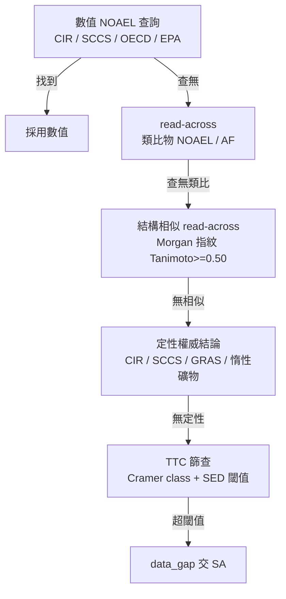

# 第 14 章：毒理安全評估引擎——NOAEL fallback 憲法與 MoS 邊際

> **第 9 章**建立了毒理資料的多源查詢管線(4 大資料庫 + TFDA 映射 + 並發查詢)。但「查到資料」不等於「做出安全判定」。當一個成分查無數值 NOAEL 時,系統該印「未找到」還是繼續推導?本章記錄一條由使用者定錨的引擎憲法——**沒有 NOAEL 就改走 fallback,絕不讓任何成分停在空白**——以及支撐它的 MoS 邊際計算與 fail-safe 非對稱原則。

## 📌 本章重點

- **NOAEL fallback 憲法**:任何成分找不到數值 NOAEL 時,引擎必依序嘗試 read-across 借值、結構相似類推、定性權威結論、TTC 篩查,窮盡才落 data_gap 交人工。報告上**每個成分都必須顯示明確安全依據**,絕不印「未找到」。
- **六階 cascade**:數值 NOAEL → read-across(類比物 NOAEL ÷ 評估係數)→ 結構相似 read-across(RDKit Morgan 指紋 Tanimoto ≥ 0.50)→ 定性權威(CIR / SCCS / GRAS / 惰性礦物)→ TTC(Cramer class + SED 閾值)→ data_gap。
- **MoS 邊際**:`MoS = NOAEL / SED`,`SED = 系統暴露量 × 濃度 × 經皮吸收率 DAp`。MoS ≥ 100 為安全門檻(對齊 SCCS 慣例)。
- **DAp 修正**:固定植物 / 動物油的經皮吸收率從預設 50% 修正為 5%(分子量 800–900 三酸甘油酯難穿透角質層),避免良性油因暴露灌水而誤擋——但精油 / 小分子 / 酯類一律排除此修正。
- **fail-safe 非對稱**:寧偽陽(誤標 review)不偽陰(漏放危險成分)。fallback 值仍須通過 MoS ≥ 100;硬閘門(奈米 / CMR / 腐蝕 / 法定限量 / 致癌分類)可覆蓋任何寬鬆結論。

## 14.1 為什麼多源查詢還不夠

第 9 章的 pipeline 解決了「去哪裡找毒理資料」:CIR、SCCS、OECD、EPA ToxValDB 四源並發查詢,結果彙整成風險摘要。但實務上暴露一個殘酷缺口——**多數化粧品成分(尤其植物萃取物、天然油脂、香料)在權威資料庫裡查不到數值 NOAEL**。

早期版本的行為是:查不到就在報告該成分的安全依據欄印「未找到」。這在一次真實送測中造成災難:某租戶的一份配方 23 個成分,有 11 個顯示「未找到」。使用者的反應不是「這系統很嚴謹」,而是「這系統不會做」——一份滿頁「未找到」的報告,對需要對主管機關負責的業者而言等於沒有價值,直接流失。

問題的本質是一個定位落差:

> **人工安全評估師(SA)遇到查無 NOAEL 的成分,會用全部化學知識 + 文獻即時做結構推理,找一個 read-across 的類比物或用 TTC 篩查兜底。AI 引擎的「腦容量」不該輸給人工。**

於是引擎憲法被明確定錨(使用者 2026-07-01):**「沒有 NOAEL 改走 TTC,或 read-across 借一個 NOAEL。」** 任何成分都不允許停在空白;報告上每個成分都必須顯示一個明確的安全依據——數值、read-across 借值、定性結論、或 TTC 篩查結果。

## 14.2 NOAEL fallback 六階 cascade

引擎的核心是一條**確定性的 fallback 階梯**(圖 14.1):由最權威、最精確的來源開始,逐級退讓到最保守的兜底,窮盡才交人工。



**圖 14.1 NOAEL fallback 六階 cascade**:每一階都對應 `app/services/noael_resolver.py` 與 `safety_determination.py` 中的一個 Tier,由高權威到低權威依序退讓。

各階的判準:

| 階 | 方法 | 判準 / 來源 |
|:---:|---|---|
| 0 | 數值 NOAEL | CIR full_report / SCCS opinion / OECD / EPA ToxValDB 的實測 POD |
| 0.5 | 權威 re-grounded | 從 EPA ToxValDB ← ECHA 抓回的 cited 值(視同權威級) |
| 1 | read-across(借值) | 類比物 cited NOAEL ÷ 評估係數(AF) |
| 1.5 | 結構相似 read-across | RDKit Morgan 指紋 Tanimoto ≥ 0.50 的錨定物 |
| 2 | 定性權威結論 | CIR / SCCS「safe as used」、GRAS、惰性礦物;附條件時降 review |
| 3 | TTC 篩查 | 低暴露 + Cramer class 分類 + SED ≤ 對應閾值 |
| — | data_gap | 窮盡後交人工 SA |

一個關鍵設計:**每一階的產物都攜帶「方法標籤」與「出處」**。報告顯示層不是印一個裸數字,而是印「read-across 借值(類比物 X,cited NOAEL Y)」或「TTC 篩查(Cramer class II,SED 低於閾值)」——讓 SA 一眼看出這個結論的可信度層級。

### 14.2.1 read-across 的評估係數

read-across 借用類比物的 NOAEL 時,不能直接套用,必須除以評估係數(assessment factor)以涵蓋物種差異、個體差異與資料品質的不確定性。引擎的 read-across 借值一律標記類比物 CAS 與相似度,讓判定可追溯。結構相似 read-across 用 RDKit 計算 Morgan 指紋的 Tanimoto 係數,門檻設 0.50——低於此值的「相似」在毒理上不具說服力,寧可退到下一階。

### 14.2.2 TTC 作為通用兜底

TTC(Threshold of Toxicological Concern,毒理學關注閾值)是最後的非人工兜底:對低暴露成分,依 Cramer 結構分類(class I/II/III)給一個保守的每日容許暴露閾值,只要系統暴露量(SED)低於該閾值即判為可接受風險。TTC 的閾值刻意取最嚴——對有結構警示(structural alert)的基因毒性疑慮成分,採 0.15 µg/day 的最保守值。

**鐵則**:TTC 是「找不到專屬數據時的保守篩查」,不是「放寬」。任何 TTC 通過的成分,其硬閘門(見 14.4)仍完全有效。

## 14.3 MoS 邊際與經皮吸收

有了 NOAEL(不論來自哪一階),下一步是計算安全邊際 MoS(Margin of Safety):

```text
SED (系統暴露劑量) = 系統暴露量 E × 配方濃度 C / 100 × 經皮吸收率 DAp / 100
MoS = NOAEL / SED
```

MoS ≥ 100 為安全門檻(對齊 SCCS 慣例:100 = 10× 物種差異 × 10× 個體差異)。低於 100 落 insufficient_margin,交 SA 複查。

### 14.3.1 經皮吸收率 DAp 的陷阱

DAp(dermal absorption percentage)預設為保守的 50%。但這對某些成分明顯過保守,會把良性成分誤擋。真實案例:一份含葵花油、鴯鶓油等固定油的配方,6 個成分被判「不可送件」。根因之一是——這些惰性三酸甘油酯油,分子量 800–900,真實經皮吸收率不到 1–2%,卻被硬套 50%,使 SED 灌水 25–50 倍,MoS 假性壓低。

修法(對齊 SCCS/1647/22 §4-5 + Bos & Meinardi 500-Dalton 規則):固定植物 / 動物油的 DAp 從 50% 修正為 **5%**。但這是一個「放寬」動作,必須嚴格控制適用範圍:

- **正控(適用 5%)**:固定植物油、動物油(三酸甘油酯,MW 800–900)
- **負控(一律排除,維持保守)**:精油、小分子(< 500 Da)、酯類、萃取物、界面活性劑

修正後,前述配方的良性油從誤擋恢復(某葵花油成分 MoS 從 36 → 361),而真正有問題的成分(某精油濃度離譜、MoS 1.2)仍正確被擋。**產品決策維持「需改配方」= 正確的誠實評估**,不是為了讓客戶開心而放水。

### 14.3.2 暴露 fallback 是正確的保守,不是 bug

當使用者未指定精確劑型時,引擎落「保守全身暴露」的 fallback 值。這會讓一部分臉部劑型(化妝水、凝膠、面膜)的成分被判 insufficient_margin。一度被視為 over-flag(誤報)想「放寬」,但深入後發現一個顛覆性結論:

> 落全身 fallback 的這些臉部劑型,**SCCS/1647/22 官方根本沒有列出對應的暴露值**。要「放寬」就等於臆造一個官方沒有的數字——那是違憲(捏造毒理數據),會造成偽陰。

因此 over-flag **不是 bug、不能靠放寬閾值消除**。正解是三個安全側修補:(1) 身體劑型的語意判別修正(「乳霜」不可一律當臉部);(2) 暴露 fallback **透明化旗標**——報告在暴露區塊顯示「未指定精確劑型,採保守全身暴露,提供正確劑型可精算」,讓 SA 一眼辨識這是保守偽陽而非真風險;(3) 補齊官方確有列出的 cited 暴露值。

## 14.4 fail-safe 非對稱原則

整套引擎奉行一條非對稱的安全哲學:**寧偽陽不偽陰**。

- **偽陽(false positive)**:把安全成分誤標 review / insufficient_margin。代價是 SA 多看一眼——可接受。
- **偽陰(false negative)**:把危險成分漏放成 safe。代價是有害配方流入市場——不可接受。

因此:

1. **fallback 值不等於放行**。read-across / TTC 借來的 NOAEL 仍須通過 MoS ≥ 100;通不過就落 review。
2. **硬閘門覆蓋一切寬鬆結論**。以下情況直接置於高嚴重度,無視 MoS 多高:
   - 奈米材料(需專屬安全評估)
   - CMR(致癌 / 致突變 / 生殖毒性)分類物質
   - 腐蝕 / 強刺激
   - 超過法定限量
   - 致癌分類的准用著色劑 / UV 濾劑用量 > 限量
3. **review 必附原因**。任何 review 判定必須顯示 `review_points` 的首要原因(AI 估計待驗證 / 致癌分類 / read-across 需確認類比物…),不留無理由的「待確認」。

一個延伸憲法:對有法定限量的成分(尤其致癌分類但准用的著色劑 / UV 濾劑,如二氧化鈦、氧化鋅、氧化鐵),引擎**必須自動判斷用量是否在限量內**——用量 ≤ 限量且符合准用用途 / 劑型 → 合規;> 限量 → 硬擋。使用者定錨:「連使用劑量都無法判別根本不用作。」不可把這類判斷全丟給 SA。

## 14.5 顯示層:每成分必顯明確安全依據

引擎再嚴謹,若顯示層仍印「未找到」,使用者感受到的就是「不會做」。因此顯示層有一條硬規則:安全評估報告的 NOAEL 欄(三表 + DOCX 兩處)在無數值時,**顯示實際使用的 fallback 方法**,而非死印「未找到」:

- 「定性評估(CIR:safe as used)」
- 「read-across 借值(類比物 X)」
- 「TTC 篩查(Cramer class II)」
- 「法定禁用——毋須 NOAEL(H350 致癌分類)」

最後一項尤其重要:對法定禁用物,顯示「毋須 NOAEL」而非誤顯「TTC 篩查」——禁用物根本不需要算 NOAEL,顯示 TTC 反而誤導。verdict-aware 的顯示邏輯確保每種結論配對正確的依據文字。

## 14.6 觀察與限制

- **權威 NOAEL 擷取層仍有洞**:CIR 報告的全文擷取尚未完整——PubChem 常只回 CIR 通用首頁 URL,抓不到個別報告 PDF。目前靠 EPA ToxValDB 的 live 查詢與 read-across 補足,CIR PDF 全文擷取是待補的大工程。
- **over-flag 校準需人類拍板**:部分保守偽陽(如某些臉部劑型落全身暴露)在安全側,不是破口,但也不能靠放寬閾值消除——因為官方無對應暴露值。放寬須由人類毒理師逐案驗證,不可由引擎自動放行。
- **不編造毒理數值(平台鐵則)**:任何 NOAEL / DAp / 暴露值必須有真實出處(EPA POD、SCCS 條文、文獻)。降 DAp、借 read-across 都必須附精準的適用範圍與依據,否則真危險會假性通過。
- **fallback 不是放寬安全**:本章所有 fallback 機制的目的是「消除空白、給出可追溯依據」,不是「讓更多成分通過」。fail-safe 的方向永遠是收緊,不是放行。

fallback 憲法的核心價值:**讓 AI 引擎的毒理判斷不輸給人工 SA 的即時結構推理——每個成分都有明確、可追溯、且方向保守的安全依據,而不是滿頁「未找到」。**

## 📚 參考資料

[^1]: SCCS (Scientific Committee on Consumer Safety). *The SCCS Notes of Guidance for the Testing of Cosmetic Ingredients and their Safety Evaluation, 12th Revision (SCCS/1647/22)*. §4–5(dermal absorption)、Margin of Safety. <https://health.ec.europa.eu/publications/sccs-notes-guidance-testing-cosmetic-ingredients-and-their-safety-evaluation-12th-revision_en>
[^2]: Kroes, R., et al. (2004). *Structure-based thresholds of toxicological concern (TTC): guidance for application to substances present at low levels in the diet*. Food and Chemical Toxicology, 42(1), 65–83.
[^3]: Cramer, G. M., Ford, R. A., & Hall, R. L. (1978). *Estimation of toxic hazard — a decision tree approach*. Food and Cosmetics Toxicology, 16(3), 255–276.
[^4]: Bos, J. D., & Meinardi, M. M. (2000). *The 500 Dalton rule for the skin penetration of chemical compounds and drugs*. Experimental Dermatology, 9(3), 165–169.
[^5]: US EPA. *CompTox Chemicals Dashboard — ToxValDB*. <https://comptox.epa.gov/dashboard>
[^6]: RDKit. *Open-Source Cheminformatics — Morgan Fingerprints / Tanimoto Similarity*. <https://www.rdkit.org>

## 📝 修訂記錄

| 版本 | 日期 | 摘要 |
|:---:|:---:|---|
| v0.3 | 2026-07-06 | 首次撰寫。涵蓋 NOAEL 六階 fallback cascade、MoS 邊際與 DAp 修正、fail-safe 非對稱原則、顯示層安全依據規則。 |

---

© 2026 Baiyuan Tech. Licensed under CC BY-NC 4.0.

**導覽** [← 第 13 章：PIF 合規引擎深度解析](ch13-compliance-engine.md) · [第 15 章：法規正確性——揭示門檻、權威階層與結構化採集 →](ch15-regulatory-correctness.md)
