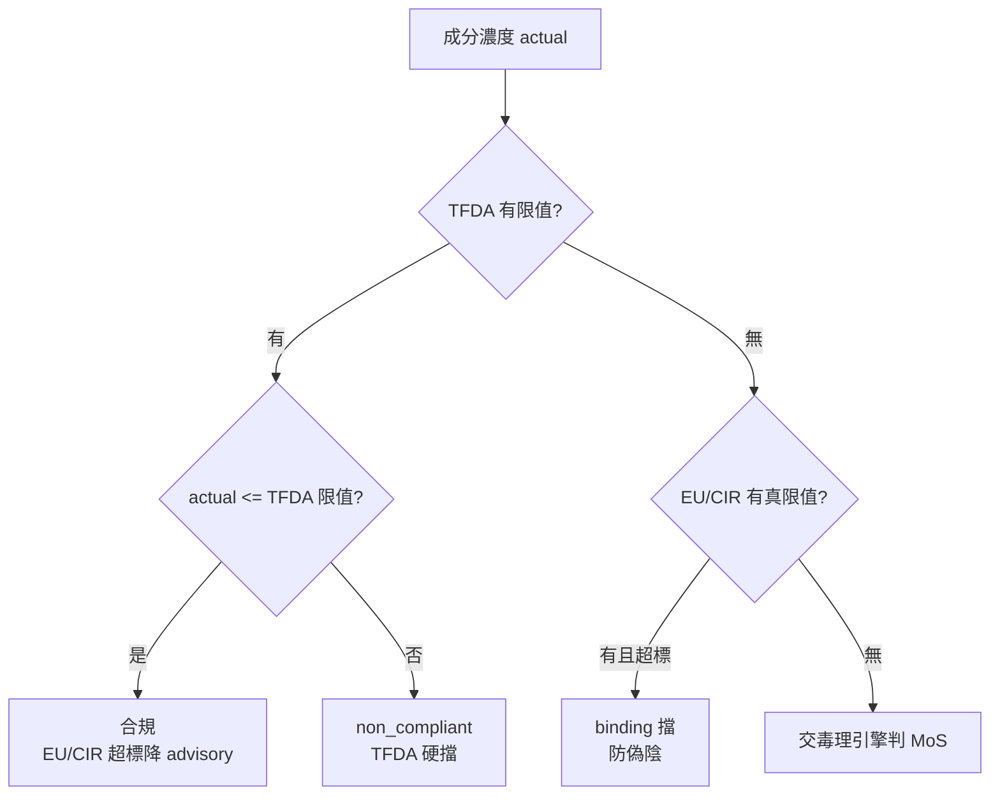

# 第 15 章：法規正確性——揭示門檻、權威階層與結構化採集

> 毒理引擎(第 14 章)判斷「這個成分本身多毒」;法規層判斷「這個用量在這個市場合不合法」。兩者都可能出錯,而法規層的錯誤特別隱蔽——一個把「標籤揭示門檻」誤當「濃度上限」的解析 bug,會讓 62 個常見天然香料集體被誤判超標。本章記錄三類法規正確性的工程修補,每一個都嚴守同一條鐵則:**移除或降級限值,絕不可造成偽陰。**

## 📌 本章重點

- **揭示門檻 ≠ 濃度上限**:EU Annex III 對致敏香料的「shall be indicated when concentration exceeds 0.001% leave-on / 0.01% rinse-off」是**標籤揭示規定**,不是使用上限。誤存為 max=0.001 會讓 Menthol 12% 假性判超標。
- **positional parser**:先剝除「presence...shall be indicated」揭示子句,再解析剩餘——因為 EU Annex III 的真實限值恆在揭示標記之前。62 列中 7 列是「揭示句 + 真實限值」混合,務必保留真值防偽陰。
- **權威階層**:本系統是台灣 TFDA 註冊用途。TFDA 有限值且達標 → EU / CIR 超標降 advisory(外銷參考);**TFDA 無限值 → EU 仍 binding**(防偽陰)。
- **EPA ToxValDB backfill**:CIR 全文擷取層幾乎是空的,權威 NOAEL 靠 EPA ToxValDB live 查補足;EPA 自承可能偏高的 flag verdict 一律 fail-closed 退 review。
- **結構化法規採集器**:掃 ECHA C&L 1125 筆致癌分類 join CosIng,自動推導 421 個基因毒 + 684 個 CMR 禁用 CAS,取代 hand-curated 的 2 筆,每筆帶 ECHA C&L 引用碼。

## 15.1 揭示門檻不是濃度上限

一份真實送測配方觸發了這個 bug:成分被系統判超標,但同款產品在 TFDA 註冊網站卻通過。根因是解析層把兩個語意完全不同的東西混為一談。

EU 化粧品法規 Annex III 對 26 種致敏香料有這樣的條文:

> The presence of the substance **shall be indicated** in the list of ingredients... when its concentration exceeds **0.001 % in leave-on products** and **0.01 % in rinse-off products**.

這是一條**標籤揭示規定**:「當濃度超過此值,必須在成分表中標示出來」——它規範的是「要不要寫在標籤上」,不是「能不能用這個濃度」。Menthol 用到 12% 完全合法,只是必須在標籤揭示。

但解析器把 `0.001` 存進了 `cosing_substances.max_concentration_pct`(濃度上限欄),於是 Menthol 12% > 0.001% → 假性判「超標」。這個誤判波及 62 列常見天然香料:Limonene、Eucalyptus、各種 Citrus 油、Lavender、Menthol 等。

### 15.1.1 為什麼不能「全部清成 NULL」

最直覺的修法是:把所有「shall be indicated」的列的 max 全設 NULL。但這會造成 7 個偽陰。

62 列中有 7 列是**「揭示句 + 真實 Annex III 限值」混合**的條文——例如 Methyl Salicylate 除了揭示規定,還有真實的 0.06% 使用限值。這些列的 max 值不是 0.001,而是真實限值。若無差別全清 NULL,這 7 個真限值就消失了 → 偽陰。

第一版修法用「值排除法」:只清 `max = 0.001`(揭示門檻的特徵值),保留其他值。這救回大部分,但仍有一個殘留——3-Propylidenephthalide 的真限值「0.01(其他產品)」恰好等於 rinse-off 的揭示門檻值 0.01,被連帶排除。

### 15.1.2 positional parser:剝子句再解析

最終修法改用 **positional parser**(`eurlex_cosing._strip_disclosure_clause`):先剝除「presence... shall be indicated...」的揭示子句及其後文字,再解析剩餘部分。關鍵洞察是——**EU Annex III 的真實限值恆在揭示標記之前**。剝掉揭示句後,剩下的若還有數值,就是真限值。

全量重算 62 列的結果:**7 列 danger 保留真值(3-Propylidenephthalide 0.01 恢復),55 列純揭示 → NULL**。同時修一個 CosIng 逗號小數 bug:歐盟用「0,001」表示小數,原 parser 會誤析成「1」,regex 改為 `(\d+(?:[.,]\d+)?)` + replace。

## 15.2 TFDA / EU / CIR 權威階層

第二類法規錯誤是**權威混淆**。本系統的用途是**台灣 TFDA 註冊**,但毒理資料庫多是 EU / 美國來源。若不分權威階層,會用 EU 限值去否決 TFDA 合法的配方。

真實案例:Methyl Salicylate 的 TFDA 限值是 1%(配方用 1% 合法通過),卻被 EU 的 0.06%(category-a leave-on)誤判為 non_compliant。

修法建立明確階層(`concentration_compliance.py` + `safety_determination.py`):

```python
tfda_permits = (tfda_max is not None and actual <= tfda_max)
```

- **TFDA 有限值且達標** → EU / CIR 超標降為 **advisory**(外銷參考,不擋台灣送件)
- **TFDA 無限值** → EU 仍 **binding**——這是防偽陰的關鍵:若某成分 TFDA 未列但 EU 有真限值 5%,配方用 5% 仍須擋,不能因為「TFDA 沒規定」就放行

**圖 15.1 權威判定流程**:



TFDA 硬閘門(severity high)、Annex II 禁用清單、CMR 分類——這些在任何權威階層下都不動。

## 15.3 EPA ToxValDB 補權威值

第 14 章提到,權威 NOAEL 擷取層幾乎是空的:`cir_reports` 的 noael 欄大量為 0(PubChem 只回 CIR 通用首頁 URL,抓不到個別報告)。這使許多成分本可用權威數值判定,卻落到 AI read-across 甚至 data_gap。

修補(`noael_engine._epa_toxval_backfill`):在成分落 AI read-across 之前,對「無權威數值 NOAEL」者 live 查 EPA ToxValDB,把結果 merge 進該成分的毒理資料,讓解析器優先認列權威值。EPA ToxValDB 甚至能以化學名解出 DTXSID(無 CAS 也能查),補上一大塊過去落空的成分。

兩道安全設計:

1. **sanity ceiling 10000**(非 2000):EPA 的 limit-dose 研究常有合法的高 NOAEL 值(良性油可到數千 mg/kg/day)。若沿用 AI 幻覺防護的 2000 上限會誤殺這些合法高值,故 EPA 值的 sanity 上限放寬到 10000。
2. **flag verdict fail-closed**:EPA 對某些值標注 `verdict='flag'`(自承可能偏高)。這類值不可靜默放行——一律 fail-closed 退 review,交 SA 確認。

實證:前述 6 成分誤擋案,修後變成「4 個真問題仍擋 + 2 個良性油解除」——Methyl Salicylate 用 EPA 的 3.9 mg/kg/day + fail-closed,誠實地維持擋下;良性油則正確解除。

## 15.4 結構化法規採集器:自動封鎖 CMR

最初的禁用物清單是 hand-curated 的——只有 2 筆。對一個要涵蓋全成分空間的系統,手工維護禁用清單既不可能完整,也無法追溯。

Phase 2026-07 建了**結構化法規採集器**(`regulatory_limit_harvester`):掃描 `echa_cl_substances`(ECHA 統一分類清單,1125 筆致癌 / 致突變 / 生殖毒性分類)join `cosing_substances`,自動推導出禁用 CAS:

- **421 個基因毒性** CAS
- **684 個 CMR 禁用** CAS

每一筆都帶 ECHA C&L 的引用碼(如 H350 致癌、H340 致突變),完全可追溯。採集結果(`carcinogen_limits_harvested`)是機器產出,bake 進 image;worker cron 每 168 小時重跑,權威庫更新即自動擴充。

lookup 的 merge 優先序:**hand-curated > 基因毒 / CMR 排除 > harvested**。一個看似異常但正確的結果:harvested 出的 CMR 物質與 Annex IV/VI 准用著色劑 / UV 濾劑的交集是 **0**——因為 H350/H351 致癌分類物與准用清單本就不該重疊,`derived = 0` 是正確結果,不是採集失敗。

### 15.4.1 踩雷:asyncpg 的 JSONB 佔位符

採集器的實作踩了一個隱蔽的 asyncpg 雷:PostgreSQL 的 JSONB `?|` 運算子(檢查 key 是否存在)裡的 `?`,被 asyncpg 當成參數佔位符解析,拋 `UndefinedFunctionError` 並污染整個 transaction。修法是改用函式形式 `func.jsonb_exists_any(col, array[...])`,避開 `?` 字元。這類「ORM / driver 把 SQL 運算子誤當佔位符」的雷,在 JSONB 密集的法規資料表上要特別警覺。

## 15.5 重金屬鹽補洞

紅隊測試發現一個邊界洞:汞、砷、鎘「及其化合物」在 TFDA 與 EU Annex II 是類別禁用,但資料庫裡只列了元素本身,鹽類的個別 CAS(如氯化汞 7487-94-7)未逐一列出。於是氯化汞原本只被降 review,而非禁用。

修法(`safety_determination._is_prohibited_heavy_metal_compound`):用 curated 的鹽類 CAS 清單 + INCI 詞根匹配(mercuric / 汞 / arsenic / 砷 / cadmium / 鎘),把這類化合物的閘門置於最高優先(§1.0),review → prohibited。這是一個 tightening(收緊)動作,方向正確。

## 15.6 安全鐵則:降級限值絕不造偽陰

本章所有修補都動到「限值」——移除揭示門檻、降級 EU 為 advisory、放寬 DAp。這類動作最危險,因為改錯方向就是讓危險成分假性通過。統一鐵則:

1. **揭示門檻 NULL 化,只移除「本就非限值」的值**(0.001/0.01 特徵值 + positional 剝子句雙重確認)
2. **混合列必保留真值**(7 列 danger 的真限值一個都不能丟)
3. **TFDA 無限值時,EU / 真限值仍 binding**(不因本地無規定而放行)
4. **TFDA 硬閘門 + Annex II 禁用 + CMR 分類全不動**(任何權威階層下都是天花板)

驗證方式:端到端 + 對抗式回歸。Menthol 12% 超標數 → 0(揭示門檻已正確 NULL);Methyl Salicylate 1% → binding 維持;防偽陰情境(TFDA 無限值 + EU 真限值 1%,配方用 5%)→ EU 維持擋。專屬回歸測試 `test_disclosure_threshold_authority.py`(10 tests)+ 全套回歸鎖死,防止任一修補在未來被無意還原。

## 📚 參考資料

[^1]: European Commission. *Regulation (EC) No 1223/2009 on cosmetic products — Annex II (prohibited) & Annex III (restricted)*. <https://eur-lex.europa.eu/legal-content/EN/TXT/?uri=CELEX:32009R1223>
[^2]: European Commission. *CosIng — Cosmetic Ingredient Database*. <https://ec.europa.eu/growth/tools-databases/cosing/>
[^3]: ECHA. *C&L Inventory — Classification and Labelling*. <https://echa.europa.eu/information-on-chemicals/cl-inventory-database>
[^4]: 中華民國衛生福利部食品藥物管理署. 《化粧品衛生安全管理法》及化粧品成分使用限制表. <https://www.fda.gov.tw>
[^5]: US EPA. *CompTox Chemicals Dashboard — ToxValDB*. <https://comptox.epa.gov/dashboard>

## 📝 修訂記錄

| 版本 | 日期 | 摘要 |
|:---:|:---:|---|
| v0.3 | 2026-07-06 | 首次撰寫。涵蓋揭示門檻 vs 濃度上限、positional parser、TFDA/EU/CIR 權威階層、EPA ToxValDB backfill、ECHA C&L 結構化採集、重金屬鹽補洞與降級限值防偽陰鐵則。 |

---

© 2026 Baiyuan Tech. Licensed under CC BY-NC 4.0.

**導覽** [← 第 14 章：毒理安全評估引擎](ch14-toxicology-safety-engine.md) · [第 16 章：自駕進化與計算基準文獻化 →](ch16-self-driving-evolution.md)
